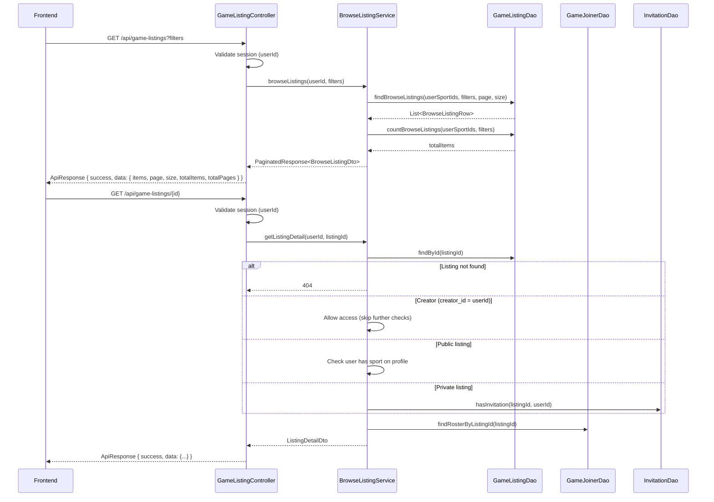

# Design Document — A200: Browse Listings

## Overview

Browse Listings adds a read-only query layer on top of the existing `game_listing` table. An authenticated player can fetch a paginated, filtered list of upcoming OPEN public listings restricted to sports on their profile. A detail endpoint returns the full roster (Team A / Team B) with positions. The listing creator can always access their own listing details. Private listings are accessible only through the detail endpoint when the user is the creator or has an invitation record.

No new database tables or migrations are required — the feature queries existing V3 schema tables.

## Architecture

```
Frontend (browse-listings.html + browseListings.js)
  → fetch() via Api helper
    → GET /api/game-listings?page=1&size=20&sportId=3&skillLevel=Intermediate&date=2026-08-15&hideFull=false
    → GET /api/game-listings/{id}
  → GameListingController (extended)
    → BrowseListingService (new)
      → GameListingDao (extended with browse/count queries)
      → GameJoinerDao (extended with count + roster queries)
      → InvitationDao (extended with existence check)
      → SportDao (existing — findSportsByUserId, userHasSport)
```

### Request Flow



## Components and Interfaces

### New Classes

| Class | Package | Responsibility |
|-------|---------|----------------|
| `BrowseListingService` | `service` | Orchestrates browse queries, applies sport-profile guard, handles private listing access check, builds DTOs |
| `BrowseListingDto` | `dto` | API response shape for a single listing card in browse results |
| `ListingDetailDto` | `dto` | API response shape for full listing detail (includes roster) |
| `RosterEntryDto` | `dto` | Represents one participant in the roster (username, team, position) |
| `PaginatedResponse<T>` | `dto` | Generic paginated response wrapper (items, page, size, totalItems, totalPages) |
| `BrowseFilter` | `dto` | Value object holding optional filter parameters |

### Extended Classes

| Class | Changes |
|-------|---------|
| `GameListingController` | Add `GET /api/game-listings` (browse) and `GET /api/game-listings/{id}` (detail) handlers |
| `GameListingDao` | Add `findBrowseListings(...)` and `countBrowseListings(...)` methods |
| `GameJoinerDao` | Add `countAcceptedByListingId(long)` and `findRosterByListingId(long)` methods |
| `InvitationDao` | Add `hasInvitation(long gameListingId, long userId)` method |

### BrowseListingService Interface

```java
public class BrowseListingService {
    /**
     * Returns a paginated list of browsable listings for the given user.
     * Only returns OPEN, public, future listings for sports on user's profile.
     */
    public PaginatedResponse<BrowseListingDto> browseListings(long userId, BrowseFilter filter);

    /**
     * Returns full detail for a single listing, including roster.
     * Access control:
     *   - Listing not found: 404
     *   - Creator (game_listing.creator_id = userId): always allowed
     *   - Public listing: user must have the sport on their profile (403 if not)
     *   - Private listing: user must have an invitation record (403 if not)
     */
    public ListingDetailDto getListingDetail(long userId, long listingId);
}
```

### BrowseFilter

```java
public class BrowseFilter {
    private int page = 1;
    private int size = 20;
    private Long sportId;        // optional — filter by specific sport
    private String skillLevel;   // optional — filter by skill level
    private LocalDate date;      // optional — filter by single date
    private boolean hideFull;    // default false — when true, exclude full listings
}
```

### BrowseListingDto

```java
public class BrowseListingDto {
    private long gameListingId;
    private String sportName;
    private String formatName;
    private String skillLevel;
    private String date;           // ISO date (YYYY-MM-DD)
    private String sessionWindow;  // "HH:mm–HH:mm"
    private String location;
    private int spotsFilled;       // count of ACCEPTED joiners
    private int totalSpots;        // sport_format.no_players
    private String creatorUsername;
}
```

### ListingDetailDto

```java
public class ListingDetailDto {
    private long gameListingId;
    private String sportName;
    private String formatName;
    private String skillLevel;
    private String date;
    private String sessionWindow;
    private String location;
    private int spotsFilled;
    private int totalSpots;
    private String creatorUsername;
    private boolean hasPositions;
    private boolean isPrivate;
    private List<RosterEntryDto> teamA;
    private List<RosterEntryDto> teamB;
}
```

### RosterEntryDto

```java
public class RosterEntryDto {
    private String username;
    private String positionName;  // null if non-positional format
}
```

### PaginatedResponse

```java
public class PaginatedResponse<T> {
    private List<T> items;
    private int page;
    private int size;
    private long totalItems;
    private int totalPages;
}
```

## Data Models

No new database tables required. The browse query joins existing tables:

```sql
-- Core browse query (simplified)
SELECT
    gl.game_listing_id,
    gl.[date],
    gl.end_time,
    gl.skill_level,
    gl.location,
    gl.creator_id,
    sf.format_name,
    sf.no_players,
    s.sport_name,
    u.username AS creator_username,
    (SELECT COUNT(*) FROM [dbo].[game_joiner] gj
     WHERE gj.game_listing_id = gl.game_listing_id AND gj.status = 'ACCEPTED') AS spots_filled
FROM [dbo].[game_listing] gl
INNER JOIN [dbo].[sport_format] sf ON gl.format_id = sf.format_id
INNER JOIN [dbo].[sport] s ON sf.sport_id = s.sport_id
INNER JOIN [dbo].[users] u ON gl.creator_id = u.user_id
WHERE gl.status = 'OPEN'
  AND gl.is_private = 0
  AND gl.[date] > GETDATE()
  AND sf.sport_id IN (SELECT sport_id FROM [dbo].[user_sport_profile] WHERE user_id = ?)
  -- optional: AND sf.sport_id = ? (sportId filter)
  -- optional: AND gl.skill_level = ? (skillLevel filter)
  -- optional: AND CAST(gl.[date] AS DATE) = ? (single date filter)
  -- optional: AND (SELECT COUNT(*) FROM game_joiner gj2
  --               WHERE gj2.game_listing_id = gl.game_listing_id
  --               AND gj2.status = 'ACCEPTED') < sf.no_players (hideFull)
ORDER BY gl.[date] ASC
OFFSET ? ROWS FETCH NEXT ? ROWS ONLY;
```

### Roster Query

```sql
SELECT
    gj.team,
    u.username,
    p.position_name
FROM [dbo].[game_joiner] gj
INNER JOIN [dbo].[users] u ON gj.user_id = u.user_id
LEFT JOIN [dbo].[position] p ON gj.position_id = p.position_id
WHERE gj.game_listing_id = ?
  AND gj.status = 'ACCEPTED'
ORDER BY gj.team, u.username;
```

### Invitation Check Query

```sql
SELECT 1 FROM [dbo].[invitation]
WHERE [game_listing_id] = ? AND [invitee_id] = ?;
```

## Detail Endpoint Access Control Logic

```
1. Find listing by ID → 404 if not found
2. If requesting user is the creator (game_listing.creator_id = userId) → allow access
3. If listing is public (is_private = 0):
   a. Check user has the listing's sport on their profile (via SportDao.userHasSport)
   b. If not → 403 "You cannot view listings for sports not on your profile"
4. If listing is private (is_private = 1):
   a. Check invitation table for a row WHERE game_listing_id = ? AND invitee_id = userId
   b. If no row exists → 403 "Access denied: invitation required"
5. Fetch roster and build response
```

## Correctness Properties

### Property 1: Result Set Validity

*For any* authenticated user and any database state, every listing returned by the browse endpoint SHALL have status = 'OPEN', is_private = false, a session start date in the future, and a sport that exists on the user's sport profile.

**Validates: Requirements 1.1, 1.2, 1.3, 1.4**

### Property 2: Sort Order Invariant

*For any* browse result set containing two or more listings, each listing's session start date SHALL be less than or equal to the next listing's session start date (ascending order).

**Validates: Requirement 1.5**

### Property 3: Pagination Invariant

*For any* page and size parameters and any data set, the number of returned items SHALL be less than or equal to `size`, and `totalPages` SHALL equal `ceil(totalItems / size)`.

**Validates: Requirements 1.6, 1.7**

### Property 4: Filter Correctness

*For any* combination of sportId, skillLevel, and date filters, every listing in the result set SHALL satisfy all applied filter conditions simultaneously.

**Validates: Requirements 2.1, 2.2, 2.3, 2.4**

### Property 5: Full Listings Toggle

*For any* browse request with `hideFull = true`, no listing in the result set SHALL have spotsFilled equal to totalSpots.

**Validates: Requirements 3.1, 3.2, 3.3**

### Property 6: Response Completeness

*For any* listing item in the browse response, the fields sportName, formatName, skillLevel, date, sessionWindow, location, spotsFilled, totalSpots, and creatorUsername SHALL all be present and non-null.

**Validates: Requirements 4.1, 4.2, 4.3, 4.4, 4.5, 4.7**

### Property 7: Capacity Accuracy

*For any* listing in the browse response, `spotsFilled` SHALL equal the count of game_joiner records with status = 'ACCEPTED' for that listing, and `totalSpots` SHALL equal the listing's format's `no_players` value.

**Validates: Requirement 4.6**

### Property 8: Roster Team Grouping

*For any* listing detail response, every entry in the `teamA` array SHALL correspond to a game_joiner record with team = 'A' and status = 'ACCEPTED', and every entry in the `teamB` array SHALL correspond to a game_joiner record with team = 'B' and status = 'ACCEPTED'.

**Validates: Requirements 5.1, 5.2**

### Property 9: Private Listing Access Enforcement

*For any* listing detail request, access SHALL be granted when the requesting user is the listing creator (`game_listing.creator_id = userId`), regardless of public/private status. *For any* private listing detail request where the requesting user is NOT the creator, access SHALL be granted only when an invitation record exists in the `invitation` table for the requesting user and that listing. The absence of both creator status and an invitation record SHALL result in HTTP 403 regardless of whether the user knows the listing ID.

**Validates: Requirements 6.1, 6.2, 6.5, 6.6, 6.7**

## Error Handling

| Scenario | HTTP Status | Error Message |
|----------|-------------|---------------|
| No valid session | 401 | "Login required" |
| Listing not found (detail) | 404 | "Listing not found" |
| Public listing sport not on user's profile (detail) | 403 | "You cannot view listings for sports not on your profile" |
| Private listing without invitation (detail) | 403 | "Access denied: invitation required" |
| Invalid page/size (non-numeric or < 1) | 400 | "Invalid pagination parameters" |
| Invalid date format in filter | 400 | "Invalid date format. Use ISO format: YYYY-MM-DD" |
| Database error | 500 | "An unexpected error occurred" (logged internally) |

## Testing Strategy

### Unit Tests (JUnit 5)

| Component | What to Test |
|-----------|-------------|
| `BrowseListingService` | Sport-profile filtering logic, pagination math, filter application, hideFull toggle, 404/403 on detail, private listing access check |
| `GameListingDao` (browse methods) | SQL correctness, filter combinations, sort order, pagination offset/fetch, hideFull exclusion |
| `GameListingController` (browse handlers) | Route registration, parameter parsing, response status codes |
| `InvitationDao` (hasInvitation) | Existence check correctness |

### Integration Tests

- End-to-end browse with seeded database (1-2 representative scenarios)
- Detail endpoint with roster verification
- Private listing access with and without invitation
- Auth rejection (no session → 401)

### Frontend Testing

- Manual verification against designs
- Verify card rendering with various data states (empty results, full capacity, no positions)
- Verify "Show full listings" toggle behaviour
- Verify disabled "Request to Join" button
