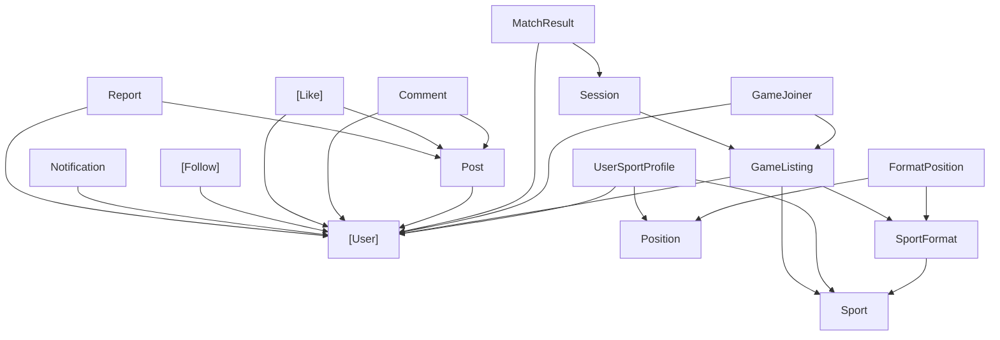

# Design Document: Database Schema Creation

## Overview

This design covers the four T-SQL scripts that initialise the GameOnDb database on each developer's local Microsoft SQL Server instance. The scripts are standalone `.sql` files executed in sequence: `drop-all.sql` → `schema.sql` → `seed-data.sql` → `indexes.sql`. They are idempotent — running the full sequence always produces a clean, usable database regardless of prior state.

---

## Architecture

### File Structure

```
database/
├── drop-all.sql      -- Tears down all tables (reverse dependency order)
├── schema.sql        -- Creates all 16 tables (dependency order)
├── seed-data.sql     -- Inserts reference/lookup data
└── indexes.sql       -- Creates performance indexes
```

All scripts target the `GameOnDb` database and assume the database already exists. Each script is self-contained and can be run independently, though the intended execution order is listed above.

### Table Dependency Graph

Tables are created bottom-up: independent tables first, then tables that reference them.



### Creation Order (schema.sql)

| Wave | Tables |
|------|--------|
| 1 | [User], Sport, Position |
| 2 | SportFormat |
| 3 | FormatPosition, UserSportProfile, GameListing, Post |
| 4 | GameJoiner, Session, Comment, [Like], [Follow], Notification, Report |
| 5 | MatchResult |

### Drop Order (drop-all.sql) — Reverse of Creation

| Wave | Tables |
|------|--------|
| 1 | MatchResult |
| 2 | GameJoiner, Session, Comment, [Like], [Follow], Notification, Report |
| 3 | FormatPosition, UserSportProfile, GameListing, Post |
| 4 | SportFormat |
| 5 | [User], Sport, Position |

---

## Components and Interfaces

### T-SQL Patterns

#### Bracket-Escaping Reserved Words

SQL Server reserved words used as identifiers MUST be wrapped in square brackets:

- `[User]` — reserved word
- `[Like]` — reserved word
- `[Follow]` — reserved word (contextually ambiguous)

All other table names (Sport, Post, Comment, etc.) do not require escaping but MAY use brackets for consistency in foreign key references.

#### Primary Keys with IDENTITY

Every table uses the pattern:

```sql
column_name INT IDENTITY(1,1) PRIMARY KEY
```

#### Foreign Key Constraints

Inline or table-level FOREIGN KEY constraints:

```sql
CONSTRAINT FK_TableName_ParentTable FOREIGN KEY (column_name)
    REFERENCES ParentTable(parent_pk)
```

Naming convention: `FK_{ChildTable}_{ParentTable}`

#### UNIQUE Constraints

```sql
CONSTRAINT UQ_TableName_Column UNIQUE (column_name)
```

For composite: `CONSTRAINT UQ_TableName_Col1_Col2 UNIQUE (col1, col2)`

#### CHECK Constraints

```sql
CONSTRAINT CHK_Follow_NoSelfFollow CHECK (follower_id <> following_id)
```

#### Default Values

```sql
column_name DATETIME DEFAULT GETDATE()
status VARCHAR(20) DEFAULT 'Open'
is_active BIT DEFAULT 1
```

#### Conditional Drop

```sql
IF OBJECT_ID('dbo.TableName', 'U') IS NOT NULL
    DROP TABLE dbo.TableName;
```

---

## Data Models

All 16 tables are documented in the requirements and `database-design.md`. The design does not introduce new entities — it implements the documented schema faithfully.

### Data Type Mapping

| Logical Type | T-SQL Type |
|--------------|-----------|
| Auto-increment PK | INT IDENTITY(1,1) |
| Short string | VARCHAR(n) |
| Long text / JSON | NVARCHAR(MAX) |
| Timestamp | DATETIME |
| Date only | DATE |
| Time only | TIME |
| Boolean flag | BIT |
| Integer | INT |

---

## Error Handling

### Schema Script

- Tables are created in dependency order so FK references never point to non-existent tables.
- If tables already exist, the script will fail. The intended workflow is to run `drop-all.sql` first.

### Drop Script

- Uses `IF OBJECT_ID(...) IS NOT NULL` before each DROP to avoid errors on missing tables.
- Tables are dropped in reverse dependency order so FK constraints don't block deletion.

### Seed Script

- Uses `IF NOT EXISTS (SELECT 1 FROM ... WHERE ...)` before each INSERT to avoid duplicate-key errors on re-runs.
- Uses `SET IDENTITY_INSERT <table> ON` / `OFF` to control explicit ID values for deterministic FK references in later inserts.

### Index Script

- Uses `IF NOT EXISTS (SELECT 1 FROM sys.indexes WHERE name = '...')` before each CREATE INDEX to skip already-existing indexes.

---

## Testing Strategy

Property-based testing does not apply to this feature. DDL scripts are declarative infrastructure — they don't have varying inputs or universal properties to validate across random data. The correct testing approach is:

### Manual Verification

1. Run the full script sequence on a fresh `GameOnDb` database.
2. Verify all 16 tables exist with correct columns, types, and constraints.
3. Verify seed data is present and FK relationships hold.
4. Verify indexes are created.

### Automated Smoke Tests (Optional)

- Execute the full sequence and query `INFORMATION_SCHEMA.TABLES` to confirm 16 tables.
- Query `INFORMATION_SCHEMA.TABLE_CONSTRAINTS` to verify FK, UNIQUE, and CHECK constraints.
- Query `sys.indexes` to verify performance indexes exist.

### Idempotency Test

- Run `drop-all.sql` → `schema.sql` → `seed-data.sql` → `indexes.sql` twice in a row — second run should succeed without errors.

---

## Seed Data Approach

### Sports

| sport_id | sport_name |
|----------|-----------|
| 1 | Football |
| 2 | Basketball |
| 3 | Cricket |
| 4 | Tennis |
| 5 | Rugby |

### SportFormats (examples)

| format_id | sport | format_name | min | max |
|-----------|-------|-------------|-----|-----|
| 1 | Football | 5-a-side | 10 | 10 |
| 2 | Football | 7-a-side | 14 | 14 |
| 3 | Football | 11-a-side | 22 | 22 |
| 4 | Basketball | 3x3 | 6 | 6 |
| 5 | Basketball | 5v5 | 10 | 10 |
| 6 | Cricket | T20 | 22 | 22 |
| 7 | Cricket | ODI | 22 | 22 |
| 8 | Tennis | Singles | 2 | 2 |
| 9 | Tennis | Doubles | 4 | 4 |
| 10 | Rugby | 7s | 14 | 14 |
| 11 | Rugby | 15s | 30 | 30 |

### Positions (examples)

General positions applicable across sports: Goalkeeper, Defender, Midfielder, Striker/Forward, Wing, Centre, Point Guard, Shooting Guard, Small Forward, Power Forward, Centre (Basketball), Bowler, Batsman, All-Rounder, Wicket-Keeper, Server, Returner, Fly-Half, Scrum-Half, Hooker, Prop, Lock, Flanker, Number 8, Fullback.

### Identity Insert Handling

```sql
SET IDENTITY_INSERT Sport ON;
INSERT INTO Sport (sport_id, sport_name, description) VALUES (1, 'Football', '...');
-- ... more inserts ...
SET IDENTITY_INSERT Sport OFF;
```

This ensures FK references (e.g., `sport_id = 1` in SportFormat) are deterministic.

---

## Index Naming Convention

Pattern: `IX_{TableName}_{Column1}[_{Column2}]`

Examples:
- `IX_User_Email`
- `IX_User_Username`
- `IX_GameListing_GameDate`
- `IX_GameListing_Status`
- `IX_GameListing_SportId`
- `IX_GameJoiner_ListingId`
- `IX_GameJoiner_UserId`
- `IX_Post_UserId`
- `IX_Post_CreatedAt`
- `IX_Notification_UserId`
- `IX_Notification_IsRead`
