# GameOn — Full System Architecture & Sprint Review Traceability

> **Project:** GameOn — Sports Management & Social Platform  
> **Module:** WRRV301 (2026)  
> **Team:** CodeSphere  
> **Database:** GameOnDb (SQL Server)  
> **Stack:** ASP.NET Core MVC | Entity Framework Core | Bootstrap 5 | SQL Server  
> **Document Version:** 1.0  
> **Last Updated:** April 2026

---

## Quick Start for Developers

1. Read [Section 1](#1-system-overview) for project context
2. Review [Section 3](#3-entity-relationship-diagram) for database structure
3. Follow [Section 15](#15-implementation-build-order--dependency-chain) for build order
4. Use [Sections 12–14](#12-sprint-review-traceability--sprint-story-15) for Sprint Review preparation
5. Reference sequence/activity diagrams when implementing specific use cases

---

## Table of Contents

| # | Section | Purpose |
|---|---------|---------|
| 1 | [System Overview](#1-system-overview) | Project context, problem statement, business rules |
| 2 | [Technology Stack & Architecture](#2-technology-stack--system-architecture) | Layered architecture, tech choices |
| 3 | [Entity Relationship Diagram](#3-entity-relationship-diagram) | Database ER model |
| 4 | [Domain Class Diagram](#4-domain-class-diagram) | C# implementation classes |
| 5 | [Component & Package Diagrams](#5-component--package-diagrams) | Solution structure |
| 6 | [MVC Architecture & Auth Flow](#6-mvc-architecture--authentication-flow) | Request pipeline, Identity flow |
| 7 | [Use Case Diagrams](#7-use-case-diagrams) | Actors and use cases per module |
| 8 | [Sequence Diagrams](#8-sequence-diagrams) | Step-by-step interaction flows |
| 9 | [Activity Diagrams](#9-activity-diagrams) | Decision-heavy workflows |
| 10 | [State Diagrams](#10-state-diagrams) | Entity lifecycle states |
| 11 | [Navigation & Deployment](#11-navigation-flow--deployment-diagram) | UI navigation map, deployment topology |
| 12 | [Sprint Story Traceability (15%)](#12-sprint-review-traceability--sprint-story-15) | Tech Lead review mapping |
| 13 | [Formal Review Traceability (70%)](#13-sprint-review-traceability--formal-review-70) | Supervisor review mapping |
| 14 | [Dev Crew Cross-Check (15%)](#14-sprint-review-traceability--dev-crew-cross-check-15) | Peer review mapping |
| 15 | [Build Order & Dependencies](#15-implementation-build-order--dependency-chain) | Implementation sequence |
| 16 | [Glossary & References](#16-glossary--references) | Terms, FSSB references |

---

## 1. System Overview

### 1.1 Problem Statement

GameOn is a web-based sports management platform with social features that helps sports players find other players to play with and compete against. The core problem is players being unable to find available teammates to fill a game.

### 1.2 Solution

The system allows users to:
- Create game listings specifying sport, skill level, position needed, and player count
- Browse and request to join game sessions
- Record and view match results
- Interact socially through posts, comments, likes, and follows
- View leaderboards based on win percentage

### 1.3 Business Rules

| # | Rule | Enforcement Point |
|---|------|-------------------|
| BR1 | A user can post ONE Game Listing at a time | GameListingService.Create() |
| BR2 | A user can join one or many game listings | GameJoinerService.Join() |
| BR3 | Only one match can be scheduled from a Game Listing | SessionService.Create() |
| BR4 | A user can post many posts | PostService.Create() |
| BR5 | A user can follow many other users | FollowService.Follow() |
| BR6 | Users in listing 2 hours before scheduled time are locked in | SessionConfirmationJob |
| BR7 | A user can play multiple sports | UserSportProfileService |
| BR8 | User can only create listing if sport is on profile | GameListingService.Validate() |
| BR9 | User can only join listing if sport is on profile | GameJoinerService.Validate() |
| BR10 | One match result per Game Listing | MatchResultService.Create() |
| BR11 | Only listing creator can update match result | MatchResultService.Update() |
| BR12 | A user can report many users, posts, comments | ReportService.Create() |
| BR13 | Only moderator can remove users/posts/comments | ModeratorService |
| BR14 | Cannot join 2 listings within 3 hours of each other | GameJoinerService.ValidateTimeConflict() |

### 1.4 System Constraints

- Venue availability is NOT synced with the system
- Not all sports grounds can be verified
- No payment gateway for bookings
- System handles organization and results only, not gameplay

### 1.5 Actors

| Actor | Description | Modules |
|-------|-------------|---------|
| Unregistered User | Has no account | D100 only |
| User (Registered) | Standard authenticated user | All modules |
| Game Listing Creator | User who created a listing | A100, C100-C500 |
| Game Listing Joiner | User who joined a listing | A300, A400 |
| Moderator | Admin role for content moderation | B400, D600, D700 |
| Time (System) | Automated time-based triggers | A500, A600, A700 |

---

## 2. Technology Stack & System Architecture

### 2.1 Technology Decisions

| Layer | Technology | Justification |
|-------|-----------|---------------|
| Frontend | Razor Views + Bootstrap 5 | Server-rendered, consistent styling |
| Backend | ASP.NET Core MVC (.NET 8) | Enterprise-grade, MVC pattern |
| ORM | Entity Framework Core | Code-first migrations, LINQ |
| Database | SQL Server | RDBMS requirement per WRRV301 |
| Auth | ASP.NET Core Identity | Role-based auth (User, Moderator) |
| Validation | Data Annotations + FluentValidation | Server + client-side |
| DI | Built-in .NET DI Container | Constructor injection throughout |

### 2.2 Layered Architecture Diagram

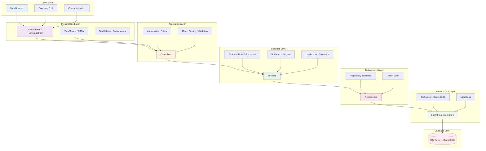

### 2.3 Request-Response Flow

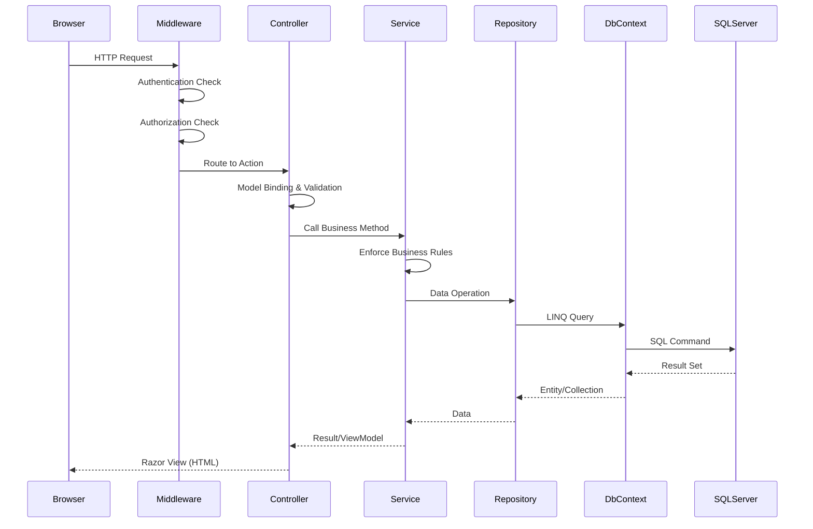

---

## 3. Entity Relationship Diagram

> **Source:** FSSB Section 4.1 — List of Data and Attributes  
> **Database:** GameOnDb (SQL Server)  
> **ORM:** Entity Framework Core (Code-First)

### 3.1 Complete ER Diagram

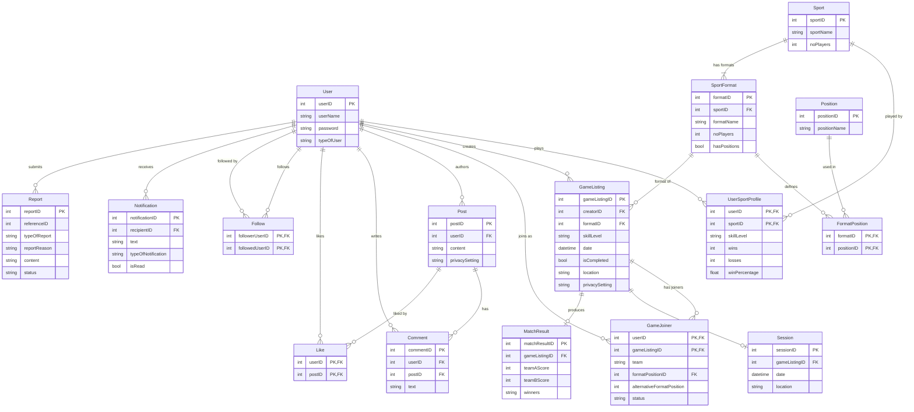


### 3.2 Relationship Cardinality Summary

| Parent Entity | Child Entity | Relationship | Cardinality | FK Column |
|---------------|-------------|--------------|-------------|-----------|
| User | UserSportProfile | plays sports | 1 to 0..* | userID |
| Sport | UserSportProfile | played by users | 1 to 0..* | sportID |
| Sport | SportFormat | has formats | 1 to 1..* | sportID |
| SportFormat | FormatPosition | defines positions | 1 to 0..* | formatID |
| Position | FormatPosition | used in formats | 1 to 0..* | positionID |
| User | GameListing | creates listings | 1 to 0..* | creatorID |
| SportFormat | GameListing | format of listing | 1 to 0..* | formatID |
| User | GameJoiner | joins games | 1 to 0..* | userID |
| GameListing | GameJoiner | has joiners | 1 to 0..* | gameListingID |
| GameListing | Session | becomes session | 1 to 0..1 | gameListingID |
| GameListing | MatchResult | produces result | 1 to 0..1 | gameListingID |
| User | Post | authors posts | 1 to 0..* | userID |
| User | Comment | writes comments | 1 to 0..* | userID |
| Post | Comment | has comments | 1 to 0..* | postID |
| User | Like | likes posts | 1 to 0..* | userID |
| Post | Like | liked by users | 1 to 0..* | postID |
| User | Follow | follows users | 1 to 0..* | followerUserID |
| User | Follow | followed by users | 1 to 0..* | followedUserID |
| User | Notification | receives | 1 to 0..* | recipientID |
| User | Report | submits reports | 1 to 0..* | reportID |

### 3.3 Database Implementation Notes

| Concern | Decision | Reason |
|---------|----------|--------|
| Composite PKs | UserSportProfile, GameJoiner, FormatPosition, Like, Follow | Junction tables use composite keys per FSSB |
| Soft Delete | GameListing.isCompleted flag | Expired listings hidden, not deleted (A500) |
| Enum vs String | typeOfUser, status, skillLevel as strings | Flexibility; map to C# enums in code |
| Cascade Delete | OFF for User → GameListing | Preserve historical data |
| Indexes | userName (unique), date on GameListing | Query performance for browse/filter |

### 3.4 Sprint Review Alignment — DB Implementation (/10)

This ER diagram directly satisfies the **Sprint Story — DB Implementation (/10)** criterion:

- ✅ Verified RDBMS: SQL Server
- ✅ All 16 entities implemented with correct PKs and FKs
- ✅ Integrated with EF Core (Code-First migrations)
- ✅ Relationships match FSSB Section 4.2 Domain Class Diagram
- ✅ Junction tables properly model many-to-many relationships

---

## 4. Domain Class Diagram

> **Source:** FSSB Section 4.2 & 4.3 — Domain & Implementation-Ready Class Diagrams  
> **Pattern:** EF Core entities with navigation properties  
> **Inheritance:** User → Admin, GameListingCreator, GameListingJoiner (via typeOfUser discriminator)

### 4.1 Implementation-Ready Class Diagram

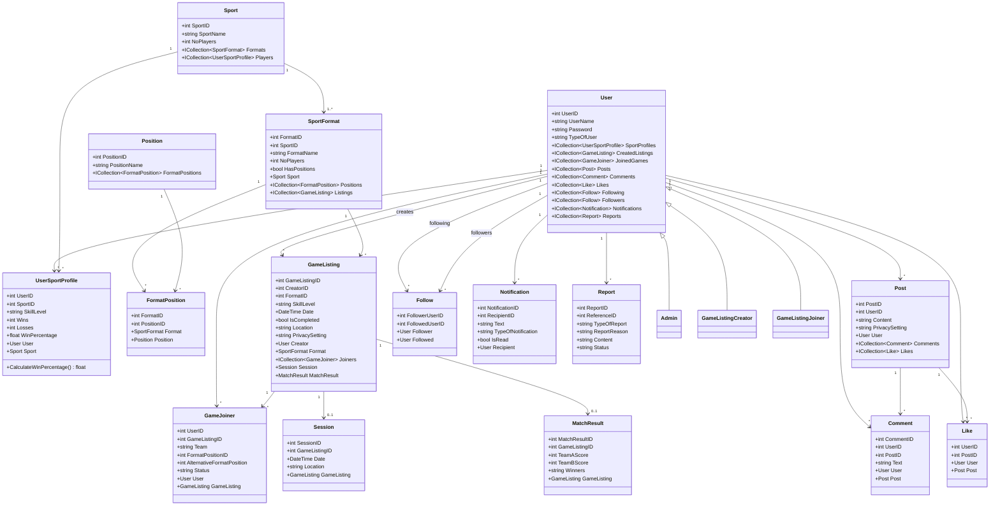


### 4.2 Entity-to-Module Mapping

| Entity | Primary Module | Use Cases | Owner |
|--------|--------------|-----------|-------|
| User | D (User Mgmt) | D100, D200, D400 | Robert Lloyd |
| UserSportProfile | D (User Mgmt) | D300 | Robert Lloyd |
| Sport | D (User Mgmt) | D300 | Robert Lloyd |
| SportFormat | A (Listings) | A100 | Lihlumelo Mgijima |
| FormatPosition | A (Listings) | A100, A300 | Lihlumelo Mgijima |
| Position | A (Listings) | A100, A300 | Lihlumelo Mgijima |
| GameListing | A (Listings) | A100, A200, C300 | Lihlumelo / Gerard |
| GameJoiner | A (Listings) | A300, A400, C500 | Lihlumelo / Gerard |
| Session | A (Listings) | A700 | Lihlumelo Mgijima |
| MatchResult | C (Game Mgmt) | C100, C200, C400 | Gerard Mc Loughlin |
| Post | B (Social) | B100, B200, B300 | Zane Griesel |
| Comment | B (Social) | B300 | Zane Griesel |
| Like | B (Social) | B300 | Zane Griesel |
| Follow | D (User Mgmt) | D400 | Robert Lloyd |
| Notification | D (User Mgmt) | D500, A600 | Robert Lloyd |
| Report | D / B | D600, D700, B400 | Robert / Zane |

### 4.3 EF Core Configuration Notes

| Entity | Configuration | Notes |
|--------|--------------|-------|
| User | HasKey(UserID) | Identity seed, unique UserName index |
| UserSportProfile | HasKey(UserID, SportID) | Composite PK, calculated WinPercentage |
| GameJoiner | HasKey(UserID, GameListingID) | Composite PK, Status enum mapping |
| Like | HasKey(UserID, PostID) | Composite PK |
| Follow | HasKey(FollowerUserID, FollowedUserID) | Self-referencing, prevent self-follow |
| FormatPosition | HasKey(FormatID, PositionID) | Composite PK |
| GameListing → Session | HasOne/WithOne | 1:0..1 optional |
| GameListing → MatchResult | HasOne/WithOne | 1:0..1 optional |

---

## 5. Component & Package Diagrams

### 5.1 Solution Component Diagram

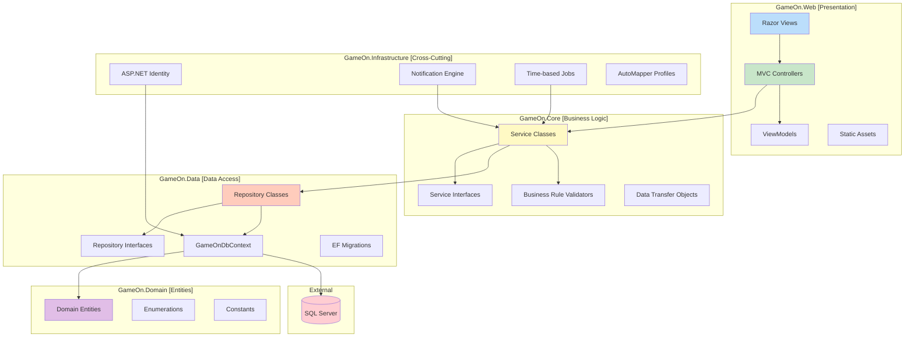

### 5.2 Package Diagram (Namespace Structure)

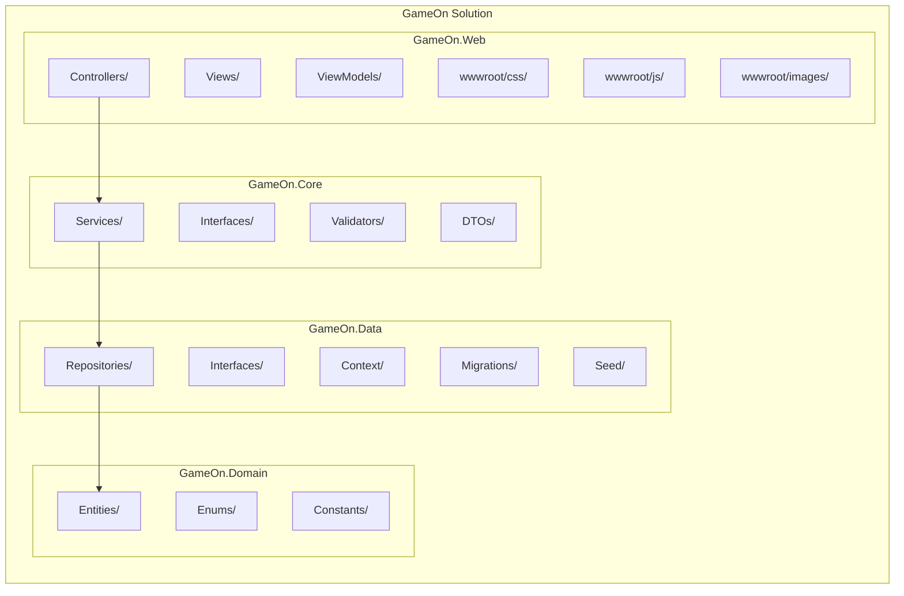


### 5.3 Controller-Service-Repository Mapping

| Controller | Service | Repository | Primary Entity |
|-----------|---------|------------|----------------|
| AccountController | AccountService | UserRepository | User |
| ProfileController | ProfileService | UserSportProfileRepository | UserSportProfile |
| SportController | SportService | SportRepository | Sport |
| GameListingController | GameListingService | GameListingRepository | GameListing |
| GameJoinerController | GameJoinerService | GameJoinerRepository | GameJoiner |
| MatchResultController | MatchResultService | MatchResultRepository | MatchResult |
| PostController | PostService | PostRepository | Post |
| CommentController | CommentService | CommentRepository | Comment |
| FollowController | FollowService | FollowRepository | Follow |
| NotificationController | NotificationService | NotificationRepository | Notification |
| ReportController | ReportService | ReportRepository | Report |
| LeaderboardController | LeaderboardService | UserSportProfileRepository | UserSportProfile |
| ModeratorController | ModeratorService | ReportRepository | Report |

### 5.4 Dependency Injection Registration Order

```
// Program.cs — Service Registration Order
1. DbContext (GameOnDbContext → SQL Server connection)
2. Identity (AddIdentity → User, Role stores)
3. Repositories (all IRepository → Repository pairs)
4. Services (all IService → Service pairs)
5. Infrastructure (Notification, Scheduling)
6. AutoMapper profiles (if used)
7. Authentication/Authorization policies
```

---

## 6. MVC Architecture & Authentication Flow

### 6.1 ASP.NET Core MVC Pipeline

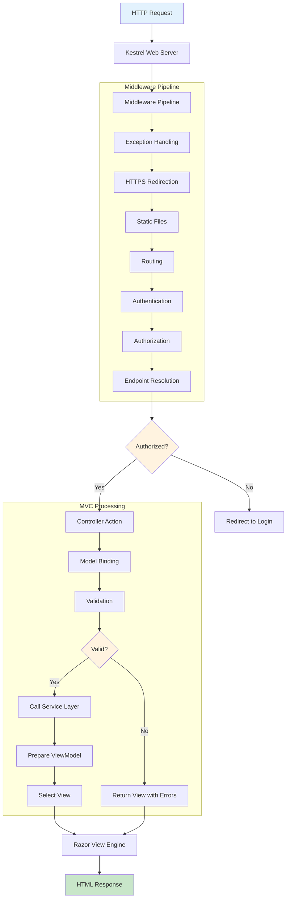

### 6.2 Authentication & Registration Flow (D100)

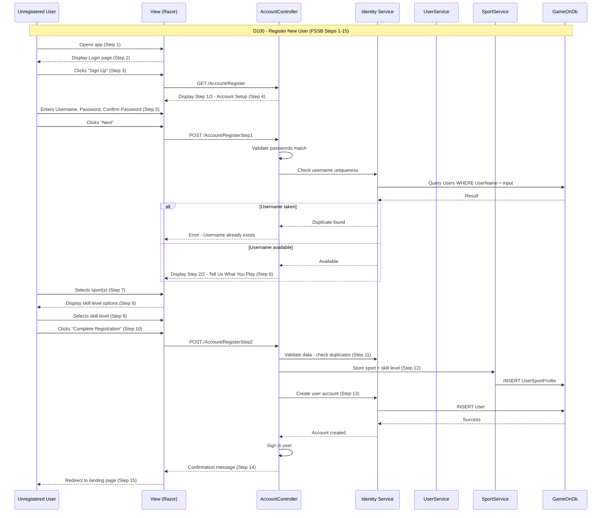

### 6.3 Login / Logout Flow

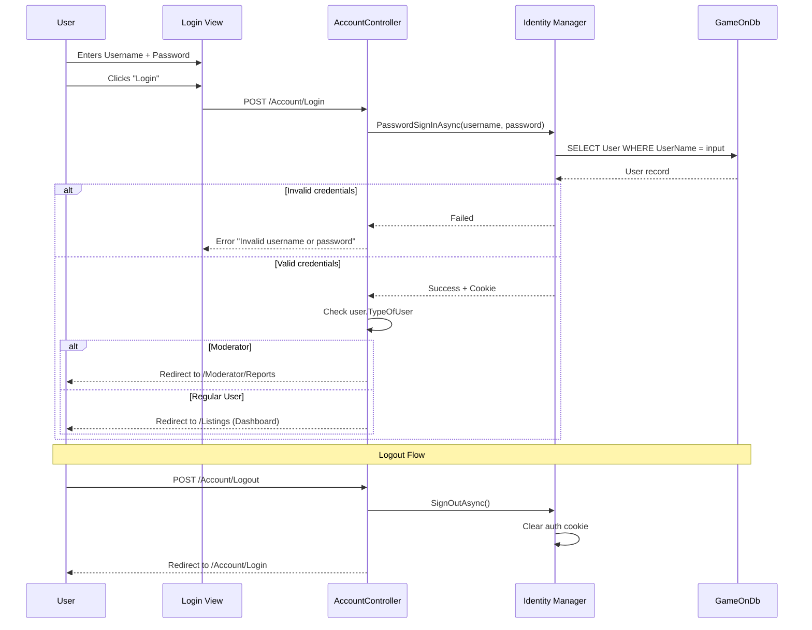


### 6.4 Authorization Matrix

| Page / Action | Anonymous | User | Listing Creator | Moderator |
|---------------|-----------|------|-----------------|-----------|
| Login/Register | ✅ | ❌ (redirect) | ❌ | ❌ |
| Browse Listings | ❌ | ✅ | ✅ | ✅ |
| Create Listing | ❌ | ✅ | ✅ | ❌ |
| Join Listing | ❌ | ✅ | ❌ (own listing) | ❌ |
| Manage Listing | ❌ | ❌ | ✅ (own only) | ❌ |
| Record Match Result | ❌ | ❌ | ✅ (own only) | ❌ |
| View/Accept Requests | ❌ | ❌ | ✅ (own only) | ❌ |
| Create Post | ❌ | ✅ | ✅ | ❌ |
| Manage Own Post | ❌ | ✅ (own) | ✅ (own) | ❌ |
| View Reports | ❌ | ❌ | ❌ | ✅ |
| Remove User/Post | ❌ | ❌ | ❌ | ✅ |
| Report User/Post | ❌ | ✅ | ✅ | ❌ |
| View Profile | ❌ | ✅ | ✅ | ✅ |
| Follow/Unfollow | ❌ | ✅ | ✅ | ❌ |
| View Notifications | ❌ | ✅ | ✅ | ✅ |
| View Leaderboard | ❌ | ✅ | ✅ | ❌ |

### 6.5 Identity Configuration

```
Roles:
├── User (default on registration)
├── Moderator (seeded account)
└── Admin (future support)

Password Policy:
├── MinLength: 6
├── RequireDigit: true
├── RequireUppercase: false
└── RequireNonAlphanumeric: false

Cookie:
├── LoginPath: /Account/Login
├── AccessDeniedPath: /Account/AccessDenied
├── ExpireTimeSpan: 60 minutes
└── SlidingExpiration: true
```

---

## 7. Use Case Diagrams

> **Source:** FSSB Section 2.1–2.3  
> **Notation:** Mermaid flowchart (Mermaid lacks native UML use-case syntax)

### 7.1 System-Level Use Case Overview

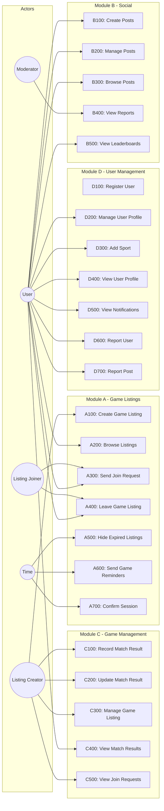

### 7.2 Module A — Game Listings (Lihlumelo Mgijima)

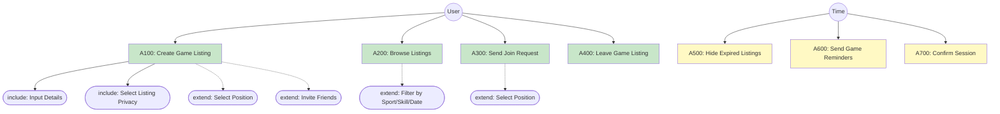


### 7.3 Module B — Social (Zane Griesel)

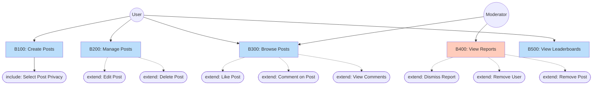

### 7.4 Module C — Game Management (Gerard Mc Loughlin)

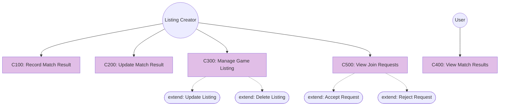

### 7.5 Module D — User Management (Robert Lloyd)

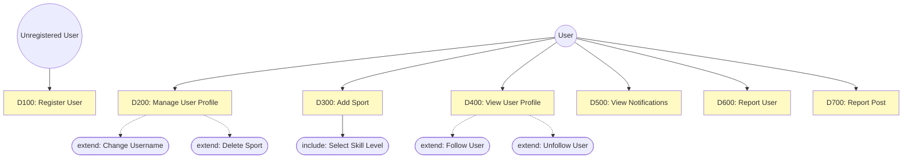

---

## 8. Sequence Diagrams

> Each sequence diagram maps 1:1 to the FSSB Basic Flow of Events.  
> **Sprint Review Criterion:** Narrative Alignment (/5) — code matches FSSB logic.

### 8.1 A100 — Create Game Listing

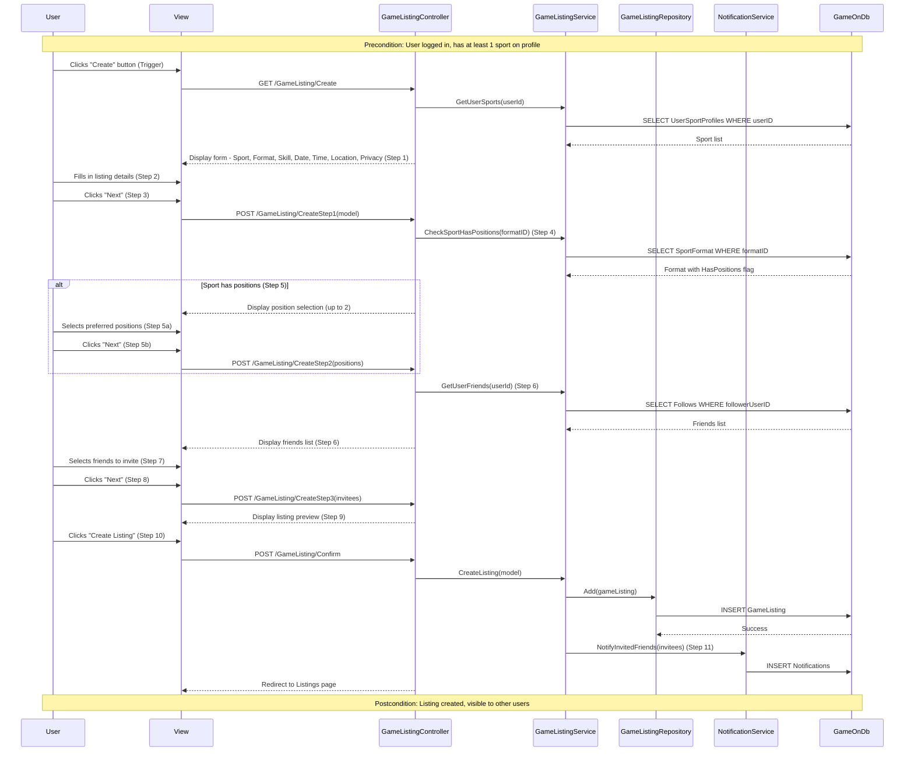

### 8.2 A300 — Send Join Request

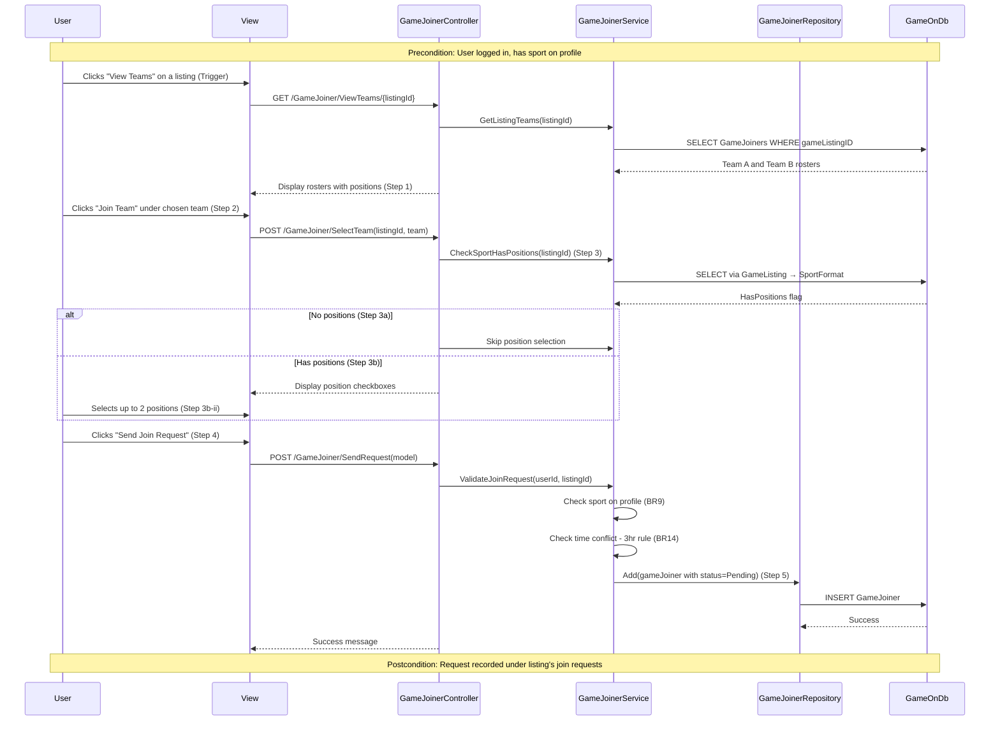


### 8.3 C100 — Record Match Result

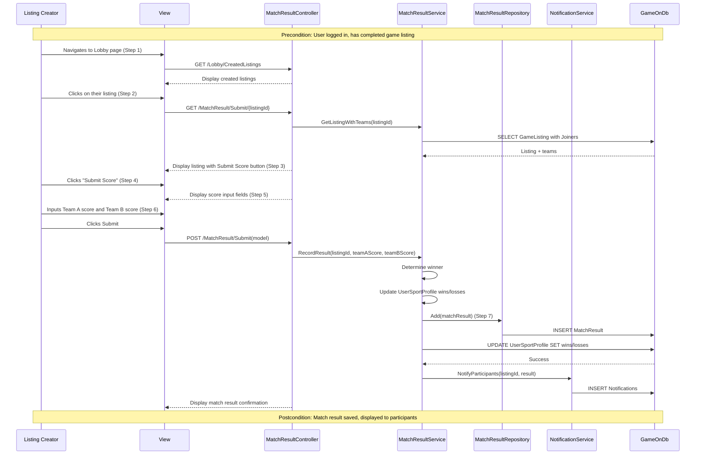

### 8.4 C500 — View Join Requests (Accept/Reject)

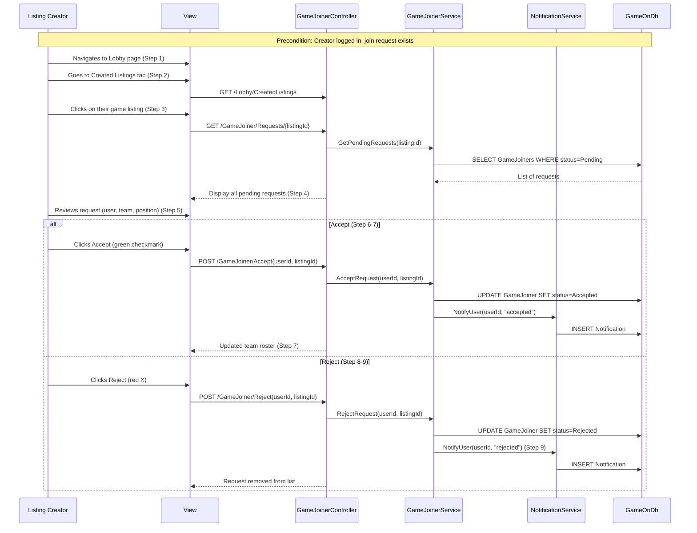

### 8.5 B100 — Create Posts

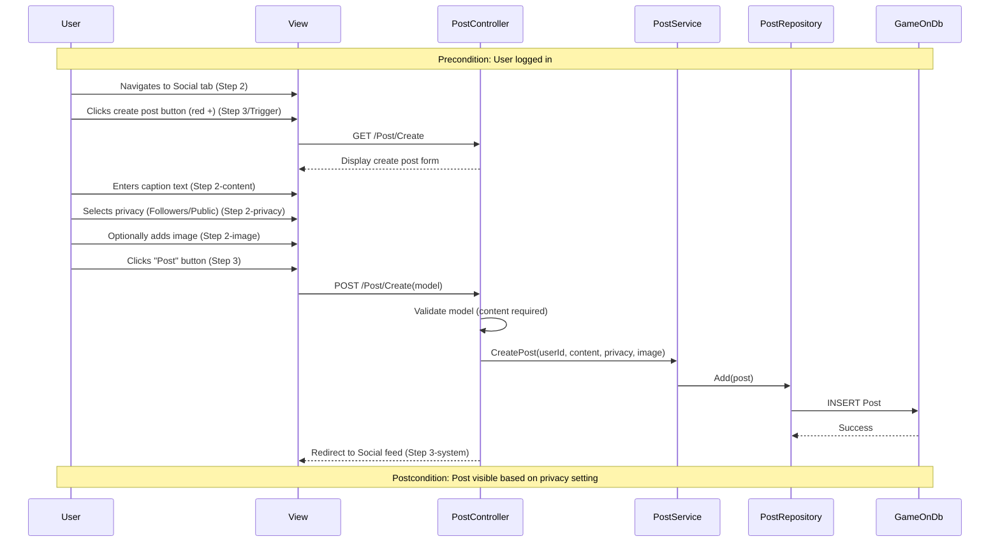


### 8.6 D400 — View User Profile (Follow/Unfollow)

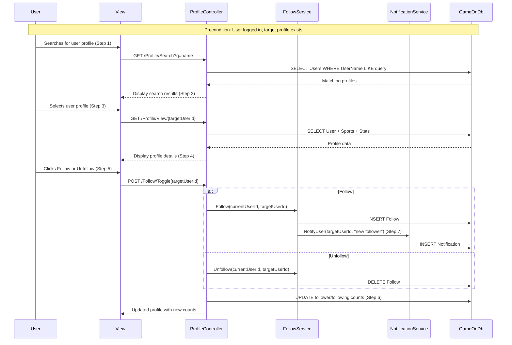

### 8.7 D600 — Report User

```mermaid
sequenceDiagram
    participant U as User
    participant V as View
    participant RC as ReportController
    participant RS as ReportService
    participant DB as GameOnDb

    Note over U,DB: Precondition: User logged in, target user exists

    U->>V: Navigates to user profile (Step 1)
    V-->>U: Display user profile (Step 2)
    U->>V: Clicks three dots menu (Step 3)
    V-->>U: Display options dropdown (Step 4)
    U->>V: Selects "Report User" (Step 5)
    V->>RC: GET /Report/User/{targetUserId}
    RC-->>V: Display list of offences (Step 6)

    U->>V: Selects offence from list (Step 7)
    U->>V: Clicks "Report & Block"
    V->>RC: POST /Report/User(model)
    RC->>RS: CreateReport(reporterId, targetId, reason, "User")
    RS->>DB: INSERT Report (status=Pending)
    DB-->>RS: Success
    RC-->>V: Confirmation message displayed (Step 8)

    Note over U,DB: Step 9: Report logged in system
    Note over U,DB: Step 10: Report sent to Moderator queue
```

### 8.8 B400 — View Reports (Moderator)

```mermaid
sequenceDiagram
    participant M as Moderator
    participant V as View
    participant MC as ModeratorController
    participant MS as ModeratorService
    participant DB as GameOnDb

    Note over M,DB: Precondition: Moderator logged in

    M->>V: Logs in with moderator account (Step 1)
    V->>MC: GET /Moderator/Reports
    MC->>MS: GetPendingReports()
    MS->>DB: SELECT Reports WHERE status=Pending
    DB-->>MS: Report list
    MC-->>V: Display reports summary (Step 2)

    M->>V: Clicks "View Item" on a report (Step 3)
    V->>MC: GET /Moderator/ViewItem/{reportId}
    MC->>MS: GetReportedItem(reportId)
    MS->>DB: SELECT referenced item (User or Post)
    DB-->>MS: Item details
    MC-->>V: Display reported item (Step 4)

    M->>V: Decides action (Step 5)

    alt Dismiss Report
        M->>V: Clicks "Dismiss Report"
        V->>MC: POST /Moderator/Dismiss/{reportId}
        MC->>MS: DismissReport(reportId)
        MS->>DB: UPDATE Report SET status=Dismissed
    else Remove User/Post
        M->>V: Clicks "Remove User" or "Remove Post"
        V->>MC: POST /Moderator/Remove/{reportId}
        MC->>MS: RemoveItem(reportId)
        MS->>DB: DELETE or DISABLE referenced item
        MS->>DB: UPDATE Report SET status=Actioned
    end

    MC-->>V: Updated reports list
```

---

## 9. Activity Diagrams

> **Purpose:** Model decision-heavy workflows with branching logic, guards, and parallel actions.  
> **Sprint Review Criterion:** Narrative Alignment — every branch must match FSSB alternative flows.

### 9.1 A100 — Create Game Listing (Multi-Step Wizard)

```mermaid
flowchart TD
    Start([User clicks Create]) --> Step1[Display listing form]
    Step1 --> Fill[User fills: Sport, Format, Skill, Date, Time, Location, Privacy]
    Fill --> ClickNext1[User clicks Next]
    ClickNext1 --> CheckPos{Sport has positions?}

    CheckPos -->|Yes| ShowPos[Display position selection]
    ShowPos --> SelectPos[User selects up to 2 positions]
    SelectPos --> ClickNext2[User clicks Next]

    CheckPos -->|No| SkipPos[Skip position step]
    SkipPos --> ShowFriends

    ClickNext2 --> ShowFriends[Display friends list]
    ShowFriends --> SelectFriends[User selects friends to invite]
    SelectFriends --> ClickNext3[User clicks Next]
    ClickNext3 --> Preview[Display listing preview]
    Preview --> ClickCreate{User clicks Create Listing?}

    ClickCreate -->|Yes| Validate{All fields valid?}
    Validate -->|No| ShowError[Display validation errors]
    ShowError --> Fill

    Validate -->|Yes| SaveListing[System creates listing in DB]
    SaveListing --> CheckInvites{Friends invited?}
    CheckInvites -->|Yes| SendNotif[Send notifications to friends]
    CheckInvites -->|No| Done

    SendNotif --> Done([Redirect to Listings page])
    ClickCreate -->|Cancel| Cancel([Return to Listings page])

    style Start fill:#c8e6c9
    style Done fill:#c8e6c9
    style CheckPos fill:#fff3e0
    style ClickCreate fill:#fff3e0
    style Validate fill:#fff3e0
    style CheckInvites fill:#fff3e0
```

### 9.2 A300 — Send Join Request (Position Branch)

```mermaid
flowchart TD
    Start([User clicks View Teams]) --> LoadTeams[System loads Team A and Team B rosters]
    LoadTeams --> Display[Display rosters with positions]
    Display --> ChooseTeam[User clicks Join Team under chosen team]
    ChooseTeam --> CheckPos{Sport has positions?}

    CheckPos -->|No| SkipPos[Skip position selection]
    CheckPos -->|Yes| ShowPos[Display all positions for sport]
    ShowPos --> SelectPos[User selects up to 2 preferred positions]
    SelectPos --> ValidatePos{Positions valid?}
    ValidatePos -->|No| PosError[Show error: select at least 1]
    PosError --> ShowPos
    ValidatePos -->|Yes| ReadyToSend

    SkipPos --> ReadyToSend[Enable Send Request button]
    ReadyToSend --> ClickSend[User clicks Send Join Request]
    ClickSend --> ValidateBR{Business rules pass?}

    ValidateBR -->|Sport not on profile| ErrSport[Error: Add sport to profile first]
    ValidateBR -->|Time conflict < 3hrs| ErrTime[Error: Conflicts with existing listing]
    ValidateBR -->|Already in listing| ErrDup[Error: Already requested/joined]
    ValidateBR -->|Pass| SaveRequest[System records join request - status Pending]

    SaveRequest --> Done([Success: Request sent to creator])
    ErrSport --> Display
    ErrTime --> Display
    ErrDup --> Display

    style Start fill:#c8e6c9
    style Done fill:#c8e6c9
    style CheckPos fill:#fff3e0
    style ValidateBR fill:#ffcdd2
```

### 9.3 A700 — Confirm Session (Time-Triggered)

```mermaid
flowchart TD
    Start([System clock tick]) --> CheckTime{Current time = 2hrs before listing?}
    CheckTime -->|No| Wait([Wait for next check])
    CheckTime -->|Yes| CheckFull{Listing is full?}

    CheckFull -->|No| NoConfirm([Listing not confirmed - remains open])
    CheckFull -->|Yes| MarkConfirmed[System marks listing as Confirmed]

    MarkConfirmed --> LockUsers[System locks all participants into session]
    LockUsers --> CreateSession[System creates Session record]
    CreateSession --> UpdateStatus[Update GameJoiner status = Locked]
    UpdateStatus --> TriggerReminder[Trigger A600 - Send Game Reminders]
    TriggerReminder --> Done([Session confirmed - all users notified])

    style Start fill:#fff9c4
    style Done fill:#c8e6c9
    style CheckTime fill:#fff3e0
    style CheckFull fill:#fff3e0
```


### 9.4 B200 — Manage Posts (Edit/Delete Branch)

```mermaid
flowchart TD
    Start([User clicks three dots on own post]) --> ShowMenu[System displays options menu]
    ShowMenu --> Choice{User selects action}

    Choice -->|Edit| LoadEdit[Display post in edit mode]
    LoadEdit --> MakeChanges[User modifies caption/privacy/image]
    MakeChanges --> ClickConfirmEdit[User clicks Confirm Edit]
    ClickConfirmEdit --> ValidateEdit{Content valid?}
    ValidateEdit -->|No| EditError[Show validation error]
    EditError --> LoadEdit
    ValidateEdit -->|Yes| SaveEdit[System updates post in DB]
    SaveEdit --> EditDone([Post updated - redirect to feed])

    Choice -->|Delete| ShowConfirm[Display delete confirmation dialog]
    ShowConfirm --> ConfirmDelete{User confirms delete?}
    ConfirmDelete -->|No| Cancel([Return to post])
    ConfirmDelete -->|Yes| DeletePost[System removes post from DB]
    DeletePost --> DeleteRelated[Remove associated comments and likes]
    DeleteRelated --> DeleteDone([Post deleted - redirect to feed])

    style Start fill:#bbdefb
    style EditDone fill:#c8e6c9
    style DeleteDone fill:#c8e6c9
    style Choice fill:#fff3e0
    style ValidateEdit fill:#fff3e0
    style ConfirmDelete fill:#ffcdd2
```

### 9.5 C300 — Manage Game Listing (Update/Delete Branch)

```mermaid
flowchart TD
    Start([Creator clicks three dots on listing]) --> ShowMenu[System displays dropdown]
    ShowMenu --> Choice{Creator selects action}

    Choice -->|Update| LoadForm[Display listing fields in edit mode]
    LoadForm --> EditFields[Creator modifies listing fields]
    EditFields --> SubmitUpdate[Creator clicks Save Changes]
    SubmitUpdate --> ValidateUpdate{Fields valid?}
    ValidateUpdate -->|No| UpdateError[Show validation errors]
    UpdateError --> LoadForm
    ValidateUpdate -->|Yes| SaveUpdate[System updates listing in DB]
    SaveUpdate --> NotifyJoiners[Notify current joiners of changes]
    NotifyJoiners --> UpdateDone([Listing updated - reflected in UI])

    Choice -->|Delete| ShowWarn[Display delete warning]
    ShowWarn --> HasJoiners{Listing has joiners?}
    HasJoiners -->|Yes| WarnJoiners[Warn: All joiners will be removed]
    HasJoiners -->|No| ConfirmDel
    WarnJoiners --> ConfirmDel{Creator confirms delete?}
    ConfirmDel -->|No| CancelDel([Return to listing])
    ConfirmDel -->|Yes| DeleteListing[System deletes listing from DB]
    DeleteListing --> RemoveJoiners[Remove all GameJoiner records]
    RemoveJoiners --> NotifyRemoved[Notify removed joiners]
    NotifyRemoved --> DeleteDone([Listing deleted - redirect to Lobby])

    style Start fill:#e1bee7
    style UpdateDone fill:#c8e6c9
    style DeleteDone fill:#c8e6c9
    style Choice fill:#fff3e0
    style ConfirmDel fill:#ffcdd2
```

### 9.6 C500 — View Join Requests (Accept/Reject Branch)

```mermaid
flowchart TD
    Start([Creator opens listing from Created tab]) --> LoadRequests[System loads pending requests]
    LoadRequests --> HasRequests{Any pending requests?}
    HasRequests -->|No| Empty([Display: No pending requests])
    HasRequests -->|Yes| DisplayList[Display requests with user info, team, position]

    DisplayList --> SelectRequest[Creator reviews a request]
    SelectRequest --> Decision{Accept or Reject?}

    Decision -->|Accept| CheckCapacity{Team has space?}
    CheckCapacity -->|No| FullError[Error: Team is full]
    FullError --> DisplayList
    CheckCapacity -->|Yes| AddToTeam[Add user to team roster]
    AddToTeam --> UpdateStatus[Update GameJoiner status = Accepted]
    UpdateStatus --> NotifyAccept[Notify user: Request accepted]
    NotifyAccept --> UpdateCount[Update player count on listing]
    UpdateCount --> CheckFull{Listing now full?}
    CheckFull -->|Yes| MarkFull[Mark listing as full]
    CheckFull -->|No| MoreRequests
    MarkFull --> MoreRequests

    Decision -->|Reject| RejectRequest[Update GameJoiner status = Rejected]
    RejectRequest --> NotifyReject[Notify user: Request declined]
    NotifyReject --> MoreRequests{More requests to review?}

    MoreRequests -->|Yes| DisplayList
    MoreRequests -->|No| Done([All requests processed])

    style Start fill:#e1bee7
    style Done fill:#c8e6c9
    style Decision fill:#fff3e0
    style CheckCapacity fill:#fff3e0
    style CheckFull fill:#fff3e0
```

---

## 10. State Diagrams

> **Purpose:** Document the lifecycle states of key entities and valid transitions.  
> **Implementation:** Map states to database column values and enforce via service layer.

### 10.1 GameListing Lifecycle

```mermaid
stateDiagram-v2
    [*] --> Created : Creator submits listing (A100)
    
    Created --> Active : Listing saved to DB
    Active --> Full : All player slots filled (accept enough joiners)
    Active --> Expired : Scheduled time passes (A500)
    Active --> Deleted : Creator deletes listing (C300)
    
    Full --> Confirmed : 2 hours before scheduled time (A700)
    Full --> Active : A joiner leaves (A400)
    Full --> Deleted : Creator deletes listing (C300)
    
    Confirmed --> Completed : Match played + result recorded (C100)
    Confirmed --> Expired : Time passes without result
    
    Completed --> [*]
    Expired --> [*]
    Deleted --> [*]

    note right of Created : privacySetting = Public/Private
    note right of Active : isCompleted = false, visible in browse
    note right of Full : All slots occupied
    note right of Confirmed : Session created, users locked in
    note right of Completed : isCompleted = true, MatchResult exists
    note right of Expired : Hidden from listings page (A500)
```

### 10.2 GameJoiner Status

```mermaid
stateDiagram-v2
    [*] --> Pending : User sends join request (A300)
    
    Pending --> Accepted : Creator accepts request (C500)
    Pending --> Rejected : Creator rejects request (C500)
    Pending --> Withdrawn : User cancels request
    
    Accepted --> Locked : 2 hours before game (A700)
    Accepted --> Left : User leaves listing (A400)
    
    Locked --> Completed : Match finished
    Left --> [*]
    Rejected --> [*]
    Withdrawn --> [*]
    Completed --> [*]

    note right of Pending : Waiting for creator decision
    note right of Accepted : Part of team, can still leave
    note right of Locked : Cannot leave, session confirmed
    note right of Left : Removed from roster, slot reopened
```

### 10.3 Report Lifecycle

```mermaid
stateDiagram-v2
    [*] --> Submitted : User reports user/post (D600/D700)
    
    Submitted --> UnderReview : Moderator views report (B400)
    
    UnderReview --> Dismissed : Moderator dismisses (no action)
    UnderReview --> Actioned : Moderator removes user/post
    
    Dismissed --> [*]
    Actioned --> [*]

    note right of Submitted : status = "Pending", in moderator queue
    note right of UnderReview : Moderator clicked View Item
    note right of Dismissed : Report closed, no penalty
    note right of Actioned : Content/user removed
```

### 10.4 Notification Lifecycle

```mermaid
stateDiagram-v2
    [*] --> Created : System generates notification

    Created --> Unread : Delivered to recipient
    Unread --> Read : User views notification (D500)
    
    Read --> [*]

    note right of Unread : isRead = false, badge count incremented
    note right of Read : isRead = true, visual indicator changes
```

### 10.5 Post Visibility States

```mermaid
stateDiagram-v2
    [*] --> Draft : User filling create form
    
    Draft --> Published : User clicks Post (B100)
    
    Published --> Edited : User edits post (B200)
    Edited --> Published : Changes saved
    
    Published --> Deleted : User deletes post (B200)
    Published --> Removed : Moderator removes post (B400)
    
    Deleted --> [*]
    Removed --> [*]

    note right of Published : privacySetting determines visibility
    note left of Published : Public = all users in community
    note left of Published : Followers = only followers see it
```

### 10.6 State-to-Database Column Mapping

| Entity | State Column | Possible Values | Transitions Triggered By |
|--------|-------------|-----------------|--------------------------|
| GameListing | isCompleted + derived | false/true + date check | A100, A500, A700, C100, C300 |
| GameJoiner | status | Pending, Accepted, Rejected, Locked, Left | A300, A400, A700, C500 |
| Report | status | Pending, UnderReview, Dismissed, Actioned | D600, D700, B400 |
| Notification | isRead | true, false | D500 (viewing) |
| Post | (existence + privacySetting) | Public, Followers, Deleted | B100, B200 |

---

## 11. Navigation Flow & Deployment Diagram

### 11.1 Application Navigation Map

> **Source:** FSSB UI mockups — three main tabs: Listings, Social, Lobby

```mermaid
graph TD
    subgraph "Authentication"
        Login[Login Page]
        Register[Register Step 1/2]
        Register2[Register Step 2/2 - Sports]
    end

    subgraph "Main Navigation Bar"
        Listings[Listings Tab]
        Social[Social Tab]
        Lobby[Lobby Tab]
        Profile[Profile Icon]
        Notif[Notification Bell]
    end

    subgraph "Listings Section"
        BrowseListings[Browse Available Listings]
        CreateListing[Create Listing Wizard]
        ViewTeams[View Teams / Join]
        FilterListings[Filter by Sport/Skill/Date]
    end

    subgraph "Social Section"
        SocialFeed[Social Feed]
        CreatePost[Create Post]
        Communities[Communities Sidebar]
        Leaderboard[Leaderboard]
        SearchPosts[Search / Browse Posts]
        PostDetail[Post Detail - Comments]
    end

    subgraph "Lobby Section"
        CreatedListings[Created Listings Tab]
        JoinedListings[Joined Listings Tab]
        MatchHistory[Match History Tab]
        ManageRequests[Manage Join Requests]
        SubmitScore[Submit/Update Score]
    end

    subgraph "Profile Section"
        MyProfile[My Profile]
        EditProfile[Edit Profile]
        AddSport[Add Sport]
        ViewOtherProfile[View Other User Profile]
        ReportUser[Report User]
    end

    subgraph "Moderator Section"
        Reports[View Reports]
        ReviewItem[Review Reported Item]
    end

    subgraph "Notifications"
        NotifList[Notification List]
    end

    %% Auth flow
    Login -->|Sign Up| Register
    Register --> Register2
    Register2 -->|Complete| Listings
    Login -->|Login| Listings

    %% Main nav
    Listings --> BrowseListings
    Listings --> CreateListing
    BrowseListings --> ViewTeams
    BrowseListings --> FilterListings

    Social --> SocialFeed
    Social --> CreatePost
    Social --> Communities
    Social --> Leaderboard
    Social --> SearchPosts
    SocialFeed --> PostDetail

    Lobby --> CreatedListings
    Lobby --> JoinedListings
    Lobby --> MatchHistory
    CreatedListings --> ManageRequests
    CreatedListings --> SubmitScore
    MatchHistory --> SubmitScore

    Profile --> MyProfile
    MyProfile --> EditProfile
    MyProfile --> AddSport
    Profile --> ViewOtherProfile
    ViewOtherProfile --> ReportUser

    Notif --> NotifList

    %% Moderator override
    Login -->|Moderator| Reports
    Reports --> ReviewItem

    style Login fill:#ffcdd2
    style Listings fill:#c8e6c9
    style Social fill:#bbdefb
    style Lobby fill:#e1bee7
    style Profile fill:#fff9c4
    style Reports fill:#ffccbc
```

### 11.2 Page-to-Controller Route Mapping

| Page | Route | Controller | Action | HTTP |
|------|-------|-----------|--------|------|
| Login | /Account/Login | AccountController | Login | GET/POST |
| Register Step 1 | /Account/Register | AccountController | Register | GET/POST |
| Register Step 2 | /Account/RegisterSports | AccountController | RegisterSports | GET/POST |
| Browse Listings | /Listings | GameListingController | Index | GET |
| Create Listing | /GameListing/Create | GameListingController | Create | GET/POST |
| View Teams | /GameListing/Teams/{id} | GameJoinerController | ViewTeams | GET |
| Social Feed | /Social | PostController | Index | GET |
| Create Post | /Post/Create | PostController | Create | GET/POST |
| Leaderboard | /Leaderboard | LeaderboardController | Index | GET |
| Lobby - Created | /Lobby/Created | LobbyController | Created | GET |
| Lobby - Joined | /Lobby/Joined | LobbyController | Joined | GET |
| Lobby - History | /Lobby/History | LobbyController | History | GET |
| Manage Requests | /GameJoiner/Requests/{id} | GameJoinerController | Requests | GET |
| Submit Score | /MatchResult/Submit/{id} | MatchResultController | Submit | GET/POST |
| My Profile | /Profile | ProfileController | Index | GET |
| View Profile | /Profile/{id} | ProfileController | View | GET |
| Add Sport | /Profile/AddSport | ProfileController | AddSport | GET/POST |
| Notifications | /Notifications | NotificationController | Index | GET |
| Report User | /Report/User/{id} | ReportController | ReportUser | GET/POST |
| Report Post | /Report/Post/{id} | ReportController | ReportPost | GET/POST |
| Moderator Reports | /Moderator/Reports | ModeratorController | Index | GET |


### 11.3 Deployment Diagram

```mermaid
graph TD
    subgraph "Client Tier"
        Browser[Web Browser]
        Mobile[Mobile Browser - Responsive]
    end

    subgraph "Web Server Tier"
        subgraph "ASP.NET Core Application"
            Kestrel[Kestrel Web Server]
            MW[Middleware Pipeline]
            MVC[MVC Engine]
            Razor[Razor View Engine]
            Identity[ASP.NET Identity]
            EF[Entity Framework Core]
        end
    end

    subgraph "Database Tier"
        SQL[(SQL Server)]
        GameOnDb[(GameOnDb)]
    end

    subgraph "Development Environment"
        VS[Visual Studio 2022]
        SSMS[SQL Server Management Studio]
        Git[Git Version Control]
        LocalDB[(LocalDB / SQL Express)]
    end

    Browser -->|HTTPS| Kestrel
    Mobile -->|HTTPS| Kestrel
    Kestrel --> MW
    MW --> MVC
    MVC --> Razor
    MVC --> Identity
    MVC --> EF
    EF -->|TCP 1433| SQL
    SQL --- GameOnDb

    VS -.->|Debug| Kestrel
    SSMS -.->|Manage| LocalDB
    LocalDB -.->|Dev Copy| GameOnDb

    style Browser fill:#e3f2fd
    style SQL fill:#ffcdd2
    style VS fill:#f3e5f5
```

### 11.4 Environment Configuration

| Environment | Database | Server | URL | Purpose |
|-------------|----------|--------|-----|---------|
| Development | LocalDB / SQL Express | IIS Express / Kestrel | https://localhost:5001 | Active coding |
| Testing | SQL Server (local) | Kestrel | https://localhost:5001 | Sprint Review demos |
| Production | SQL Server (network) | IIS / Kestrel | TBD | Final deployment |

### 11.5 Shared Layout Structure (_Layout.cshtml)

```
_Layout.cshtml
├── Header
│   ├── GAME ON Logo (red, italic)
│   ├── Profile Image (top right, clickable → /Profile)
│   └── Notification Bell (badge count)
├── Navigation Tabs
│   ├── Listings (active = red underline)
│   ├── Social
│   └── Lobby
├── @RenderBody() (page content)
└── Footer (minimal)
```

> **Sprint Review Note:** Consistent UI (System Consistency /5) is assessed across ALL subsystems.  
> Every team member MUST use the same `_Layout.cshtml` with identical header, nav tabs, colours, and fonts.

---

## 12. Sprint Review Traceability — Sprint Story (15%)

> **Assessor:** Tech Leads  
> **Marks:** 40 (weighted 15% of total Sprint Review mark)  
> **Focus:** DB integration, CRUD progress, FSSB narrative alignment, UX  
> **Note:** Login/Logout does NOT count. Tech Lead chooses a use case from your BOC.

### 12.1 Mark Breakdown

| Category | Marks | Criteria | Evidence Required |
|----------|-------|----------|-------------------|
| **Teamwork** | /15 | | |
| DB Implementation | /10 | Verified, integrated RDBMS (SQL Server) | Show GameOnDb in SSMS, run query, show EF migration |
| System Consistency | /5 | Consistent UI (buttons, colours, fonts) between subsystems | Navigate between modules — same layout, colours, fonts |
| **Functionality [individual]** | /15 | | |
| BOC & CRUD Progress | /10 | Working CRUD and/or SQL retrieval for ONE use case | Demo full create/read/update/delete for assigned use case |
| Narrative Alignment | /5 | Code matches FSSB narrative steps | Walk through code alongside FSSB document |
| **UX [individual]** | /10 | | |
| Navigation & Recognition | /4 | Intuitive menus, lookups/searches | Show dropdowns, search bars, navigation flow |
| Error Prevention | /2 | Error checking, system remains stable | Trigger validation errors, show system stays up |
| Logic & Efficiency | /4 | Logical screen layout, easy task completion | Demo completing a task in minimal clicks |

### 12.2 DB Implementation (/10) — Artifact Checklist

| # | Item | File/Location | Status |
|---|------|---------------|--------|
| 1 | SQL Server instance running | SSMS → connect to (localdb) or named instance | ☐ |
| 2 | GameOnDb database exists | SSMS → Databases → GameOnDb | ☐ |
| 3 | All 16 tables created | SSMS → Tables list matches Section 4.1 | ☐ |
| 4 | Foreign keys configured | SSMS → Database Diagrams or Keys folder | ☐ |
| 5 | EF Core DbContext configured | Data/GameOnDbContext.cs — all DbSet<> properties | ☐ |
| 6 | Migrations applied | Migrations/ folder + `Update-Database` runs clean | ☐ |
| 7 | Seed data present | Sport, SportFormat, Position tables pre-populated | ☐ |
| 8 | Connection string in appsettings.json | ConnectionStrings:GameOnDb → SQL Server | ☐ |
| 9 | Data reads correctly | Navigate to any page — data loads from DB | ☐ |
| 10 | Data writes correctly | Create a record — verify in SSMS | ☐ |

### 12.3 System Consistency (/5) — Design Token Checklist

| Token | Standard | Applied Where |
|-------|----------|--------------|
| Primary colour | Red (#DC3545 or similar) | Buttons, active tab, logo |
| Secondary colour | Dark grey/black | Navbar background, text |
| Accent colour | Green badges for skill levels | Skill level tags |
| Font family | System default or chosen sans-serif | All text across all pages |
| Button style | Rounded, red background, white text | All CTAs: Create, Post, Submit, Join |
| Card style | White bg, subtle shadow, rounded corners | Listing cards, post cards, profile cards |
| Header | "GAME ON" italic red on grey gradient | _Layout.cshtml header |
| Navigation | Three tabs — Listings / Social / Lobby | Every authenticated page |
| Profile icon | Top-right, circular, clickable | _Layout.cshtml |
| Notification badge | Number badge on bell icon | _Layout.cshtml |

### 12.4 BOC & CRUD Progress (/10) — Per Member

#### Lihlumelo Mgijima (Module A)

| Use Case | CRUD Operation | Controller Action | Service Method | Repository Method | View |
|----------|---------------|-------------------|----------------|-------------------|------|
| A100 Create Listing | **Create** | GameListingController.Create | GameListingService.CreateListing() | GameListingRepository.Add() | Create.cshtml (wizard) |
| A100 Create Listing | **Read** | GameListingController.Create (GET) | GameListingService.GetUserSports() | SportRepository.GetByUser() | Create.cshtml (load sports) |
| A200 Browse Listings | **Read** | GameListingController.Index | GameListingService.GetAvailable() | GameListingRepository.GetFiltered() | Index.cshtml |
| A300 Send Request | **Create** | GameJoinerController.SendRequest | GameJoinerService.CreateRequest() | GameJoinerRepository.Add() | ViewTeams.cshtml |
| A400 Leave Listing | **Delete** | GameJoinerController.Leave | GameJoinerService.RemoveJoiner() | GameJoinerRepository.Remove() | JoinedListings.cshtml |

#### Zane Griesel (Module B)

| Use Case | CRUD Operation | Controller Action | Service Method | Repository Method | View |
|----------|---------------|-------------------|----------------|-------------------|------|
| B100 Create Posts | **Create** | PostController.Create | PostService.CreatePost() | PostRepository.Add() | Create.cshtml |
| B200 Manage Posts | **Update** | PostController.Edit | PostService.UpdatePost() | PostRepository.Update() | Edit.cshtml |
| B200 Manage Posts | **Delete** | PostController.Delete | PostService.DeletePost() | PostRepository.Remove() | Delete.cshtml |
| B300 Browse Posts | **Read** | PostController.Index | PostService.GetFeed() | PostRepository.GetFiltered() | Index.cshtml |
| B500 Leaderboard | **Read** | LeaderboardController.Index | LeaderboardService.GetRankings() | UserSportProfileRepository.GetTop() | Index.cshtml |

#### Gerard Mc Loughlin (Module C)

| Use Case | CRUD Operation | Controller Action | Service Method | Repository Method | View |
|----------|---------------|-------------------|----------------|-------------------|------|
| C100 Record Result | **Create** | MatchResultController.Submit | MatchResultService.RecordResult() | MatchResultRepository.Add() | Submit.cshtml |
| C200 Update Result | **Update** | MatchResultController.Update | MatchResultService.UpdateResult() | MatchResultRepository.Update() | Update.cshtml |
| C300 Manage Listing | **Update/Delete** | GameListingController.Edit/Delete | GameListingService.Update/Delete() | GameListingRepository.Update/Remove() | Edit.cshtml |
| C400 View Results | **Read** | MatchResultController.History | MatchResultService.GetByUser() | MatchResultRepository.GetByUser() | History.cshtml |
| C500 View Requests | **Read + Update** | GameJoinerController.Requests | GameJoinerService.GetPending() | GameJoinerRepository.GetByListing() | Requests.cshtml |

#### Robert Lloyd (Module D)

| Use Case | CRUD Operation | Controller Action | Service Method | Repository Method | View |
|----------|---------------|-------------------|----------------|-------------------|------|
| D100 Register | **Create** | AccountController.Register | AccountService.Register() | UserRepository.Add() | Register.cshtml |
| D200 Manage Profile | **Read + Update** | ProfileController.Edit | ProfileService.UpdateProfile() | UserRepository.Update() | Edit.cshtml |
| D300 Add Sport | **Create** | ProfileController.AddSport | SportService.AddToProfile() | UserSportProfileRepository.Add() | AddSport.cshtml |
| D400 View Profile | **Read** | ProfileController.View | ProfileService.GetProfile() | UserRepository.GetWithSports() | View.cshtml |
| D500 Notifications | **Read** | NotificationController.Index | NotificationService.GetAll() | NotificationRepository.GetByUser() | Index.cshtml |


### 12.5 Narrative Alignment (/5) — Verification Template

For whichever use case the Tech Lead selects, walk through this checklist:

| Step # | FSSB Narrative Step | Code Location | Working? |
|--------|--------------------|--------------:|----------|
| 1 | [Copy from FSSB] | Controller line / View element | ☐ |
| 2 | [Copy from FSSB] | Service method / DB query | ☐ |
| 3 | [Copy from FSSB] | View interaction / redirect | ☐ |
| ... | ... | ... | ☐ |

> **Preparation tip:** Print your FSSB use case narratives. Highlight each step.  
> Have your code open to the matching Controller action. Walk through line-by-line.

### 12.6 UX Criteria (/10) — Evidence Map

| Criterion | Marks | What to Demonstrate | Implementation |
|-----------|-------|--------------------:|----------------|
| Navigation & Recognition | /4 | Dropdown menus, search bars, breadcrumbs | Bootstrap nav, `<select>` for sport filter, search input |
| | | Lookup/search to aid user | Sport dropdown in Create Listing, user search in Social |
| | | Intuitive menu structure | Three-tab layout matching UI mockups |
| Error Prevention | /2 | Required field validation | `[Required]` annotations + jQuery unobtrusive validation |
| | | System remains stable on bad input | try/catch in services, ModelState checks in controllers |
| | | No unhandled exceptions shown | Custom error pages, friendly messages |
| Logic & Efficiency | /4 | Minimal clicks to complete task | Create Listing wizard = 4 steps (not 10) |
| | | Logical layout | Form labels above inputs, buttons at bottom |
| | | Information hierarchy | Most important info first, progressive disclosure |

---

## 13. Sprint Review Traceability — Formal Review (70%)

> **Assessor:** Supervisor  
> **Marks:** 60 (weighted 70% of total Sprint Review mark)  
> **Focus:** Use case functionality vs BOC schedule. Functionality is king.  
> **Format:** Each member demonstrates 2 use cases. Book a review slot via Funda.

### 13.1 Mark Breakdown

| Category | Marks | Criteria |
|----------|-------|----------|
| **Teamwork** | /5 | |
| System Consistency | /5 | Unified, standardised design across entire integrated system |
| **Functionality [individual]** | /40 | |
| Use Case 1 | /20 | Working Status (/15) + FSSB Alignment (/5) |
| Use Case 2 | /20 | Working Status (/15) + FSSB Alignment (/5) |
| **UX [individual]** | /15 | |
| Navigation & Recognition | /6 | Smooth user flow; lookups/datasheet views assist recall |
| Error Recovery | /3 | Robust error checking with helpful feedback |
| Efficiency & Aesthetics | /6 | Correct, all-inclusive utility; professional, balanced layout |

### 13.2 Recommended Use Case Pairings per Member

> Strategy: Choose 1 CRUD-heavy use case + 1 query/display use case for maximum coverage.

| Member | Use Case 1 (CRUD) | Use Case 2 (Query/Report) | Rationale |
|--------|-------------------|---------------------------|-----------|
| **Lihlumelo Mgijima** | A100: Create Game Listing | A200: Browse Listings | Full wizard CRUD + filtered query with display |
| **Zane Griesel** | B100: Create Posts | B300: Browse Posts (+ Like/Comment) | Create CRUD + feed with interactions |
| **Gerard Mc Loughlin** | C100: Record Match Result | C500: View Join Requests (Accept/Reject) | Result recording + decision-based CRUD |
| **Robert Lloyd** | D100: Register User | D400: View User Profile (Follow/Unfollow) | Multi-step create + profile with actions |

### 13.3 Use Case 1 — Working Status (/15) Rubric

| Score | Description | Example |
|-------|-------------|---------|
| 13-15 | Fully functional, all CRUD operations work, data persists | Create listing → visible in browse → stored in DB |
| 10-12 | Mostly functional, minor issues (e.g., one field not saving) | Create works but image upload fails |
| 7-9 | Partially functional, some CRUD works | Can create but not read back / can read but not create |
| 4-6 | Minimal functionality, basic form displays but doesn't save | Form renders, submit throws error |
| 0-3 | Non-functional or not attempted | Page crashes or doesn't load |

### 13.4 FSSB Alignment (/5) per Use Case — Detailed Checklist

#### Lihlumelo — A100: Create Game Listing

| Step | FSSB Narrative | Implementation Artifact | ☐ |
|------|---------------|------------------------|---|
| 1 | System displays information required | GET /GameListing/Create → form with all fields | ☐ |
| 2 | User fills in details | Form: Sport dropdown, Format, Skill, Date, Time, Location, Privacy | ☐ |
| 3 | User clicks Next | POST Step 1 → validates → proceeds | ☐ |
| 4 | System checks sport has positions | Service checks SportFormat.HasPositions | ☐ |
| 5a | User selects up to 2 positions | Position checkboxes, max 2 validation | ☐ |
| 5b | User clicks Next | POST Step 2 → proceeds | ☐ |
| 6 | System displays friends list | Query Follow table → show followed users | ☐ |
| 7 | User selects friends to invite | Checkbox list of friends | ☐ |
| 8 | User clicks Next | POST Step 3 → proceeds | ☐ |
| 9 | System displays listing preview | Confirm page showing card preview | ☐ |
| 10 | User clicks Create Listing | POST Confirm → save to DB | ☐ |
| 11 | System creates listing + notifies friends | INSERT GameListing + INSERT Notifications | ☐ |

#### Zane — B100: Create Posts

| Step | FSSB Narrative | Implementation Artifact | ☐ |
|------|---------------|------------------------|---|
| 1 | User logs into account | Authentication check (precondition) | ☐ |
| 2 | User navigates to social tab | Social tab active in nav | ☐ |
| 3 | User selects create post button | Red + button → GET /Post/Create | ☐ |
| 4 | User enters details (image, caption, privacy) | Form: textarea, file upload, privacy dropdown | ☐ |
| 5 | User clicks Post | POST /Post/Create → validate → save | ☐ |
| 6 | System posts, viewable from profile | INSERT Post → visible on Social feed and Profile | ☐ |

#### Gerard — C100: Record Match Result

| Step | FSSB Narrative | Implementation Artifact | ☐ |
|------|---------------|------------------------|---|
| 1 | Creator navigates to lobby page | Lobby tab active | ☐ |
| 2 | Goes to Created Listings, clicks listing | GET /Lobby/Created → click listing | ☐ |
| 3 | System displays listing + Submit Score button | View with team rosters + button | ☐ |
| 4 | Creator clicks Submit Score | Navigate to score input | ☐ |
| 5 | System displays score input | Two number fields (Team A, Team B) | ☐ |
| 6 | User inputs scores | Enter integer values | ☐ |
| 7 | System saves result | INSERT MatchResult + UPDATE wins/losses | ☐ |

#### Robert — D100: Register User

| Step | FSSB Narrative | Implementation Artifact | ☐ |
|------|---------------|------------------------|---|
| 1 | User opens app | Navigate to root URL | ☐ |
| 2 | System displays login page | Login view loads | ☐ |
| 3 | User selects Sign Up | Click link → GET /Account/Register | ☐ |
| 4 | System displays Step 1/2 | Account Setup form | ☐ |
| 5 | User enters Username, Password, Confirm | Three input fields + Next button | ☐ |
| 6 | System directs to Step 2/2 | Sports selection page | ☐ |
| 7 | User selects sport | Click sport card/image | ☐ |
| 8 | System displays skill level | Skill level options appear | ☐ |
| 9 | User selects skill level | Radio/checkbox for Beginner/Intermediate/Advanced | ☐ |
| 10 | User clicks Complete Registration | POST → validate all | ☐ |
| 11 | System validates (no duplicate username) | Check DB for existing username | ☐ |
| 12 | System stores sport + skill level | INSERT UserSportProfile | ☐ |
| 13 | System creates account | INSERT User via Identity | ☐ |
| 14 | System sends confirmation | Success message/toast | ☐ |
| 15 | Redirect to landing page | Redirect to /Listings | ☐ |


### 13.5 UX Criteria (/15) — Formal Review Evidence

| Criterion | Marks | What Supervisor Looks For | How to Satisfy |
|-----------|-------|--------------------------|----------------|
| **Navigation & Recognition** | /6 | | |
| Smooth user flow | /2 | No dead ends, logical page transitions | Back buttons, breadcrumbs, redirect after actions |
| Lookups/search | /2 | Dropdowns populated from DB, search functionality | Sport dropdowns, user search, listing filters |
| Datasheet views | /2 | Tables/lists that help user find information | Listing cards, match history table, notification list |
| **Error Recovery** | /3 | | |
| Robust error checking | /1 | All forms validate before submit | `[Required]`, `[StringLength]`, `[Range]` annotations |
| Helpful feedback | /1 | Specific error messages, not generic | "Username already taken" not "Error occurred" |
| System stability | /1 | No crashes on invalid input | try/catch, null checks, 404 handling |
| **Efficiency & Aesthetics** | /6 | | |
| Correct, all-inclusive utility | /2 | Feature does everything the use case requires | All FSSB steps implemented, no missing functionality |
| Professional layout | /2 | Bootstrap grid, proper spacing, alignment | Container/row/col structure, consistent padding |
| Balanced visual design | /2 | Good use of colour, white space, no clutter | Card-based layouts, breathing room between elements |

### 13.6 System Consistency (/5) — Integration Checklist

| # | Check | All Members Must Agree On |
|---|-------|---------------------------|
| 1 | Same _Layout.cshtml | Header, nav tabs, footer identical |
| 2 | Same CSS file | site.css or shared Bootstrap theme |
| 3 | Same button classes | `btn btn-danger` for primary actions |
| 4 | Same card structure | `card` > `card-body` > content |
| 5 | Same font | Consistent font-family declaration |
| 6 | Same colour palette | Red primary, grey secondary, green accent |
| 7 | Same notification badge | Bell icon with count badge |
| 8 | Same profile icon style | Circular image, top-right position |
| 9 | Same tab active indicator | Red underline on active tab |
| 10 | Same form styling | Labels above, Bootstrap form-control inputs |

---

## 14. Sprint Review Traceability — Dev Crew Cross-Check (15%)

> **Assessor:** Peer Dev Crews  
> **Marks:** 40 (weighted 15% of total Sprint Review mark)  
> **Format:** Group mark. Each crew peer-reviews 2 other crews.  
> **Date:** Tentative Saturday, 5 September 8:30–15:00

### 14.1 Mark Breakdown

| Category | Marks | Criteria |
|----------|-------|----------|
| **Teamwork** | /10 | |
| Team Pitch | /5 | Explain system purpose clearly to peer crew |
| System Consistency | /5 | Consistent UI between subsystems |
| **Functionality** | /20 | |
| Use Case Status | /15 | Peer rates: Working / Partial / Non-Functional (1 CRUD, 1 Query) |
| Narrative Match | /5 | System behaves as described in FSSB |
| **UX** | /10 | |
| Navigation & Recognition | /4 | Ease of movement; dropdowns/search aid recall |
| Error Handling | /2 | Meaningful, specific error messages |
| Efficiency & Aesthetics | /4 | All-inclusive functionality; good white space, no clutter |

### 14.2 Team Pitch Script (/5)

> Prepare a 2-minute pitch covering these points:

| # | Point | Script Template |
|---|-------|-----------------|
| 1 | Problem | "Sports players struggle to find available teammates to fill a game." |
| 2 | Solution | "GameOn lets users create game listings, find players, and compete." |
| 3 | Key Features | "Listings with skill matching, social feed, match results, leaderboards." |
| 4 | Tech Stack | "ASP.NET Core MVC, SQL Server, Bootstrap 5, Entity Framework Core." |
| 5 | Demo Flow | "We'll show: Register → Create Listing → Join → Record Result → Social." |

### 14.3 Use Case Status Assessment (/15)

Peer crew will assess 1 CRUD use case and 1 Query/Report use case per team:

| Rating | Score | Definition |
|--------|-------|-----------|
| Working | 12-15 | All operations functional, data persists, complete flow |
| Partial | 6-11 | Some operations work, others incomplete or buggy |
| Non-Functional | 0-5 | Does not work, crashes, or not implemented |

**Recommended demonstration pairs (1 CRUD + 1 Query/Report):**

| CRUD Use Case | Query/Report Use Case | Combined Demo |
|---------------|----------------------|---------------|
| A100: Create Game Listing | A200: Browse Listings (filtered) | Create a listing → see it appear in browse |
| B100: Create Posts | B500: View Leaderboards | Create a post → view rankings |
| C100: Record Match Result | C400: View Match Results | Record score → see in match history |
| D100: Register User | D400: View User Profile | Register → view own profile with sport |

### 14.4 Narrative Match (/5) — Peer Verification Guide

The reviewing crew will be given your FSSB. They will:

1. Read the Basic Flow of Events for 1 selected use case
2. Attempt to follow those exact steps in your running system
3. Score based on how closely the system matches the narrative

| Score | Description |
|-------|-------------|
| 5 | Perfect match — every FSSB step is present and works as described |
| 4 | Minor deviation — one step slightly different but intent preserved |
| 3 | Noticeable gaps — 1-2 steps missing or significantly different |
| 2 | Major differences — flow doesn't match narrative well |
| 0-1 | Cannot follow the narrative at all |

### 14.5 UX Peer Assessment (/10)

| Criterion | Marks | Peer Evaluator Checks |
|-----------|-------|----------------------|
| Navigation & Recognition | /4 | Can I find features without help? Are dropdowns populated? |
| | | Is the menu structure logical? Can I get back to where I was? |
| Error Handling | /2 | What happens if I submit an empty form? |
| | | Does the error tell me WHAT is wrong? |
| | | Does the system crash or stay stable? |
| Efficiency & Aesthetics | /4 | Can I complete a task in a reasonable number of clicks? |
| | | Is the layout clean with good white space? |
| | | Does it look professional (not a wireframe/prototype)? |

### 14.6 Pre-Review Self-Assessment Checklist

Run through this before the peer review day:

| # | Check | Status |
|---|-------|--------|
| 1 | System starts without errors | ☐ |
| 2 | Database is seeded with demo data | ☐ |
| 3 | Login works with test accounts | ☐ |
| 4 | All team members' features accessible from main nav | ☐ |
| 5 | Create Listing → Browse → appears in list | ☐ |
| 6 | Create Post → appears in social feed | ☐ |
| 7 | Record Result → appears in match history | ☐ |
| 8 | Register → profile shows sports | ☐ |
| 9 | No unhandled exception pages visible | ☐ |
| 10 | Consistent styling across all pages (no broken layouts) | ☐ |
| 11 | FSSB document printed and ready for reference | ☐ |
| 12 | Team can explain any feature to a stranger | ☐ |

---

## 15. Implementation Build Order & Dependency Chain

> **Deadline:** 26 August 2026  
> **Sprint Review:** Week of 4–8 August 2026 (Sprint Story + Formal Review)  
> **Dev Crew Cross-Check:** Tentative Saturday, 5 September 2026  
> **Strategy:** Work backwards from review dates. Code-complete by 1 August. Final week = testing + polish.  
> **Team Size:** 4 developers working in parallel on their assigned modules.

### 15.1 Timeline Overview

```mermaid
gantt
    title GameOn Implementation Schedule (Deadline: 26 Aug 2026)
    dateFormat  YYYY-MM-DD
    axisFormat  %d %b

    section Phase 1 - Foundation
    Solution + Entities + DbContext       :p1a, 2026-06-30, 3d
    EF Migrations + Seed Data             :p1b, after p1a, 2d
    Identity Setup + Shared Layout        :p1c, after p1b, 3d
    Program.cs DI + Routing               :p1d, after p1c, 1d

    section Phase 2 - Auth + User (Robert)
    D100 Register User                    :p2a, after p1d, 4d
    Login / Logout                        :p2b, after p1d, 2d
    D200 Manage Profile                   :p2c, after p2a, 3d
    D300 Add Sport                        :p2d, after p2c, 2d
    D400 View Profile + Follow            :p2e, after p2d, 3d
    D500 Notifications                    :p2f, after p2e, 2d

    section Phase 3 - Listings (Lihlumelo)
    A100 Create Game Listing              :p3a, after p2d, 5d
    A200 Browse Listings                  :p3b, after p3a, 3d
    A300 Send Join Request                :p3c, after p3b, 3d
    A400 Leave Game Listing               :p3d, after p3c, 1d
    A500 Hide Expired Listings            :p3e, after p3d, 1d
    A600 Send Game Reminders              :p3f, after p3e, 2d
    A700 Confirm Session                  :p3g, after p3f, 2d

    section Phase 4 - Game Mgmt (Gerard)
    C300 Manage Game Listing              :p4a, after p3b, 3d
    C500 View Join Requests               :p4b, after p3c, 3d
    C100 Record Match Result              :p4c, after p4b, 3d
    C200 Update Match Result              :p4d, after p4c, 2d
    C400 View Match Results               :p4e, after p4d, 2d

    section Phase 5 - Social (Zane)
    B100 Create Posts                     :p5a, after p2b, 3d
    B200 Manage Posts                     :p5b, after p5a, 3d
    B300 Browse Posts + Like + Comment    :p5c, after p5b, 4d
    B500 View Leaderboards               :p5d, after p4e, 3d

    section Phase 6 - Reports + Polish
    D600 Report User (Robert)             :p6a, after p2e, 2d
    D700 Report Post (Robert)             :p6b, after p5c, 2d
    B400 View Reports - Moderator (Zane)  :p6c, after p6a, 3d
    Notification Integration              :p6d, after p6c, 2d
    UI Consistency Pass (ALL)             :p6e, after p6d, 3d

    section Review Prep
    Code Freeze                           :milestone, 2026-08-15, 0d
    Testing + Bug Fixes                   :p7a, 2026-08-15, 5d
    Sprint Story with Tech Leads          :milestone, 2026-08-20, 0d
    Formal Review with Supervisor         :crit, p7b, 2026-08-20, 5d
    Final Submission                      :milestone, 2026-08-26, 0d
```

### 15.2 Phase Dependency Graph (Concrete)

```mermaid
graph TD
    subgraph "Phase 1: Foundation [30 Jun – 8 Jul]"
        P1A[Solution + 16 Entity Classes]
        P1B[GameOnDbContext + Migrations]
        P1C[Identity + _Layout + CSS]
        P1D[Program.cs DI + Routing]
    end

    subgraph "Phase 2: User Module - Robert [9 Jul – 24 Jul]"
        P2A[D100: Register User]
        P2B[Login / Logout]
        P2C[D200: Manage Profile]
        P2D[D300: Add Sport]
        P2E[D400: View Profile + Follow/Unfollow]
        P2F[D500: View Notifications]
    end

    subgraph "Phase 3: Listings - Lihlumelo [15 Jul – 4 Aug]"
        P3A[A100: Create Game Listing]
        P3B[A200: Browse Listings]
        P3C[A300: Send Join Request]
        P3D[A400: Leave Listing]
        P3E[A500: Hide Expired]
        P3F[A600: Send Reminders]
        P3G[A700: Confirm Session]
    end

    subgraph "Phase 4: Game Mgmt - Gerard [21 Jul – 7 Aug]"
        P4A[C300: Manage Listing]
        P4B[C500: View Join Requests]
        P4C[C100: Record Match Result]
        P4D[C200: Update Match Result]
        P4E[C400: View Match Results]
    end

    subgraph "Phase 5: Social - Zane [11 Jul – 1 Aug]"
        P5A[B100: Create Posts]
        P5B[B200: Manage Posts]
        P5C[B300: Browse + Like + Comment]
        P5D[B500: Leaderboards]
    end

    subgraph "Phase 6: Reports + Polish [1 Aug – 14 Aug]"
        P6A[D600: Report User]
        P6B[D700: Report Post]
        P6C[B400: View Reports]
        P6D[Notification Wiring]
        P6E[UI Consistency Pass]
    end

    subgraph "Phase 7: Review Prep [15 Aug – 26 Aug]"
        P7A[Code Freeze 15 Aug]
        P7B[Testing + Bug Fixes]
        P7C[Sprint Story Review]
        P7D[Formal Review]
        P7E[Final Submission 26 Aug]
    end

    P1A --> P1B --> P1C --> P1D

    P1D --> P2A
    P1D --> P2B
    P2A --> P2C --> P2D
    P2D --> P2E --> P2F

    P2D --> P3A
    P3A --> P3B --> P3C --> P3D --> P3E --> P3F --> P3G

    P3B --> P4A
    P3C --> P4B
    P4B --> P4C --> P4D
    P4C --> P4E

    P2B --> P5A --> P5B --> P5C
    P4E --> P5D

    P2E --> P6A
    P5C --> P6B
    P6A --> P6C
    P6B --> P6C
    P6C --> P6D --> P6E

    P6E --> P7A --> P7B --> P7C --> P7D --> P7E

    style P1A fill:#e8f5e9
    style P2A fill:#fff9c4
    style P3A fill:#c8e6c9
    style P4A fill:#e1bee7
    style P5A fill:#bbdefb
    style P6A fill:#ffccbc
    style P7A fill:#ffcdd2
```


### 15.3 Daily Build Plan per Team Member

#### Robert Lloyd (Module D — User Management)

| Day | Date | Task | Deliverable | Depends On |
|-----|------|------|-------------|------------|
| 1-3 | 30 Jun – 2 Jul | Phase 1 (shared) | Entities, DbContext, Migrations | — |
| 4-5 | 3–4 Jul | Phase 1 (shared) | Identity, Layout, CSS, DI | Entities |
| 6 | 7 Jul | Phase 1 finalize | Seed data (Sports, Formats, Positions) | Migrations |
| 7-10 | 8–11 Jul | D100: Register | Full 2-step registration flow | Identity |
| 11-12 | 14–15 Jul | Login/Logout | Auth cookie, role-based redirect | Identity |
| 13-15 | 16–18 Jul | D200: Manage Profile | View/edit username, display sports | D100 |
| 16-17 | 21–22 Jul | D300: Add Sport | Sport selection + skill level | D200 |
| 18-20 | 23–25 Jul | D400: View Profile | Other user profile + follow/unfollow | D300 |
| 21-22 | 28–29 Jul | D500: View Notifications | Notification list, read/unread | D400 |
| 23-24 | 30–31 Jul | D600: Report User | Report form + offence list | D400 |
| 25-26 | 1–4 Aug | D700: Report Post | Report from social feed | B300 (Zane) |
| 27-30 | 5–14 Aug | Integration + polish | Wire notifications, consistency | All modules |

#### Lihlumelo Mgijima (Module A — Game Listings)

| Day | Date | Task | Deliverable | Depends On |
|-----|------|------|-------------|------------|
| 1-6 | 30 Jun – 7 Jul | Phase 1 (assist) | Help with entities, seed sport formats | — |
| 7-11 | 15–19 Jul | A100: Create Listing | 4-step wizard (details→positions→friends→confirm) | D300 (sport on profile) |
| 12-14 | 22–24 Jul | A200: Browse Listings | Filtered listing page, cards | A100 |
| 15-17 | 25–29 Jul | A300: Send Join Request | Team view, position select, request | A200 |
| 18 | 30 Jul | A400: Leave Listing | Leave button on Joined tab | A300 |
| 19 | 31 Jul | A500: Hide Expired | Date filter in browse query | A200 |
| 20-21 | 1–4 Aug | A600: Send Reminders | Notification 2hrs before | A700 |
| 22-23 | 4–5 Aug | A700: Confirm Session | Lock users, create session | A300 (full listing) |
| 24-30 | 6–14 Aug | Integration + polish | Business rule enforcement, testing | All modules |

#### Gerard Mc Loughlin (Module C — Game Management)

| Day | Date | Task | Deliverable | Depends On |
|-----|------|------|-------------|------------|
| 1-6 | 30 Jun – 7 Jul | Phase 1 (assist) | Help with entities, test DB | — |
| 7-9 | 21–23 Jul | C300: Manage Listing | Update/delete listing from Lobby | A100 (listing exists) |
| 10-12 | 24–28 Jul | C500: View Join Requests | Accept/reject UI with notifications | A300 (requests exist) |
| 13-15 | 29–31 Jul | C100: Record Match Result | Score input, winner calc, stats update | C500 (game played) |
| 16-17 | 1–4 Aug | C200: Update Match Result | Edit score from match history | C100 |
| 18-19 | 4–5 Aug | C400: View Match Results | Match history page in Lobby | C100 |
| 20-30 | 6–14 Aug | Integration + polish | Leaderboard data feeds, testing | All modules |

#### Zane Griesel (Module B — Social)

| Day | Date | Task | Deliverable | Depends On |
|-----|------|------|-------------|------------|
| 1-6 | 30 Jun – 7 Jul | Phase 1 (assist) | Help with entities, CSS design | — |
| 7-9 | 11–15 Jul | B100: Create Posts | Post form with privacy, image, caption | Login (Robert) |
| 10-12 | 16–18 Jul | B200: Manage Posts | Edit/delete own posts | B100 |
| 13-16 | 21–24 Jul | B300: Browse Posts | Social feed, like, comment, communities | B100 |
| 17-19 | 5–7 Aug | B500: Leaderboards | Ranking by win%, filter by sport/community | C400 (match data) |
| 20-22 | 8–10 Aug | B400: View Reports | Moderator dashboard, dismiss/remove | D600, D700 |
| 23-30 | 11–14 Aug | Integration + polish | Report flow end-to-end, UI consistency | All modules |

### 15.4 Critical Path

```mermaid
graph LR
    A[Foundation<br/>30 Jun - 8 Jul] --> B[D100 Register + D300 Add Sport<br/>8-22 Jul]
    B --> C[A100 Create Listing<br/>15-19 Jul]
    C --> D[A300 Send Join Request<br/>25-29 Jul]
    D --> E[C500 Accept Requests<br/>24-28 Jul]
    E --> F[C100 Record Result<br/>29-31 Jul]
    F --> G[B500 Leaderboards<br/>5-7 Aug]
    G --> H[UI Polish<br/>8-14 Aug]
    H --> I[Code Freeze<br/>15 Aug]
    I --> J[Sprint Review<br/>20-25 Aug]

    style A fill:#e8f5e9
    style I fill:#ffcdd2
    style J fill:#ffcdd2
```

> **Critical path insight:** The longest dependency chain runs through Robert's D300 (Add Sport) → Lihlumelo's A100 (Create Listing) → A300 (Join Request) → Gerard's C500 (Accept) → C100 (Record Result) → Zane's B500 (Leaderboard). If any of these slips, everything downstream is delayed.

### 15.5 Parallel Work Streams

| Week | Robert (D) | Lihlumelo (A) | Gerard (C) | Zane (B) |
|------|-----------|---------------|------------|----------|
| 30 Jun – 4 Jul | Entities + DbContext | Seed data (formats/positions) | Test migrations | CSS + Layout |
| 7–11 Jul | D100 Register | Help with Identity testing | Help with DB diagram | B100 Create Posts |
| 14–18 Jul | D200 Profile + D300 Sport | A100 Create Listing (start) | Research match result logic | B200 Manage Posts |
| 21–25 Jul | D400 View Profile + Follow | A100 (finish) + A200 Browse | C300 Manage Listing | B300 Browse + Like |
| 28 Jul – 1 Aug | D500 Notifications | A300 Join + A400 Leave | C500 View Requests | B300 Comment |
| 4–8 Aug | D600 Report User | A500 + A600 + A700 | C100 + C200 Record/Update | B500 Leaderboards |
| 11–14 Aug | D700 Report Post | Integration testing | C400 View Results | B400 View Reports |
| 15–19 Aug | **CODE FREEZE** — Bug fixes + demo prep | Testing all flows end-to-end | Testing all flows | Testing all flows |
| 20–26 Aug | **SPRINT REVIEWS** | Sprint Story + Formal Review | Sprint Story + Formal Review | Sprint Story + Formal Review |

### 15.6 Key Milestones

| Date | Milestone | Gate Criteria |
|------|-----------|--------------|
| **8 Jul** | Foundation Complete | All entities compile, DB created, Identity works, Layout renders |
| **15 Jul** | Login + Register Working | Can register a new user with sport, login, see dashboard |
| **22 Jul** | Listings Core Working | Can create a listing and see it in browse |
| **29 Jul** | Join Flow Working | Can send request, creator can accept, user appears on team |
| **5 Aug** | Match Results Working | Can record a score, see in history, stats updated |
| **8 Aug** | Social Complete | Can post, like, comment, see leaderboard |
| **14 Aug** | All Features Integrated | Reports work, notifications fire, UI consistent |
| **15 Aug** | CODE FREEZE | No new features. Only bug fixes and polish. |
| **20 Aug** | Review Ready | Demo script rehearsed, FSSB printed, all flows tested |
| **26 Aug** | FINAL SUBMISSION | Everything submitted, reviewed, done. |

### 15.7 Risk Mitigation

| Risk | Probability | Impact | Mitigation |
|------|-------------|--------|------------|
| Robert's D300 delays Lihlumelo's A100 | Medium | High (critical path) | Robert prioritises D300 by 18 Jul; Lihlumelo preps A100 UI with mock data |
| Database schema changes mid-project | Medium | Medium | Lock entity design by 8 Jul; use migrations for any changes |
| UI inconsistency across members | High | Medium (costs /5 marks) | Agree on shared CSS by 4 Jul; PR review all layout changes |
| Time-triggered features (A500/A600/A700) hard to demo | Medium | Low | Use manual triggers for demo; explain scheduled logic to reviewer |
| Member absent or behind | Low | High | Daily standup; each member documents their code for handoff |

---

## 16. Glossary & References

### 16.1 Glossary

| Term | Definition |
|------|-----------|
| FSSB | Functional Specification & Solution Blueprint — the approved design document |
| BOC | Backlog Ownership Chart — maps use cases to team members |
| Sprint Story | 15% tech-lead assessment focusing on DB, CRUD, narrative alignment |
| Formal Review | 70% supervisor assessment focusing on use case functionality |
| Dev Crew Cross-Check | 15% peer assessment focusing on usability and consistency |
| Use Case | A specific interaction between an actor and the system |
| CRUD | Create, Read, Update, Delete — the four basic data operations |
| EF Core | Entity Framework Core — the ORM for database access |
| GameOnDb | The SQL Server database for this project |
| Listing Creator | The user who created a specific game listing |
| Listing Joiner | A user who has been accepted into a game listing |
| Session | A confirmed game that is locked in 2 hours before start time |
| Moderator | An admin role that can review reports and remove content |
| ViewModel | A class that shapes data specifically for a Razor View |
| Repository | A data access class that abstracts EF Core queries |
| Service | A class containing business logic between Controller and Repository |
| Navigation Property | An EF Core property representing a relationship to another entity |
| Composite PK | A primary key made up of two or more columns |
| Seed Data | Pre-populated data inserted during migration (Sports, Formats, Positions) |

### 16.2 FSSB Cross-Reference Index

| FSSB Section | Architecture Section | Content |
|-------------|---------------------|---------|
| 1.1 Problem Description | [Section 1.1](#11-problem-statement) | Problem statement |
| 1.2 Business Rules | [Section 1.3](#13-business-rules) | All 14 business rules |
| 1.3 System Constraints | [Section 1.4](#14-system-constraints) | Platform limitations |
| 2.1 Initial Use Case Model | [Section 7.1](#71-system-level-use-case-overview) | Use case diagram |
| 2.3 Use Case Glossary | [Section 7](#7-use-case-diagrams) | Module allocation |
| 2.4.2.1 A100 Narrative | [Section 8.1](#81-a100--create-game-listing) | Sequence diagram |
| 2.4.2.3 A300 Narrative | [Section 8.2](#82-a300--send-join-request) | Sequence diagram |
| 2.4.2.8 D100 Narrative | [Section 6.2](#62-authentication--registration-flow-d100) | Auth sequence |
| 2.4.2.9 B100 Narrative | [Section 8.5](#85-b100--create-posts) | Sequence diagram |
| 2.4.2.10 C100 Narrative | [Section 8.3](#83-c100--record-match-result) | Sequence diagram |
| 4.1 Data Attributes | [Section 3.1](#31-complete-er-diagram) | ER diagram |
| 4.2 Domain Class Diagram | [Section 4.1](#41-implementation-ready-class-diagram) | Class diagram |
| 4.4 Database Structure | [Section 3](#3-entity-relationship-diagram) | Full DB schema |
| 5.1 System Environment | [Section 11.3](#113-deployment-diagram) | Deployment |

### 16.3 Sprint Review Rubric Quick Reference

| Component | Weight | Total Marks | Key Focus |
|-----------|--------|-------------|-----------|
| Sprint Story (Tech Leads) | 15% | /40 | DB (/10), Consistency (/5), CRUD (/10), Narrative (/5), UX (/10) |
| Formal Review (Supervisor) | 70% | /60 | Consistency (/5), UC1 (/20), UC2 (/20), UX (/15) |
| Dev Crew Cross-Check (Peers) | 15% | /40 | Pitch (/5), Consistency (/5), Status (/15), Narrative (/5), UX (/10) |
| **TOTAL** | **100%** | **140 raw** | Weighted to percentage |

### 16.4 File Naming Conventions

| Type | Convention | Example |
|------|-----------|---------|
| Entity | PascalCase, singular | `GameListing.cs` |
| Controller | PascalCase + "Controller" | `GameListingController.cs` |
| Service | PascalCase + "Service" | `GameListingService.cs` |
| Interface | "I" + PascalCase + "Service/Repository" | `IGameListingService.cs` |
| Repository | PascalCase + "Repository" | `GameListingRepository.cs` |
| ViewModel | PascalCase + "ViewModel" | `CreateListingViewModel.cs` |
| View | PascalCase, matches action | `Views/GameListing/Create.cshtml` |
| Migration | Timestamp + description | `20260701_InitialCreate.cs` |
| CSS | lowercase, kebab-case | `site.css`, `game-on-theme.css` |

### 16.5 Document Revision History

| Version | Date | Author | Changes |
|---------|------|--------|---------|
| 1.0 | April 2026 | CodeSphere | Initial architecture document |

---

> **End of Document**  
> This architecture document is a living reference. Update it as implementation decisions evolve.  
> For questions, refer back to the FSSB as the single source of truth for functional requirements.
