# GameOn — Complete Development Plan

> **Project:** GameOn — Sports Management & Social Platform  
> **Module:** WRRV301 (2026)  
> **Team:** CodeSphere  
> **Deadline:** 26 August 2026  
> **Stack:** ASP.NET Core MVC | Entity Framework Core | SQL Server | Bootstrap 5  
> **Document Purpose:** Complete implementation roadmap for the entire development team

---

## Table of Contents

| # | Section | Purpose |
|---|---------|---------|
| 1 | [Executive Summary](#1-executive-summary) | Project context and objectives |
| 2 | [System Architecture Overview](#2-system-architecture-overview) | High-level design |
| 3 | [Development Roadmap](#3-development-roadmap) | Phased implementation plan |
| 4 | [Entity Relationship Planning](#4-entity-relationship-planning) | Database design |
| 5 | [ASP.NET Core MVC Structure](#5-aspnet-core-mvc-structure) | Folder structure |
| 6 | [Use Case Planning](#6-use-case-planning) | Per use case implementation details |
| 7 | [Database Migration Plan](#7-database-migration-plan) | Migration and seed strategy |
| 8 | [Service Layer Planning](#8-service-layer-planning) | Business logic inventory |
| 9 | [Repository Layer Planning](#9-repository-layer-planning) | Data access methods |
| 10 | [Controller Planning](#10-controller-planning) | Route and action mapping |
| 11 | [UI Planning](#11-ui-planning) | Navigation, layouts, journeys |
| 12 | [Sprint Review Traceability Matrix](#12-sprint-review-traceability-matrix) | Rubric alignment |
| 13 | [Risk Assessment](#13-risk-assessment) | Risks and mitigation |
| 14 | [Development Order](#14-development-order) | Priority-sequenced feature list |
| 15 | [Final Build Checklist](#15-final-build-checklist) | Pre-submission verification |

---

## 1. Executive Summary

### 1.1 Project Purpose

GameOn is a web-based sports management platform with integrated social features designed to connect sports players with available teammates and opponents for pickup games and organised sessions.

### 1.2 Problem Being Solved

Sports players frequently struggle to find available teammates to fill a game. There is no centralised platform that connects players based on sport, skill level, location, and availability while also offering social engagement and competitive tracking.

### 1.3 Main Stakeholders

| Stakeholder | Role | Interest |
|-------------|------|----------|
| Sports Players (Users) | Primary users | Find games, compete, track stats, socialise |
| Game Listing Creators | Power users | Organise games, manage rosters, record results |
| Game Listing Joiners | Participants | Find and join games matching their skill/sport |
| Moderators | Content governance | Review reports, remove bad content/users |
| WRRV301 Supervisors | Academic assessors | Evaluate Sprint Review deliverables (70% weight) |
| Tech Leads | Technical assessors | Verify DB integration, CRUD, FSSB narrative alignment (15%) |
| Peer Dev Crews | Peer assessors | Evaluate usability and consistency (15%) |

### 1.4 System Objectives

| # | Objective | Measured By |
|---|-----------|-------------|
| O1 | Allow users to create game listings specifying sport, skill level, positions, and player count | A100 functional |
| O2 | Allow users to browse, filter, and request to join game sessions | A200, A300 functional |
| O3 | Allow listing creators to manage rosters (accept/reject requests) | C500 functional |
| O4 | Record and display match results with automatic stat tracking | C100, C400, B500 functional |
| O5 | Provide social features: posts, comments, likes, follows | B100-B300, D400 functional |
| O6 | Display leaderboards based on win percentage per sport | B500 functional |
| O7 | Enable user/post reporting and moderator content governance | D600, D700, B400 functional |
| O8 | Deliver notifications for game invites, reminders, and social activity | D500, A600 functional |

### 1.5 Key Business Rules

| # | Rule | Enforcement Location |
|---|------|---------------------|
| BR1 | A user can post ONE Game Listing at a time | GameListingService.Create() — check active count |
| BR2 | A user can join one or many game listings | GameJoinerService — no single-join limit |
| BR3 | Only one match can be scheduled from a Game Listing | Session table — unique FK constraint |
| BR4 | A user can only create a game listing if they have that sport on their profile | GameListingService.Validate() — check UserSportProfile |
| BR5 | A user can only join a game listing if they have that sport on their profile | GameJoinerService.Validate() — check UserSportProfile |
| BR6 | One match result can be created from a Game Listing | MatchResult — unique FK constraint |
| BR7 | Only the Game Listing creator can update a match result | MatchResultService — authorization check creatorID |
| BR8 | A user can report many users, posts and comments | ReportService — no limit |
| BR9 | Only moderator can remove users, posts or comments | [Authorize(Roles="Moderator")] on ModeratorController |
| BR10 | A user cannot join 2 listings whose scheduled times are less than 3 hours apart | GameJoinerService.ValidateTimeConflict() |
| BR11 | All users still in a listing 2 hours before scheduled time are locked in | SessionService — time-triggered confirmation (A700) |
| BR12 | A user can play multiple sports | UserSportProfile — composite PK allows multiple |
| BR13 | Only the listing creator can record and update a match result | MatchResultService — check creatorID |
| BR14 | A user can follow many other users / have many followers | Follow table — no limits |

### 1.6 System Constraints

| Constraint | Impact on Design |
|-----------|-----------------|
| Venue availability is NOT synced with the system | Location is free-text input only |
| Not all sports grounds can be verified | No address validation or maps integration |
| No payment gateway for booking sports grounds | No financial transactions in system |
| System does not handle how games are played | Only organisation + result recording |

---

## 2. System Architecture Overview

### 2.1 High-Level Architecture Diagram

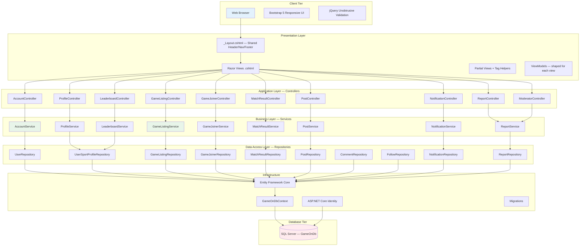

### 2.2 MVC Architecture Diagram

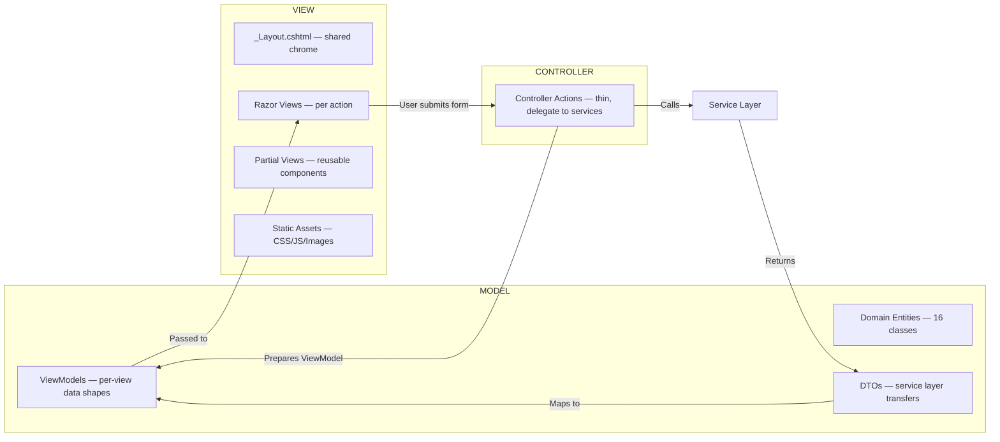

### 2.3 Layered Architecture — Request Flow

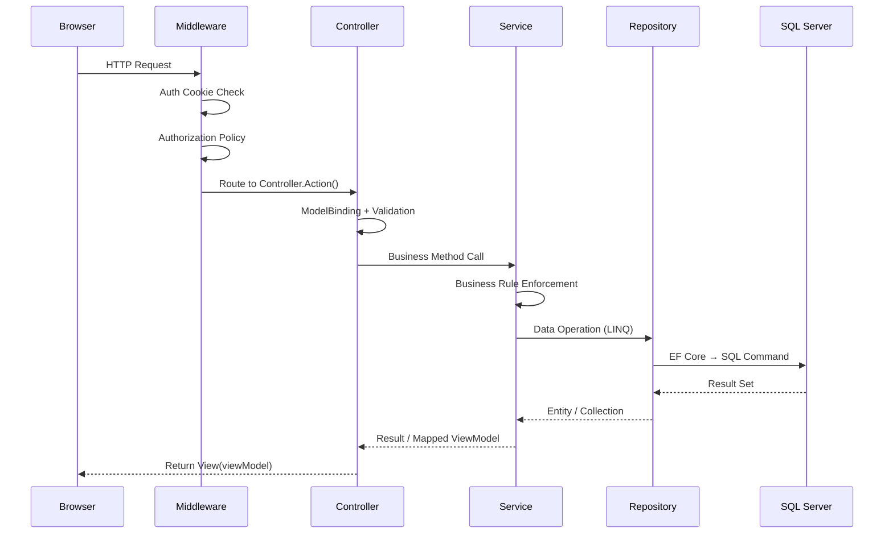

### 2.4 Technology Stack Summary

| Layer | Technology | Version | Purpose |
|-------|-----------|---------|---------|
| Frontend | Bootstrap 5 | 5.3+ | Responsive layout, components |
| Frontend | jQuery | 3.6+ | Unobtrusive validation, AJAX |
| Backend | ASP.NET Core MVC | .NET 8 | Web framework |
| ORM | Entity Framework Core | 8.x | Database abstraction |
| Database | SQL Server | 2019+ | RDBMS storage |
| Authentication | ASP.NET Core Identity | Built-in | User accounts, roles, cookies |
| Validation | Data Annotations | Built-in | Server-side + client-side |
| DI Container | Built-in .NET | — | Constructor injection |
| IDE | Visual Studio 2022 | 17.x | Development environment |

---

## 3. Development Roadmap

> **Timeline:** 30 June 2026 → 26 August 2026 (8 weeks)  
> **Code Freeze:** 15 August 2026  
> **Sprint Reviews:** 20–25 August 2026  
> **Team:** 4 developers working in parallel on assigned modules

### 3.1 Phase Timeline Overview

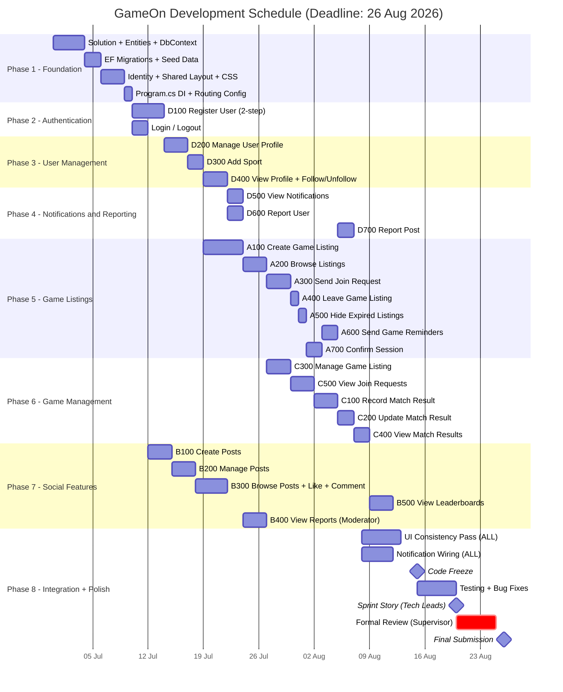

### 3.2 Phase 1 — Foundation (ALL team members)

| Item | Owner | Dependencies | Complexity | DB Entities Required | UI Pages |
|------|-------|-------------|-----------|---------------------|----------|
| Create .NET solution with project structure | All | None | Low | — | — |
| Define all 16 entity classes | All | None | Medium | All 16 | — |
| Create GameOnDbContext with DbSets | All | Entities | Medium | All 16 | — |
| Generate initial EF Migration | All | DbContext | Low | All tables | — |
| Seed Sport, SportFormat, Position, FormatPosition | All | Migration | Low | Reference tables | — |
| Configure ASP.NET Identity (User + Roles) | Robert | DbContext | Medium | User | — |
| Create _Layout.cshtml with shared nav/header | Zane | None | Medium | — | Shared layout |
| Define site.css with design tokens (colours, fonts) | Zane | None | Medium | — | All pages |
| Configure Program.cs (DI, middleware, routing) | Robert | All above | Low | — | — |

**Gate Criteria:** All entities compile. DB created in SQL Server. Identity works. Shared layout renders.

### 3.3 Phase 2 — Authentication (Robert Lloyd)

| Item | Dependencies | Complexity | DB Entities | UI Pages |
|------|-------------|-----------|-------------|----------|
| D100: Register User — Step 1/2 (Username, Password, Confirm) | Identity setup | High | User | Register.cshtml |
| D100: Register User — Step 2/2 (Select Sport + Skill Level) | Sport seed data | High | UserSportProfile | RegisterSports.cshtml |
| Login with cookie authentication | Identity setup | Medium | User | Login.cshtml |
| Logout with cookie clear | Login | Low | — | Redirect |
| Role-based redirect (User → Listings, Moderator → Reports) | Identity roles | Low | — | — |

**Gate Criteria:** Can register a new user with sport. Can login. Can logout. Moderator redirects to reports page.

### 3.4 Phase 3 — User Management (Robert Lloyd)

| Item | Dependencies | Complexity | DB Entities | UI Pages |
|------|-------------|-----------|-------------|----------|
| D200: Manage Profile — View own profile with stats | D100 | Medium | User, UserSportProfile | Profile/Index.cshtml |
| D200: Manage Profile — Edit username | D200 View | Low | User | Profile/Edit.cshtml |
| D200: Manage Profile — Delete sport from profile | D200 View | Low | UserSportProfile | Profile/Edit.cshtml |
| D300: Add Sport — Select from available sports | D200 | Medium | UserSportProfile, Sport | Profile/AddSport.cshtml |
| D300: Add Sport — Choose skill level (Beginner/Intermediate/Advanced) | D300 select | Low | UserSportProfile | Profile/AddSport.cshtml |
| D400: View User Profile — Display other user's profile | D200 | Medium | User, UserSportProfile, Follow | Profile/View.cshtml |
| D400: Follow User | D400 View | Medium | Follow | Profile/View.cshtml (button) |
| D400: Unfollow User | D400 Follow | Low | Follow | Profile/View.cshtml (button) |
| D400: Search users | D400 View | Medium | User | Profile/Search.cshtml |

**Gate Criteria:** Full profile management. Add/remove sports. Follow/unfollow other users. Search works.

### 3.5 Phase 4 — Notifications & Reporting (Robert Lloyd)

| Item | Dependencies | Complexity | DB Entities | UI Pages |
|------|-------------|-----------|-------------|----------|
| D500: View Notifications — List all (read/unread) | Follow system | Medium | Notification | Notifications/Index.cshtml |
| D500: Mark notification as read | D500 list | Low | Notification | Notifications/Index.cshtml |
| D600: Report User — Three dots menu on profile | D400 | Medium | Report | Report/User.cshtml |
| D600: Select offence reason from list | D600 form | Low | Report | Report/User.cshtml |
| D700: Report Post — Three dots menu on post | B300 (posts exist) | Medium | Report | Report/Post.cshtml |
| D700: Select offence reason from list | D700 form | Low | Report | Report/Post.cshtml |

**Gate Criteria:** Notifications display with read/unread. Reports submit correctly and appear in moderator queue.

### 3.6 Phase 5 — Game Listings (Lihlumelo Mgijima)

| Item | Dependencies | Complexity | DB Entities | UI Pages |
|------|-------------|-----------|-------------|----------|
| A100: Create Listing — Step 1 (Sport, Format, Skill, Date, Time, Location, Privacy) | D300 (sport on profile) | High | GameListing, SportFormat | GameListing/Create.cshtml |
| A100: Create Listing — Step 2 (Position selection if applicable) | Step 1 | Medium | FormatPosition | GameListing/CreateStep2.cshtml |
| A100: Create Listing — Step 3 (Invite friends) | Step 2 + Follow | Medium | Follow, Notification | GameListing/CreateStep3.cshtml |
| A100: Create Listing — Step 4 (Preview + Confirm) | Step 3 | Low | GameListing | GameListing/Confirm.cshtml |
| A200: Browse Listings — Display available listings with cards | A100 | Medium | GameListing | Listings/Index.cshtml |
| A200: Filter by sport, skill level, date | A200 base | Medium | GameListing | Listings/Index.cshtml (filters) |
| A300: Send Join Request — View teams (Team A/B rosters) | A200 | High | GameJoiner | GameJoiner/ViewTeams.cshtml |
| A300: Select position (if sport has positions) | A300 view | Medium | FormatPosition | GameJoiner/ViewTeams.cshtml |
| A300: Submit join request | A300 position | Medium | GameJoiner | GameJoiner/ViewTeams.cshtml |
| A400: Leave Game Listing — Leave button on Joined tab | A300 accepted | Low | GameJoiner | Lobby/Joined.cshtml |
| A500: Hide Expired Listings — Filter by date in query | A200 | Low | GameListing | Service-level filter |
| A600: Send Game Reminders — 2hrs before notification | A700 | Medium | Notification | System-generated |
| A700: Confirm Session — Lock users 2hrs before | A300 (full listing) | Medium | Session, GameJoiner | System-triggered |

**Gate Criteria:** Full create wizard works. Listings browse with filters. Join request flow. Leave works. Time features trigger.

### 3.7 Phase 6 — Game Management (Gerard Mc Loughlin)

| Item | Dependencies | Complexity | DB Entities | UI Pages |
|------|-------------|-----------|-------------|----------|
| C300: Manage Listing — View own listing from Lobby/Created | A100 | Low | GameListing | Lobby/Created.cshtml |
| C300: Update game listing fields | C300 view | Medium | GameListing | GameListing/Edit.cshtml |
| C300: Delete game listing (with confirmation) | C300 view | Medium | GameListing, GameJoiner | GameListing/Delete.cshtml |
| C500: View Join Requests — Display pending requests | A300 (requests exist) | High | GameJoiner | GameJoiner/Requests.cshtml |
| C500: Accept join request | C500 view | Medium | GameJoiner, Notification | GameJoiner/Requests.cshtml |
| C500: Reject join request | C500 view | Medium | GameJoiner, Notification | GameJoiner/Requests.cshtml |
| C100: Record Match Result — Score input form | C500 (game completed) | Medium | MatchResult | MatchResult/Submit.cshtml |
| C100: Calculate winner + update UserSportProfile stats | C100 submit | High | MatchResult, UserSportProfile | Service logic |
| C200: Update Match Result — Edit existing score | C100 | Low | MatchResult | MatchResult/Update.cshtml |
| C400: View Match Results — Match history list | C100 | Low | MatchResult | Lobby/History.cshtml |

**Gate Criteria:** Full listing management. Accept/reject works with notifications. Score submission updates stats. History displays.

### 3.8 Phase 7 — Social Features (Zane Griesel)

| Item | Dependencies | Complexity | DB Entities | UI Pages |
|------|-------------|-----------|-------------|----------|
| B100: Create Posts — Form (caption, image, privacy) | Login | Medium | Post | Post/Create.cshtml |
| B200: Manage Posts — Edit post (caption/privacy) | B100 | Medium | Post | Post/Edit.cshtml |
| B200: Delete post (with confirmation) | B100 | Low | Post, Comment, Like | Post/Delete.cshtml |
| B300: Browse Posts — Social feed with community filter | B100 | High | Post, Comment, Like | Social/Index.cshtml |
| B300: Like / Unlike a post | B300 feed | Medium | Like | Partial/AJAX |
| B300: Comment on a post | B300 feed | Medium | Comment | Partial/AJAX or form |
| B300: View comments on a post | B300 | Low | Comment | Post/Detail.cshtml |
| B500: View Leaderboards — Rankings by win% per sport | C100 (match data) | Medium | UserSportProfile | Leaderboard/Index.cshtml |
| B500: Filter by sport/community/friends | B500 base | Medium | UserSportProfile, Follow | Leaderboard/Index.cshtml |
| B400: View Reports — Moderator dashboard | D600/D700 (reports exist) | Medium | Report | Moderator/Index.cshtml |
| B400: Dismiss report | B400 view | Low | Report | Moderator/Index.cshtml |
| B400: Remove user/post | B400 view | Medium | Report, User/Post | Moderator/Index.cshtml |

**Gate Criteria:** Full post lifecycle. Social feed with likes/comments. Leaderboard renders. Moderator can action reports.

### 3.9 Phase 8 — Integration & Polish (ALL)

| Item | Owner | Dependencies | Complexity |
|------|-------|-------------|-----------|
| Wire all notification triggers (follow, join accepted/rejected, game reminder, match result) | Robert | All features | Medium |
| UI consistency pass — ensure same colours, buttons, cards, fonts everywhere | All | All views | Medium |
| Error handling — custom error pages, try/catch, friendly messages | All | All controllers | Medium |
| Responsive testing — test all pages on mobile viewport | All | All views | Low |
| Integration testing — end-to-end flows across modules | All | All features | High |
| Demo data — create realistic test accounts and data | All | All features | Low |
| FSSB alignment check — walk through narratives vs code | All | All features | Medium |

**Gate Criteria:** System runs end-to-end without errors. All pages consistent. All FSSB narratives verifiable.

### 3.10 Critical Path

```mermaid
graph LR
    F[Foundation<br/>30 Jun–9 Jul] --> R[D100 Register + D300 Add Sport<br/>10–22 Jul]
    R --> CL[A100 Create Listing<br/>15–22 Jul]
    CL --> BL[A200 Browse + A300 Join<br/>22–29 Jul]
    BL --> RQ[C500 Accept Requests<br/>29 Jul–1 Aug]
    RQ --> MR[C100 Record Result<br/>1–5 Aug]
    MR --> LB[B500 Leaderboards<br/>5–8 Aug]
    LB --> PO[UI Polish<br/>8–14 Aug]
    PO --> CF[Code Freeze<br/>15 Aug]
    CF --> SR[Sprint Reviews<br/>20–26 Aug]

    style F fill:#e8f5e9
    style CF fill:#ffcdd2
    style SR fill:#ffcdd2
```

> **Critical insight:** The longest chain is Foundation → Register → Add Sport → Create Listing → Join Request → Accept → Record Result → Leaderboard. Any delay on this path pushes the entire project.

### 3.11 Parallel Work Streams by Week

| Week | Robert (D) | Lihlumelo (A) | Gerard (C) | Zane (B) |
|------|-----------|---------------|------------|----------|
| 30 Jun – 4 Jul | Entities + DbContext | Seed formats/positions | Help with DB testing | _Layout + CSS design |
| 7–11 Jul | Identity + D100 Register | Help test Identity | Help test migrations | B100 Create Posts |
| 14–18 Jul | D200 Profile + D300 Sport | A100 Create Listing (start) | Study match result logic | B200 Manage Posts |
| 21–25 Jul | D400 View Profile + Follow | A100 (finish) + A200 Browse | C300 Manage Listing | B300 Browse + Like |
| 28 Jul – 1 Aug | D500 Notifications | A300 Join + A400 Leave | C500 View Requests | B300 Comment |
| 4–8 Aug | D600 Report User | A500 + A600 + A700 | C100 + C200 Record/Update | B500 Leaderboards |
| 11–14 Aug | D700 Report Post + polish | Integration testing | C400 View Results + polish | B400 Moderator + polish |
| 15–19 Aug | Bug fixes + demo prep | Bug fixes + demo prep | Bug fixes + demo prep | Bug fixes + demo prep |
| 20–26 Aug | **SPRINT REVIEWS** | **SPRINT REVIEWS** | **SPRINT REVIEWS** | **SPRINT REVIEWS** |

---

## 4. Entity Relationship Planning

> **Source:** FSSB Section 4.1 — List of Data and Attributes  
> **Database:** GameOnDb (SQL Server)  
> **ORM:** Entity Framework Core (Code-First with Migrations)  
> **Total Entities:** 16

### 4.1 Complete ER Diagram

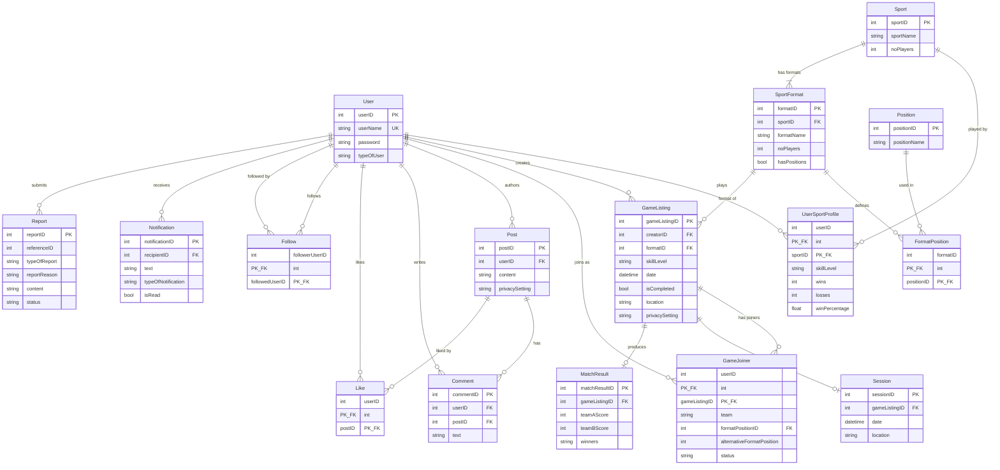

### 4.2 Database Planning Notes

| Concern | Decision | Justification |
|---------|----------|---------------|
| PK Strategy | Auto-increment int for single PKs; composite for junction tables | Standard SQL Server identity pattern |
| Composite PKs | UserSportProfile, GameJoiner, FormatPosition, Like, Follow | Junction tables use natural composite keys |
| Soft Delete | GameListing uses isCompleted flag; Posts are hard-deleted | Expired listings hidden but preserved for history |
| String vs Enum | Store as strings in DB; map to C# enums in code | Flexibility for future values; readable in SSMS |
| Calculated Fields | winPercentage computed in service, stored in DB | Avoid recalculation on every leaderboard query |
| Cascade Delete | Restrict on User deletion; Cascade on Post→Comments, Post→Likes | Protect referential integrity; clean up orphans |
| Indexes | Unique on User.userName; Index on GameListing.date; Index on Notification.recipientID+isRead | Query performance for key operations |
| Null handling | location, alternativeFormatPosition nullable; all FKs non-nullable | Match FSSB requirements |

### 4.3 Per-Entity Detailed Planning

---

#### Entity: User

| Attribute | Type | Constraints | Notes |
|-----------|------|------------|-------|
| userID | int | PK, Identity | Auto-increment |
| userName | string(50) | Required, Unique | Login identifier |
| password | string(256) | Required | Hashed via Identity |
| typeOfUser | string(20) | Required, Default="User" | "User" or "Moderator" |

| Planning Item | Detail |
|---------------|--------|
| **Purpose** | Core identity entity for every person in the system |
| **Primary Key** | userID (int, auto-increment) |
| **Foreign Keys** | None (top-level parent) |
| **Relationships** | 1:many → UserSportProfile, GameListing, GameJoiner, Post, Comment, Like, Follow (as follower), Follow (as followed), Notification, Report |
| **Validation Rules** | userName: 3-30 chars, unique, alphanumeric + underscore; password: min 6 chars, at least 1 digit |
| **CRUD Operations** | Create (D100), Read (D200, D400), Update (D200), Delete (Moderator B400) |
| **Business Rules** | BR1 (one active listing), BR4/BR5 (sport check via profile) |

---

#### Entity: UserSportProfile

| Attribute | Type | Constraints | Notes |
|-----------|------|------------|-------|
| userID | int | PK, FK→User | Composite key part 1 |
| sportID | int | PK, FK→Sport | Composite key part 2 |
| skillLevel | string(20) | Required | Beginner/Intermediate/Advanced |
| wins | int | Default=0 | Updated on match result |
| losses | int | Default=0 | Updated on match result |
| winPercentage | float | Computed | wins/(wins+losses)*100 |

| Planning Item | Detail |
|---------------|--------|
| **Purpose** | Tracks which sports a user plays, their skill level, and win/loss stats |
| **Primary Key** | Composite (userID, sportID) |
| **Foreign Keys** | userID → User, sportID → Sport |
| **Relationships** | Many:1 → User, Many:1 → Sport |
| **Validation Rules** | skillLevel must be one of [Beginner, Intermediate, Advanced]; wins/losses ≥ 0 |
| **CRUD Operations** | Create (D100 registration, D300 add sport), Read (D200, D400, B500), Update (C100 match result), Delete (D200 remove sport) |
| **Business Rules** | BR4 (user must have sport to create listing), BR5 (must have sport to join), BR12 (multiple sports allowed) |

---

#### Entity: Sport

| Attribute | Type | Constraints | Notes |
|-----------|------|------------|-------|
| sportID | int | PK, Identity | Auto-increment |
| sportName | string(50) | Required, Unique | Display name |
| noPlayers | int | Required, >0 | Default player count |

| Planning Item | Detail |
|---------------|--------|
| **Purpose** | Reference table of all available sports in the system |
| **Primary Key** | sportID (int, auto-increment) |
| **Foreign Keys** | None |
| **Relationships** | 1:many → SportFormat, 1:many → UserSportProfile |
| **Validation Rules** | sportName required and unique; noPlayers > 0 |
| **CRUD Operations** | Read only (populated via seed data) |
| **Seed Data** | Padel, Tennis, Basketball, Football, Rugby |

---

#### Entity: SportFormat

| Attribute | Type | Constraints | Notes |
|-----------|------|------------|-------|
| formatID | int | PK, Identity | Auto-increment |
| sportID | int | FK→Sport | Parent sport |
| formatName | string(50) | Required | e.g., "5v5", "3v3", "Doubles" |
| noPlayers | int | Required, >0 | Total players needed for this format |
| hasPositions | bool | Required | Does this format have defined positions? |

| Planning Item | Detail |
|---------------|--------|
| **Purpose** | Defines format variations per sport (e.g., Football 5v5, Basketball 3v3) |
| **Primary Key** | formatID (int, auto-increment) |
| **Foreign Keys** | sportID → Sport |
| **Relationships** | Many:1 → Sport, 1:many → FormatPosition, 1:many → GameListing |
| **Validation Rules** | formatName required; noPlayers > 0; hasPositions boolean |
| **CRUD Operations** | Read only (populated via seed data) |
| **Seed Data** | Football: 5v5 (10 players, hasPositions=true), 7v7, 11v11; Basketball: 3v3, 5v5; Tennis: Singles, Doubles; Padel: Doubles; Rugby: 7s, 15s |

---

#### Entity: FormatPosition

| Attribute | Type | Constraints | Notes |
|-----------|------|------------|-------|
| formatID | int | PK, FK→SportFormat | Composite key part 1 |
| positionID | int | PK, FK→Position | Composite key part 2 |

| Planning Item | Detail |
|---------------|--------|
| **Purpose** | Junction table mapping which positions apply to which sport format |
| **Primary Key** | Composite (formatID, positionID) |
| **Foreign Keys** | formatID → SportFormat, positionID → Position |
| **Relationships** | Many:1 → SportFormat, Many:1 → Position |
| **Validation Rules** | Both FK references must exist |
| **CRUD Operations** | Read only (populated via seed data) |
| **Seed Data** | Football 5v5 → Goalkeeper, Defense, Midfield, Attack; Basketball → Guard, Forward, Center |

---

#### Entity: Position

| Attribute | Type | Constraints | Notes |
|-----------|------|------------|-------|
| positionID | int | PK, Identity | Auto-increment |
| positionName | string(50) | Required, Unique | Display name |

| Planning Item | Detail |
|---------------|--------|
| **Purpose** | Reference table of all playing positions across all sports |
| **Primary Key** | positionID (int, auto-increment) |
| **Foreign Keys** | None |
| **Relationships** | 1:many → FormatPosition |
| **Validation Rules** | positionName required and unique |
| **CRUD Operations** | Read only (populated via seed data) |
| **Seed Data** | Goalkeeper, Defense, Midfield, Attack, Any Position, Guard, Forward, Center |

---

#### Entity: GameListing

| Attribute | Type | Constraints | Notes |
|-----------|------|------------|-------|
| gameListingID | int | PK, Identity | Auto-increment |
| creatorID | int | FK→User | Who created this listing |
| formatID | int | FK→SportFormat | Which sport/format |
| skillLevel | string(20) | Required | Suggested skill level |
| date | datetime | Required | Scheduled game date+time |
| isCompleted | bool | Default=false | Set true after match result |
| location | string(200) | Required | Free-text venue name |
| privacySetting | string(10) | Required | "Public" or "Private" |

| Planning Item | Detail |
|---------------|--------|
| **Purpose** | A game session created by a user seeking players to fill teams |
| **Primary Key** | gameListingID (int, auto-increment) |
| **Foreign Keys** | creatorID → User, formatID → SportFormat |
| **Relationships** | Many:1 → User (creator), Many:1 → SportFormat, 1:many → GameJoiner, 1:0..1 → Session, 1:0..1 → MatchResult |
| **Validation Rules** | date must be in the future; location required; privacySetting "Public" or "Private"; BR1: creator max 1 active listing; BR4: creator must have sport on profile |
| **CRUD Operations** | Create (A100), Read (A200, C300), Update (C300), Delete (C300) |
| **Business Rules** | BR1, BR3, BR4 |
| **State Transitions** | Created → Active → Full → Confirmed → Completed/Expired/Deleted |

---

#### Entity: GameJoiner

| Attribute | Type | Constraints | Notes |
|-----------|------|------------|-------|
| userID | int | PK, FK→User | Composite key part 1 |
| gameListingID | int | PK, FK→GameListing | Composite key part 2 |
| team | string(1) | Required | "A" or "B" |
| formatPositionID | int | FK→FormatPosition, Nullable | Primary position |
| alternativeFormatPosition | int | Nullable | Secondary position preference |
| status | string(20) | Required, Default="Pending" | Pending/Accepted/Rejected/Locked/Left |

| Planning Item | Detail |
|---------------|--------|
| **Purpose** | Tracks join requests and accepted members for each game listing |
| **Primary Key** | Composite (userID, gameListingID) |
| **Foreign Keys** | userID → User, gameListingID → GameListing |
| **Relationships** | Many:1 → User, Many:1 → GameListing |
| **Validation Rules** | team "A" or "B"; status valid enum value; BR5: sport must be on profile; BR10: no time conflict < 3hrs |
| **CRUD Operations** | Create (A300), Read (C500), Update (C500 accept/reject, A700 lock), Delete (A400 leave) |
| **Business Rules** | BR5, BR10, BR11 |
| **State Transitions** | Pending → Accepted/Rejected; Accepted → Locked/Left; Locked → Completed |

---

#### Entity: Session

| Attribute | Type | Constraints | Notes |
|-----------|------|------------|-------|
| sessionID | int | PK, Identity | Auto-increment |
| gameListingID | int | FK→GameListing, Unique | One session per listing |
| date | datetime | Required | Copied from listing |
| location | string(200) | Required | Copied from listing |

| Planning Item | Detail |
|---------------|--------|
| **Purpose** | Represents a confirmed game session (created when listing locks 2hrs before start) |
| **Primary Key** | sessionID (int, auto-increment) |
| **Foreign Keys** | gameListingID → GameListing (unique) |
| **Relationships** | 1:1 → GameListing |
| **Validation Rules** | BR3: only 1 session per listing; gameListingID must be unique |
| **CRUD Operations** | Create (A700 — system-triggered), Read (internal) |
| **Business Rules** | BR3, BR11 |

---

#### Entity: MatchResult

| Attribute | Type | Constraints | Notes |
|-----------|------|------------|-------|
| matchResultID | int | PK, Identity | Auto-increment |
| gameListingID | int | FK→GameListing, Unique | One result per listing |
| teamAScore | int | Required, ≥0 | Team A final score |
| teamBScore | int | Required, ≥0 | Team B final score |
| winners | string(10) | Required | "Team A", "Team B", or "Draw" |

| Planning Item | Detail |
|---------------|--------|
| **Purpose** | The final score of a completed game, recorded by the listing creator |
| **Primary Key** | matchResultID (int, auto-increment) |
| **Foreign Keys** | gameListingID → GameListing (unique) |
| **Relationships** | 1:1 → GameListing |
| **Validation Rules** | BR6: 1 result per listing (unique FK); BR7/BR13: only creator can create/update; scores ≥ 0 |
| **CRUD Operations** | Create (C100), Read (C400), Update (C200) |
| **Business Rules** | BR6, BR7, BR13 |
| **Side Effects** | On create/update → recalculate UserSportProfile.wins/losses/winPercentage for all participants |

---

#### Entity: Post

| Attribute | Type | Constraints | Notes |
|-----------|------|------------|-------|
| postID | int | PK, Identity | Auto-increment |
| userID | int | FK→User | Author |
| content | string(500) | Required | Caption text |
| privacySetting | string(10) | Required | "Public" or "Followers" |

| Planning Item | Detail |
|---------------|--------|
| **Purpose** | Social content posted by users (text + optional image) |
| **Primary Key** | postID (int, auto-increment) |
| **Foreign Keys** | userID → User |
| **Relationships** | Many:1 → User, 1:many → Comment, 1:many → Like |
| **Validation Rules** | content required, max 500 chars; privacySetting "Public" or "Followers" |
| **CRUD Operations** | Create (B100), Read (B300), Update (B200 edit), Delete (B200 user / B400 moderator) |
| **Business Rules** | Privacy determines visibility in feed |

---

#### Entity: Comment

| Attribute | Type | Constraints | Notes |
|-----------|------|------------|-------|
| commentID | int | PK, Identity | Auto-increment |
| userID | int | FK→User | Commenter |
| postID | int | FK→Post | Which post |
| text | string(250) | Required | Comment content |

| Planning Item | Detail |
|---------------|--------|
| **Purpose** | User comments on posts in the social feed |
| **Primary Key** | commentID (int, auto-increment) |
| **Foreign Keys** | userID → User, postID → Post |
| **Relationships** | Many:1 → User, Many:1 → Post |
| **Validation Rules** | text required, max 250 chars |
| **CRUD Operations** | Create (B300), Read (B300), Delete (B400 moderator) |

---

#### Entity: Like

| Attribute | Type | Constraints | Notes |
|-----------|------|------------|-------|
| userID | int | PK, FK→User | Who liked |
| postID | int | PK, FK→Post | Which post |

| Planning Item | Detail |
|---------------|--------|
| **Purpose** | Tracks which users have liked which posts (toggle on/off) |
| **Primary Key** | Composite (userID, postID) |
| **Foreign Keys** | userID → User, postID → Post |
| **Relationships** | Many:1 → User, Many:1 → Post |
| **Validation Rules** | One like per user per post (enforced by composite PK) |
| **CRUD Operations** | Create (B300 like), Delete (B300 unlike) |

---

#### Entity: Follow

| Attribute | Type | Constraints | Notes |
|-----------|------|------------|-------|
| followerUserID | int | PK, FK→User | Who is following |
| followedUserID | int | PK, FK→User | Who is being followed |

| Planning Item | Detail |
|---------------|--------|
| **Purpose** | Social graph tracking who follows whom |
| **Primary Key** | Composite (followerUserID, followedUserID) |
| **Foreign Keys** | followerUserID → User, followedUserID → User (self-referencing) |
| **Relationships** | Self-referencing many:many on User |
| **Validation Rules** | Cannot follow self (service validation); unique pair (composite PK) |
| **CRUD Operations** | Create (D400 follow), Delete (D400 unfollow) |
| **Side Effects** | On create → generate Notification for followed user |

---

#### Entity: Notification

| Attribute | Type | Constraints | Notes |
|-----------|------|------------|-------|
| notificationID | int | PK, Identity | Auto-increment |
| recipientID | int | FK→User | Who receives it |
| text | string(300) | Required | Message content |
| typeOfNotification | string(30) | Required | Category of notification |
| isRead | bool | Default=false | Read/unread status |

| Planning Item | Detail |
|---------------|--------|
| **Purpose** | System-generated messages delivered to users for various events |
| **Primary Key** | notificationID (int, auto-increment) |
| **Foreign Keys** | recipientID → User |
| **Relationships** | Many:1 → User |
| **Validation Rules** | text required; typeOfNotification required; isRead defaults false |
| **CRUD Operations** | Create (system-generated), Read (D500), Update (D500 mark as read) |
| **Notification Types** | FollowNew, JoinRequestReceived, JoinAccepted, JoinRejected, GameReminder, MatchResultPosted, ListingCancelled, ListingInvite |

---

#### Entity: Report

| Attribute | Type | Constraints | Notes |
|-----------|------|------------|-------|
| reportID | int | PK, Identity | Auto-increment |
| referenceID | int | Required | ID of reported user or post |
| typeOfReport | string(10) | Required | "User" or "Post" |
| reportReason | string(50) | Required | Selected offence |
| content | string(200) | Nullable | Additional details |
| status | string(20) | Default="Pending" | Pending/Dismissed/Actioned |

| Planning Item | Detail |
|---------------|--------|
| **Purpose** | User-submitted complaints about other users or posts |
| **Primary Key** | reportID (int, auto-increment) |
| **Foreign Keys** | Implicit — referenceID points to User.userID or Post.postID based on typeOfReport |
| **Relationships** | Polymorphic reference via typeOfReport + referenceID |
| **Validation Rules** | typeOfReport "User" or "Post"; reportReason required (from predefined list); status valid enum |
| **CRUD Operations** | Create (D600, D700), Read (B400), Update (B400 moderator dismiss/action) |
| **Report Reasons** | Offensive username, Harassment, Inappropriate content, Spam, Cheating, Other |
| **Business Rules** | BR8 (user can report many), BR9 (only moderator can action) |

### 4.4 Relationship Cardinality Summary

| Parent | Child | Type | FK Column | Cascade |
|--------|-------|------|-----------|---------|
| User | UserSportProfile | 1:0..* | userID | Cascade |
| Sport | UserSportProfile | 1:0..* | sportID | Restrict |
| Sport | SportFormat | 1:1..* | sportID | Cascade |
| SportFormat | FormatPosition | 1:0..* | formatID | Cascade |
| Position | FormatPosition | 1:0..* | positionID | Cascade |
| User | GameListing | 1:0..* | creatorID | Restrict |
| SportFormat | GameListing | 1:0..* | formatID | Restrict |
| User | GameJoiner | 1:0..* | userID | Cascade |
| GameListing | GameJoiner | 1:0..* | gameListingID | Cascade |
| GameListing | Session | 1:0..1 | gameListingID | Cascade |
| GameListing | MatchResult | 1:0..1 | gameListingID | Cascade |
| User | Post | 1:0..* | userID | Cascade |
| User | Comment | 1:0..* | userID | Restrict |
| Post | Comment | 1:0..* | postID | Cascade |
| User | Like | 1:0..* | userID | Cascade |
| Post | Like | 1:0..* | postID | Cascade |
| User | Follow (follower) | 1:0..* | followerUserID | Cascade |
| User | Follow (followed) | 1:0..* | followedUserID | Restrict |
| User | Notification | 1:0..* | recipientID | Cascade |
| User | Report | 1:0..* | reportID (implicit) | Restrict |

---

## 5. ASP.NET Core MVC Structure

### 5.1 Solution Folder Structure

```
GameOn/
│
├── Controllers/
│   ├── AccountController.cs           # Login, Register (D100), Logout
│   ├── ProfileController.cs           # D200, D300, D400 (own + other profiles)
│   ├── GameListingController.cs       # A100 Create, A200 Browse, C300 Manage
│   ├── GameJoinerController.cs        # A300 Join, A400 Leave, C500 Requests
│   ├── MatchResultController.cs       # C100 Record, C200 Update, C400 View
│   ├── PostController.cs              # B100 Create, B200 Manage, B300 Browse
│   ├── NotificationController.cs      # D500 View Notifications
│   ├── ReportController.cs            # D600 Report User, D700 Report Post
│   ├── ModeratorController.cs         # B400 View/Action Reports
│   ├── LeaderboardController.cs       # B500 Leaderboard
│   └── LobbyController.cs            # Created/Joined/History tabs
│
├── Services/
│   ├── Interfaces/
│   │   ├── IAccountService.cs
│   │   ├── IProfileService.cs
│   │   ├── IGameListingService.cs
│   │   ├── IGameJoinerService.cs
│   │   ├── IMatchResultService.cs
│   │   ├── IPostService.cs
│   │   ├── ICommentService.cs
│   │   ├── ILikeService.cs
│   │   ├── IFollowService.cs
│   │   ├── INotificationService.cs
│   │   ├── IReportService.cs
│   │   ├── ILeaderboardService.cs
│   │   └── ISessionService.cs
│   ├── AccountService.cs
│   ├── ProfileService.cs
│   ├── GameListingService.cs
│   ├── GameJoinerService.cs
│   ├── MatchResultService.cs
│   ├── PostService.cs
│   ├── CommentService.cs
│   ├── LikeService.cs
│   ├── FollowService.cs
│   ├── NotificationService.cs
│   ├── ReportService.cs
│   ├── LeaderboardService.cs
│   └── SessionService.cs
│
├── Repositories/
│   ├── Interfaces/
│   │   ├── IUserRepository.cs
│   │   ├── IUserSportProfileRepository.cs
│   │   ├── ISportRepository.cs
│   │   ├── ISportFormatRepository.cs
│   │   ├── IGameListingRepository.cs
│   │   ├── IGameJoinerRepository.cs
│   │   ├── ISessionRepository.cs
│   │   ├── IMatchResultRepository.cs
│   │   ├── IPostRepository.cs
│   │   ├── ICommentRepository.cs
│   │   ├── ILikeRepository.cs
│   │   ├── IFollowRepository.cs
│   │   ├── INotificationRepository.cs
│   │   └── IReportRepository.cs
│   ├── UserRepository.cs
│   ├── UserSportProfileRepository.cs
│   ├── SportRepository.cs
│   ├── SportFormatRepository.cs
│   ├── GameListingRepository.cs
│   ├── GameJoinerRepository.cs
│   ├── SessionRepository.cs
│   ├── MatchResultRepository.cs
│   ├── PostRepository.cs
│   ├── CommentRepository.cs
│   ├── LikeRepository.cs
│   ├── FollowRepository.cs
│   ├── NotificationRepository.cs
│   └── ReportRepository.cs
│
├── Models/
│   ├── Entities/
│   │   ├── User.cs
│   │   ├── UserSportProfile.cs
│   │   ├── Sport.cs
│   │   ├── SportFormat.cs
│   │   ├── FormatPosition.cs
│   │   ├── Position.cs
│   │   ├── GameListing.cs
│   │   ├── GameJoiner.cs
│   │   ├── Session.cs
│   │   ├── MatchResult.cs
│   │   ├── Post.cs
│   │   ├── Comment.cs
│   │   ├── Like.cs
│   │   ├── Follow.cs
│   │   ├── Notification.cs
│   │   └── Report.cs
│   └── Enums/
│       ├── SkillLevel.cs              # Beginner, Intermediate, Advanced
│       ├── JoinerStatus.cs            # Pending, Accepted, Rejected, Locked, Left
│       ├── PrivacySetting.cs          # Public, Private, Followers
│       ├── ReportType.cs              # User, Post
│       ├── ReportStatus.cs            # Pending, Dismissed, Actioned
│       ├── NotificationType.cs        # FollowNew, JoinAccepted, etc.
│       └── Team.cs                    # A, B
│
├── ViewModels/
│   ├── Account/
│   │   ├── RegisterStep1ViewModel.cs  # Username, Password, ConfirmPassword
│   │   ├── RegisterStep2ViewModel.cs  # Sport selection + skill level
│   │   └── LoginViewModel.cs          # Username, Password
│   ├── Profile/
│   │   ├── MyProfileViewModel.cs      # Own profile display
│   │   ├── EditProfileViewModel.cs    # Edit username
│   │   ├── ViewProfileViewModel.cs    # Other user's profile
│   │   ├── AddSportViewModel.cs       # Sport + skill level selection
│   │   └── SearchUsersViewModel.cs    # Search results
│   ├── GameListing/
│   │   ├── CreateListingStep1ViewModel.cs  # Sport, format, skill, date, location, privacy
│   │   ├── CreateListingStep2ViewModel.cs  # Position selection
│   │   ├── CreateListingStep3ViewModel.cs  # Invite friends
│   │   ├── ConfirmListingViewModel.cs      # Preview before create
│   │   ├── BrowseListingsViewModel.cs      # List + filters
│   │   ├── ListingCardViewModel.cs         # Single listing card
│   │   └── EditListingViewModel.cs         # C300 update
│   ├── GameJoiner/
│   │   ├── ViewTeamsViewModel.cs           # Team A/B rosters
│   │   ├── JoinRequestViewModel.cs         # Position selection + submit
│   │   ├── PendingRequestViewModel.cs      # For listing creator view
│   │   └── JoinedListingsViewModel.cs      # User's joined games
│   ├── MatchResult/
│   │   ├── SubmitScoreViewModel.cs         # Team A score, Team B score
│   │   ├── UpdateScoreViewModel.cs         # Edit existing score
│   │   └── MatchHistoryViewModel.cs        # List of results
│   ├── Post/
│   │   ├── CreatePostViewModel.cs          # Content, privacy, image
│   │   ├── EditPostViewModel.cs            # Edit caption/privacy
│   │   ├── PostFeedViewModel.cs            # Social feed display
│   │   ├── PostDetailViewModel.cs          # Post + comments
│   │   └── CommentViewModel.cs             # Add comment
│   ├── Notification/
│   │   └── NotificationListViewModel.cs    # All notifications
│   ├── Report/
│   │   ├── ReportUserViewModel.cs          # Offence selection
│   │   └── ReportPostViewModel.cs          # Offence selection
│   ├── Moderator/
│   │   ├── ReportDashboardViewModel.cs     # All pending reports
│   │   └── ReportDetailViewModel.cs        # Single report + actions
│   └── Leaderboard/
│       └── LeaderboardViewModel.cs         # Rankings list + filters
│
├── Data/
│   ├── GameOnDbContext.cs             # All DbSets + Fluent API config
│   ├── Migrations/                    # EF Core generated migrations
│   └── Seed/
│       └── DataSeeder.cs              # Seed sports, formats, positions, test users
│
├── Views/
│   ├── Shared/
│   │   ├── _Layout.cshtml             # Header (GAME ON logo), nav tabs, profile icon, bell
│   │   ├── _LoginLayout.cshtml        # Minimal layout for login/register
│   │   ├── _ValidationScriptsPartial.cshtml
│   │   ├── _Notification.cshtml       # Notification badge partial
│   │   └── Error.cshtml
│   ├── Account/
│   │   ├── Login.cshtml
│   │   ├── Register.cshtml            # Step 1
│   │   └── RegisterSports.cshtml      # Step 2
│   ├── Profile/
│   │   ├── Index.cshtml               # Own profile
│   │   ├── Edit.cshtml
│   │   ├── View.cshtml                # Other user profile
│   │   ├── AddSport.cshtml
│   │   └── Search.cshtml
│   ├── GameListing/
│   │   ├── Create.cshtml              # Step 1
│   │   ├── CreateStep2.cshtml         # Positions
│   │   ├── CreateStep3.cshtml         # Invite friends
│   │   ├── Confirm.cshtml             # Preview
│   │   ├── Index.cshtml               # Browse listings
│   │   ├── Edit.cshtml                # C300
│   │   └── Delete.cshtml              # C300
│   ├── GameJoiner/
│   │   ├── ViewTeams.cshtml           # Team rosters + join
│   │   └── Requests.cshtml            # Creator's request management
│   ├── Lobby/
│   │   ├── Created.cshtml             # Creator's listings
│   │   ├── Joined.cshtml              # Joined listings
│   │   └── History.cshtml             # Match history
│   ├── MatchResult/
│   │   ├── Submit.cshtml              # Enter scores
│   │   └── Update.cshtml              # Edit scores
│   ├── Post/
│   │   ├── Create.cshtml
│   │   ├── Edit.cshtml
│   │   └── Detail.cshtml              # Post + comments
│   ├── Social/
│   │   └── Index.cshtml               # Social feed
│   ├── Notification/
│   │   └── Index.cshtml
│   ├── Report/
│   │   ├── User.cshtml
│   │   └── Post.cshtml
│   ├── Moderator/
│   │   ├── Index.cshtml               # Reports dashboard
│   │   └── Detail.cshtml              # Single report
│   └── Leaderboard/
│       └── Index.cshtml
│
├── wwwroot/
│   ├── css/
│   │   └── site.css                   # Custom styles + design tokens
│   ├── js/
│   │   └── site.js                    # Custom interactions
│   ├── images/
│   │   ├── logo.png                   # GAME ON logo
│   │   └── sports/                    # Sport images for cards
│   └── lib/
│       ├── bootstrap/                 # Bootstrap 5
│       └── jquery-validation/         # Client-side validation
│
├── Program.cs                         # DI, middleware, routing, Identity
├── appsettings.json                   # Connection string, app config
└── appsettings.Development.json       # Local dev overrides
```

### 5.2 Folder Purpose Explanations

| Folder | Purpose | Naming Convention |
|--------|---------|-------------------|
| `/Controllers` | Handle HTTP requests, validate input, call services, return views | `{Feature}Controller.cs` |
| `/Services` | Business logic, rule enforcement, orchestration between repositories | `{Feature}Service.cs` |
| `/Services/Interfaces` | Contracts for dependency injection | `I{Feature}Service.cs` |
| `/Repositories` | Data access, EF Core queries, CRUD operations | `{Entity}Repository.cs` |
| `/Repositories/Interfaces` | Contracts for repository DI | `I{Entity}Repository.cs` |
| `/Models/Entities` | Domain entity classes mapping to DB tables | `{TableName}.cs` — PascalCase |
| `/Models/Enums` | Strongly-typed enumerations for status/type fields | `{Field}Name.cs` |
| `/ViewModels` | Data shapes tailored per view — no business logic | `{Action}ViewModel.cs` |
| `/Data` | DbContext, migrations, seed data | — |
| `/Views` | Razor templates organised by controller | `/Views/{Controller}/{Action}.cshtml` |
| `/Views/Shared` | Layouts, partials used across all controllers | Prefixed with `_` |
| `/wwwroot` | Static files served directly (CSS, JS, images) | Lowercase, kebab-case |

### 5.3 Key Architectural Decisions

| Decision | Rationale |
|----------|-----------|
| One DbContext (GameOnDbContext) | Small project, single database — no need for bounded contexts |
| Repository per entity | Clean separation; easy to mock for unit testing |
| Service per feature (not per entity) | Business operations span multiple entities |
| ViewModels separate from entities | Never expose DB entities to views; prevents overposting |
| Shared _Layout with 3-tab nav | Matches FSSB UI mockups (Listings / Social / Lobby) |
| Enums stored as strings | Readable in SSMS; convert via `.ToString()` / `Enum.Parse()` |

---

## 6. Use Case Planning

> **Source:** FSSB Section 2.3 — Use Case Glossary and Responsibilities  
> **Requirement:** For every use case, define purpose, actors, business rules, DB tables, controller actions, services, views, validation, and navigation.

---

### 6.1 D100 — Register New User

| Aspect | Detail |
|--------|--------|
| **Purpose** | Allow an unregistered user to create a GameOn account with at least one sport |
| **Actors** | Unregistered User |
| **Business Rules** | Username must be unique; password confirmed; at least 1 sport selected with skill level |
| **Database Tables** | User, UserSportProfile |
| **Controller Actions** | `AccountController.Register()` GET/POST, `AccountController.RegisterSports()` GET/POST |
| **Services** | IAccountService: `RegisterStep1()`, `RegisterStep2()`, `ValidateUsername()` |
| **Views** | `Account/Register.cshtml` (Step 1), `Account/RegisterSports.cshtml` (Step 2) |
| **ViewModels** | RegisterStep1ViewModel, RegisterStep2ViewModel |
| **Validation** | Username: required, 3-30 chars, unique; Password: required, min 6, 1 digit; ConfirmPassword must match; Sport: at least 1 selected; SkillLevel: required per sport |
| **Navigation Changes** | Login page → "Sign Up" link → Register Step 1 → Step 2 → Redirect to Listings |

---

### 6.2 D200 — Manage User Profile

| Aspect | Detail |
|--------|--------|
| **Purpose** | Allow registered user to view and edit their own profile details |
| **Actors** | Registered User |
| **Business Rules** | Username change must remain unique; cannot remove last sport from profile |
| **Database Tables** | User, UserSportProfile, Follow |
| **Controller Actions** | `ProfileController.Index()` GET, `ProfileController.Edit()` GET/POST |
| **Services** | IProfileService: `GetMyProfile()`, `UpdateUsername()`, `RemoveSport()` |
| **Views** | `Profile/Index.cshtml`, `Profile/Edit.cshtml` |
| **ViewModels** | MyProfileViewModel (games played, followers, following, sports list), EditProfileViewModel |
| **Validation** | Username: required, unique, 3-30 chars |
| **Navigation Changes** | Profile icon (top-right) → Profile/Index |

---

### 6.3 D300 — Add Sport

| Aspect | Detail |
|--------|--------|
| **Purpose** | Allow user to add a new sport to their profile with a selected skill level |
| **Actors** | Registered User |
| **Business Rules** | Sport must not already be on user's profile; skill level required |
| **Database Tables** | UserSportProfile, Sport |
| **Controller Actions** | `ProfileController.AddSport()` GET/POST |
| **Services** | IProfileService: `GetAvailableSports()`, `AddSportToProfile()` |
| **Views** | `Profile/AddSport.cshtml` |
| **ViewModels** | AddSportViewModel (available sports list, selected sport, skill level radio buttons) |
| **Validation** | Sport selection required; skill level required (Beginner/Intermediate/Advanced); cannot add duplicate |
| **Navigation Changes** | Profile/Index → "Add Sport" (+) button → AddSport page |

---

### 6.4 D400 — View User Profile (Follow/Unfollow)

| Aspect | Detail |
|--------|--------|
| **Purpose** | Allow user to view another user's profile and follow/unfollow them |
| **Actors** | Registered User |
| **Business Rules** | Cannot follow self; follow/unfollow toggles; notification sent on new follow |
| **Database Tables** | User, UserSportProfile, Follow, Notification |
| **Controller Actions** | `ProfileController.View(userId)` GET, `ProfileController.ToggleFollow(userId)` POST |
| **Services** | IProfileService: `GetUserProfile()`, IFollowService: `Follow()`, `Unfollow()`, `IsFollowing()` |
| **Views** | `Profile/View.cshtml`, `Profile/Search.cshtml` |
| **ViewModels** | ViewProfileViewModel (user details, sports, games played, followers count, following count, isFollowing flag) |
| **Validation** | Target user must exist; cannot follow self |
| **Navigation Changes** | Search users (Social tab) → Profile/View; Follow button toggles to Unfollow |

---

### 6.5 D500 — View Notifications

| Aspect | Detail |
|--------|--------|
| **Purpose** | Display all notifications for the logged-in user with read/unread status |
| **Actors** | Registered User |
| **Business Rules** | Notifications sorted newest first; clicking marks as read; badge shows unread count |
| **Database Tables** | Notification |
| **Controller Actions** | `NotificationController.Index()` GET, `NotificationController.MarkRead(id)` POST |
| **Services** | INotificationService: `GetAllForUser()`, `GetUnreadCount()`, `MarkAsRead()` |
| **Views** | `Notification/Index.cshtml` |
| **ViewModels** | NotificationListViewModel (list of notifications, unread count) |
| **Validation** | User can only see own notifications |
| **Navigation Changes** | Bell icon (top-right) with badge count → Notification/Index |

---

### 6.6 D600 — Report User

| Aspect | Detail |
|--------|--------|
| **Purpose** | Allow a user to report another user for an offence |
| **Actors** | Registered User |
| **Business Rules** | User can report many users; reported user must exist; report goes to moderator queue |
| **Database Tables** | Report |
| **Controller Actions** | `ReportController.ReportUser(userId)` GET/POST |
| **Services** | IReportService: `CreateReport()` |
| **Views** | `Report/User.cshtml` |
| **ViewModels** | ReportUserViewModel (reported user info, offence dropdown, optional details) |
| **Validation** | Offence reason required (from predefined list); target user must exist |
| **Navigation Changes** | Profile/View → Three dots menu → "Report User" → Report/User |

---

### 6.7 D700 — Report Post

| Aspect | Detail |
|--------|--------|
| **Purpose** | Allow a user to report a post for an offence |
| **Actors** | Registered User |
| **Business Rules** | Post must exist; report goes to moderator queue |
| **Database Tables** | Report |
| **Controller Actions** | `ReportController.ReportPost(postId)` GET/POST |
| **Services** | IReportService: `CreateReport()` |
| **Views** | `Report/Post.cshtml` |
| **ViewModels** | ReportPostViewModel (post info, offence dropdown, optional details) |
| **Validation** | Offence reason required; target post must exist |
| **Navigation Changes** | Social feed → Three dots on post → "Report Post" → Report/Post |

---

### 6.8 A100 — Create Game Listing

| Aspect | Detail |
|--------|--------|
| **Purpose** | Allow user to create a new game listing through a multi-step wizard |
| **Actors** | User (Listing Creator) |
| **Business Rules** | BR1: max 1 active listing per user; BR4: must have sport on profile; date must be future; privacy Public/Private |
| **Database Tables** | GameListing, SportFormat, FormatPosition, Follow, Notification |
| **Controller Actions** | `GameListingController.Create()` GET, `CreateStep1()` POST, `CreateStep2()` POST, `CreateStep3()` POST, `Confirm()` POST |
| **Services** | IGameListingService: `GetUserSports()`, `CheckHasPositions()`, `GetUserFriends()`, `CreateListing()`, `ValidateCanCreate()` |
| **Views** | `GameListing/Create.cshtml` (Step 1), `CreateStep2.cshtml` (positions), `CreateStep3.cshtml` (friends), `Confirm.cshtml` (preview) |
| **ViewModels** | CreateListingStep1ViewModel, CreateListingStep2ViewModel, CreateListingStep3ViewModel, ConfirmListingViewModel |
| **Validation** | Sport/format required; date required + future; location required; skill level required; max 2 positions; BR1 enforcement |
| **Navigation Changes** | Listings tab → "Create" button → 4-step wizard → redirect to Listings |

---

### 6.9 A200 — Browse Listings

| Aspect | Detail |
|--------|--------|
| **Purpose** | Display all available game listings the user can join, with filtering |
| **Actors** | User |
| **Business Rules** | Only show listings for sports on user's profile; hide expired listings (A500); hide user's own listing |
| **Database Tables** | GameListing, SportFormat, Sport, UserSportProfile |
| **Controller Actions** | `GameListingController.Index(filters)` GET |
| **Services** | IGameListingService: `GetAvailableListings()`, `ApplyFilters()` |
| **Views** | `GameListing/Index.cshtml` |
| **ViewModels** | BrowseListingsViewModel (listing cards collection, filter options) |
| **Validation** | Filter values validated (valid sport IDs, valid skill levels, valid date range) |
| **Navigation Changes** | Listings tab (default landing page after login) |

---

### 6.10 A300 — Send Join Request

| Aspect | Detail |
|--------|--------|
| **Purpose** | Allow user to request to join a game listing by selecting team and positions |
| **Actors** | User (potential Listing Joiner) |
| **Business Rules** | BR5: must have sport on profile; BR10: no time conflict < 3hrs; select team (A/B); select up to 2 positions if applicable |
| **Database Tables** | GameJoiner, FormatPosition, GameListing |
| **Controller Actions** | `GameJoinerController.ViewTeams(listingId)` GET, `GameJoinerController.SendRequest()` POST |
| **Services** | IGameJoinerService: `GetTeamRosters()`, `ValidateCanJoin()`, `CreateJoinRequest()` |
| **Views** | `GameJoiner/ViewTeams.cshtml` |
| **ViewModels** | ViewTeamsViewModel (Team A roster, Team B roster, join form), JoinRequestViewModel |
| **Validation** | Team selection required; BR5 (sport on profile); BR10 (time conflict check); max 2 positions |
| **Navigation Changes** | Browse Listings → "View Teams" button on card → ViewTeams page |

---

### 6.11 A400 — Leave Game Listing

| Aspect | Detail |
|--------|--------|
| **Purpose** | Allow a user to leave a game listing they have joined |
| **Actors** | User (Listing Joiner) |
| **Business Rules** | Cannot leave if status is "Locked" (session confirmed); removes user from roster; updates player count |
| **Database Tables** | GameJoiner |
| **Controller Actions** | `GameJoinerController.Leave(listingId)` POST |
| **Services** | IGameJoinerService: `LeaveGameListing()`, `ValidateCanLeave()` |
| **Views** | `Lobby/Joined.cshtml` (Leave button on each card) |
| **ViewModels** | JoinedListingsViewModel |
| **Validation** | Must be current member; status cannot be "Locked" |
| **Navigation Changes** | Lobby → Joined Listings tab → "Leave" button |

---

### 6.12 A500 — Hide Expired Listings

| Aspect | Detail |
|--------|--------|
| **Purpose** | Automatically filter out listings whose scheduled time has passed |
| **Actors** | Time (System) |
| **Business Rules** | Listings with date < current time should not appear in browse results |
| **Database Tables** | GameListing |
| **Controller Actions** | None (implemented in service query filter) |
| **Services** | IGameListingService: `GetAvailableListings()` — includes `.Where(l => l.Date > DateTime.Now)` |
| **Views** | No dedicated view — affects A200 query |
| **Validation** | N/A (server-side date comparison) |
| **Navigation Changes** | None |

---

### 6.13 A600 — Send Game Reminders

| Aspect | Detail |
|--------|--------|
| **Purpose** | Send notification to all participants 2 hours before scheduled game time |
| **Actors** | Time (System) |
| **Business Rules** | Only send if session is confirmed (A700 completed); send to all participants in listing |
| **Database Tables** | Notification, GameJoiner, GameListing |
| **Controller Actions** | None (background job or checked on page load) |
| **Services** | INotificationService: `SendGameReminders()`, ISessionService: `GetUpcomingSessions()` |
| **Views** | Notification appears in D500 notification list |
| **Validation** | N/A |
| **Navigation Changes** | None (notification appears in bell icon) |

---

### 6.14 A700 — Confirm Session

| Aspect | Detail |
|--------|--------|
| **Purpose** | Lock all participants into the game 2 hours before start; create Session record |
| **Actors** | Time (System) |
| **Business Rules** | BR11: listing must be full; 2 hours before scheduled time; lock all GameJoiner status to "Locked"; create Session entity |
| **Database Tables** | Session, GameJoiner, GameListing |
| **Controller Actions** | None (background check or triggered on listing access) |
| **Services** | ISessionService: `ConfirmSession()`, `CheckAndConfirmDueSessions()` |
| **Views** | Status change reflected in Lobby views |
| **Validation** | Listing must be full; time must be ≤ 2 hours from scheduled |
| **Navigation Changes** | None (status changes reflected in existing views) |

---

### 6.15 B100 — Create Posts

| Aspect | Detail |
|--------|--------|
| **Purpose** | Allow user to create a social post with text, optional image, and privacy setting |
| **Actors** | User |
| **Business Rules** | Content required; privacy setting determines who can see it |
| **Database Tables** | Post |
| **Controller Actions** | `PostController.Create()` GET/POST |
| **Services** | IPostService: `CreatePost()` |
| **Views** | `Post/Create.cshtml` |
| **ViewModels** | CreatePostViewModel (content textarea, privacy dropdown, image upload) |
| **Validation** | Content required, max 500 chars; privacy required (Public/Followers) |
| **Navigation Changes** | Social tab → red "+" create button → Post/Create |

---

### 6.16 B200 — Manage Posts

| Aspect | Detail |
|--------|--------|
| **Purpose** | Allow user to edit or delete their own posts |
| **Actors** | User |
| **Business Rules** | Can only manage own posts; edit changes caption/privacy; delete removes post + comments + likes |
| **Database Tables** | Post, Comment, Like |
| **Controller Actions** | `PostController.Edit(postId)` GET/POST, `PostController.Delete(postId)` GET/POST |
| **Services** | IPostService: `UpdatePost()`, `DeletePost()`, `ValidateOwnership()` |
| **Views** | `Post/Edit.cshtml`, `Post/Delete.cshtml` (confirmation) |
| **ViewModels** | EditPostViewModel |
| **Validation** | Must be post owner; content required on edit |
| **Navigation Changes** | Social feed → three dots on own post → Edit/Delete options |

---

### 6.17 B300 — Browse Posts

| Aspect | Detail |
|--------|--------|
| **Purpose** | Display social feed with posts filtered by community; allow like and comment interactions |
| **Actors** | User |
| **Business Rules** | Show public posts from all communities user belongs to; show followers-only posts from followed users; communities = sports on profile |
| **Database Tables** | Post, Comment, Like, UserSportProfile, Follow |
| **Controller Actions** | `PostController.Index(community?)` GET, `PostController.Like(postId)` POST, `PostController.Comment(postId)` POST, `PostController.Detail(postId)` GET |
| **Services** | IPostService: `GetFeed()`, ILikeService: `ToggleLike()`, ICommentService: `AddComment()` |
| **Views** | `Social/Index.cshtml`, `Post/Detail.cshtml` |
| **ViewModels** | PostFeedViewModel, PostDetailViewModel, CommentViewModel |
| **Validation** | Comment text required, max 250 chars |
| **Navigation Changes** | Social tab → Social/Index; Communities sidebar filters by sport |

---

### 6.18 B400 — View Reports (Moderator)

| Aspect | Detail |
|--------|--------|
| **Purpose** | Allow moderator to view all pending reports and take action (dismiss or remove) |
| **Actors** | Moderator |
| **Business Rules** | BR9: only moderator can remove users/posts; can dismiss reports; can remove reported user/post |
| **Database Tables** | Report, User, Post |
| **Controller Actions** | `ModeratorController.Index()` GET, `ModeratorController.ViewItem(reportId)` GET, `ModeratorController.Dismiss(reportId)` POST, `ModeratorController.Remove(reportId)` POST |
| **Services** | IReportService: `GetPendingReports()`, `DismissReport()`, `ActionReport()` |
| **Views** | `Moderator/Index.cshtml`, `Moderator/Detail.cshtml` |
| **ViewModels** | ReportDashboardViewModel, ReportDetailViewModel |
| **Validation** | User must have Moderator role |
| **Navigation Changes** | Moderator login → lands on Moderator/Index (Reports tab instead of Listings) |

---

### 6.19 B500 — View Leaderboards

| Aspect | Detail |
|--------|--------|
| **Purpose** | Display rankings of users by win percentage, filterable by sport and social group |
| **Actors** | User |
| **Business Rules** | Ranked by winPercentage descending; filter by sport (community), friends, following |
| **Database Tables** | UserSportProfile, Follow, User |
| **Controller Actions** | `LeaderboardController.Index(sport?, filter?)` GET |
| **Services** | ILeaderboardService: `GetRankings()` |
| **Views** | `Leaderboard/Index.cshtml` |
| **ViewModels** | LeaderboardViewModel (ranked user list, filter options) |
| **Validation** | Filter values must be valid sport IDs |
| **Navigation Changes** | Social tab → Leaderboard link/button → Leaderboard/Index |

---

### 6.20 C100 — Record Match Result

| Aspect | Detail |
|--------|--------|
| **Purpose** | Allow listing creator to submit the final score after a game is completed |
| **Actors** | Game Listing Creator |
| **Business Rules** | BR6: only 1 result per listing; BR7/BR13: only creator can submit; scores ≥ 0; determines winner; updates win/loss stats for all participants |
| **Database Tables** | MatchResult, UserSportProfile, GameListing, GameJoiner |
| **Controller Actions** | `MatchResultController.Submit(listingId)` GET/POST |
| **Services** | IMatchResultService: `RecordResult()`, `CalculateWinner()`, `UpdatePlayerStats()` |
| **Views** | `MatchResult/Submit.cshtml` |
| **ViewModels** | SubmitScoreViewModel (Team A name/roster + score input, Team B name/roster + score input) |
| **Validation** | Must be listing creator; scores required and ≥ 0; listing must be completed/confirmed; no existing result |
| **Navigation Changes** | Lobby → Created Listings → click listing → "Submit Score" button |

---

### 6.21 C200 — Update Match Result

| Aspect | Detail |
|--------|--------|
| **Purpose** | Allow listing creator to correct a previously submitted match result |
| **Actors** | Game Listing Creator |
| **Business Rules** | BR7/BR13: only creator can update; recalculates winner; recalculates stats |
| **Database Tables** | MatchResult, UserSportProfile |
| **Controller Actions** | `MatchResultController.Update(resultId)` GET/POST |
| **Services** | IMatchResultService: `UpdateResult()`, `RecalculateStats()` |
| **Views** | `MatchResult/Update.cshtml` |
| **ViewModels** | UpdateScoreViewModel (current scores pre-filled, editable) |
| **Validation** | Must be listing creator; scores ≥ 0; result must exist |
| **Navigation Changes** | Lobby → Match History → "Update Score" button on own results |

---

### 6.22 C300 — Manage Game Listing

| Aspect | Detail |
|--------|--------|
| **Purpose** | Allow listing creator to update or delete their game listing |
| **Actors** | Game Listing Creator |
| **Business Rules** | Only creator can manage; update changes fields; delete removes listing + notifies joiners |
| **Database Tables** | GameListing, GameJoiner, Notification |
| **Controller Actions** | `GameListingController.Edit(listingId)` GET/POST, `GameListingController.Delete(listingId)` GET/POST |
| **Services** | IGameListingService: `UpdateListing()`, `DeleteListing()`, `ValidateOwnership()` |
| **Views** | `GameListing/Edit.cshtml`, `GameListing/Delete.cshtml` |
| **ViewModels** | EditListingViewModel |
| **Validation** | Must be creator; same field validation as create (date future, location required, etc.) |
| **Navigation Changes** | Lobby → Created Listings → three dots → Update/Delete |

---

### 6.23 C400 — View Match Results

| Aspect | Detail |
|--------|--------|
| **Purpose** | Display user's match history with win/loss indicators and scores |
| **Actors** | User |
| **Business Rules** | Shows results from both created and joined listings; displays WIN/LOSS/DRAW indicator |
| **Database Tables** | MatchResult, GameListing, GameJoiner |
| **Controller Actions** | `MatchResultController.History()` GET, or `LobbyController.History()` GET |
| **Services** | IMatchResultService: `GetUserMatchHistory()` |
| **Views** | `Lobby/History.cshtml` |
| **ViewModels** | MatchHistoryViewModel (list of results with sport, date, score, outcome) |
| **Validation** | Only show results for listings user participated in |
| **Navigation Changes** | Lobby tab → "Match History" sub-tab; also accessible from Profile → "View Match Results" |

---

### 6.24 C500 — View Join Requests (Accept/Reject)

| Aspect | Detail |
|--------|--------|
| **Purpose** | Allow listing creator to see pending requests and accept or reject them |
| **Actors** | Game Listing Creator |
| **Business Rules** | Only creator sees requests; accept adds user to team; reject notifies user; check team capacity before accept |
| **Database Tables** | GameJoiner, Notification, GameListing |
| **Controller Actions** | `GameJoinerController.Requests(listingId)` GET, `Accept(userId, listingId)` POST, `Reject(userId, listingId)` POST |
| **Services** | IGameJoinerService: `GetPendingRequests()`, `AcceptRequest()`, `RejectRequest()`, `CheckTeamCapacity()` |
| **Views** | `GameJoiner/Requests.cshtml` |
| **ViewModels** | PendingRequestViewModel (user info, requested team, positions, accept/reject buttons) |
| **Validation** | Must be listing creator; team must have space for accept; request must be in Pending status |
| **Navigation Changes** | Lobby → Created Listings → click listing → see "Requests (N)" section |

---

## 7. Database Migration Plan

> **Strategy:** Code-First with EF Core Migrations  
> **Database:** SQL Server (GameOnDb)  
> **Approach:** Single initial migration for all tables, then incremental migrations for changes

### 7.1 Migration Order

| # | Migration Name | Tables Created | Depends On |
|---|---------------|----------------|------------|
| 1 | `InitialCreate` | User, Sport, Position | None — foundation tables |
| 2 | `AddSportFormats` | SportFormat, FormatPosition | Sport, Position |
| 3 | `AddUserSportProfile` | UserSportProfile | User, Sport |
| 4 | `AddGameListingEntities` | GameListing, GameJoiner, Session | User, SportFormat |
| 5 | `AddMatchResult` | MatchResult | GameListing |
| 6 | `AddSocialEntities` | Post, Comment, Like, Follow | User |
| 7 | `AddNotificationAndReport` | Notification, Report | User |

> **Alternative (recommended for simplicity):** Create all entities first, then run a single `InitialCreate` migration that generates all 16 tables at once. Use subsequent migrations only for schema changes discovered during development.

### 7.2 Table Creation Order (FK Dependency)

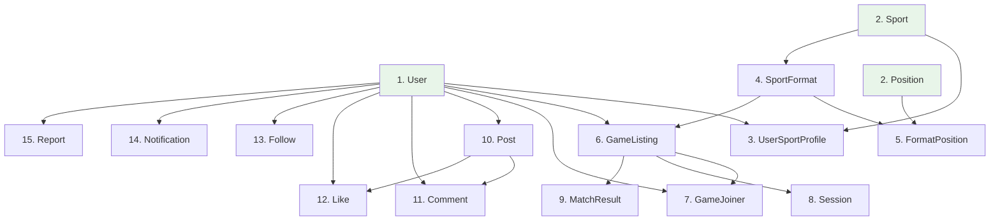

### 7.3 Seed Data Requirements

#### Sports (seed on migration)

| sportID | sportName | noPlayers |
|---------|-----------|-----------|
| 1 | Padel | 4 |
| 2 | Tennis | 4 |
| 3 | Basketball | 10 |
| 4 | Football | 22 |
| 5 | Rugby | 30 |

#### Sport Formats (seed on migration)

| formatID | sportID | formatName | noPlayers | hasPositions |
|----------|---------|-----------|-----------|-------------|
| 1 | 1 | Doubles | 4 | false |
| 2 | 2 | Singles | 2 | false |
| 3 | 2 | Doubles | 4 | false |
| 4 | 3 | 3v3 | 6 | true |
| 5 | 3 | 5v5 | 10 | true |
| 6 | 4 | 5v5 | 10 | true |
| 7 | 4 | 7v7 | 14 | true |
| 8 | 4 | 11v11 | 22 | true |
| 9 | 5 | 7s | 14 | true |
| 10 | 5 | 15s | 30 | true |

#### Positions (seed on migration)

| positionID | positionName |
|-----------|-------------|
| 1 | Any Position |
| 2 | Goalkeeper |
| 3 | Defense |
| 4 | Midfield |
| 5 | Attack |
| 6 | Guard |
| 7 | Forward |
| 8 | Center |
| 9 | Scrumhalf |
| 10 | Flyhalf |
| 11 | Wing |
| 12 | Fullback |

#### Format-Position Mappings (seed on migration)

| formatID | positionIDs | Sport Context |
|----------|-------------|---------------|
| 4 (Basketball 3v3) | 1, 6, 7, 8 | Any, Guard, Forward, Center |
| 5 (Basketball 5v5) | 1, 6, 7, 8 | Any, Guard, Forward, Center |
| 6 (Football 5v5) | 1, 2, 3, 4, 5 | Any, GK, Def, Mid, Att |
| 7 (Football 7v7) | 1, 2, 3, 4, 5 | Any, GK, Def, Mid, Att |
| 8 (Football 11v11) | 1, 2, 3, 4, 5 | Any, GK, Def, Mid, Att |
| 9 (Rugby 7s) | 1, 9, 10, 11, 12 | Any, SH, FH, Wing, FB |
| 10 (Rugby 15s) | 1, 3, 9, 10, 11, 12 | Any, Def, SH, FH, Wing, FB |

#### User Roles (seeded via Identity)

| Role | Purpose |
|------|---------|
| User | Default role assigned on registration |
| Moderator | Content governance role |

#### Notification Types (application constants, not DB seed)

| Type | Trigger |
|------|---------|
| FollowNew | User follows another user |
| JoinRequestReceived | Join request sent to listing creator |
| JoinAccepted | Creator accepts join request |
| JoinRejected | Creator rejects join request |
| GameReminder | 2 hours before scheduled game |
| MatchResultPosted | Creator submits match result |
| ListingCancelled | Creator deletes listing with joiners |
| ListingInvite | Creator invites friend during A100 |

#### Report Reasons (application constants)

| Reason | Applies To |
|--------|-----------|
| Offensive username | User |
| Harassment | User, Post |
| Inappropriate content | Post |
| Spam | Post |
| Cheating | User |
| Other | User, Post |

#### Test User Accounts (seed for development/demo)

| userName | password | typeOfUser | Sports |
|----------|----------|-----------|--------|
| Zane | Test123 | User | Tennis (Advanced), Football (Intermediate) |
| Lihlumelo | Test123 | User | Football (Advanced), Basketball (Beginner) |
| Gerard | Test123 | User | Basketball (Intermediate), Padel (Advanced) |
| Robert | Test123 | User | Tennis (Beginner), Padel (Intermediate) |
| Moderator | Admin123 | Moderator | — |

### 7.4 Migration Commands Reference

```
# Create initial migration
dotnet ef migrations add InitialCreate

# Apply to database
dotnet ef database update

# Add subsequent migration
dotnet ef migrations add AddNewFeature

# Rollback last migration
dotnet ef migrations remove

# Reset database (development only)
dotnet ef database drop
dotnet ef database update
```

### 7.5 DbContext Configuration Checklist

| Configuration | Method | Purpose |
|---------------|--------|---------|
| Composite keys | `HasKey(e => new { e.FK1, e.FK2 })` | UserSportProfile, GameJoiner, FormatPosition, Like, Follow |
| Unique constraints | `HasIndex().IsUnique()` | User.userName, Session.gameListingID, MatchResult.gameListingID |
| Default values | `HasDefaultValue()` | isCompleted=false, isRead=false, wins=0, losses=0, status="Pending" |
| Cascade behavior | `OnDelete(DeleteBehavior.X)` | Per relationship table in Section 4.4 |
| String length | `HasMaxLength()` | userName(50), content(500), text(250), location(200) |
| Self-referencing | Configure both FK navigations | Follow entity (follower + followed → User) |
| Enum conversion | `HasConversion<string>()` | Store enums as readable strings |

---

## 8. Service Layer Planning

> **Pattern:** Each service encapsulates business logic for a feature domain.  
> **Rule:** Controllers never access repositories directly — always go through services.  
> **DI:** All services registered as `Scoped` in Program.cs via interface.

### 8.1 Service Inventory

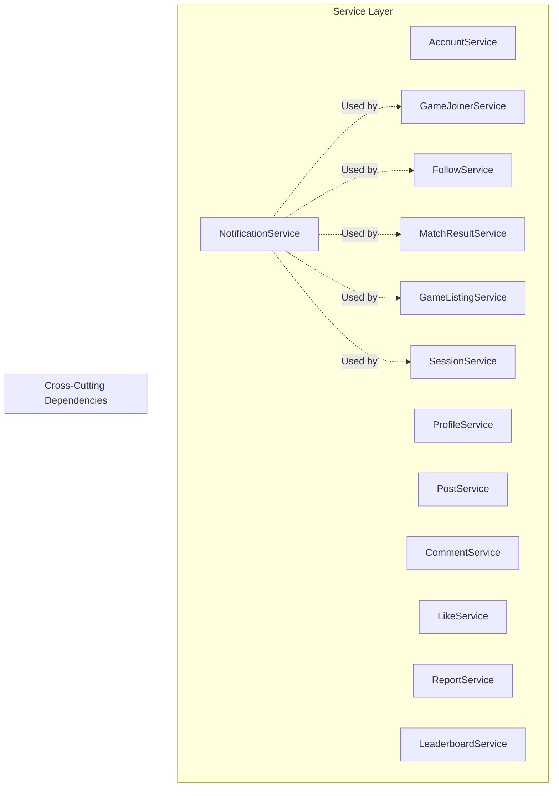

### 8.2 AccountService

| Aspect | Detail |
|--------|--------|
| **Interface** | `IAccountService` |
| **Responsibilities** | User registration (2-step), login validation, username uniqueness check |
| **Dependencies** | IUserRepository, IUserSportProfileRepository, ISportRepository, UserManager (Identity) |

| Method | Parameters | Returns | Business Logic |
|--------|-----------|---------|----------------|
| `ValidateUsername()` | string username | bool (available) | Check uniqueness in DB |
| `RegisterStep1()` | RegisterStep1ViewModel | ServiceResult | Validate + create user via Identity |
| `RegisterStep2()` | int userId, List<SportSelection> | ServiceResult | Create UserSportProfile records |
| `Login()` | string username, string password | LoginResult | Validate credentials, return role |
| `Logout()` | — | void | Sign out via Identity |

---

### 8.3 ProfileService

| Aspect | Detail |
|--------|--------|
| **Interface** | `IProfileService` |
| **Responsibilities** | Profile viewing, editing, sport management |
| **Dependencies** | IUserRepository, IUserSportProfileRepository, ISportRepository, IFollowRepository |

| Method | Parameters | Returns | Business Logic |
|--------|-----------|---------|----------------|
| `GetMyProfile()` | int userId | MyProfileViewModel | Load user + sports + stats + follower counts |
| `GetUserProfile()` | int userId, int viewerId | ViewProfileViewModel | Load other user's profile + isFollowing flag |
| `UpdateUsername()` | int userId, string newName | ServiceResult | Validate uniqueness, update |
| `GetAvailableSports()` | int userId | List<Sport> | Sports NOT already on user's profile |
| `AddSportToProfile()` | int userId, int sportId, string skill | ServiceResult | Validate not duplicate, insert |
| `RemoveSport()` | int userId, int sportId | ServiceResult | Validate not last sport, delete |
| `SearchUsers()` | string query | List<UserSearchResult> | Search by username LIKE |

---

### 8.4 GameListingService

| Aspect | Detail |
|--------|--------|
| **Interface** | `IGameListingService` |
| **Responsibilities** | Listing creation (wizard), browsing, filtering, management, business rule enforcement |
| **Dependencies** | IGameListingRepository, ISportFormatRepository, IUserSportProfileRepository, IFollowRepository, INotificationService |

| Method | Parameters | Returns | Business Logic |
|--------|-----------|---------|----------------|
| `ValidateCanCreate()` | int userId | bool | Check BR1 (max 1 active listing) + BR4 (sport on profile) |
| `GetUserSports()` | int userId | List<SportFormat> | Formats for sports on user's profile |
| `CheckHasPositions()` | int formatId | bool | Return SportFormat.hasPositions |
| `GetUserFriends()` | int userId | List<User> | Users that this user follows |
| `CreateListing()` | CreateListingModel | ServiceResult | Validate all rules, INSERT, notify friends |
| `GetAvailableListings()` | int userId, FilterModel | List<ListingCard> | Filter by user's sports, exclude expired (A500), exclude own |
| `UpdateListing()` | int listingId, EditModel | ServiceResult | Validate ownership, update fields |
| `DeleteListing()` | int listingId, int userId | ServiceResult | Validate ownership, notify joiners, delete |
| `GetCreatedListings()` | int userId | List<ListingCard> | User's own listings in Lobby |

---

### 8.5 GameJoinerService

| Aspect | Detail |
|--------|--------|
| **Interface** | `IGameJoinerService` |
| **Responsibilities** | Join request flow, roster management, leave functionality, business rule enforcement |
| **Dependencies** | IGameJoinerRepository, IGameListingRepository, IUserSportProfileRepository, INotificationService |

| Method | Parameters | Returns | Business Logic |
|--------|-----------|---------|----------------|
| `GetTeamRosters()` | int listingId | TeamsViewModel | Load Team A and Team B members with positions |
| `ValidateCanJoin()` | int userId, int listingId | ValidationResult | BR5 (sport on profile) + BR10 (3hr conflict) + not already joined |
| `CreateJoinRequest()` | JoinRequestModel | ServiceResult | Validate, INSERT with status=Pending, notify creator |
| `GetPendingRequests()` | int listingId | List<RequestVM> | All GameJoiners where status=Pending |
| `AcceptRequest()` | int userId, int listingId | ServiceResult | Check capacity, update status=Accepted, notify user |
| `RejectRequest()` | int userId, int listingId | ServiceResult | Update status=Rejected, notify user |
| `CheckTeamCapacity()` | int listingId, string team | bool | Count accepted + check against format.noPlayers/2 |
| `LeaveGameListing()` | int userId, int listingId | ServiceResult | Validate not Locked, remove/update status=Left |
| `GetJoinedListings()` | int userId | List<ListingCard> | User's joined games in Lobby |
| `ValidateTimeConflict()` | int userId, DateTime date | bool | Check if user has listing within 3hrs of date |

---

### 8.6 SessionService

| Aspect | Detail |
|--------|--------|
| **Interface** | `ISessionService` |
| **Responsibilities** | Confirm sessions, lock participants, time-triggered operations |
| **Dependencies** | ISessionRepository, IGameListingRepository, IGameJoinerRepository, INotificationService |

| Method | Parameters | Returns | Business Logic |
|--------|-----------|---------|----------------|
| `CheckAndConfirmDueSessions()` | — | void | Find full listings 2hrs before start, confirm them |
| `ConfirmSession()` | int listingId | ServiceResult | Create Session record, lock all GameJoiners |
| `IsSessionConfirmed()` | int listingId | bool | Check if Session record exists |
| `GetUpcomingSessions()` | — | List<Session> | Sessions within next 2 hours (for reminders) |

---

### 8.7 MatchResultService

| Aspect | Detail |
|--------|--------|
| **Interface** | `IMatchResultService` |
| **Responsibilities** | Score recording, winner calculation, stat updates, result history |
| **Dependencies** | IMatchResultRepository, IGameListingRepository, IGameJoinerRepository, IUserSportProfileRepository, INotificationService |

| Method | Parameters | Returns | Business Logic |
|--------|-----------|---------|----------------|
| `RecordResult()` | int listingId, int teamAScore, int teamBScore | ServiceResult | Validate BR6/BR7, calculate winner, INSERT, update stats |
| `UpdateResult()` | int resultId, int teamAScore, int teamBScore | ServiceResult | Validate BR13, reverse old stats, apply new stats |
| `CalculateWinner()` | int teamAScore, int teamBScore | string | Return "Team A" / "Team B" / "Draw" |
| `UpdatePlayerStats()` | int listingId, string winners | void | Increment wins for winners, losses for losers, recalc winPercentage |
| `GetUserMatchHistory()` | int userId | List<MatchHistoryItem> | All results where user was creator or joiner |
| `ValidateCanRecord()` | int userId, int listingId | bool | Check is creator + no existing result + listing completed |

---

### 8.8 PostService

| Aspect | Detail |
|--------|--------|
| **Interface** | `IPostService` |
| **Responsibilities** | Post CRUD, feed generation, privacy filtering |
| **Dependencies** | IPostRepository, IFollowRepository, IUserSportProfileRepository |

| Method | Parameters | Returns | Business Logic |
|--------|-----------|---------|----------------|
| `CreatePost()` | int userId, CreatePostModel | ServiceResult | Validate content, INSERT |
| `UpdatePost()` | int postId, EditPostModel | ServiceResult | Validate ownership, UPDATE |
| `DeletePost()` | int postId, int userId | ServiceResult | Validate ownership, DELETE (cascade comments/likes) |
| `GetFeed()` | int userId, string community? | List<PostFeedItem> | Public posts in user's communities + followers-only from followed users |
| `GetPostDetail()` | int postId | PostDetailVM | Post + comments + like count + user liked flag |
| `ValidateOwnership()` | int postId, int userId | bool | Check post.userID == userId |

---

### 8.9 CommentService

| Aspect | Detail |
|--------|--------|
| **Interface** | `ICommentService` |
| **Responsibilities** | Add comments, retrieve comments for a post |
| **Dependencies** | ICommentRepository |

| Method | Parameters | Returns | Business Logic |
|--------|-----------|---------|----------------|
| `AddComment()` | int userId, int postId, string text | ServiceResult | Validate text length, INSERT |
| `GetCommentsForPost()` | int postId | List<CommentVM> | Ordered by date ascending |
| `DeleteComment()` | int commentId | ServiceResult | For moderator use |

---

### 8.10 LikeService

| Aspect | Detail |
|--------|--------|
| **Interface** | `ILikeService` |
| **Responsibilities** | Toggle likes, count likes, check if user liked |
| **Dependencies** | ILikeRepository |

| Method | Parameters | Returns | Business Logic |
|--------|-----------|---------|----------------|
| `ToggleLike()` | int userId, int postId | bool (nowLiked) | If exists → DELETE, else INSERT |
| `GetLikeCount()` | int postId | int | COUNT where postId |
| `HasUserLiked()` | int userId, int postId | bool | EXISTS check |

---

### 8.11 FollowService

| Aspect | Detail |
|--------|--------|
| **Interface** | `IFollowService` |
| **Responsibilities** | Follow/unfollow, follower counts, following list |
| **Dependencies** | IFollowRepository, INotificationService |

| Method | Parameters | Returns | Business Logic |
|--------|-----------|---------|----------------|
| `Follow()` | int followerId, int followedId | ServiceResult | Validate not self, INSERT, send notification |
| `Unfollow()` | int followerId, int followedId | ServiceResult | DELETE |
| `IsFollowing()` | int followerId, int followedId | bool | EXISTS check |
| `GetFollowerCount()` | int userId | int | COUNT where followedUserID |
| `GetFollowingCount()` | int userId | int | COUNT where followerUserID |
| `GetFollowing()` | int userId | List<User> | For friend invite in A100 |

---

### 8.12 NotificationService

| Aspect | Detail |
|--------|--------|
| **Interface** | `INotificationService` |
| **Responsibilities** | Create notifications, retrieve for user, mark as read, badge count |
| **Dependencies** | INotificationRepository |

| Method | Parameters | Returns | Business Logic |
|--------|-----------|---------|----------------|
| `CreateNotification()` | int recipientId, string text, string type | void | INSERT notification |
| `GetAllForUser()` | int userId | List<NotificationVM> | Ordered newest first |
| `GetUnreadCount()` | int userId | int | COUNT where isRead=false |
| `MarkAsRead()` | int notificationId | void | UPDATE isRead=true |
| `MarkAllAsRead()` | int userId | void | UPDATE all for user |
| `SendGameReminders()` | int listingId | void | Create notification for each participant |
| `NotifyListingDeleted()` | int listingId | void | Notify all joiners |

---

### 8.13 ReportService

| Aspect | Detail |
|--------|--------|
| **Interface** | `IReportService` |
| **Responsibilities** | Create reports, moderator dashboard, action reports |
| **Dependencies** | IReportRepository, IUserRepository, IPostRepository |

| Method | Parameters | Returns | Business Logic |
|--------|-----------|---------|----------------|
| `CreateReport()` | CreateReportModel | ServiceResult | INSERT with status=Pending |
| `GetPendingReports()` | — | List<ReportDashboardItem> | All reports where status=Pending |
| `GetReportDetail()` | int reportId | ReportDetailVM | Report + referenced item details |
| `DismissReport()` | int reportId | ServiceResult | UPDATE status=Dismissed |
| `ActionReport()` | int reportId | ServiceResult | Remove user/post, UPDATE status=Actioned |

---

### 8.14 LeaderboardService

| Aspect | Detail |
|--------|--------|
| **Interface** | `ILeaderboardService` |
| **Responsibilities** | Calculate rankings, apply filters |
| **Dependencies** | IUserSportProfileRepository, IFollowRepository |

| Method | Parameters | Returns | Business Logic |
|--------|-----------|---------|----------------|
| `GetRankings()` | int userId, int? sportId, string filter | List<RankingItem> | Order by winPercentage DESC; filter by sport/friends/following |
| `GetTopPlayers()` | int sportId, int count | List<RankingItem> | Top N for a specific sport |

---

### 8.15 Service Registration (Program.cs)

```
// Register all services in DI container
builder.Services.AddScoped<IAccountService, AccountService>();
builder.Services.AddScoped<IProfileService, ProfileService>();
builder.Services.AddScoped<IGameListingService, GameListingService>();
builder.Services.AddScoped<IGameJoinerService, GameJoinerService>();
builder.Services.AddScoped<ISessionService, SessionService>();
builder.Services.AddScoped<IMatchResultService, MatchResultService>();
builder.Services.AddScoped<IPostService, PostService>();
builder.Services.AddScoped<ICommentService, CommentService>();
builder.Services.AddScoped<ILikeService, LikeService>();
builder.Services.AddScoped<IFollowService, FollowService>();
builder.Services.AddScoped<INotificationService, NotificationService>();
builder.Services.AddScoped<IReportService, ReportService>();
builder.Services.AddScoped<ILeaderboardService, LeaderboardService>();
```

### 8.16 Service-to-Use Case Mapping

| Service | Use Cases Served |
|---------|-----------------|
| AccountService | D100, Login/Logout |
| ProfileService | D200, D300, D400 |
| GameListingService | A100, A200, C300 |
| GameJoinerService | A300, A400, C500 |
| SessionService | A700 |
| MatchResultService | C100, C200, C400 |
| PostService | B100, B200, B300 |
| CommentService | B300 |
| LikeService | B300 |
| FollowService | D400 |
| NotificationService | D500, A600 + all notification triggers |
| ReportService | D600, D700, B400 |
| LeaderboardService | B500 |

---

## 9. Repository Layer Planning

> **Pattern:** One repository per entity. Generic base interface with entity-specific methods.  
> **Rule:** Repositories handle data access only — no business logic.  
> **DI:** All registered as `Scoped` via interface.

### 9.1 Generic Repository Interface

```
IRepository<T> where T : class
├── GetByIdAsync(int id) → T?
├── GetAllAsync() → IEnumerable<T>
├── AddAsync(T entity) → void
├── Update(T entity) → void
├── Remove(T entity) → void
├── SaveChangesAsync() → Task<int>
```

### 9.2 Repository Details

---

#### IUserRepository / UserRepository

| Method | Signature | Purpose |
|--------|-----------|---------|
| `GetByIdAsync` | `Task<User?> GetByIdAsync(int userId)` | Single user by PK |
| `GetByUsernameAsync` | `Task<User?> GetByUsernameAsync(string username)` | Login lookup |
| `UsernameExistsAsync` | `Task<bool> UsernameExistsAsync(string username)` | Uniqueness check (D100, D200) |
| `SearchByUsernameAsync` | `Task<List<User>> SearchByUsernameAsync(string query)` | User search (D400) |
| `GetWithSportsAsync` | `Task<User?> GetWithSportsAsync(int userId)` | Profile load with sports eager-loaded |
| `AddAsync` | `Task AddAsync(User user)` | Registration (D100) |
| `Update` | `void Update(User user)` | Profile edit (D200) |
| `Remove` | `void Remove(User user)` | Moderator remove (B400) |

---

#### IUserSportProfileRepository / UserSportProfileRepository

| Method | Signature | Purpose |
|--------|-----------|---------|
| `GetByUserAsync` | `Task<List<UserSportProfile>> GetByUserAsync(int userId)` | All sports for a user |
| `GetByUserAndSportAsync` | `Task<UserSportProfile?> GetByUserAndSportAsync(int userId, int sportId)` | Check if user has sport |
| `GetTopByWinPercentageAsync` | `Task<List<UserSportProfile>> GetTopByWinPercentageAsync(int sportId, int count)` | Leaderboard (B500) |
| `GetRankingsFilteredAsync` | `Task<List<UserSportProfile>> GetRankingsFilteredAsync(int? sportId, List<int> userIds)` | Filtered leaderboard |
| `AddAsync` | `Task AddAsync(UserSportProfile profile)` | Add sport (D100, D300) |
| `Update` | `void Update(UserSportProfile profile)` | Update wins/losses (C100) |
| `Remove` | `void Remove(UserSportProfile profile)` | Remove sport (D200) |

---

#### ISportRepository / SportRepository

| Method | Signature | Purpose |
|--------|-----------|---------|
| `GetAllAsync` | `Task<List<Sport>> GetAllAsync()` | All sports for selection |
| `GetByIdAsync` | `Task<Sport?> GetByIdAsync(int sportId)` | Single sport lookup |
| `GetAvailableForUserAsync` | `Task<List<Sport>> GetAvailableForUserAsync(int userId)` | Sports not yet on user profile |

---

#### ISportFormatRepository / SportFormatRepository

| Method | Signature | Purpose |
|--------|-----------|---------|
| `GetBySportAsync` | `Task<List<SportFormat>> GetBySportAsync(int sportId)` | Formats for a sport (A100 dropdown) |
| `GetByIdAsync` | `Task<SportFormat?> GetByIdAsync(int formatId)` | Single format with hasPositions |
| `GetByIdWithPositionsAsync` | `Task<SportFormat?> GetByIdWithPositionsAsync(int formatId)` | Format + loaded positions |
| `GetForUserSportsAsync` | `Task<List<SportFormat>> GetForUserSportsAsync(int userId)` | All formats for user's sports |

---

#### IGameListingRepository / GameListingRepository

| Method | Signature | Purpose |
|--------|-----------|---------|
| `GetByIdAsync` | `Task<GameListing?> GetByIdAsync(int listingId)` | Single listing |
| `GetByIdWithDetailsAsync` | `Task<GameListing?> GetByIdWithDetailsAsync(int listingId)` | With format, joiners, creator |
| `GetActiveByCreatorAsync` | `Task<GameListing?> GetActiveByCreatorAsync(int userId)` | Check BR1 (max 1 active) |
| `GetAvailableAsync` | `Task<List<GameListing>> GetAvailableAsync(List<int> sportIds, DateTime now)` | Browse (A200) — future, not completed |
| `GetFilteredAsync` | `Task<List<GameListing>> GetFilteredAsync(FilterModel filters)` | With sport/skill/date filters |
| `GetCreatedByUserAsync` | `Task<List<GameListing>> GetCreatedByUserAsync(int userId)` | Lobby created tab |
| `GetFullListingsNeedingConfirmAsync` | `Task<List<GameListing>> GetFullListingsNeedingConfirmAsync(DateTime threshold)` | A700 time check |
| `AddAsync` | `Task AddAsync(GameListing listing)` | Create (A100) |
| `Update` | `void Update(GameListing listing)` | Manage (C300) |
| `Remove` | `void Remove(GameListing listing)` | Delete (C300) |

---

#### IGameJoinerRepository / GameJoinerRepository

| Method | Signature | Purpose |
|--------|-----------|---------|
| `GetByKeysAsync` | `Task<GameJoiner?> GetByKeysAsync(int userId, int listingId)` | Single joiner record |
| `GetByListingAsync` | `Task<List<GameJoiner>> GetByListingAsync(int listingId)` | All joiners for a listing |
| `GetPendingByListingAsync` | `Task<List<GameJoiner>> GetPendingByListingAsync(int listingId)` | Pending requests (C500) |
| `GetAcceptedByListingAsync` | `Task<List<GameJoiner>> GetAcceptedByListingAsync(int listingId)` | Team rosters (A300) |
| `GetByTeamAsync` | `Task<List<GameJoiner>> GetByTeamAsync(int listingId, string team)` | Team A or B members |
| `GetJoinedByUserAsync` | `Task<List<GameJoiner>> GetJoinedByUserAsync(int userId)` | User's joined listings |
| `GetUserListingsInTimeRangeAsync` | `Task<List<GameJoiner>> GetUserListingsInTimeRangeAsync(int userId, DateTime start, DateTime end)` | BR10 time conflict check |
| `CountAcceptedByTeamAsync` | `Task<int> CountAcceptedByTeamAsync(int listingId, string team)` | Team capacity check |
| `AddAsync` | `Task AddAsync(GameJoiner joiner)` | Join request (A300) |
| `Update` | `void Update(GameJoiner joiner)` | Accept/Reject/Lock (C500, A700) |
| `Remove` | `void Remove(GameJoiner joiner)` | Leave (A400) |

---

#### ISessionRepository / SessionRepository

| Method | Signature | Purpose |
|--------|-----------|---------|
| `GetByListingAsync` | `Task<Session?> GetByListingAsync(int listingId)` | Check if confirmed |
| `ExistsForListingAsync` | `Task<bool> ExistsForListingAsync(int listingId)` | Quick existence check |
| `AddAsync` | `Task AddAsync(Session session)` | Confirm session (A700) |

---

#### IMatchResultRepository / MatchResultRepository

| Method | Signature | Purpose |
|--------|-----------|---------|
| `GetByListingAsync` | `Task<MatchResult?> GetByListingAsync(int listingId)` | Result for a specific listing |
| `ExistsForListingAsync` | `Task<bool> ExistsForListingAsync(int listingId)` | BR6 check |
| `GetByUserAsync` | `Task<List<MatchResult>> GetByUserAsync(int userId)` | Match history (C400) |
| `AddAsync` | `Task AddAsync(MatchResult result)` | Record (C100) |
| `Update` | `void Update(MatchResult result)` | Update (C200) |

---

#### IPostRepository / PostRepository

| Method | Signature | Purpose |
|--------|-----------|---------|
| `GetByIdAsync` | `Task<Post?> GetByIdAsync(int postId)` | Single post |
| `GetByIdWithDetailsAsync` | `Task<Post?> GetByIdWithDetailsAsync(int postId)` | Post + comments + likes |
| `GetFeedAsync` | `Task<List<Post>> GetFeedAsync(List<int> visibleUserIds, string? community)` | Social feed (B300) |
| `GetByUserAsync` | `Task<List<Post>> GetByUserAsync(int userId)` | User's posts (profile) |
| `AddAsync` | `Task AddAsync(Post post)` | Create (B100) |
| `Update` | `void Update(Post post)` | Edit (B200) |
| `Remove` | `void Remove(Post post)` | Delete (B200, B400) |

---

#### ICommentRepository / CommentRepository

| Method | Signature | Purpose |
|--------|-----------|---------|
| `GetByPostAsync` | `Task<List<Comment>> GetByPostAsync(int postId)` | Comments for a post |
| `AddAsync` | `Task AddAsync(Comment comment)` | Add comment (B300) |
| `Remove` | `void Remove(Comment comment)` | Moderator delete |

---

#### ILikeRepository / LikeRepository

| Method | Signature | Purpose |
|--------|-----------|---------|
| `GetByKeysAsync` | `Task<Like?> GetByKeysAsync(int userId, int postId)` | Check if liked |
| `ExistsAsync` | `Task<bool> ExistsAsync(int userId, int postId)` | Quick check |
| `CountByPostAsync` | `Task<int> CountByPostAsync(int postId)` | Like count |
| `AddAsync` | `Task AddAsync(Like like)` | Like (B300) |
| `Remove` | `void Remove(Like like)` | Unlike (B300) |

---

#### IFollowRepository / FollowRepository

| Method | Signature | Purpose |
|--------|-----------|---------|
| `GetByKeysAsync` | `Task<Follow?> GetByKeysAsync(int followerId, int followedId)` | Check relationship |
| `ExistsAsync` | `Task<bool> ExistsAsync(int followerId, int followedId)` | IsFollowing check |
| `GetFollowersAsync` | `Task<List<Follow>> GetFollowersAsync(int userId)` | User's followers |
| `GetFollowingAsync` | `Task<List<Follow>> GetFollowingAsync(int userId)` | Users this person follows |
| `GetFollowerCountAsync` | `Task<int> GetFollowerCountAsync(int userId)` | Count |
| `GetFollowingCountAsync` | `Task<int> GetFollowingCountAsync(int userId)` | Count |
| `GetFollowingIdsAsync` | `Task<List<int>> GetFollowingIdsAsync(int userId)` | For feed filtering |
| `AddAsync` | `Task AddAsync(Follow follow)` | Follow (D400) |
| `Remove` | `void Remove(Follow follow)` | Unfollow (D400) |

---

#### INotificationRepository / NotificationRepository

| Method | Signature | Purpose |
|--------|-----------|---------|
| `GetByUserAsync` | `Task<List<Notification>> GetByUserAsync(int userId)` | All notifications (D500) |
| `GetUnreadCountAsync` | `Task<int> GetUnreadCountAsync(int userId)` | Badge count |
| `GetByIdAsync` | `Task<Notification?> GetByIdAsync(int id)` | Single notification |
| `AddAsync` | `Task AddAsync(Notification notification)` | Create notification |
| `AddRangeAsync` | `Task AddRangeAsync(List<Notification> notifications)` | Bulk (reminders) |
| `Update` | `void Update(Notification notification)` | Mark as read |

---

#### IReportRepository / ReportRepository

| Method | Signature | Purpose |
|--------|-----------|---------|
| `GetPendingAsync` | `Task<List<Report>> GetPendingAsync()` | Moderator dashboard (B400) |
| `GetByIdAsync` | `Task<Report?> GetByIdAsync(int reportId)` | Single report detail |
| `GetByReferenceAsync` | `Task<List<Report>> GetByReferenceAsync(int refId, string type)` | All reports against an item |
| `AddAsync` | `Task AddAsync(Report report)` | Submit report (D600, D700) |
| `Update` | `void Update(Report report)` | Dismiss/Action (B400) |

### 9.3 Repository Registration (Program.cs)

```
builder.Services.AddScoped<IUserRepository, UserRepository>();
builder.Services.AddScoped<IUserSportProfileRepository, UserSportProfileRepository>();
builder.Services.AddScoped<ISportRepository, SportRepository>();
builder.Services.AddScoped<ISportFormatRepository, SportFormatRepository>();
builder.Services.AddScoped<IGameListingRepository, GameListingRepository>();
builder.Services.AddScoped<IGameJoinerRepository, GameJoinerRepository>();
builder.Services.AddScoped<ISessionRepository, SessionRepository>();
builder.Services.AddScoped<IMatchResultRepository, MatchResultRepository>();
builder.Services.AddScoped<IPostRepository, PostRepository>();
builder.Services.AddScoped<ICommentRepository, CommentRepository>();
builder.Services.AddScoped<ILikeRepository, LikeRepository>();
builder.Services.AddScoped<IFollowRepository, FollowRepository>();
builder.Services.AddScoped<INotificationRepository, NotificationRepository>();
builder.Services.AddScoped<IReportRepository, ReportRepository>();
```

---

## 10. Controller Planning

> **Pattern:** Thin controllers — validate input, call service, return view.  
> **Authorization:** `[Authorize]` on all controllers except AccountController login/register.  
> **Naming:** Actions match HTTP verb semantics (GET for display, POST for mutations).

### 10.1 Controller Map

---

#### AccountController

| Aspect | Detail |
|--------|--------|
| **Purpose** | Authentication: login, register (2-step), logout |
| **Authorization** | `[AllowAnonymous]` for Login/Register; `[Authorize]` for Logout |
| **Service Dependencies** | IAccountService |

| Action | HTTP | Route | View | Use Case |
|--------|------|-------|------|----------|
| `Login()` | GET | /Account/Login | Login.cshtml | — |
| `Login(model)` | POST | /Account/Login | Redirect or Login.cshtml | — |
| `Register()` | GET | /Account/Register | Register.cshtml | D100 Step 1 |
| `Register(model)` | POST | /Account/Register | Redirect to Step 2 | D100 Step 1 |
| `RegisterSports()` | GET | /Account/RegisterSports | RegisterSports.cshtml | D100 Step 2 |
| `RegisterSports(model)` | POST | /Account/RegisterSports | Redirect to Listings | D100 Step 2 |
| `Logout()` | POST | /Account/Logout | Redirect to Login | — |

---

#### ProfileController

| Aspect | Detail |
|--------|--------|
| **Purpose** | User profile management: own profile, other profiles, sports, search |
| **Authorization** | `[Authorize]` — all actions require login |
| **Service Dependencies** | IProfileService, IFollowService |

| Action | HTTP | Route | View | Use Case |
|--------|------|-------|------|----------|
| `Index()` | GET | /Profile | Profile/Index.cshtml | D200 |
| `Edit()` | GET | /Profile/Edit | Profile/Edit.cshtml | D200 |
| `Edit(model)` | POST | /Profile/Edit | Redirect to Index | D200 |
| `AddSport()` | GET | /Profile/AddSport | Profile/AddSport.cshtml | D300 |
| `AddSport(model)` | POST | /Profile/AddSport | Redirect to Index | D300 |
| `RemoveSport(sportId)` | POST | /Profile/RemoveSport | Redirect to Index | D200 |
| `View(userId)` | GET | /Profile/{userId} | Profile/View.cshtml | D400 |
| `ToggleFollow(userId)` | POST | /Profile/ToggleFollow | Redirect to View | D400 |
| `Search(query)` | GET | /Profile/Search | Profile/Search.cshtml | D400 |

---

#### GameListingController

| Aspect | Detail |
|--------|--------|
| **Purpose** | Listing creation wizard, browsing, and management |
| **Authorization** | `[Authorize]` — all actions require login |
| **Service Dependencies** | IGameListingService |

| Action | HTTP | Route | View | Use Case |
|--------|------|-------|------|----------|
| `Index(filters)` | GET | /Listings | GameListing/Index.cshtml | A200 |
| `Create()` | GET | /GameListing/Create | GameListing/Create.cshtml | A100 Step 1 |
| `CreateStep1(model)` | POST | /GameListing/CreateStep1 | Redirect to Step 2/3 | A100 Step 1 |
| `CreateStep2(model)` | POST | /GameListing/CreateStep2 | Redirect to Step 3 | A100 Step 2 |
| `CreateStep3(model)` | POST | /GameListing/CreateStep3 | Redirect to Confirm | A100 Step 3 |
| `Confirm(model)` | POST | /GameListing/Confirm | Redirect to Index | A100 Step 4 |
| `Edit(listingId)` | GET | /GameListing/Edit/{id} | GameListing/Edit.cshtml | C300 |
| `Edit(model)` | POST | /GameListing/Edit/{id} | Redirect to Lobby | C300 |
| `Delete(listingId)` | GET | /GameListing/Delete/{id} | GameListing/Delete.cshtml | C300 |
| `DeleteConfirm(listingId)` | POST | /GameListing/Delete/{id} | Redirect to Lobby | C300 |

---

#### GameJoinerController

| Aspect | Detail |
|--------|--------|
| **Purpose** | Join requests: view teams, send request, accept/reject, leave |
| **Authorization** | `[Authorize]` — all actions require login |
| **Service Dependencies** | IGameJoinerService |

| Action | HTTP | Route | View | Use Case |
|--------|------|-------|------|----------|
| `ViewTeams(listingId)` | GET | /GameJoiner/ViewTeams/{id} | GameJoiner/ViewTeams.cshtml | A300 |
| `SendRequest(model)` | POST | /GameJoiner/SendRequest | Redirect with success msg | A300 |
| `Leave(listingId)` | POST | /GameJoiner/Leave/{id} | Redirect to Lobby/Joined | A400 |
| `Requests(listingId)` | GET | /GameJoiner/Requests/{id} | GameJoiner/Requests.cshtml | C500 |
| `Accept(userId, listingId)` | POST | /GameJoiner/Accept | Redirect to Requests | C500 |
| `Reject(userId, listingId)` | POST | /GameJoiner/Reject | Redirect to Requests | C500 |

---

#### MatchResultController

| Aspect | Detail |
|--------|--------|
| **Purpose** | Match result recording, updating, and history viewing |
| **Authorization** | `[Authorize]` — Submit/Update restricted to listing creator in service layer |
| **Service Dependencies** | IMatchResultService |

| Action | HTTP | Route | View | Use Case |
|--------|------|-------|------|----------|
| `Submit(listingId)` | GET | /MatchResult/Submit/{id} | MatchResult/Submit.cshtml | C100 |
| `Submit(model)` | POST | /MatchResult/Submit/{id} | Redirect to History | C100 |
| `Update(resultId)` | GET | /MatchResult/Update/{id} | MatchResult/Update.cshtml | C200 |
| `Update(model)` | POST | /MatchResult/Update/{id} | Redirect to History | C200 |
| `History()` | GET | /MatchResult/History | Lobby/History.cshtml | C400 |

---

#### PostController

| Aspect | Detail |
|--------|--------|
| **Purpose** | Post creation, editing, deletion, feed display, likes, comments |
| **Authorization** | `[Authorize]` — Edit/Delete restricted to owner in service layer |
| **Service Dependencies** | IPostService, ILikeService, ICommentService |

| Action | HTTP | Route | View | Use Case |
|--------|------|-------|------|----------|
| `Index(community?)` | GET | /Social | Social/Index.cshtml | B300 |
| `Create()` | GET | /Post/Create | Post/Create.cshtml | B100 |
| `Create(model)` | POST | /Post/Create | Redirect to Social | B100 |
| `Edit(postId)` | GET | /Post/Edit/{id} | Post/Edit.cshtml | B200 |
| `Edit(model)` | POST | /Post/Edit/{id} | Redirect to Social | B200 |
| `Delete(postId)` | GET | /Post/Delete/{id} | Post/Delete.cshtml | B200 |
| `DeleteConfirm(postId)` | POST | /Post/Delete/{id} | Redirect to Social | B200 |
| `Detail(postId)` | GET | /Post/{id} | Post/Detail.cshtml | B300 |
| `Like(postId)` | POST | /Post/Like/{id} | Redirect to referrer | B300 |
| `Comment(model)` | POST | /Post/Comment | Redirect to Detail | B300 |

---

#### NotificationController

| Aspect | Detail |
|--------|--------|
| **Purpose** | Display and manage user notifications |
| **Authorization** | `[Authorize]` |
| **Service Dependencies** | INotificationService |

| Action | HTTP | Route | View | Use Case |
|--------|------|-------|------|----------|
| `Index()` | GET | /Notifications | Notification/Index.cshtml | D500 |
| `MarkRead(id)` | POST | /Notifications/MarkRead/{id} | Redirect to Index | D500 |
| `MarkAllRead()` | POST | /Notifications/MarkAllRead | Redirect to Index | D500 |

---

#### ReportController

| Aspect | Detail |
|--------|--------|
| **Purpose** | Submit reports against users or posts |
| **Authorization** | `[Authorize]` |
| **Service Dependencies** | IReportService |

| Action | HTTP | Route | View | Use Case |
|--------|------|-------|------|----------|
| `ReportUser(userId)` | GET | /Report/User/{id} | Report/User.cshtml | D600 |
| `ReportUser(model)` | POST | /Report/User/{id} | Redirect with confirmation | D600 |
| `ReportPost(postId)` | GET | /Report/Post/{id} | Report/Post.cshtml | D700 |
| `ReportPost(model)` | POST | /Report/Post/{id} | Redirect with confirmation | D700 |

---

#### ModeratorController

| Aspect | Detail |
|--------|--------|
| **Purpose** | Moderator dashboard for reviewing and actioning reports |
| **Authorization** | `[Authorize(Roles = "Moderator")]` — moderator only |
| **Service Dependencies** | IReportService |

| Action | HTTP | Route | View | Use Case |
|--------|------|-------|------|----------|
| `Index()` | GET | /Moderator/Reports | Moderator/Index.cshtml | B400 |
| `Detail(reportId)` | GET | /Moderator/Detail/{id} | Moderator/Detail.cshtml | B400 |
| `Dismiss(reportId)` | POST | /Moderator/Dismiss/{id} | Redirect to Index | B400 |
| `Remove(reportId)` | POST | /Moderator/Remove/{id} | Redirect to Index | B400 |

---

#### LeaderboardController

| Aspect | Detail |
|--------|--------|
| **Purpose** | Display player rankings by win percentage |
| **Authorization** | `[Authorize]` |
| **Service Dependencies** | ILeaderboardService |

| Action | HTTP | Route | View | Use Case |
|--------|------|-------|------|----------|
| `Index(sportId?, filter?)` | GET | /Leaderboard | Leaderboard/Index.cshtml | B500 |

---

#### LobbyController

| Aspect | Detail |
|--------|--------|
| **Purpose** | Lobby page with Created Listings, Joined Listings, and Match History tabs |
| **Authorization** | `[Authorize]` |
| **Service Dependencies** | IGameListingService, IGameJoinerService, IMatchResultService |

| Action | HTTP | Route | View | Use Case |
|--------|------|-------|------|----------|
| `Created()` | GET | /Lobby/Created | Lobby/Created.cshtml | C300 view |
| `Joined()` | GET | /Lobby/Joined | Lobby/Joined.cshtml | A400 context |
| `History()` | GET | /Lobby/History | Lobby/History.cshtml | C400 |

### 10.2 Controller Authorization Summary

| Controller | Default Auth | Exceptions | Role Restriction |
|-----------|-------------|------------|-----------------|
| AccountController | AllowAnonymous | Logout requires auth | None |
| ProfileController | Authorize | — | None |
| GameListingController | Authorize | — | Creator-only checks in service |
| GameJoinerController | Authorize | — | Creator-only for Requests/Accept/Reject |
| MatchResultController | Authorize | — | Creator-only for Submit/Update |
| PostController | Authorize | — | Owner-only for Edit/Delete |
| NotificationController | Authorize | — | None |
| ReportController | Authorize | — | None |
| ModeratorController | Authorize | — | Moderator role required |
| LeaderboardController | Authorize | — | None |
| LobbyController | Authorize | — | None |

### 10.3 Shared Controller Patterns

```
// Standard GET action pattern
[HttpGet]
public async Task<IActionResult> ActionName(int id)
{
    var viewModel = await _service.GetData(id, GetUserId());
    if (viewModel == null) return NotFound();
    return View(viewModel);
}

// Standard POST action pattern
[HttpPost]
[ValidateAntiForgeryToken]
public async Task<IActionResult> ActionName(ViewModel model)
{
    if (!ModelState.IsValid) return View(model);

    var result = await _service.DoOperation(model, GetUserId());
    if (!result.Success)
    {
        ModelState.AddModelError("", result.ErrorMessage);
        return View(model);
    }

    TempData["Success"] = "Operation completed successfully.";
    return RedirectToAction("Index");
}

// Helper to get current user ID
private int GetUserId() => int.Parse(User.FindFirst(ClaimTypes.NameIdentifier).Value);
```

---

## 11. UI Planning

> **Source:** FSSB Section 2.4 — Use Case Narratives & UI Designs  
> **Framework:** Bootstrap 5 with custom site.css  
> **Design Language:** Red primary (#DC3545), dark grey header, white cards, professional sports theme  
> **Responsive:** Mobile-first; all pages must work on 375px+ viewport

### 11.1 Navigation Structure

```mermaid
graph TD
    subgraph "Shared Header (_Layout.cshtml)"
        Logo["GAME ON (red italic logo)"]
        ProfileIcon["Profile Image (top-right, circular)"]
        BellIcon["Notification Bell + Badge Count"]
    end

    subgraph "Primary Navigation Tabs"
        Tab1["Listings"]
        Tab2["Social"]
        Tab3["Lobby"]
    end

    subgraph "Listings Tab"
        L1["Browse Available Listings (default)"]
        L2["Create Listing (red button)"]
        L3["Filter panel (sport/skill/date)"]
    end

    subgraph "Social Tab"
        S1["Social Feed"]
        S2["Communities Sidebar"]
        S3["Create Post (+)"]
        S4["Leaderboard link"]
        S5["Search Bar"]
    end

    subgraph "Lobby Tab"
        LB1["Created Listings sub-tab"]
        LB2["Joined Listings sub-tab"]
        LB3["Match History sub-tab"]
    end

    subgraph "Profile (via icon click)"
        P1["My Profile"]
        P2["Edit Profile"]
        P3["Add Sport"]
        P4["View Posts"]
        P5["View Match Results"]
    end

    subgraph "Moderator (role-based)"
        M1["Reports Dashboard (replaces Social tab)"]
    end

    Logo --- Tab1
    Logo --- Tab2
    Logo --- Tab3
    Tab1 --> L1 & L2 & L3
    Tab2 --> S1 & S2 & S3 & S4 & S5
    Tab3 --> LB1 & LB2 & LB3
    ProfileIcon --> P1
    P1 --> P2 & P3 & P4 & P5
    BellIcon --> Notifications["Notification List"]
```

### 11.2 Menu Layout (Shared _Layout.cshtml)

```
┌─────────────────────────────────────────────────────────────────┐
│  [GAME ON]                                    [🔔 22] [👤 img]  │
├─────────────────────────────────────────────────────────────────┤
│  [ Listings ]          [ Social ]          [ Lobby ]            │
├─────────────────────────────────────────────────────────────────┤
│                                                                 │
│                    @RenderBody()                                 │
│                                                                 │
└─────────────────────────────────────────────────────────────────┘
```

| Element | Position | Bootstrap Class | Behaviour |
|---------|----------|----------------|-----------|
| Logo "GAME ON" | Top-left | `navbar-brand text-danger fw-bold fst-italic` | Links to /Listings |
| Notification bell | Top-right | `position-relative` + `badge` | Links to /Notifications; badge shows unread count |
| Profile image | Top-right (after bell) | `rounded-circle` 40x40px | Links to /Profile |
| Tabs | Below header | `nav nav-tabs` | Active tab has red underline via `border-bottom: 3px solid #DC3545` |
| Active tab indicator | Dynamic | `.active` class + custom CSS | Controlled by current controller/route |

### 11.3 User Journey Maps

#### Journey 1: New User Registration → First Game

```mermaid
graph LR
    A[Open App] --> B[Login Page]
    B -->|Click Sign Up| C[Register Step 1]
    C -->|Username + Password| D[Register Step 2]
    D -->|Select Sport + Skill| E[Listings Page]
    E -->|Browse| F[Click View Teams]
    F -->|Select Team + Position| G[Send Join Request]
    G -->|Wait for acceptance| H[Notification: Accepted]
    H --> I[Game Day → Match Played]
    I --> J[Creator Records Result]
    J --> K[Stats Updated → Leaderboard]
```

#### Journey 2: Listing Creator Full Flow

```mermaid
graph LR
    A[Login] --> B[Listings Tab]
    B -->|Click Create| C[Create Wizard Step 1]
    C --> D[Step 2: Positions]
    D --> E[Step 3: Invite Friends]
    E --> F[Step 4: Confirm]
    F --> G[Listing Live]
    G --> H[Receive Join Requests]
    H -->|Review in Lobby| I[Accept/Reject]
    I --> J[Teams Full]
    J -->|2hrs before| K[Session Confirmed]
    K --> L[Game Played]
    L --> M[Submit Score]
    M --> N[Stats Updated]
```

#### Journey 3: Social Engagement

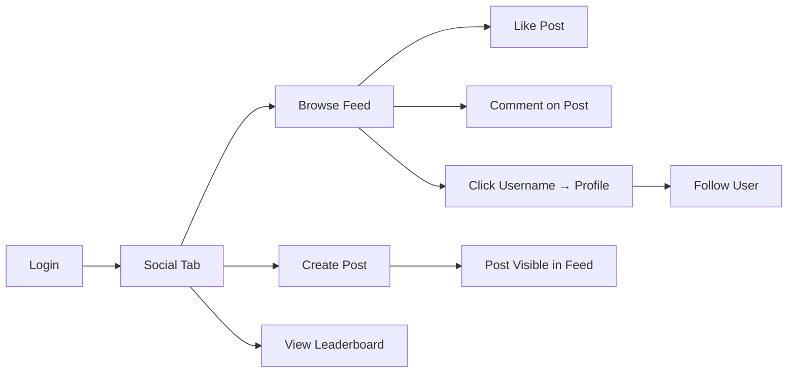

#### Journey 4: Moderator Flow

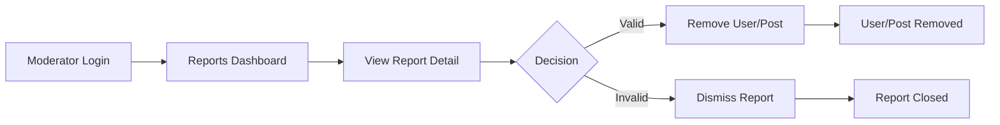

### 11.4 Page Inventory

| # | Page | URL | Controller.Action | Layout | Primary Content |
|---|------|-----|-------------------|--------|-----------------|
| 1 | Login | /Account/Login | Account.Login | _LoginLayout | Username + password form, Sign Up link |
| 2 | Register Step 1 | /Account/Register | Account.Register | _LoginLayout | Username, password, confirm fields |
| 3 | Register Step 2 | /Account/RegisterSports | Account.RegisterSports | _LoginLayout | Sport cards + skill level selection |
| 4 | Browse Listings | /Listings | GameListing.Index | _Layout | Listing cards grid, filter panel, Create button |
| 5 | Create Listing Step 1 | /GameListing/Create | GameListing.Create | _Layout | Form: privacy, sport, format, skill, date, time, location |
| 6 | Create Listing Step 2 | /GameListing/CreateStep2 | GameListing.CreateStep2 | _Layout | Position checkboxes (if applicable) |
| 7 | Create Listing Step 3 | /GameListing/CreateStep3 | GameListing.CreateStep3 | _Layout | Friends list with checkboxes + invite count |
| 8 | Create Listing Confirm | /GameListing/Confirm | GameListing.Confirm | _Layout | Card preview + Create Listing button |
| 9 | View Teams | /GameJoiner/ViewTeams/{id} | GameJoiner.ViewTeams | _Layout | Team A/B rosters, Join Team buttons, position select |
| 10 | Social Feed | /Social | Post.Index | _Layout | Communities sidebar, post cards, search, create (+) |
| 11 | Create Post | /Post/Create | Post.Create | _Layout | Privacy dropdown, text area, image upload, Post button |
| 12 | Post Detail | /Post/{id} | Post.Detail | _Layout | Post + comment list + add comment form |
| 13 | Leaderboard | /Leaderboard | Leaderboard.Index | _Layout | Rankings table, sport filter tabs, filter buttons |
| 14 | Lobby - Created | /Lobby/Created | Lobby.Created | _Layout | Creator's listing cards with manage options |
| 15 | Lobby - Joined | /Lobby/Joined | Lobby.Joined | _Layout | Joined listing cards with Leave button |
| 16 | Lobby - History | /Lobby/History | Lobby.History | _Layout | Match result cards with WIN/LOSS indicator |
| 17 | Manage Requests | /GameJoiner/Requests/{id} | GameJoiner.Requests | _Layout | Pending requests with Accept/Reject buttons |
| 18 | Submit Score | /MatchResult/Submit/{id} | MatchResult.Submit | _Layout | Team rosters + score input fields |
| 19 | Update Score | /MatchResult/Update/{id} | MatchResult.Update | _Layout | Current scores + edit fields |
| 20 | My Profile | /Profile | Profile.Index | _Layout | Avatar, username, stats, sports, View Posts/Results |
| 21 | Edit Profile | /Profile/Edit | Profile.Edit | _Layout | Edit username, remove sports |
| 22 | Add Sport | /Profile/AddSport | Profile.AddSport | _Layout | Sport cards + skill level radio buttons |
| 23 | View Other Profile | /Profile/{id} | Profile.View | _Layout | User info, sports, Follow/Unfollow button, report |
| 24 | Search Users | /Profile/Search | Profile.Search | _Layout | Search input + results list |
| 25 | Notifications | /Notifications | Notification.Index | _Layout | Notification list (read/unread visual distinction) |
| 26 | Report User | /Report/User/{id} | Report.ReportUser | _Layout | User display + offence dropdown + submit |
| 27 | Report Post | /Report/Post/{id} | Report.ReportPost | _Layout | Post display + offence dropdown + submit |
| 28 | Moderator Dashboard | /Moderator/Reports | Moderator.Index | _Layout | Report cards with View Item / Dismiss / Remove |
| 29 | Edit Listing | /GameListing/Edit/{id} | GameListing.Edit | _Layout | Editable listing fields |
| 30 | Delete Listing | /GameListing/Delete/{id} | GameListing.Delete | _Layout | Confirmation with warning |
| 31 | Edit Post | /Post/Edit/{id} | Post.Edit | _Layout | Edit caption/privacy |
| 32 | Delete Post | /Post/Delete/{id} | Post.Delete | _Layout | Confirmation dialog |

### 11.5 Layout Specifications

#### Dashboard / Listings Page (Landing)

```
┌─────────────────────────────────────────────────────────────┐
│ Available Listings ▽ (filter icon)         [Create] (red)   │
├─────────────────────────────────────────────────────────────┤
│ [Advanced ×] (active filter badge)                          │
├─────────────────────────────────────────────────────────────┤
│ ┌─────────────────────────────────────────────────────────┐ │
│ │ [img] Basketball  📍 Lorraine Court  [View Teams →]     │ │
│ │       Advanced       17/04-12:00                        │ │
│ │                      👤 2/6                             │ │
│ └─────────────────────────────────────────────────────────┘ │
│ ┌─────────────────────────────────────────────────────────┐ │
│ │ [img] Football 5v5 📍 Lorraine Court  [View Teams →]    │ │
│ │       Advanced       17/04-13:00                        │ │
│ │                      👤 4/10                            │ │
│ └─────────────────────────────────────────────────────────┘ │
│ ...more cards...                                            │
└─────────────────────────────────────────────────────────────┘
```

#### Profile Page Layout

```
┌─────────────────────────────────────────────────────────────┐
│ [← back]        GAME ON                     [🔔] [👤]       │
├─────────────────────────────────────────────────────────────┤
│                    (avatar image)                            │
│                    John Snow ✏️                              │
│         23              18              23                   │
│      Games played    Followers       Following              │
├─────────────────────────────────────────────────────────────┤
│ My Sports:                                                  │
│ [Padel]  [Basketball]  [Tennis]  [+ Add Sport]              │
│ Intermediate  Beginner    Advanced                          │
├─────────────────────────────────────────────────────────────┤
│ [View Posts →]                                              │
│ [View Match Results →]                                      │
└─────────────────────────────────────────────────────────────┘
```

#### Social Feed Layout

```
┌─────────────────────────────────────────────────────────────┐
│ [Listings]      [Social]        [Lobby]                     │
├──────────┬──────────────────────────────────────────────────┤
│          │  [_________🔍_________]                          │
│Communit: │                                                  │
│[Tennis]  │  👤 Lebanon James            ⋮                   │
│ Padel    │  "Slowly getting better"                         │
│ Football │  [====== IMAGE ======]                           │
│Basketball│  ❤️ 5  💬 8                                      │
│ Rugby    │                                                  │
│          │  👤 Lihlumelo Mgijima        ⋮                   │
│  [+]     │  "What's the best raquet..."                     │
│ create   │  ♡ 1  💬 3                                       │
│          │                                                  │
├──────────┴──────────────────────────────────────────────────┤
│        [LEADERBOARD arrow-down]                             │
└─────────────────────────────────────────────────────────────┘
```

#### Lobby Page Layout

```
┌─────────────────────────────────────────────────────────────┐
│ [Listings]      [Social]        [Lobby]                     │
├─────────────────────────────────────────────────────────────┤
│ [CREATED LISTINGS] | [JOINED LISTINGS] | [Match History]    │
├─────────────────────────────────────────────────────────────┤
│                                                             │
│ ┌───────────────────────────┐ ┌───────────────────────────┐ │
│ │ Basketball 3v3      WIN   │ │ Basketball 3v3      LOSS  │ │
│ │ Lorraine Court      🏆    │ │ Lorraine Court      💔(2) │ │
│ │ 17/04-12:00   21-14      │ │ 17/04-12:00   21-14      │ │
│ │ [Advanced] [View Teams→]  │ │ [Advanced] [Update Score] │ │
│ └───────────────────────────┘ └───────────────────────────┘ │
└─────────────────────────────────────────────────────────────┘
```

#### Notification Page Layout

```
┌─────────────────────────────────────────────────────────────┐
│ [← back]     Notifications                                  │
├─────────────────────────────────────────────────────────────┤
│ 👤 Lihlumelo commented: "Great game, let's run it back!"   │
│ 👤 Robert started following you.                            │
│ ✅ Your request to join "Zane's Basketball 3v3" accepted.   │
│─────────────── Unread ──────────────────────────────────────│
│ ❌ Your request to join "Robert's Doubles" was declined.    │
│ ⏰ Reminder: Your 5v5 Football game starts in 2 hours.      │
│ 📊 Match results for "Gerard's Basketball" posted.          │
│ 🚫 The Basketball 3v3 listing has been cancelled.           │
└─────────────────────────────────────────────────────────────┘
```

### 11.6 Design Token Reference

| Token | Value | Usage |
|-------|-------|-------|
| Primary colour | `#DC3545` (Bootstrap danger red) | Buttons, logo text, active tab border, CTAs |
| Secondary colour | `#343A40` (dark grey) | Header background gradient, body text |
| Accent colour | Various per skill level | Beginner=green, Intermediate=orange, Advanced=red badges |
| Background | `#F8F9FA` (light grey) | Page background |
| Card background | `#FFFFFF` | All content cards |
| Card shadow | `0 2px 4px rgba(0,0,0,0.1)` | Subtle depth on cards |
| Card radius | `8px` | Rounded corners |
| Font family | `-apple-system, BlinkMacSystemFont, "Segoe UI", Roboto` | Bootstrap default |
| Font size body | `16px` | Standard readable text |
| Button style | `btn btn-danger rounded-pill px-4` | All primary action buttons |
| Secondary button | `btn btn-outline-secondary rounded-pill` | Cancel, Back buttons |
| Tab active | `border-bottom: 3px solid #DC3545` | Active navigation tab |
| Profile image | `40px × 40px, border-radius: 50%` | Header icon |
| Notification badge | `position-absolute top-0 start-100 translate-middle badge bg-danger` | Unread count |

### 11.7 Responsive Breakpoints

| Breakpoint | Width | Layout Adjustment |
|-----------|-------|-------------------|
| Mobile | < 576px | Single column, stacked cards, hamburger menu |
| Tablet | 576–992px | Two-column card grid, sidebar collapses |
| Desktop | > 992px | Full layout as designed in FSSB mockups |

### 11.8 Form Styling Standards

| Element | Bootstrap Class | Custom |
|---------|----------------|--------|
| Form group | `mb-3` | — |
| Label | `form-label fw-semibold` | Above input |
| Text input | `form-control` | — |
| Select dropdown | `form-select` | Populated from DB |
| Radio/checkbox | `form-check` | Inline for skill levels |
| Submit button | `btn btn-danger rounded-pill px-4 mt-3` | Full width on mobile |
| Validation error | `text-danger` + `invalid-feedback` | Below input field |
| Success message | `alert alert-success alert-dismissible` | TempData flash message |
| Error summary | `alert alert-danger` | ModelState errors at top of form |

---

## 12. Sprint Review Traceability Matrix

> **Purpose:** Map every use case to the Sprint Review rubric criteria to ensure maximum marks.  
> **Review Components:**  
> - Sprint Story with Tech Leads: 40 marks (15% weight)  
> - Formal Review with Supervisor: 60 marks (70% weight)  
> - Dev Crew Cross-Check: 40 marks (15% weight)

### 12.1 Complete Traceability Matrix — All Use Cases

| Use Case | Database | CRUD | FSSB Alignment | UX | Validation | Error Handling | Sprint Story | Formal Review | Cross-Check |
|----------|----------|------|----------------|-----|------------|---------------|-------------|---------------|-------------|
| **D100** Register | User, UserSportProfile | Create | 15-step narrative, 2-step wizard | Intuitive form flow, clear labels | Username unique, password match, sport required | "Username taken", "Passwords don't match" | DB(/10)✓ CRUD(/10)✓ | UC Working(/15)✓ FSSB(/5)✓ | Status(/15)✓ Narrative(/5)✓ |
| **D200** Manage Profile | User, UserSportProfile | Read, Update, Delete | 7-step narrative | Profile icon → profile page, edit pencil | Username unique on change, can't remove last sport | "Username already exists", "Must keep at least 1 sport" | Consistency(/5)✓ | UX Navigation(/6)✓ | Efficiency(/4)✓ |
| **D300** Add Sport | UserSportProfile, Sport | Create | 9-step narrative | Sport cards visual, skill radio buttons | Sport not already added, skill required | "Sport already on profile", "Select skill level" | CRUD(/10)✓ | UC Working(/15)✓ | Status(/15)✓ |
| **D400** View Profile + Follow | User, Follow, Notification | Read, Create, Delete | 7-step narrative | Search → view → follow button toggle | Can't follow self, user must exist | "User not found", button state toggle | Narrative(/5)✓ | FSSB(/5)✓ | Narrative(/5)✓ |
| **D500** Notifications | Notification | Read, Update | 4-step narrative | Bell badge, read/unread visual | User sees only own notifications | — (read-only, minimal errors) | UX(/10)✓ | UX Recognition(/6)✓ | Navigation(/4)✓ |
| **D600** Report User | Report | Create | 10-step narrative | Three dots → reason dropdown → confirm | Reason required, user exists | "Select a reason", confirmation toast | CRUD(/10)✓ | UC Working(/15)✓ | Error(/2)✓ |
| **D700** Report Post | Report | Create | 10-step narrative | Three dots → reason dropdown → confirm | Reason required, post exists | "Select a reason", confirmation toast | Narrative(/5)✓ | FSSB(/5)✓ | Narrative(/5)✓ |
| **A100** Create Listing | GameListing, FormatPosition | Create | 11-step wizard narrative | 4-step wizard, progress indicator, preview | All fields required, date future, BR1 max 1 | "You already have an active listing", "Date must be in future" | DB(/10)✓ CRUD(/10)✓ | UC Working(/15)✓ FSSB(/5)✓ | Status(/15)✓ Narrative(/5)✓ |
| **A200** Browse Listings | GameListing | Read | 3-step narrative | Cards grid, filter chips, View Teams button | Filter values valid | — (read-only display) | Consistency(/5)✓ | UX Efficiency(/6)✓ | Efficiency(/4)✓ |
| **A300** Send Join Request | GameJoiner, FormatPosition | Create | 5-step narrative | Team rosters display, position checkboxes | BR5 sport on profile, BR10 time conflict, max 2 positions | "Sport not on profile", "Time conflict with existing game" | CRUD(/10)✓ Narrative(/5)✓ | UC Working(/15)✓ FSSB(/5)✓ | Status(/15)✓ |
| **A400** Leave Listing | GameJoiner | Delete | 2-step narrative | Leave button on Joined tab card | Cannot leave if Locked | "Cannot leave confirmed session" | CRUD(/10)✓ | UX Error(/3)✓ | Error(/2)✓ |
| **A500** Hide Expired | GameListing | Read (filter) | 2-step narrative | Expired listings don't appear | Date comparison server-side | — (automatic, no user error) | Narrative(/5)✓ | FSSB(/5)✓ | — |
| **A600** Send Reminders | Notification | Create | 4-step narrative | Notification appears in bell | Session must be confirmed | — (system-triggered) | — | — | — |
| **A700** Confirm Session | Session, GameJoiner | Create, Update | 3-step narrative | Status change reflected in UI | Listing must be full, time threshold | — (system-triggered) | — | — | — |
| **B100** Create Posts | Post | Create | 6-step narrative (renumbered) | Create (+) button, privacy dropdown, image upload | Content required (max 500), privacy required | "Content is required", "Select privacy" | CRUD(/10)✓ | UC Working(/15)✓ FSSB(/5)✓ | Status(/15)✓ |
| **B200** Manage Posts | Post, Comment, Like | Update, Delete | 7-step narrative with branches | Three dots → Edit/Delete, confirmation dialog | Must be owner, content required on edit | "You can only manage your own posts" | CRUD(/10)✓ | UX Error(/3)✓ | Error(/2)✓ |
| **B300** Browse Posts | Post, Comment, Like | Read, Create, Delete | 7-step narrative | Feed with communities sidebar, like/comment inline | Comment text required (max 250) | "Comment cannot be empty" | Consistency(/5)✓ | UX Navigation(/6)✓ | Navigation(/4)✓ |
| **B400** View Reports | Report, User, Post | Read, Update | 5-step narrative | Moderator dashboard, View Item, Dismiss/Remove | Must be Moderator role | 403 if non-moderator access | Narrative(/5)✓ | UC Working(/15)✓ FSSB(/5)✓ | Status(/15)✓ |
| **B500** Leaderboard | UserSportProfile | Read | 4-step narrative | Rankings table, filter tabs | Filter must be valid sport | — (read-only, dropdowns prevent bad input) | CRUD(/10)✓ | UX Efficiency(/6)✓ | Efficiency(/4)✓ |
| **C100** Record Result | MatchResult, UserSportProfile | Create | 8-step narrative | Score inputs per team, Submit button | BR6 one per listing, BR7 creator only, scores ≥ 0 | "Only creator can submit", "Scores must be 0 or higher" | DB(/10)✓ CRUD(/10)✓ | UC Working(/15)✓ FSSB(/5)✓ | Status(/15)✓ Narrative(/5)✓ |
| **C200** Update Result | MatchResult, UserSportProfile | Update | 8-step narrative | Pre-filled score fields, Submit | BR13 creator only, scores ≥ 0, result must exist | "Only creator can update", "No result to update" | CRUD(/10)✓ | UC Working(/15)✓ | Status(/15)✓ |
| **C300** Manage Listing | GameListing, GameJoiner, Notification | Update, Delete | 9-step narrative with branches | Three dots → Update/Delete, confirmation | Must be creator, fields valid | "Only creator can manage", deletion warning | Narrative(/5)✓ | FSSB(/5)✓ UX Error(/3)✓ | Narrative(/5)✓ |
| **C400** View Results | MatchResult | Read | 6-step narrative | Match history cards, WIN/LOSS badges | — (read-only) | — | Consistency(/5)✓ | UX Efficiency(/6)✓ | Efficiency(/4)✓ |
| **C500** View Requests | GameJoiner, Notification | Read, Update | 9-step narrative with branches | Request cards with Accept(✓)/Reject(✗), team info | Must be creator, team has space, request pending | "Team is full", "Request already processed" | CRUD(/10)✓ Narrative(/5)✓ | UC Working(/15)✓ FSSB(/5)✓ | Status(/15)✓ Narrative(/5)✓ |

### 12.2 Sprint Story Mapping (Tech Leads — 15%)

#### Teamwork /15

| Criterion | Marks | What to Demonstrate | Artifacts |
|-----------|-------|--------------------:|-----------|
| DB Implementation | /10 | SQL Server running, GameOnDb exists, all 16 tables with FKs, EF migrations applied, data reads/writes | SSMS connection, run query, show migration files |
| System Consistency | /5 | Same layout, colours, buttons, fonts across ALL team members' pages | Navigate Listings → Social → Lobby → Profile (4 different developers' work) |

#### Functionality (Individual) /15

| Criterion | Marks | What to Demonstrate | Artifacts |
|-----------|-------|--------------------:|-----------|
| BOC & CRUD Progress | /10 | Working CRUD for 1 use case (Tech Lead chooses from BOC). Login/Logout does NOT count | Full create→read→update→delete cycle on assigned use case |
| Narrative Alignment | /5 | Code follows FSSB Basic Flow step-by-step | Walk through FSSB document alongside running code |

**Per-member recommended demo use case:**

| Member | Primary Demo (CRUD) | Backup Demo | FSSB Steps to Trace |
|--------|--------------------:|------------|---------------------|
| Robert | D100 Register (Create) + D300 Add Sport | D400 Follow | D100: 15 steps, D300: 9 steps |
| Lihlumelo | A100 Create Listing (full wizard) | A300 Send Join Request | A100: 11 steps |
| Gerard | C100 Record Match Result | C500 Accept/Reject Requests | C100: 8 steps, C500: 9 steps |
| Zane | B100 Create Post | B200 Manage Posts (Edit + Delete) | B100: 6 steps, B200: 7 steps |

#### UX (Individual) /10

| Criterion | Marks | Evidence |
|-----------|-------|---------|
| Navigation & Recognition | /4 | Dropdowns populated from DB, search bar works, breadcrumbs/back buttons, three-tab nav intuitive |
| Error Prevention | /2 | Required field validation fires before submit, system remains stable on bad input |
| Logic & Efficiency | /4 | Minimal clicks to complete task, logical form layout, progressive disclosure in wizard |

### 12.3 Formal Review Mapping (Supervisor — 70%)

#### Teamwork /5

| Criterion | Marks | Evidence |
|-----------|-------|---------|
| System Consistency | /5 | Unified design across entire integrated system — same _Layout, same CSS, same Bootstrap classes |

#### Functionality (Individual) /40 — Two Use Cases Each

| Member | Use Case 1 (/20) | Use Case 2 (/20) | Strategy |
|--------|:-----------------:|:-----------------:|----------|
| **Robert** | D100 Register User | D400 View Profile + Follow/Unfollow | CRUD wizard + social interaction |
| **Lihlumelo** | A100 Create Game Listing | A200 Browse Listings | Full wizard CRUD + filtered query display |
| **Gerard** | C100 Record Match Result | C500 View Join Requests (Accept/Reject) | Result CRUD + decision-based update |
| **Zane** | B100 Create Posts | B300 Browse Posts (+ Like + Comment) | Create CRUD + feed with interactions |

**Scoring per use case (/20):**

| Sub-criterion | Marks | Definition |
|---------------|-------|-----------|
| Working Status | /15 | 13-15: Fully functional, all operations, data persists. 10-12: Mostly works, minor issues. 7-9: Partially functional. 4-6: Minimal. 0-3: Non-functional. |
| FSSB Alignment | /5 | 5: Perfect match. 4: Minor deviation. 3: Noticeable gaps. 2: Major differences. 0-1: Cannot follow narrative. |

#### UX (Individual) /15

| Criterion | Marks | What Supervisor Checks |
|-----------|-------|----------------------|
| Navigation & Recognition | /6 | Smooth flow, lookups/datasheet views, no dead ends, logical transitions |
| Error Recovery | /3 | Robust validation, specific error messages, system stays stable |
| Efficiency & Aesthetics | /6 | All-inclusive utility, professional balanced layout, good white space |

### 12.4 Dev Crew Cross-Check Mapping (Peers — 15%)

#### Teamwork /10

| Criterion | Marks | Preparation |
|-----------|-------|-------------|
| Team Pitch | /5 | 2-minute explanation: problem → solution → features → tech stack → demo path |
| System Consistency | /5 | Prove same design across all 4 members' subsystems |

#### Functionality /20

| Criterion | Marks | What Peers Assess |
|-----------|-------|-------------------|
| Use Case Status | /15 | Peers rate 1 CRUD + 1 Query use case: Working(12-15) / Partial(6-11) / Non-Functional(0-5) |
| Narrative Match | /5 | Peers follow FSSB steps in running system: 5=perfect, 3=gaps, 0=can't follow |

**Recommended demo pairs for peer review:**

| CRUD Demo | Query/Report Demo | Combined Story |
|-----------|-------------------|----------------|
| A100 Create Listing | A200 Browse (appears in list) | Create → verify in browse |
| B100 Create Post | B500 Leaderboards | Post → check social works |
| C100 Record Result | C400 View Match History | Submit score → see in history |
| D100 Register | D400 View Profile | Register → see sport on profile |

#### UX /10

| Criterion | Marks | Peer Checks |
|-----------|-------|-------------|
| Navigation & Recognition | /4 | Can find features without help? Dropdowns populated? Menu logical? |
| Error Handling | /2 | Empty form submit → meaningful error? System crash-free? |
| Efficiency & Aesthetics | /4 | Reasonable click count? Clean layout? Professional appearance? |

### 12.5 Per-Member FSSB Alignment Checklist

#### Robert Lloyd — D100 Register User (15 steps)

| # | FSSB Step | Implementation Check | ☐ |
|---|-----------|---------------------|---|
| 1 | Unregistered user opens the app | Navigate to root → redirect to /Account/Login | ☐ |
| 2 | System displays login page | Login.cshtml renders with form | ☐ |
| 3 | User selects "Sign Up" | Link navigates to /Account/Register | ☐ |
| 4 | System displays Step 1/2 Account Setup | Register.cshtml with Username/Password/Confirm | ☐ |
| 5 | User enters fields and clicks Next | POST validates, redirects to Step 2 | ☐ |
| 6 | System displays Step 2/2 Tell Us What You Play | RegisterSports.cshtml with sport cards | ☐ |
| 7 | User selects sport | Click sport card highlights it | ☐ |
| 8 | System displays skill level | Skill options appear for selected sport | ☐ |
| 9 | User selects skill level | Radio button selection | ☐ |
| 10 | User clicks Complete Registration | POST submits all data | ☐ |
| 11 | System validates (no duplicate username) | Service checks, returns error if taken | ☐ |
| 12 | System stores sport + skill level | INSERT UserSportProfile | ☐ |
| 13 | System creates user account | INSERT User via Identity | ☐ |
| 14 | System sends confirmation | Success alert/toast displayed | ☐ |
| 15 | Redirect to landing page | Redirect to /Listings | ☐ |

#### Lihlumelo Mgijima — A100 Create Game Listing (11 steps)

| # | FSSB Step | Implementation Check | ☐ |
|---|-----------|---------------------|---|
| 1 | System displays information required | GET /GameListing/Create renders form | ☐ |
| 2 | User fills in details | Sport dropdown, format, skill, date, time, location, privacy | ☐ |
| 3 | User clicks Next | POST Step1 validates, proceeds | ☐ |
| 4 | System checks if sport has positions | Service checks SportFormat.hasPositions | ☐ |
| 5a | User selects up to 2 positions | Position checkboxes rendered (max 2 validation) | ☐ |
| 5b | User clicks Next | POST Step2 proceeds | ☐ |
| 6 | System displays friends list | Query Follow table, show followed users | ☐ |
| 7 | User selects friends to invite | Checkbox list with friend names | ☐ |
| 8 | User clicks Next | POST Step3 proceeds | ☐ |
| 9 | System displays listing preview | Confirm page with card preview | ☐ |
| 10 | User clicks Create Listing | POST Confirm saves to DB | ☐ |
| 11 | System creates listing + notifies friends | INSERT GameListing + INSERT Notifications | ☐ |

#### Gerard Mc Loughlin — C100 Record Match Result (8 steps)

| # | FSSB Step | Implementation Check | ☐ |
|---|-----------|---------------------|---|
| 1 | Creator navigates to lobby | Lobby tab active | ☐ |
| 2 | Goes to Created Listings, clicks listing | GET /Lobby/Created → click listing | ☐ |
| 3 | System displays listing + Submit Score button | View renders teams + button | ☐ |
| 4 | Creator clicks Submit Score | Navigate to score input | ☐ |
| 5 | System displays score input | Two number fields rendered | ☐ |
| 6 | User inputs scores | Enter Team A and Team B scores | ☐ |
| 7 | System saves result | INSERT MatchResult + UPDATE UserSportProfile | ☐ |
| 8 | Result displayed | Redirect to history with new result visible | ☐ |

#### Zane Griesel — B100 Create Posts (6 steps)

| # | FSSB Step | Implementation Check | ☐ |
|---|-----------|---------------------|---|
| 1 | User logs into account | Already authenticated (precondition) | ☐ |
| 2 | User navigates to social tab | Social tab active | ☐ |
| 3 | User selects create post button | Click red (+) → GET /Post/Create | ☐ |
| 4 | User enters details (image, caption, privacy) | Form with textarea, file input, dropdown | ☐ |
| 5 | User clicks Post | POST /Post/Create validates + saves | ☐ |
| 6 | System posts, viewable from profile | Post appears in Social feed and user's profile | ☐ |

### 12.6 Marks Maximization Strategy

| Priority | Action | Marks at Stake |
|----------|--------|---------------|
| 1 | Get DB fully working with all tables + seed data | DB Implementation /10 (Sprint Story) |
| 2 | Ensure 2 use cases FULLY functional per member | Functionality /40 (Formal Review — 70% weight!) |
| 3 | Match FSSB narrative step-by-step | Narrative Alignment /5 × 3 reviews = 15 total marks |
| 4 | Unified CSS/layout across all team members | System Consistency /5 × 3 reviews = 15 total marks |
| 5 | Add validation + error messages to all forms | Error Prevention/Recovery /2+/3+/2 = 7 total marks |
| 6 | Polish navigation with dropdowns + search | Navigation /4+/6+/4 = 14 total marks |
| 7 | Prepare team pitch (2 min script) | Team Pitch /5 (Cross-Check) |

---

## 13. Risk Assessment

> **Purpose:** Identify risks that could prevent successful Sprint Review delivery and define mitigation strategies.

### 13.1 Technical Risks

| # | Risk | Probability | Impact | Mitigation Strategy |
|---|------|-------------|--------|---------------------|
| T1 | EF Core migration conflicts when merging team branches | High | Medium | Use a single InitialCreate migration; coordinate schema changes in team standup; one person runs migrations |
| T2 | SQL Server connection issues on review day | Medium | Critical | Test connection day before; have connection string backup; keep localdb as fallback |
| T3 | Identity configuration doesn't work correctly (roles, cookies) | Medium | High | Implement and test Identity first (Phase 1); use well-documented Microsoft patterns |
| T4 | LINQ queries return wrong data or N+1 performance issues | Medium | Medium | Use `.Include()` for eager loading; test queries in isolation; check generated SQL |
| T5 | Business rule logic errors (BR1, BR5, BR10 especially) | High | High | Write unit tests for service validation methods; test edge cases early |
| T6 | Composite key configuration errors in EF Core | Medium | High | Configure all composite keys in `OnModelCreating`; test CRUD on junction tables first |
| T7 | Time-triggered features (A500/A600/A700) hard to implement and demo | Medium | Low | Implement as service methods called on page load rather than background jobs; use manual trigger for demo |

### 13.2 Database Risks

| # | Risk | Probability | Impact | Mitigation Strategy |
|---|------|-------------|--------|---------------------|
| D1 | Seed data missing or incorrect on review day | Medium | High | Create `DataSeeder.cs` that runs on startup; verify in development before review |
| D2 | Foreign key constraint violations during testing | High | Medium | Seed data in correct order; test cascading deletes; use try/catch with meaningful messages |
| D3 | Database schema doesn't match FSSB entity list | Low | Critical | Verify all 16 entities against FSSB Section 4.1 before code freeze |
| D4 | Test data wiped accidentally before demo | Medium | High | Create a database backup script; seed data auto-runs on empty DB |
| D5 | Win percentage calculation rounding errors | Low | Low | Use `Math.Round()` with 2 decimal places; handle division by zero (0 games played) |

### 13.3 UI Risks

| # | Risk | Probability | Impact | Mitigation Strategy |
|---|------|-------------|--------|---------------------|
| U1 | Inconsistent styling between team members' pages | High | High (costs /5 marks × 3 reviews) | Agree on shared site.css by end of Phase 1; PR review all CSS changes; use Bootstrap classes only |
| U2 | Wizard state lost between steps (A100 create listing) | Medium | High | Use TempData or Session storage for wizard data; test full flow before freeze |
| U3 | Forms missing client-side validation (bad UX) | Medium | Medium | Use `jquery-validation-unobtrusive`; add `[Required]` data annotations to all ViewModels |
| U4 | Responsive breakpoints broken on mobile | Low | Low | Test on 375px viewport; use Bootstrap grid exclusively; avoid fixed widths |
| U5 | Navigation confusion — users can't find features | Medium | Medium (costs /4-6 marks) | Follow three-tab structure from FSSB mockups exactly; add breadcrumbs where needed |
| U6 | Missing error messages — user gets generic "An error occurred" | Medium | Medium (costs /2-3 marks) | Use ModelState.AddModelError with specific messages; use TempData for success messages |

### 13.4 Integration Risks

| # | Risk | Probability | Impact | Mitigation Strategy |
|---|------|-------------|--------|---------------------|
| I1 | Team members' code doesn't merge cleanly | High | High | Use feature branches per use case; merge to main frequently; resolve conflicts immediately |
| I2 | Notification system not connected to all trigger points | High | Medium | Create a single NotificationService; wire triggers in Phase 8 integration week |
| I3 | Leaderboard depends on match data that doesn't exist yet | Medium | Medium | Gerard's C100 must complete before Zane's B500; seed some match data for testing |
| I4 | Follow/friends data needed by A100 but built by Robert in D400 | Medium | High (critical path) | Robert prioritizes D400 Follow by Week 3; Lihlumelo tests with mock data until then |
| I5 | Cross-module navigation broken (links between different members' pages) | Medium | Medium | Agree on route names in Phase 1; use `asp-controller` / `asp-action` tag helpers consistently |

### 13.5 Security Risks

| # | Risk | Probability | Impact | Mitigation Strategy |
|---|------|-------------|--------|---------------------|
| S1 | Overposting attacks (user submits hidden form fields) | Medium | High | Use ViewModels — never bind directly to entities; use `[Bind]` attribute if needed |
| S2 | Users accessing other users' data (IDOR) | Medium | High | Always check `userId == currentUser` in service layer for ownership-required actions |
| S3 | Non-moderator accessing moderator pages | Low | Medium | Use `[Authorize(Roles = "Moderator")]`; test with non-moderator account |
| S4 | CSRF attacks on POST actions | Low | Medium | Use `[ValidateAntiForgeryToken]` on all POST actions; include `@Html.AntiForgeryToken()` in forms |
| S5 | SQL injection via search queries | Low | Low | EF Core parameterizes all queries; never use raw SQL with string concatenation |
| S6 | Passwords stored in plain text | Low | Critical | ASP.NET Identity handles hashing automatically; never store raw passwords |

### 13.6 Risk Priority Matrix

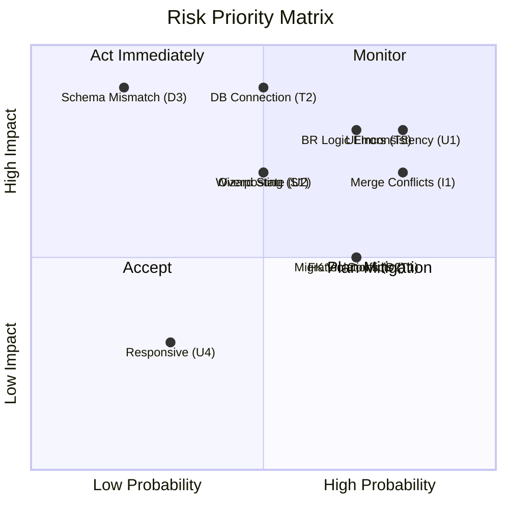

---

## 14. Development Order

> **Strategy:** Build from easiest to hardest within each dependency chain.  
> **Priority levels:** P1 (Critical path — must finish first), P2 (High — needed for most features), P3 (Medium — standalone), P4 (Low — nice-to-have polish)

### 14.1 Recommended Implementation Sequence

| # | Feature | Priority | Complexity | Dependencies | Est. Time | Owner |
|---|---------|----------|-----------|-------------|-----------|-------|
| 1 | Solution structure + entity classes | P1 | Low | None | 2 days | All |
| 2 | GameOnDbContext + Migrations | P1 | Medium | #1 | 2 days | All |
| 3 | Seed data (Sports, Formats, Positions) | P1 | Low | #2 | 1 day | All |
| 4 | ASP.NET Identity + roles | P1 | Medium | #2 | 2 days | Robert |
| 5 | _Layout.cshtml + site.css + shared nav | P1 | Medium | None | 2 days | Zane |
| 6 | Program.cs DI registration | P1 | Low | #1-5 | 0.5 day | Robert |
| 7 | Login / Logout | P1 | Medium | #4, #6 | 2 days | Robert |
| 8 | D100 Register User (2-step) | P1 | High | #4, #3, #6 | 4 days | Robert |
| 9 | D200 Manage Profile (view + edit) | P2 | Medium | #8 | 3 days | Robert |
| 10 | D300 Add Sport | P1 | Medium | #9 | 2 days | Robert |
| 11 | B100 Create Posts | P2 | Medium | #7 | 3 days | Zane |
| 12 | B200 Manage Posts (edit + delete) | P2 | Medium | #11 | 3 days | Zane |
| 13 | D400 View Profile + Follow/Unfollow | P1 | High | #10 | 3 days | Robert |
| 14 | A100 Create Game Listing (wizard) | P1 | High | #10, #13 | 5 days | Lihlumelo |
| 15 | A200 Browse Listings + filters | P1 | Medium | #14 | 3 days | Lihlumelo |
| 16 | B300 Browse Posts + Like + Comment | P2 | High | #12 | 4 days | Zane |
| 17 | A300 Send Join Request | P1 | High | #15 | 3 days | Lihlumelo |
| 18 | C300 Manage Game Listing (edit/delete) | P2 | Medium | #15 | 3 days | Gerard |
| 19 | C500 View Join Requests (accept/reject) | P1 | High | #17 | 3 days | Gerard |
| 20 | A400 Leave Game Listing | P2 | Low | #17 | 1 day | Lihlumelo |
| 21 | D500 View Notifications | P2 | Medium | #13 | 2 days | Robert |
| 22 | C100 Record Match Result | P1 | Medium | #19 | 3 days | Gerard |
| 23 | C200 Update Match Result | P3 | Low | #22 | 2 days | Gerard |
| 24 | C400 View Match Results | P2 | Low | #22 | 2 days | Gerard |
| 25 | D600 Report User | P3 | Medium | #13 | 2 days | Robert |
| 26 | A500 Hide Expired Listings | P3 | Low | #15 | 1 day | Lihlumelo |
| 27 | B500 View Leaderboards | P2 | Medium | #22 | 3 days | Zane |
| 28 | D700 Report Post | P3 | Medium | #16 | 2 days | Robert |
| 29 | A700 Confirm Session | P3 | Medium | #17 | 2 days | Lihlumelo |
| 30 | A600 Send Game Reminders | P3 | Medium | #29 | 2 days | Lihlumelo |
| 31 | B400 View Reports (Moderator) | P3 | Medium | #25, #28 | 3 days | Zane |
| 32 | Notification wiring (all triggers) | P2 | Medium | #21, all features | 3 days | Robert |
| 33 | UI consistency pass | P2 | Medium | All views | 3 days | All |
| 34 | Error handling + validation polish | P2 | Medium | All controllers | 2 days | All |
| 35 | Integration testing + demo data | P1 | Low | All above | 3 days | All |
| 36 | FSSB alignment walkthrough | P1 | Low | All above | 1 day | All |

### 14.2 Complexity Legend

| Level | Definition | Typical Time | Examples |
|-------|-----------|-------------|---------|
| Low | Single entity, simple CRUD, minimal logic | 1-2 days | A400 Leave, A500 Expired, C200 Update |
| Medium | Multiple entities, validation, some branching | 2-3 days | D300 Add Sport, B100 Create Post, C100 Record Result |
| High | Multi-step flow, complex validation, multiple BRs | 4-5 days | A100 Create Listing wizard, A300 Join (BR5+BR10), C500 Accept/Reject |

### 14.3 Dependency Chain Visualization

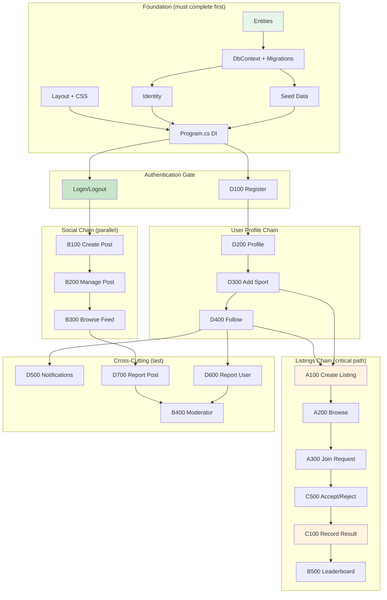

### 14.4 What to Build If Running Out of Time

If approaching code freeze with incomplete features, prioritize in this order:

| Priority | What to Ensure Works | Why | Marks Impact |
|----------|---------------------|-----|-------------|
| 1 | Your 2 Formal Review use cases fully functional | 70% of total mark comes from here | /40 individual functionality |
| 2 | Database with all tables + seed data running | Every review checks DB | /10 Sprint Story |
| 3 | Consistent UI across all team pages | Assessed in all 3 reviews | /5 + /5 + /5 = /15 total |
| 4 | Validation + error messages on your 2 use cases | UX marks across all reviews | /10 + /15 + /10 = /35 area |
| 5 | 1 CRUD use case for Sprint Story demo | Tech Lead will choose one | /10 + /5 narrative |
| 6 | System doesn't crash on invalid input | Stability matters everywhere | Error handling marks |
| 7 | All other use cases (nice-to-have) | Extra robustness | Minor marks |

---

## 15. Final Build Checklist

> **Purpose:** Pre-submission verification checklist. Run through every item before Sprint Reviews.  
> **When to use:** After Code Freeze (15 August 2026) and before Sprint Story review (20 August 2026).  
> **Rule:** Every item must be ☑ before presenting to any assessor.

### 15.1 Database Checklist

| # | Check | How to Verify | Status |
|---|-------|---------------|--------|
| 1 | SQL Server instance running and accessible | Open SSMS → connect successfully | ☐ |
| 2 | GameOnDb database exists | SSMS → Databases → GameOnDb visible | ☐ |
| 3 | All 16 tables present | SSMS → Tables → count = 16 | ☐ |
| 4 | Table names match FSSB Section 4.1 | Compare table list to entity list | ☐ |
| 5 | All columns match FSSB attributes | Open each table → check columns | ☐ |
| 6 | Primary keys configured correctly | Check PK on each table (including composites) | ☐ |
| 7 | Foreign keys configured correctly | Check FK relationships in diagram view | ☐ |
| 8 | Unique constraints on userName, Session.gameListingID, MatchResult.gameListingID | Attempt duplicate insert → fails | ☐ |
| 9 | Seed data present — 5 Sports | `SELECT * FROM Sports` → 5 rows | ☐ |
| 10 | Seed data present — 10 SportFormats | `SELECT * FROM SportFormats` → 10 rows | ☐ |
| 11 | Seed data present — 12 Positions | `SELECT * FROM Positions` → 12 rows | ☐ |
| 12 | Seed data present — FormatPosition mappings | `SELECT * FROM FormatPositions` → correct mappings | ☐ |
| 13 | Test user accounts seeded | Login with Zane/Test123, Lihlumelo/Test123, etc. | ☐ |
| 14 | Moderator account seeded | Login with Moderator/Admin123 → see Reports page | ☐ |
| 15 | Connection string in appsettings.json correct | App starts without DB connection error | ☐ |
| 16 | EF Migrations applied cleanly | `dotnet ef database update` → no errors | ☐ |
| 17 | Data persists after app restart | Create record → restart → record still there | ☐ |
| 18 | Can read data from any table via the application | Navigate to a page → data loads from DB | ☐ |
| 19 | Can write data to any table via the application | Submit a form → verify in SSMS | ☐ |
| 20 | No orphaned records or FK violations | Run app without constraint errors | ☐ |

### 15.2 Authentication Checklist

| # | Check | How to Verify | Status |
|---|-------|---------------|--------|
| 1 | Register Step 1 works (username + password) | Complete registration form | ☐ |
| 2 | Register Step 2 works (sport + skill) | Select sport, choose skill, complete | ☐ |
| 3 | Duplicate username rejected with message | Try registering with existing username | ☐ |
| 4 | Password confirmation mismatch shows error | Enter different passwords → error message | ☐ |
| 5 | Login with valid credentials succeeds | Login → redirected to Listings | ☐ |
| 6 | Login with invalid credentials shows error | Wrong password → "Invalid credentials" | ☐ |
| 7 | Logout clears session | Logout → redirected to Login → back button doesn't access pages | ☐ |
| 8 | Unauthenticated user redirected to Login | Navigate to /Listings without login → redirect | ☐ |
| 9 | Moderator login redirects to Reports | Login as Moderator → see Reports dashboard | ☐ |
| 10 | User role assigned on registration | Check AspNetUserRoles table after register | ☐ |
| 11 | `[Authorize]` blocks anonymous access on all protected pages | Try accessing any URL without login | ☐ |
| 12 | `[Authorize(Roles="Moderator")]` blocks regular users from Moderator pages | Login as regular user → navigate to /Moderator → 403 or redirect | ☐ |

### 15.3 CRUD Checklist (Per Team Member)

#### Robert Lloyd — Module D

| # | Use Case | Create | Read | Update | Delete | Status |
|---|----------|--------|------|--------|--------|--------|
| 1 | D100 Register | ☐ User created in DB | ☐ Profile loads after register | — | — | ☐ |
| 2 | D200 Profile | — | ☐ Own profile displays | ☐ Username changes | ☐ Sport removed | ☐ |
| 3 | D300 Add Sport | ☐ UserSportProfile inserted | ☐ Sport appears on profile | — | — | ☐ |
| 4 | D400 Follow | ☐ Follow record created | ☐ Other profile displays | — | ☐ Unfollow removes record | ☐ |
| 5 | D500 Notifications | — | ☐ List displays | ☐ Mark as read | — | ☐ |
| 6 | D600 Report User | ☐ Report created | — | — | — | ☐ |
| 7 | D700 Report Post | ☐ Report created | — | — | — | ☐ |

#### Lihlumelo Mgijima — Module A

| # | Use Case | Create | Read | Update | Delete | Status |
|---|----------|--------|------|--------|--------|--------|
| 1 | A100 Create Listing | ☐ GameListing inserted | ☐ Preview shows correctly | — | — | ☐ |
| 2 | A200 Browse | — | ☐ Available listings display with filters | — | — | ☐ |
| 3 | A300 Join Request | ☐ GameJoiner inserted (Pending) | ☐ Teams display | — | — | ☐ |
| 4 | A400 Leave | — | — | — | ☐ GameJoiner removed/status=Left | ☐ |
| 5 | A500 Hide Expired | — | ☐ Expired listings not shown | — | — | ☐ |
| 6 | A600 Reminders | ☐ Notification created | — | — | — | ☐ |
| 7 | A700 Confirm | ☐ Session created | — | ☐ Joiners locked | — | ☐ |

#### Gerard Mc Loughlin — Module C

| # | Use Case | Create | Read | Update | Delete | Status |
|---|----------|--------|------|--------|--------|--------|
| 1 | C100 Record Result | ☐ MatchResult inserted + stats updated | — | — | — | ☐ |
| 2 | C200 Update Result | — | — | ☐ Score changed + stats recalculated | — | ☐ |
| 3 | C300 Manage Listing | — | ☐ Listing details display | ☐ Fields updated | ☐ Listing deleted | ☐ |
| 4 | C400 View Results | — | ☐ Match history displays | — | — | ☐ |
| 5 | C500 View Requests | — | ☐ Pending requests display | ☐ Accept/Reject status change | — | ☐ |

#### Zane Griesel — Module B

| # | Use Case | Create | Read | Update | Delete | Status |
|---|----------|--------|------|--------|--------|--------|
| 1 | B100 Create Post | ☐ Post inserted | — | — | — | ☐ |
| 2 | B200 Manage Post | — | — | ☐ Caption/privacy edited | ☐ Post + comments + likes deleted | ☐ |
| 3 | B300 Browse/Like/Comment | ☐ Like/Comment created | ☐ Feed displays | — | ☐ Unlike removes | ☐ |
| 4 | B400 Reports (Mod) | — | ☐ Pending reports display | ☐ Dismiss/Action status | — | ☐ |
| 5 | B500 Leaderboard | — | ☐ Rankings display correctly | — | — | ☐ |

### 15.4 Validation Checklist

| # | Check | Where | Expected Result | Status |
|---|-------|-------|-----------------|--------|
| 1 | Empty required field shows error | All forms | Red text "X is required" below field | ☐ |
| 2 | Username too short (<3 chars) shows error | Register, Edit Profile | "Username must be 3-30 characters" | ☐ |
| 3 | Password too short (<6 chars) shows error | Register | "Password must be at least 6 characters" | ☐ |
| 4 | Password mismatch shows error | Register | "Passwords do not match" | ☐ |
| 5 | Duplicate username shows error | Register, Edit Profile | "Username already taken" | ☐ |
| 6 | Date in the past shows error | Create Listing | "Date must be in the future" | ☐ |
| 7 | More than 2 positions selected shows error | Create Listing Step 2, Join Request | "Select up to 2 positions" | ☐ |
| 8 | BR1 — second active listing blocked | Create Listing | "You already have an active listing" | ☐ |
| 9 | BR5 — join without sport blocked | Send Join Request | "Add this sport to your profile first" | ☐ |
| 10 | BR10 — time conflict blocked | Send Join Request | "Conflicts with game at [time]" | ☐ |
| 11 | Score < 0 blocked | Submit/Update Score | "Score must be 0 or higher" | ☐ |
| 12 | Empty comment blocked | Add Comment | "Comment cannot be empty" | ☐ |
| 13 | Report reason not selected blocked | Report User/Post | "Please select a reason" | ☐ |
| 14 | Non-owner edit blocked | Edit Post, Manage Listing | Redirect or "Access denied" | ☐ |
| 15 | Client-side validation fires (no page reload) | All forms | Error shows immediately on blur/submit | ☐ |

### 15.5 Navigation Checklist

| # | Check | Action | Expected Result | Status |
|---|-------|--------|-----------------|--------|
| 1 | Listings tab loads Browse Listings | Click "Listings" tab | /Listings page with cards | ☐ |
| 2 | Social tab loads Social Feed | Click "Social" tab | /Social page with posts | ☐ |
| 3 | Lobby tab loads Created Listings | Click "Lobby" tab | /Lobby/Created page | ☐ |
| 4 | Profile icon loads own profile | Click profile image top-right | /Profile page | ☐ |
| 5 | Bell icon loads notifications | Click bell icon | /Notifications page | ☐ |
| 6 | Notification badge shows count | Have unread notifications | Badge number visible | ☐ |
| 7 | Active tab highlighted (red underline) | Navigate between tabs | Current tab has red border-bottom | ☐ |
| 8 | Back navigation works | Use browser back or back buttons | Returns to previous page correctly | ☐ |
| 9 | Create Listing button visible on Listings page | View Listings page | Red "Create" button present | ☐ |
| 10 | View Teams button on each listing card | View Browse Listings | Button on every card | ☐ |
| 11 | Three dots menu on own posts | View Social Feed | Three dots visible on own posts only | ☐ |
| 12 | Lobby sub-tabs switch correctly | Click Created/Joined/History | Correct content loads | ☐ |
| 13 | Logo links back to Listings | Click "GAME ON" logo | Redirect to /Listings | ☐ |
| 14 | Search bar functional on Social tab | Enter query → search | Results displayed | ☐ |
| 15 | After form submit → redirected to logical page | Complete any form | Redirect to parent list/index | ☐ |

### 15.6 Error Handling Checklist

| # | Check | How to Test | Expected Result | Status |
|---|-------|-------------|-----------------|--------|
| 1 | Invalid URL returns friendly 404 | Navigate to /nonexistent | Custom 404 page or redirect | ☐ |
| 2 | Server error returns friendly 500 | Force exception (dev tools) | Custom error page, no stack trace | ☐ |
| 3 | Form errors display clearly | Submit invalid form | Validation summary at top + inline errors | ☐ |
| 4 | Success messages display after actions | Complete a create/edit/delete | Green alert "Successfully created" etc. | ☐ |
| 5 | System remains stable after any error | Trigger multiple errors in sequence | App continues working, no crash | ☐ |
| 6 | Unauthorized access handled gracefully | Access moderator page as user | Redirect to Access Denied or Login | ☐ |
| 7 | Concurrent edit doesn't crash | Two users edit same record | Last save wins or concurrency message | ☐ |
| 8 | Empty database doesn't crash pages | No listings/posts exist | "No listings found" message, no exception | ☐ |
| 9 | Null navigation properties handled | Access profile with no sports | Displays empty state, doesn't crash | ☐ |
| 10 | Anti-forgery token present on all forms | Inspect form HTML | `__RequestVerificationToken` hidden input | ☐ |

### 15.7 Responsive Design Checklist

| # | Check | Viewport | Expected Result | Status |
|---|-------|----------|-----------------|--------|
| 1 | Login page readable on mobile | 375px | Form centered, no horizontal scroll | ☐ |
| 2 | Navigation tabs usable on mobile | 375px | Tabs visible (may wrap or become dropdown) | ☐ |
| 3 | Listing cards stack vertically on mobile | 375px | Single column, full width cards | ☐ |
| 4 | Create Listing wizard usable on mobile | 375px | Form fields full width, Next button reachable | ☐ |
| 5 | Social feed readable on mobile | 375px | Posts full width, community sidebar hidden/collapsed | ☐ |
| 6 | Profile page displays correctly on tablet | 768px | Content centered, stats row visible | ☐ |
| 7 | Tables don't overflow on small screens | 576px | Horizontal scroll or responsive table class | ☐ |
| 8 | Buttons are large enough to tap | 375px | Min 44px touch target | ☐ |
| 9 | Images scale proportionally | All sizes | No distortion, max-width: 100% | ☐ |
| 10 | No horizontal scrollbar on any page | All sizes | Content fits within viewport | ☐ |

### 15.8 Testing Checklist

| # | Test Type | What to Test | Status |
|---|-----------|-------------|--------|
| 1 | End-to-end: Register → Login → Create Listing → Browse → Join | Full user journey works | ☐ |
| 2 | End-to-end: Join Request → Accept → Game → Record Result → History | Full game lifecycle | ☐ |
| 3 | End-to-end: Create Post → Like → Comment → Report → Moderator Action | Full social lifecycle | ☐ |
| 4 | End-to-end: Register → Profile → Add Sport → Follow → Notifications | Full profile lifecycle | ☐ |
| 5 | Business rule: Cannot create 2nd listing while 1st active | BR1 enforcement | ☐ |
| 6 | Business rule: Cannot join without sport on profile | BR5 enforcement | ☐ |
| 7 | Business rule: Cannot join if time conflict < 3hrs | BR10 enforcement | ☐ |
| 8 | Business rule: Only creator can submit/update score | BR7/BR13 enforcement | ☐ |
| 9 | Business rule: Only moderator can remove users/posts | BR9 enforcement | ☐ |
| 10 | Cross-module: Notification fires on follow, accept, reject, result | All notification triggers | ☐ |
| 11 | Cross-module: Win/loss stats update after match result | UserSportProfile.wins/losses change | ☐ |
| 12 | Cross-module: Leaderboard reflects recorded results | B500 shows correct rankings | ☐ |
| 13 | Stress: Multiple join requests to same listing | Concurrent requests don't break team capacity | ☐ |
| 14 | Edge: User with no posts sees empty feed message | Not a crash | ☐ |
| 15 | Edge: User with 0 games has 0% win rate (not NaN) | Division by zero handled | ☐ |

### 15.9 Sprint Review Readiness Checklist

| # | Check | Before Which Review | Status |
|---|-------|--------------------:|--------|
| 1 | FSSB document printed (or PDF on second screen) | All 3 reviews | ☐ |
| 2 | Know which 2 use cases supervisor will assess | Formal Review | ☐ |
| 3 | Can demo full CRUD on at least 1 use case (not login) | Sprint Story | ☐ |
| 4 | Can walk through FSSB narrative step-by-step alongside code | Sprint Story + Formal | ☐ |
| 5 | System starts without errors from cold boot | All 3 reviews | ☐ |
| 6 | Test accounts available and working | All 3 reviews | ☐ |
| 7 | Demo data populated (listings, posts, results) | All 3 reviews | ☐ |
| 8 | All team members' features accessible from same running instance | All 3 reviews | ☐ |
| 9 | 2-minute team pitch rehearsed | Dev Crew Cross-Check | ☐ |
| 10 | Can explain any feature to a peer crew | Dev Crew Cross-Check | ☐ |
| 11 | Know the marking rubric criteria | All 3 reviews | ☐ |
| 12 | System consistency verified — navigate all pages, same look | All 3 reviews | ☐ |
| 13 | All validation errors produce user-friendly messages | Sprint Story (UX /10) | ☐ |
| 14 | Notification badge displays correct unread count | Formal Review (UX /15) | ☐ |
| 15 | Booking made with supervisor on Funda (before 30 July 17:00) | Formal Review | ☐ |

### 15.10 Final Pre-Submission Command Sequence

```
# 1. Clean build
dotnet clean
dotnet build

# 2. Verify no build errors
# Output: "Build succeeded. 0 Warning(s) 0 Error(s)"

# 3. Drop and recreate database (fresh)
dotnet ef database drop --force
dotnet ef database update

# 4. Run application
dotnet run

# 5. Verify in browser
# - Navigate to https://localhost:5001
# - Should see Login page
# - Login with test account
# - Verify all tabs load
# - Verify seed data present

# 6. Run through Sprint Review demo flow
# Register → Add Sport → Create Listing → Browse → Join → Accept → Record → Leaderboard
```

---

> **End of GameOn Development Plan**  
> This document contains everything needed to build the GameOn project from scratch.  
> Follow Section 14 (Development Order) for implementation sequence.  
> Use Section 12 (Sprint Review Traceability) to ensure maximum marks.  
> Reference Section 15 (this checklist) before every review session.  
> The FSSB remains the single source of truth for functional requirements.
