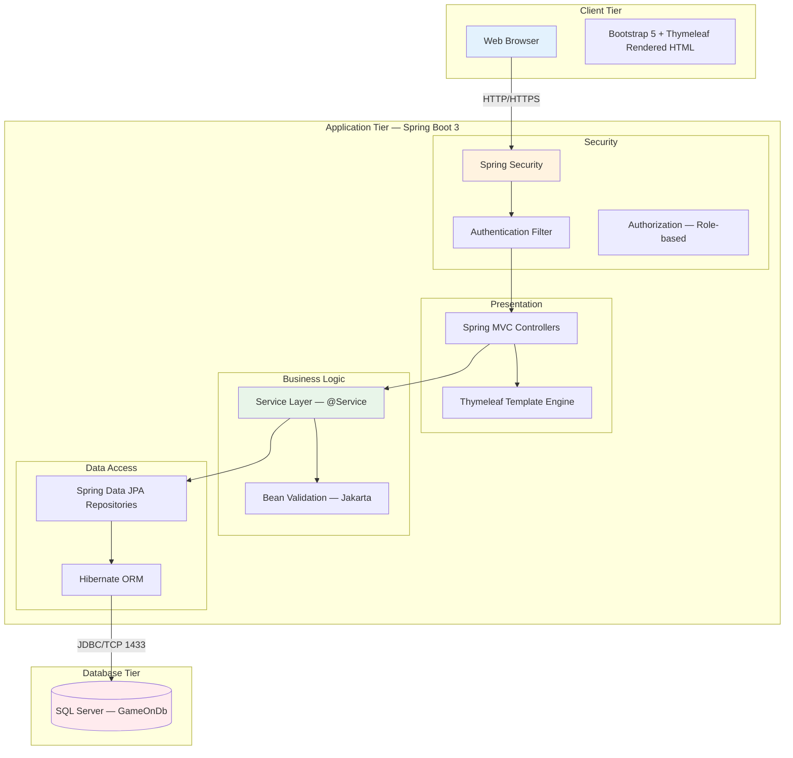
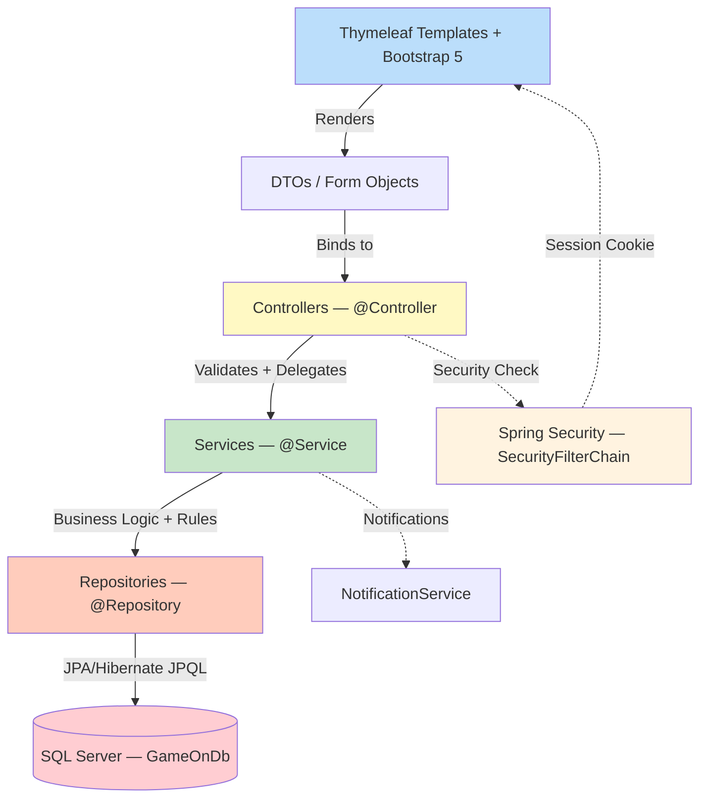
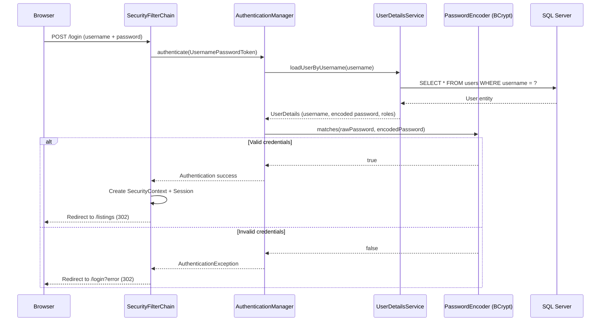
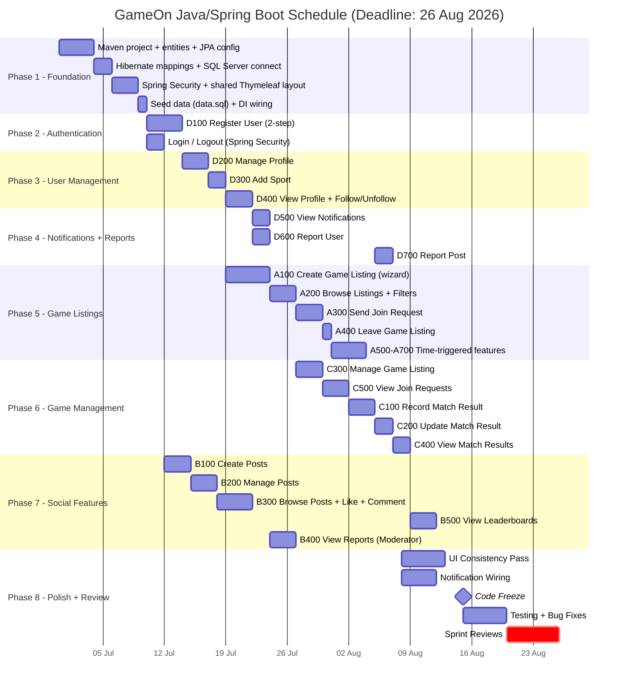
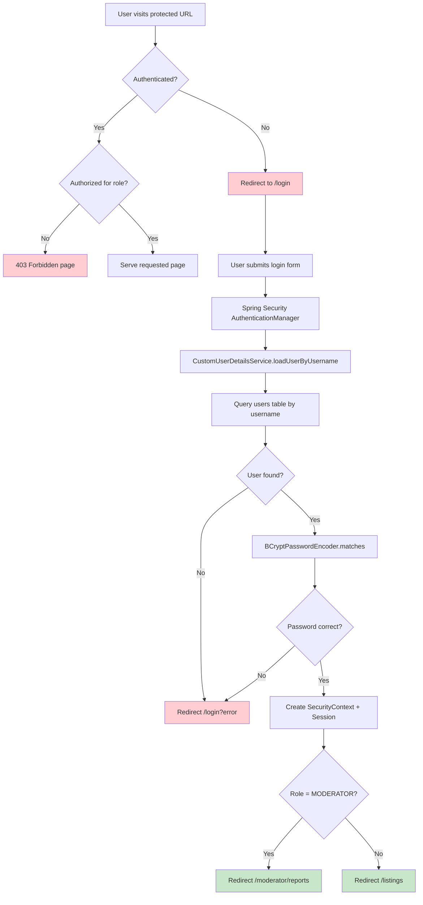
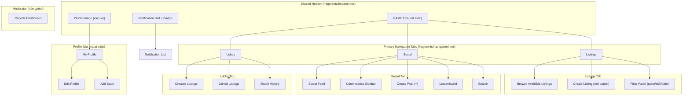
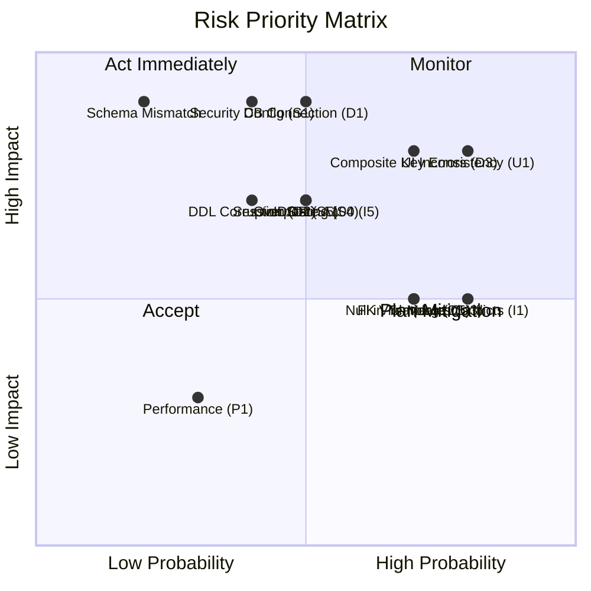
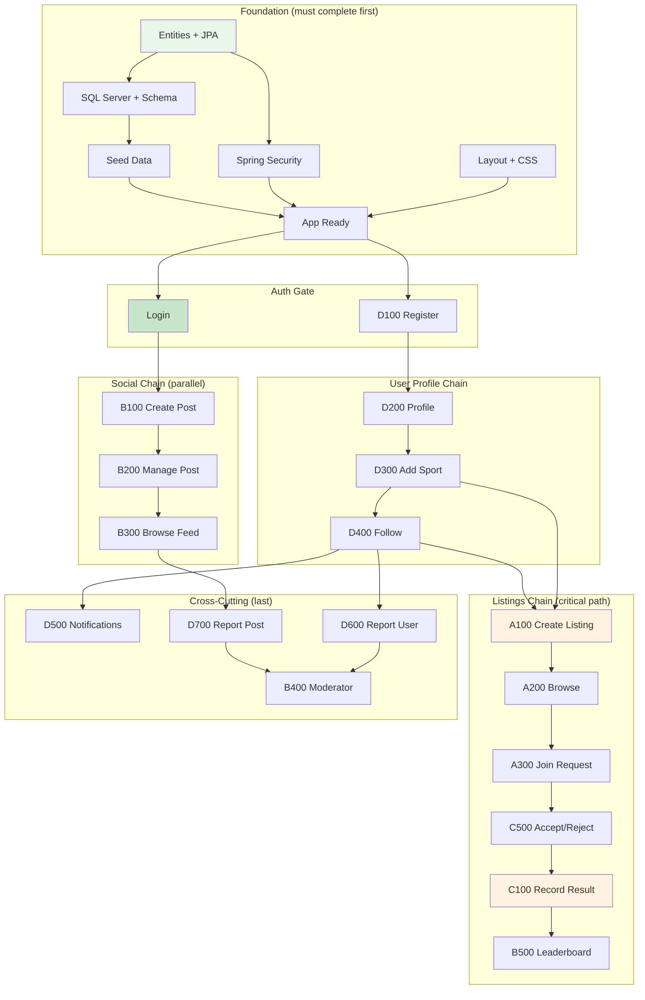

# GameOn — Java/Spring Boot Development Plan

> **Project:** GameOn — Sports Management & Social Platform  
> **Module:** WRRV301 (2026)  
> **Team:** CodeSphere  
> **Deadline:** 26 August 2026  
> **Stack:** Java 21 | Spring Boot 3 | Spring MVC | Spring Security | Spring Data JPA | Hibernate | SQL Server | Thymeleaf | Bootstrap 5 | Maven  
> **Document Purpose:** Complete implementation roadmap — architecture, planning, strategy, and Sprint Review readiness

---

## Table of Contents

| # | Section | Purpose |
|---|---------|---------|
| 1 | [Executive Summary](#1-executive-summary) | Project context and objectives |
| 2 | [System Architecture](#2-system-architecture) | High-level + layered + auth diagrams |
| 3 | [Project Structure](#3-project-structure) | Java package layout |
| 4 | [Development Roadmap](#4-development-roadmap) | Phased implementation plan |
| 5 | [Database Planning](#5-database-planning) | SQL Server ER + table inventory |
| 6 | [Entity Planning](#6-entity-planning) | JPA mappings per entity |
| 7 | [Spring Security Planning](#7-spring-security-planning) | Auth, roles, routes |
| 8 | [Controller Planning](#8-controller-planning) | All controllers with endpoints |
| 9 | [Service Layer Planning](#9-service-layer-planning) | Business logic inventory |
| 10 | [Repository Planning](#10-repository-planning) | Data access methods |
| 11 | [Thymeleaf UI Planning](#11-thymeleaf-ui-planning) | Navigation, pages, layouts |
| 12 | [Use Case Planning](#12-use-case-planning) | All 24 use cases detailed |
| 13 | [Sprint Review Traceability Matrix](#13-sprint-review-traceability-matrix) | Rubric alignment |
| 14 | [Risk Assessment](#14-risk-assessment) | Risks and mitigation |
| 15 | [Development Sequence](#15-development-sequence) | Priority-ordered build list |
| 16 | [Testing Strategy](#16-testing-strategy) | Unit, integration, acceptance |
| 17 | [Deployment Planning](#17-deployment-planning) | SQL Server, config, logging |
| 18 | [Final Sprint Review Checklist](#18-final-sprint-review-checklist) | Pre-submission verification |

---

## 1. Executive Summary

### 1.1 Project Purpose

GameOn is a web-based sports management platform with integrated social features that connects sports players with available teammates and opponents for pickup games and organised sessions.

### 1.2 Problem Being Solved

Sports players frequently cannot find available teammates to fill a game. There is no centralised platform that matches players by sport, skill level, location, and availability while also offering social engagement and competitive stat tracking.

### 1.3 Main Stakeholders

| Stakeholder | Role | Interest |
|-------------|------|----------|
| Sports Players (Users) | Primary users | Find games, compete, track stats, socialise |
| Game Listing Creators | Power users | Organise games, manage rosters, record results |
| Game Listing Joiners | Participants | Find and join games matching their skill/sport |
| Moderators | Content governance | Review reports, remove bad content/users |
| WRRV301 Supervisors | Academic assessors | Evaluate Sprint Review deliverables (70% weight) |
| Tech Leads | Technical assessors | Verify DB integration, CRUD, FSSB narrative alignment (15%) |
| Peer Dev Crews | Peer assessors | Evaluate usability and consistency (15%) |

### 1.4 Key Objectives

| # | Objective | Measured By |
|---|-----------|-------------|
| O1 | Allow users to create game listings specifying sport, skill level, positions, player count | A100 functional |
| O2 | Allow users to browse, filter, and request to join game sessions | A200, A300 functional |
| O3 | Allow listing creators to manage rosters (accept/reject requests) | C500 functional |
| O4 | Record and display match results with automatic stat tracking | C100, C400, B500 functional |
| O5 | Provide social features: posts, comments, likes, follows | B100-B300, D400 functional |
| O6 | Display leaderboards based on win percentage per sport | B500 functional |
| O7 | Enable user/post reporting and moderator content governance | D600, D700, B400 functional |
| O8 | Deliver notifications for game invites, reminders, and social activity | D500, A600 functional |

### 1.5 Business Rules

| # | Rule | Enforcement Location |
|---|------|---------------------|
| BR1 | A user can post ONE Game Listing at a time | GameListingService.create() — count active |
| BR2 | A user can join one or many game listings | GameJoinerService — no single-join limit |
| BR3 | Only one match can be scheduled from a Game Listing | Session table — unique FK |
| BR4 | User can only create listing if sport is on their profile | GameListingService.validate() |
| BR5 | User can only join listing if sport is on their profile | GameJoinerService.validate() |
| BR6 | One match result per Game Listing | MatchResult — unique FK constraint |
| BR7 | Only listing creator can update match result | MatchResultService — check creatorId |
| BR8 | A user can report many users, posts and comments | ReportService — no limit |
| BR9 | Only moderator can remove users, posts or comments | @PreAuthorize("hasRole('MODERATOR')") |
| BR10 | Cannot join 2 listings with times < 3 hours apart | GameJoinerService.validateTimeConflict() |
| BR11 | Users in listing 2hrs before scheduled time are locked in | SessionService — time-triggered |
| BR12 | A user can play multiple sports | UserSportProfile composite PK |
| BR13 | Only listing creator can record/update match result | MatchResultService — authorization |
| BR14 | A user can follow many other users / have many followers | Follow table — no limits |

---

## 2. System Architecture

### 2.1 High-Level Architecture



### 2.2 Layered Architecture



### 2.3 Authentication Architecture



### 2.4 Technology Stack Detail

| Layer | Technology | Version | Purpose |
|-------|-----------|---------|---------|
| Language | Java | 21 (LTS) | Core language |
| Framework | Spring Boot | 3.2+ | Application framework |
| Web | Spring MVC | 6.x | Request handling, controllers |
| Templates | Thymeleaf | 3.1+ | Server-side HTML rendering |
| CSS | Bootstrap 5 | 5.3+ | Responsive layout, components |
| Security | Spring Security | 6.x | Auth, roles, CSRF protection |
| ORM | Hibernate | 6.x | JPA implementation |
| Data Access | Spring Data JPA | 3.x | Repository abstraction |
| Database | SQL Server | 2019+ | RDBMS storage |
| Build | Maven | 3.9+ | Dependency management, build |
| Validation | Jakarta Bean Validation | 3.0 | @NotNull, @Size, custom validators |
| Utility | Lombok | Latest | Reduce boilerplate (optional) |
| Testing | JUnit 5 + Mockito | 5.x / 5.x | Unit and integration tests |
| VCS | Git | Latest | Version control |

---

## 3. Project Structure

### 3.1 Maven Project Layout

```
gameon/
├── pom.xml                                    # Maven build + dependencies
├── src/
│   ├── main/
│   │   ├── java/
│   │   │   └── com/
│   │   │       └── gameon/
│   │   │           ├── GameOnApplication.java           # @SpringBootApplication entry point
│   │   │           │
│   │   │           ├── config/
│   │   │           │   ├── SecurityConfig.java          # SecurityFilterChain, CORS, CSRF
│   │   │           │   ├── WebMvcConfig.java            # View resolvers, static resources
│   │   │           │   └── DataSeeder.java              # CommandLineRunner seed data
│   │   │           │
│   │   │           ├── security/
│   │   │           │   ├── CustomUserDetailsService.java # UserDetailsService impl
│   │   │           │   ├── CustomUserDetails.java        # UserDetails wrapper
│   │   │           │   └── SecurityUtils.java            # Get current user helper
│   │   │           │
│   │   │           ├── controller/
│   │   │           │   ├── AuthController.java           # Login, Register, Logout
│   │   │           │   ├── ProfileController.java        # D200, D300, D400
│   │   │           │   ├── GameListingController.java    # A100, A200, C300
│   │   │           │   ├── GameJoinerController.java     # A300, A400, C500
│   │   │           │   ├── MatchResultController.java    # C100, C200, C400
│   │   │           │   ├── PostController.java           # B100, B200, B300
│   │   │           │   ├── NotificationController.java   # D500
│   │   │           │   ├── ReportController.java         # D600, D700
│   │   │           │   ├── ModeratorController.java      # B400
│   │   │           │   ├── LeaderboardController.java    # B500
│   │   │           │   └── LobbyController.java          # Created/Joined/History tabs
│   │   │           │
│   │   │           ├── service/
│   │   │           │   ├── AuthService.java
│   │   │           │   ├── ProfileService.java
│   │   │           │   ├── GameListingService.java
│   │   │           │   ├── GameJoinerService.java
│   │   │           │   ├── SessionService.java
│   │   │           │   ├── MatchResultService.java
│   │   │           │   ├── PostService.java
│   │   │           │   ├── CommentService.java
│   │   │           │   ├── LikeService.java
│   │   │           │   ├── FollowService.java
│   │   │           │   ├── NotificationService.java
│   │   │           │   ├── ReportService.java
│   │   │           │   └── LeaderboardService.java
│   │   │           │
│   │   │           ├── repository/
│   │   │           │   ├── UserRepository.java
│   │   │           │   ├── UserSportProfileRepository.java
│   │   │           │   ├── SportRepository.java
│   │   │           │   ├── SportFormatRepository.java
│   │   │           │   ├── FormatPositionRepository.java
│   │   │           │   ├── PositionRepository.java
│   │   │           │   ├── GameListingRepository.java
│   │   │           │   ├── GameJoinerRepository.java
│   │   │           │   ├── SessionRepository.java
│   │   │           │   ├── MatchResultRepository.java
│   │   │           │   ├── PostRepository.java
│   │   │           │   ├── CommentRepository.java
│   │   │           │   ├── LikeRepository.java
│   │   │           │   ├── FollowRepository.java
│   │   │           │   ├── NotificationRepository.java
│   │   │           │   └── ReportRepository.java
│   │   │           │
│   │   │           ├── model/
│   │   │           │   ├── entity/
│   │   │           │   │   ├── User.java
│   │   │           │   │   ├── UserSportProfile.java
│   │   │           │   │   ├── UserSportProfileId.java   # @Embeddable composite key
│   │   │           │   │   ├── Sport.java
│   │   │           │   │   ├── SportFormat.java
│   │   │           │   │   ├── FormatPosition.java
│   │   │           │   │   ├── FormatPositionId.java     # @Embeddable composite key
│   │   │           │   │   ├── Position.java
│   │   │           │   │   ├── GameListing.java
│   │   │           │   │   ├── GameJoiner.java
│   │   │           │   │   ├── GameJoinerId.java         # @Embeddable composite key
│   │   │           │   │   ├── Session.java
│   │   │           │   │   ├── MatchResult.java
│   │   │           │   │   ├── Post.java
│   │   │           │   │   ├── Comment.java
│   │   │           │   │   ├── Like.java
│   │   │           │   │   ├── LikeId.java               # @Embeddable composite key
│   │   │           │   │   ├── Follow.java
│   │   │           │   │   ├── FollowId.java             # @Embeddable composite key
│   │   │           │   │   ├── Notification.java
│   │   │           │   │   └── Report.java
│   │   │           │   └── enums/
│   │   │           │       ├── SkillLevel.java           # BEGINNER, INTERMEDIATE, ADVANCED
│   │   │           │       ├── JoinerStatus.java         # PENDING, ACCEPTED, REJECTED, LOCKED, LEFT
│   │   │           │       ├── PrivacySetting.java       # PUBLIC, PRIVATE, FOLLOWERS
│   │   │           │       ├── ReportType.java           # USER, POST
│   │   │           │       ├── ReportStatus.java         # PENDING, DISMISSED, ACTIONED
│   │   │           │       ├── NotificationType.java     # FOLLOW_NEW, JOIN_ACCEPTED, etc.
│   │   │           │       ├── Team.java                 # A, B
│   │   │           │       └── UserRole.java             # USER, MODERATOR
│   │   │           │
│   │   │           ├── dto/
│   │   │           │   ├── auth/
│   │   │           │   │   ├── RegisterStep1Dto.java
│   │   │           │   │   ├── RegisterStep2Dto.java
│   │   │           │   │   └── LoginDto.java
│   │   │           │   ├── profile/
│   │   │           │   │   ├── MyProfileDto.java
│   │   │           │   │   ├── EditProfileDto.java
│   │   │           │   │   ├── ViewProfileDto.java
│   │   │           │   │   └── AddSportDto.java
│   │   │           │   ├── listing/
│   │   │           │   │   ├── CreateListingStep1Dto.java
│   │   │           │   │   ├── CreateListingStep2Dto.java
│   │   │           │   │   ├── CreateListingStep3Dto.java
│   │   │           │   │   ├── ConfirmListingDto.java
│   │   │           │   │   ├── BrowseListingsDto.java
│   │   │           │   │   ├── ListingCardDto.java
│   │   │           │   │   └── EditListingDto.java
│   │   │           │   ├── joiner/
│   │   │           │   │   ├── ViewTeamsDto.java
│   │   │           │   │   ├── JoinRequestDto.java
│   │   │           │   │   └── PendingRequestDto.java
│   │   │           │   ├── match/
│   │   │           │   │   ├── SubmitScoreDto.java
│   │   │           │   │   ├── UpdateScoreDto.java
│   │   │           │   │   └── MatchHistoryDto.java
│   │   │           │   ├── social/
│   │   │           │   │   ├── CreatePostDto.java
│   │   │           │   │   ├── EditPostDto.java
│   │   │           │   │   ├── PostFeedDto.java
│   │   │           │   │   └── CommentDto.java
│   │   │           │   ├── notification/
│   │   │           │   │   └── NotificationDto.java
│   │   │           │   ├── report/
│   │   │           │   │   ├── ReportUserDto.java
│   │   │           │   │   └── ReportPostDto.java
│   │   │           │   └── leaderboard/
│   │   │           │       └── LeaderboardDto.java
│   │   │           │
│   │   │           ├── exception/
│   │   │           │   ├── GlobalExceptionHandler.java    # @ControllerAdvice
│   │   │           │   ├── ResourceNotFoundException.java
│   │   │           │   ├── BusinessRuleException.java
│   │   │           │   ├── UnauthorizedAccessException.java
│   │   │           │   └── DuplicateResourceException.java
│   │   │           │
│   │   │           ├── validation/
│   │   │           │   ├── UniqueUsername.java            # Custom constraint annotation
│   │   │           │   ├── UniqueUsernameValidator.java   # ConstraintValidator impl
│   │   │           │   ├── FutureDate.java               # Custom: date must be future
│   │   │           │   └── FutureDateValidator.java
│   │   │           │
│   │   │           └── util/
│   │   │               ├── DateUtils.java                 # Time conflict checks
│   │   │               └── WinPercentageCalculator.java   # Stats calculation
│   │   │
│   │   └── resources/
│   │       ├── application.properties                     # DB connection, JPA, security config
│   │       ├── application-dev.properties                 # Dev overrides
│   │       ├── application-prod.properties                # Prod overrides
│   │       ├── data.sql                                   # Seed data (sports, formats, positions)
│   │       ├── templates/
│   │       │   ├── fragments/
│   │       │   │   ├── layout.html                        # Main layout (header, nav, footer)
│   │       │   │   ├── navigation.html                    # Tabs: Listings / Social / Lobby
│   │       │   │   ├── header.html                        # GAME ON logo, bell, profile
│   │       │   │   └── messages.html                      # Flash message partial
│   │       │   ├── auth/
│   │       │   │   ├── login.html
│   │       │   │   ├── register.html                      # Step 1
│   │       │   │   └── register-sports.html               # Step 2
│   │       │   ├── profile/
│   │       │   │   ├── index.html                         # Own profile
│   │       │   │   ├── edit.html
│   │       │   │   ├── view.html                          # Other user
│   │       │   │   ├── add-sport.html
│   │       │   │   └── search.html
│   │       │   ├── listing/
│   │       │   │   ├── browse.html                        # A200
│   │       │   │   ├── create-step1.html
│   │       │   │   ├── create-step2.html                  # Positions
│   │       │   │   ├── create-step3.html                  # Invite friends
│   │       │   │   ├── confirm.html                       # Preview
│   │       │   │   ├── edit.html
│   │       │   │   └── delete.html
│   │       │   ├── joiner/
│   │       │   │   ├── view-teams.html
│   │       │   │   └── requests.html
│   │       │   ├── lobby/
│   │       │   │   ├── created.html
│   │       │   │   ├── joined.html
│   │       │   │   └── history.html
│   │       │   ├── match/
│   │       │   │   ├── submit.html
│   │       │   │   └── update.html
│   │       │   ├── social/
│   │       │   │   ├── feed.html
│   │       │   │   ├── create-post.html
│   │       │   │   ├── edit-post.html
│   │       │   │   └── post-detail.html
│   │       │   ├── notification/
│   │       │   │   └── index.html
│   │       │   ├── report/
│   │       │   │   ├── report-user.html
│   │       │   │   └── report-post.html
│   │       │   ├── moderator/
│   │       │   │   ├── dashboard.html
│   │       │   │   └── detail.html
│   │       │   ├── leaderboard/
│   │       │   │   └── index.html
│   │       │   └── error/
│   │       │       ├── 403.html
│   │       │       ├── 404.html
│   │       │       └── 500.html
│   │       └── static/
│   │           ├── css/
│   │           │   └── site.css                           # Custom styles + design tokens
│   │           ├── js/
│   │           │   └── site.js                            # Custom interactions
│   │           └── images/
│   │               ├── logo.png
│   │               └── sports/                            # Sport card images
│   │
│   └── test/
│       └── java/
│           └── com/
│               └── gameon/
│                   ├── service/                            # Service unit tests
│                   ├── repository/                         # Repository integration tests
│                   ├── controller/                         # MockMvc controller tests
│                   └── security/                           # Security config tests
│
└── .gitignore
```

### 3.2 Package Purpose Explanations

| Package | Purpose | Spring Stereotype |
|---------|---------|-------------------|
| `config` | Application configuration — security, MVC, seed data | `@Configuration` |
| `security` | Custom UserDetailsService, security utilities | `@Service` / `@Component` |
| `controller` | Handle HTTP requests, bind forms, call services, return views | `@Controller` |
| `service` | Business logic, rule enforcement, orchestration | `@Service` |
| `repository` | Data access via Spring Data JPA interfaces | `@Repository` (extends JpaRepository) |
| `model.entity` | JPA entity classes mapping to SQL Server tables | `@Entity` |
| `model.enums` | Java enumerations for status/type fields | Plain enum |
| `dto` | Data Transfer Objects / Form-backing objects for views | Plain POJO with validation annotations |
| `exception` | Custom exceptions + global handler | `@ControllerAdvice` |
| `validation` | Custom Bean Validation constraints | `@Constraint` + `ConstraintValidator` |
| `util` | Stateless helper/utility methods | `@Component` or static |

### 3.3 Key Maven Dependencies (pom.xml)

| Dependency | Purpose |
|-----------|---------|
| `spring-boot-starter-web` | Spring MVC + embedded Tomcat |
| `spring-boot-starter-thymeleaf` | Thymeleaf template engine |
| `spring-boot-starter-data-jpa` | Spring Data JPA + Hibernate |
| `spring-boot-starter-security` | Spring Security |
| `spring-boot-starter-validation` | Jakarta Bean Validation |
| `thymeleaf-extras-springsecurity6` | Security tag support in Thymeleaf |
| `mssql-jdbc` | SQL Server JDBC driver |
| `lombok` (optional) | Reduce boilerplate getters/setters |
| `spring-boot-starter-test` | JUnit 5 + Mockito + MockMvc |
| `spring-security-test` | Security testing utilities |
| `spring-boot-devtools` | Hot reload during development |

---

## 4. Development Roadmap

> **Timeline:** 30 June 2026 → 26 August 2026 (8 weeks)  
> **Code Freeze:** 15 August 2026  
> **Sprint Reviews:** 20–25 August 2026  
> **Team:** 4 developers in parallel on assigned modules

### 4.1 Phase Timeline



### 4.2 Phase 1 — Foundation (ALL)

| Item | Owner | Complexity | DB Tables | Pages | Controllers | Services |
|------|-------|-----------|-----------|-------|-------------|----------|
| Maven project with Spring Boot starter | All | Low | — | — | — | — |
| All 16 entity classes with JPA annotations | All | High | All 16 | — | — | — |
| Composite key @Embeddable classes (5) | All | Medium | — | — | — | — |
| application.properties — SQL Server connection | Robert | Low | — | — | — | — |
| Hibernate auto-ddl or Flyway/data.sql schema | All | Medium | All | — | — | — |
| Seed data: Sports, Formats, Positions | All | Low | Sport, SportFormat, Position, FormatPosition | — | — | — |
| Spring Security config (SecurityFilterChain) | Robert | Medium | — | — | — | — |
| Shared layout.html (header + tabs + footer) | Zane | Medium | — | layout | — | — |
| site.css design tokens | Zane | Medium | — | — | — | — |

**Gate:** Application starts. SQL Server connected. Tables exist. Seed data visible in SSMS. Login page renders.

### 4.3 Phase 2 — Authentication (Robert)

| Item | Dependencies | Complexity | DB Tables | Pages | Controllers | Services |
|------|-------------|-----------|-----------|-------|-------------|----------|
| D100 Register Step 1 (username, password, confirm) | Security config | High | User | register.html | AuthController | AuthService |
| D100 Register Step 2 (select sport + skill) | Step 1 + Sport seed | High | UserSportProfile | register-sports.html | AuthController | AuthService |
| Login form (Spring Security form login) | Security config | Medium | User | login.html | — (handled by Spring) | CustomUserDetailsService |
| Logout | Login | Low | — | — | — (handled by Spring) | — |
| Role-based redirect after login | Login | Low | — | — | AuthController | — |

**Gate:** Register creates user in DB. Login authenticates. Logout clears session. Moderator redirects to /moderator.

### 4.4 Phase 3 — User Management (Robert)

| Item | Dependencies | Complexity | DB Tables | Pages | Controllers | Services |
|------|-------------|-----------|-----------|-------|-------------|----------|
| D200 View own profile | D100 | Medium | User, UserSportProfile, Follow | profile/index.html | ProfileController | ProfileService |
| D200 Edit username | D200 view | Low | User | profile/edit.html | ProfileController | ProfileService |
| D300 Add Sport | D200 | Medium | UserSportProfile, Sport | profile/add-sport.html | ProfileController | ProfileService |
| D400 View other user profile | D300 | Medium | User, UserSportProfile, Follow | profile/view.html | ProfileController | ProfileService |
| D400 Follow / Unfollow | D400 view | Medium | Follow, Notification | profile/view.html | ProfileController | FollowService |
| Search users | D400 | Medium | User | profile/search.html | ProfileController | ProfileService |

**Gate:** Full profile CRUD. Add/remove sports. Follow/unfollow toggles. Search works.

### 4.5 Phase 4 — Notifications & Reporting (Robert)

| Item | Dependencies | Complexity | DB Tables | Pages | Controllers | Services |
|------|-------------|-----------|-----------|-------|-------------|----------|
| D500 View Notifications | Follow system | Medium | Notification | notification/index.html | NotificationController | NotificationService |
| D500 Mark as read | D500 | Low | Notification | notification/index.html | NotificationController | NotificationService |
| D600 Report User | D400 | Medium | Report | report/report-user.html | ReportController | ReportService |
| D700 Report Post | B300 | Medium | Report | report/report-post.html | ReportController | ReportService |

**Gate:** Notifications display. Reports submit and appear in moderator queue.

### 4.6 Phase 5 — Game Listings (Lihlumelo)

| Item | Dependencies | Complexity | DB Tables | Pages | Controllers | Services |
|------|-------------|-----------|-----------|-------|-------------|----------|
| A100 Create Listing wizard (4 steps) | D300 (sport on profile) | High | GameListing, SportFormat, FormatPosition | 4 create pages | GameListingController | GameListingService |
| A200 Browse Listings + filters | A100 | Medium | GameListing | listing/browse.html | GameListingController | GameListingService |
| A300 Send Join Request | A200 | High | GameJoiner | joiner/view-teams.html | GameJoinerController | GameJoinerService |
| A400 Leave Game Listing | A300 | Low | GameJoiner | lobby/joined.html | GameJoinerController | GameJoinerService |
| A500 Hide Expired Listings | A200 | Low | GameListing | — (query filter) | — | GameListingService |
| A600 Send Game Reminders | A700 | Medium | Notification | — (system) | — | NotificationService |
| A700 Confirm Session | A300 (full listing) | Medium | Session, GameJoiner | — (status change) | — | SessionService |

**Gate:** Full create wizard. Browse with filters. Join request flow. Leave works.

### 4.7 Phase 6 — Game Management (Gerard)

| Item | Dependencies | Complexity | DB Tables | Pages | Controllers | Services |
|------|-------------|-----------|-----------|-------|-------------|----------|
| C300 Manage Listing (update/delete) | A100 | Medium | GameListing, GameJoiner, Notification | listing/edit.html, delete.html | GameListingController | GameListingService |
| C500 View Join Requests (accept/reject) | A300 | High | GameJoiner, Notification | joiner/requests.html | GameJoinerController | GameJoinerService |
| C100 Record Match Result | C500 | Medium | MatchResult, UserSportProfile | match/submit.html | MatchResultController | MatchResultService |
| C200 Update Match Result | C100 | Low | MatchResult, UserSportProfile | match/update.html | MatchResultController | MatchResultService |
| C400 View Match Results | C100 | Low | MatchResult | lobby/history.html | MatchResultController | MatchResultService |

**Gate:** Full listing management. Accept/reject with notifications. Score updates stats. History displays.

### 4.8 Phase 7 — Social Features (Zane)

| Item | Dependencies | Complexity | DB Tables | Pages | Controllers | Services |
|------|-------------|-----------|-----------|-------|-------------|----------|
| B100 Create Posts | Login | Medium | Post | social/create-post.html | PostController | PostService |
| B200 Manage Posts (edit/delete) | B100 | Medium | Post, Comment, Like | social/edit-post.html | PostController | PostService |
| B300 Browse Posts + Like + Comment | B100 | High | Post, Comment, Like | social/feed.html, post-detail.html | PostController | PostService, LikeService, CommentService |
| B500 View Leaderboards | C100 (match data) | Medium | UserSportProfile | leaderboard/index.html | LeaderboardController | LeaderboardService |
| B400 View Reports (Moderator) | D600/D700 | Medium | Report | moderator/dashboard.html | ModeratorController | ReportService |

**Gate:** Full post lifecycle. Feed with likes/comments. Leaderboard renders. Moderator actions reports.

### 4.9 Phase 8 — Integration & Polish (ALL)

| Item | Owner | Complexity | Purpose |
|------|-------|-----------|---------|
| Wire all notification triggers | Robert | Medium | Follow, join accepted/rejected, game reminder, match result |
| UI consistency pass | All | Medium | Same colours, buttons, cards, fonts across all pages |
| Error handling — custom error pages | All | Low | 403, 404, 500 Thymeleaf error pages |
| Responsive testing | All | Low | Test all pages on 375px viewport |
| Integration testing | All | High | End-to-end flows across modules |
| Demo data creation | All | Low | Realistic test accounts and data |
| FSSB alignment check | All | Medium | Walk through narratives vs running code |

### 4.10 Critical Path

```mermaid
graph LR
    F[Foundation<br/>30 Jun–9 Jul] --> R[D100 Register + D300 Sport<br/>10–22 Jul]
    R --> CL[A100 Create Listing<br/>15–22 Jul]
    CL --> BL[A200 Browse + A300 Join<br/>22–29 Jul]
    BL --> RQ[C500 Accept Requests<br/>29 Jul–1 Aug]
    RQ --> MR[C100 Record Result<br/>1–5 Aug]
    MR --> LB[B500 Leaderboards<br/>5–8 Aug]
    LB --> PO[UI Polish<br/>8–14 Aug]
    PO --> CF[Code Freeze<br/>15 Aug]
    CF --> SR[Sprint Reviews<br/>20–26 Aug]

    style F fill:#e8f5e9
    style CF fill:#ffcdd2
    style SR fill:#ffcdd2
```



### 4.11 Parallel Work Streams by Week

| Week | Robert (D) | Lihlumelo (A) | Gerard (C) | Zane (B) |
|------|-----------|---------------|------------|----------|
| 30 Jun – 4 Jul | Entities + JPA + SQL Server | Seed data (formats/positions) | Help test DB | Layout + CSS |
| 7–11 Jul | Security + D100 Register | Help test Security | Help test migrations | B100 Create Posts |
| 14–18 Jul | D200 Profile + D300 Sport | A100 Create Listing (start) | Study match logic | B200 Manage Posts |
| 21–25 Jul | D400 View Profile + Follow | A100 (finish) + A200 Browse | C300 Manage Listing | B300 Browse + Like |
| 28 Jul – 1 Aug | D500 Notifications | A300 Join + A400 Leave | C500 View Requests | B300 Comment |
| 4–8 Aug | D600 Report User | A500 + A600 + A700 | C100 + C200 Record/Update | B500 Leaderboards |
| 11–14 Aug | D700 Report Post + polish | Integration testing | C400 View Results + polish | B400 Moderator + polish |
| 15–19 Aug | Bug fixes + demo prep | Bug fixes + demo prep | Bug fixes + demo prep | Bug fixes + demo prep |
| 20–26 Aug | **SPRINT REVIEWS** | **SPRINT REVIEWS** | **SPRINT REVIEWS** | **SPRINT REVIEWS** |

---

## 5. Database Planning

> **Database:** SQL Server 2019+ (GameOnDb)  
> **ORM:** Hibernate 6 via Spring Data JPA  
> **Schema Strategy:** `spring.jpa.hibernate.ddl-auto=update` for dev; managed SQL scripts for production  
> **Total Tables:** 16 + Identity/Role tables managed by Spring Security

### 5.1 SQL Server ER Diagram

```mermaid
erDiagram
    users {
        bigint user_id PK
        varchar username UK
        varchar password
        varchar user_role
    }

    user_sport_profiles {
        bigint user_id PK_FK
        bigint sport_id PK_FK
        varchar skill_level
        int wins
        int losses
        float win_percentage
    }

    sports {
        bigint sport_id PK
        varchar sport_name UK
        int no_players
    }

    sport_formats {
        bigint format_id PK
        bigint sport_id FK
        varchar format_name
        int no_players
        bit has_positions
    }

    format_positions {
        bigint format_id PK_FK
        bigint position_id PK_FK
    }

    positions {
        bigint position_id PK
        varchar position_name UK
    }

    game_listings {
        bigint game_listing_id PK
        bigint creator_id FK
        bigint format_id FK
        varchar skill_level
        datetime2 scheduled_date
        bit is_completed
        varchar location
        varchar privacy_setting
    }

    game_joiners {
        bigint user_id PK_FK
        bigint game_listing_id PK_FK
        varchar team
        bigint format_position_id FK
        bigint alt_format_position_id
        varchar status
    }

    sessions {
        bigint session_id PK
        bigint game_listing_id FK_UK
        datetime2 session_date
        varchar location
    }

    match_results {
        bigint match_result_id PK
        bigint game_listing_id FK_UK
        int team_a_score
        int team_b_score
        varchar winners
    }

    posts {
        bigint post_id PK
        bigint user_id FK
        varchar content
        varchar privacy_setting
        datetime2 created_at
    }

    comments {
        bigint comment_id PK
        bigint user_id FK
        bigint post_id FK
        varchar text
        datetime2 created_at
    }

    likes {
        bigint user_id PK_FK
        bigint post_id PK_FK
    }

    follows {
        bigint follower_user_id PK_FK
        bigint followed_user_id PK_FK
    }

    notifications {
        bigint notification_id PK
        bigint recipient_id FK
        varchar text
        varchar notification_type
        bit is_read
        datetime2 created_at
    }

    reports {
        bigint report_id PK
        bigint reporter_id FK
        bigint reference_id
        varchar report_type
        varchar report_reason
        varchar content
        varchar status
        datetime2 created_at
    }

    users ||--o{ user_sport_profiles : "plays"
    sports ||--o{ user_sport_profiles : "played by"
    sports ||--|{ sport_formats : "has formats"
    sport_formats ||--o{ format_positions : "defines"
    positions ||--o{ format_positions : "used in"
    users ||--o{ game_listings : "creates"
    sport_formats ||--o{ game_listings : "format of"
    users ||--o{ game_joiners : "joins"
    game_listings ||--o{ game_joiners : "has players"
    game_listings ||--o| sessions : "confirms into"
    game_listings ||--o| match_results : "produces"
    users ||--o{ posts : "authors"
    users ||--o{ comments : "writes"
    posts ||--o{ comments : "has"
    users ||--o{ likes : "gives"
    posts ||--o{ likes : "receives"
    users ||--o{ follows : "follows"
    users ||--o{ follows : "followed by"
    users ||--o{ notifications : "receives"
    users ||--o{ reports : "submits"
```

### 5.2 Database Table Inventory

---

#### Table: `users`

| Column | Type | Constraints | Notes |
|--------|------|------------|-------|
| user_id | BIGINT | PK, IDENTITY | Auto-increment |
| username | VARCHAR(50) | NOT NULL, UNIQUE | Login identifier |
| password | VARCHAR(255) | NOT NULL | BCrypt encoded |
| user_role | VARCHAR(20) | NOT NULL, DEFAULT 'USER' | USER or MODERATOR |

| Planning Item | Detail |
|---------------|--------|
| **Purpose** | Core identity table for all authenticated users |
| **Primary Key** | user_id (BIGINT, IDENTITY) |
| **Foreign Keys** | None (parent table) |
| **Relationships** | 1:N → user_sport_profiles, game_listings, game_joiners, posts, comments, likes, follows, notifications, reports |
| **Validation** | username: 3-30 chars, unique; password: min 6, hashed |
| **Indexes** | UNIQUE INDEX on username |
| **Constraints** | user_role IN ('USER', 'MODERATOR') |
| **CRUD** | Create (D100), Read (D200/D400), Update (D200), Delete (B400 moderator) |

---

#### Table: `user_sport_profiles`

| Column | Type | Constraints | Notes |
|--------|------|------------|-------|
| user_id | BIGINT | PK, FK → users | Composite key part 1 |
| sport_id | BIGINT | PK, FK → sports | Composite key part 2 |
| skill_level | VARCHAR(20) | NOT NULL | BEGINNER/INTERMEDIATE/ADVANCED |
| wins | INT | NOT NULL, DEFAULT 0 | Updated on match result |
| losses | INT | NOT NULL, DEFAULT 0 | Updated on match result |
| win_percentage | FLOAT | DEFAULT 0.0 | Calculated field |

| Planning Item | Detail |
|---------------|--------|
| **Purpose** | Junction table: which sports a user plays + per-sport stats |
| **Primary Key** | Composite (user_id, sport_id) |
| **Foreign Keys** | user_id → users, sport_id → sports |
| **Relationships** | N:1 → users, N:1 → sports |
| **Validation** | skill_level IN ('BEGINNER','INTERMEDIATE','ADVANCED'); wins/losses ≥ 0 |
| **Indexes** | PK covers both columns |
| **Constraints** | CHECK (wins >= 0), CHECK (losses >= 0) |
| **CRUD** | Create (D100, D300), Read (D200, B500), Update (C100), Delete (D200) |

---

#### Table: `sports`

| Column | Type | Constraints | Notes |
|--------|------|------------|-------|
| sport_id | BIGINT | PK, IDENTITY | Auto-increment |
| sport_name | VARCHAR(50) | NOT NULL, UNIQUE | Display name |
| no_players | INT | NOT NULL | Default player count |

| Planning Item | Detail |
|---------------|--------|
| **Purpose** | Reference table of available sports (seed data) |
| **Primary Key** | sport_id |
| **Indexes** | UNIQUE on sport_name |
| **CRUD** | Read-only (seeded via data.sql) |

---

#### Table: `sport_formats`

| Column | Type | Constraints | Notes |
|--------|------|------------|-------|
| format_id | BIGINT | PK, IDENTITY | Auto-increment |
| sport_id | BIGINT | FK → sports, NOT NULL | Parent sport |
| format_name | VARCHAR(50) | NOT NULL | e.g., "5v5", "3v3", "Doubles" |
| no_players | INT | NOT NULL | Total players for format |
| has_positions | BIT | NOT NULL, DEFAULT 0 | Whether positions apply |

| Planning Item | Detail |
|---------------|--------|
| **Purpose** | Format variations per sport |
| **Primary Key** | format_id |
| **Foreign Keys** | sport_id → sports |
| **Indexes** | INDEX on sport_id (parent lookup) |
| **CRUD** | Read-only (seeded) |

---

#### Table: `format_positions`

| Column | Type | Constraints | Notes |
|--------|------|------------|-------|
| format_id | BIGINT | PK, FK → sport_formats | Composite part 1 |
| position_id | BIGINT | PK, FK → positions | Composite part 2 |

| Planning Item | Detail |
|---------------|--------|
| **Purpose** | Junction: which positions apply to which format |
| **Primary Key** | Composite (format_id, position_id) |
| **CRUD** | Read-only (seeded) |

---

#### Table: `positions`

| Column | Type | Constraints | Notes |
|--------|------|------------|-------|
| position_id | BIGINT | PK, IDENTITY | Auto-increment |
| position_name | VARCHAR(50) | NOT NULL, UNIQUE | Display name |

| Planning Item | Detail |
|---------------|--------|
| **Purpose** | Reference table of playing positions |
| **Primary Key** | position_id |
| **CRUD** | Read-only (seeded) |

---

#### Table: `game_listings`

| Column | Type | Constraints | Notes |
|--------|------|------------|-------|
| game_listing_id | BIGINT | PK, IDENTITY | Auto-increment |
| creator_id | BIGINT | FK → users, NOT NULL | Listing owner |
| format_id | BIGINT | FK → sport_formats, NOT NULL | Sport format |
| skill_level | VARCHAR(20) | NOT NULL | Suggested skill |
| scheduled_date | DATETIME2 | NOT NULL | Game date + time |
| is_completed | BIT | NOT NULL, DEFAULT 0 | True after result recorded |
| location | VARCHAR(200) | NOT NULL | Venue name (free text) |
| privacy_setting | VARCHAR(10) | NOT NULL | PUBLIC or PRIVATE |

| Planning Item | Detail |
|---------------|--------|
| **Purpose** | A game session seeking players |
| **Primary Key** | game_listing_id |
| **Foreign Keys** | creator_id → users, format_id → sport_formats |
| **Indexes** | INDEX on creator_id; INDEX on scheduled_date; INDEX on format_id |
| **Constraints** | privacy_setting IN ('PUBLIC','PRIVATE'); BR1 enforced in service |
| **CRUD** | Create (A100), Read (A200, C300), Update (C300), Delete (C300) |

---

#### Table: `game_joiners`

| Column | Type | Constraints | Notes |
|--------|------|------------|-------|
| user_id | BIGINT | PK, FK → users | Composite part 1 |
| game_listing_id | BIGINT | PK, FK → game_listings | Composite part 2 |
| team | VARCHAR(1) | NOT NULL | 'A' or 'B' |
| format_position_id | BIGINT | FK → format_positions, NULLABLE | Primary position |
| alt_format_position_id | BIGINT | NULLABLE | Alternate position |
| status | VARCHAR(20) | NOT NULL, DEFAULT 'PENDING' | PENDING/ACCEPTED/REJECTED/LOCKED/LEFT |

| Planning Item | Detail |
|---------------|--------|
| **Purpose** | Join requests + accepted members for each listing |
| **Primary Key** | Composite (user_id, game_listing_id) |
| **Foreign Keys** | user_id → users, game_listing_id → game_listings |
| **Indexes** | INDEX on game_listing_id + status (for pending lookups) |
| **Constraints** | team IN ('A','B'); status IN ('PENDING','ACCEPTED','REJECTED','LOCKED','LEFT') |
| **CRUD** | Create (A300), Read (C500), Update (C500, A700), Delete (A400) |

---

#### Table: `sessions`

| Column | Type | Constraints | Notes |
|--------|------|------------|-------|
| session_id | BIGINT | PK, IDENTITY | Auto-increment |
| game_listing_id | BIGINT | FK → game_listings, UNIQUE | One session per listing |
| session_date | DATETIME2 | NOT NULL | Copied from listing |
| location | VARCHAR(200) | NOT NULL | Copied from listing |

| Planning Item | Detail |
|---------------|--------|
| **Purpose** | Confirmed game session (created 2hrs before start) |
| **Primary Key** | session_id |
| **Constraints** | UNIQUE on game_listing_id (BR3) |
| **CRUD** | Create (A700 system), Read (internal) |

---

#### Table: `match_results`

| Column | Type | Constraints | Notes |
|--------|------|------------|-------|
| match_result_id | BIGINT | PK, IDENTITY | Auto-increment |
| game_listing_id | BIGINT | FK → game_listings, UNIQUE | One result per listing |
| team_a_score | INT | NOT NULL | ≥ 0 |
| team_b_score | INT | NOT NULL | ≥ 0 |
| winners | VARCHAR(10) | NOT NULL | TEAM_A / TEAM_B / DRAW |

| Planning Item | Detail |
|---------------|--------|
| **Purpose** | Final score of a completed game |
| **Primary Key** | match_result_id |
| **Constraints** | UNIQUE on game_listing_id (BR6); CHECK (team_a_score >= 0); CHECK (team_b_score >= 0) |
| **CRUD** | Create (C100), Read (C400), Update (C200) |

---

#### Table: `posts`

| Column | Type | Constraints | Notes |
|--------|------|------------|-------|
| post_id | BIGINT | PK, IDENTITY | Auto-increment |
| user_id | BIGINT | FK → users, NOT NULL | Author |
| content | VARCHAR(500) | NOT NULL | Caption text |
| privacy_setting | VARCHAR(10) | NOT NULL | PUBLIC or FOLLOWERS |
| created_at | DATETIME2 | NOT NULL, DEFAULT GETDATE() | Timestamp |

| Planning Item | Detail |
|---------------|--------|
| **Purpose** | Social posts by users |
| **Primary Key** | post_id |
| **Indexes** | INDEX on user_id; INDEX on created_at DESC |
| **CRUD** | Create (B100), Read (B300), Update (B200), Delete (B200, B400) |

---

#### Table: `comments`

| Column | Type | Constraints | Notes |
|--------|------|------------|-------|
| comment_id | BIGINT | PK, IDENTITY | Auto-increment |
| user_id | BIGINT | FK → users, NOT NULL | Commenter |
| post_id | BIGINT | FK → posts, NOT NULL | Parent post |
| text | VARCHAR(250) | NOT NULL | Comment content |
| created_at | DATETIME2 | NOT NULL, DEFAULT GETDATE() | Timestamp |

| Planning Item | Detail |
|---------------|--------|
| **Purpose** | Comments on posts |
| **Primary Key** | comment_id |
| **CRUD** | Create (B300), Read (B300), Delete (B400 moderator) |

---

#### Table: `likes`

| Column | Type | Constraints | Notes |
|--------|------|------------|-------|
| user_id | BIGINT | PK, FK → users | Composite part 1 |
| post_id | BIGINT | PK, FK → posts | Composite part 2 |

| Planning Item | Detail |
|---------------|--------|
| **Purpose** | Track which users liked which posts |
| **Primary Key** | Composite (user_id, post_id) |
| **CRUD** | Create (B300 like), Delete (B300 unlike) |

---

#### Table: `follows`

| Column | Type | Constraints | Notes |
|--------|------|------------|-------|
| follower_user_id | BIGINT | PK, FK → users | Who follows |
| followed_user_id | BIGINT | PK, FK → users | Who is followed |

| Planning Item | Detail |
|---------------|--------|
| **Purpose** | Social graph — who follows whom |
| **Primary Key** | Composite (follower_user_id, followed_user_id) |
| **Constraints** | CHECK (follower_user_id != followed_user_id) — prevent self-follow |
| **CRUD** | Create (D400 follow), Delete (D400 unfollow) |

---

#### Table: `notifications`

| Column | Type | Constraints | Notes |
|--------|------|------------|-------|
| notification_id | BIGINT | PK, IDENTITY | Auto-increment |
| recipient_id | BIGINT | FK → users, NOT NULL | Who receives |
| text | VARCHAR(300) | NOT NULL | Message |
| notification_type | VARCHAR(30) | NOT NULL | Category |
| is_read | BIT | NOT NULL, DEFAULT 0 | Read status |
| created_at | DATETIME2 | NOT NULL, DEFAULT GETDATE() | Timestamp |

| Planning Item | Detail |
|---------------|--------|
| **Purpose** | System-generated messages to users |
| **Primary Key** | notification_id |
| **Indexes** | INDEX on recipient_id + is_read (badge count query) |
| **CRUD** | Create (system), Read (D500), Update (D500 mark read) |

---

#### Table: `reports`

| Column | Type | Constraints | Notes |
|--------|------|------------|-------|
| report_id | BIGINT | PK, IDENTITY | Auto-increment |
| reporter_id | BIGINT | FK → users, NOT NULL | Who reported |
| reference_id | BIGINT | NOT NULL | ID of reported user or post |
| report_type | VARCHAR(10) | NOT NULL | USER or POST |
| report_reason | VARCHAR(50) | NOT NULL | Offence category |
| content | VARCHAR(200) | NULLABLE | Additional details |
| status | VARCHAR(20) | NOT NULL, DEFAULT 'PENDING' | PENDING/DISMISSED/ACTIONED |
| created_at | DATETIME2 | NOT NULL, DEFAULT GETDATE() | Timestamp |

| Planning Item | Detail |
|---------------|--------|
| **Purpose** | User complaints about content or users |
| **Primary Key** | report_id |
| **Indexes** | INDEX on status (moderator queue lookup) |
| **Constraints** | report_type IN ('USER','POST'); status IN ('PENDING','DISMISSED','ACTIONED') |
| **CRUD** | Create (D600, D700), Read (B400), Update (B400 moderator action) |

---

## 6. Entity Planning

> **ORM:** Hibernate 6 via Spring Data JPA  
> **ID Strategy:** `@GeneratedValue(strategy = GenerationType.IDENTITY)` for single-column PKs  
> **Composite Keys:** `@EmbeddedId` with `@Embeddable` ID class  
> **Naming:** `@Table(name = "table_name")` with snake_case  
> **Enums:** `@Enumerated(EnumType.STRING)` stored as VARCHAR

### 6.1 Entity Summary Table

| Entity | Table | PK Type | Composite? | Relationships | Fetch Strategy |
|--------|-------|---------|-----------|---------------|----------------|
| User | users | Long (IDENTITY) | No | 1:N to many | LAZY all collections |
| UserSportProfile | user_sport_profiles | UserSportProfileId | Yes (userId + sportId) | N:1 User, N:1 Sport | EAGER for User/Sport |
| Sport | sports | Long (IDENTITY) | No | 1:N formats, 1:N profiles | LAZY collections |
| SportFormat | sport_formats | Long (IDENTITY) | No | N:1 Sport, 1:N positions, 1:N listings | LAZY collections |
| FormatPosition | format_positions | FormatPositionId | Yes (formatId + positionId) | N:1 Format, N:1 Position | EAGER both |
| Position | positions | Long (IDENTITY) | No | 1:N format_positions | LAZY |
| GameListing | game_listings | Long (IDENTITY) | No | N:1 User, N:1 Format, 1:N joiners, 1:0..1 session/result | LAZY collections |
| GameJoiner | game_joiners | GameJoinerId | Yes (userId + listingId) | N:1 User, N:1 Listing | EAGER User |
| Session | sessions | Long (IDENTITY) | No | 1:1 GameListing | EAGER listing |
| MatchResult | match_results | Long (IDENTITY) | No | 1:1 GameListing | EAGER listing |
| Post | posts | Long (IDENTITY) | No | N:1 User, 1:N comments, 1:N likes | LAZY collections |
| Comment | comments | Long (IDENTITY) | No | N:1 User, N:1 Post | EAGER User |
| Like | likes | LikeId | Yes (userId + postId) | N:1 User, N:1 Post | EAGER both |
| Follow | follows | FollowId | Yes (followerId + followedId) | N:1 User (×2) | EAGER both |
| Notification | notifications | Long (IDENTITY) | No | N:1 User | EAGER User |
| Report | reports | Long (IDENTITY) | No | N:1 User (reporter) | EAGER reporter |

### 6.2 Per-Entity JPA Planning

---

#### User

| Aspect | Detail |
|--------|--------|
| **Purpose** | Core identity entity for all authenticated persons |
| **JPA Mapping** | `@Entity @Table(name = "users")` |
| **ID** | `@Id @GeneratedValue(strategy = IDENTITY) Long userId` |
| **Columns** | `@Column(unique = true, nullable = false, length = 50) String username` |
| | `@Column(nullable = false) String password` — BCrypt hash |
| | `@Enumerated(STRING) @Column(nullable = false) UserRole userRole` |
| **Relationships** | `@OneToMany(mappedBy = "user") List<UserSportProfile> sportProfiles` |
| | `@OneToMany(mappedBy = "creator") List<GameListing> createdListings` |
| | `@OneToMany(mappedBy = "user") List<Post> posts` |
| **Validation** | `@NotBlank @Size(min=3, max=50)` username; `@NotBlank @Size(min=6)` password |
| **Cascade** | None on collections (manage via service) |
| **Fetch** | All collections LAZY |

---

#### UserSportProfile

| Aspect | Detail |
|--------|--------|
| **Purpose** | Which sports a user plays + per-sport win/loss stats |
| **JPA Mapping** | `@Entity @Table(name = "user_sport_profiles")` |
| **ID** | `@EmbeddedId UserSportProfileId id` |
| **Embeddable** | `UserSportProfileId { Long userId; Long sportId; }` |
| **Columns** | `@Enumerated(STRING) SkillLevel skillLevel`; `int wins`; `int losses`; `float winPercentage` |
| **Relationships** | `@ManyToOne @MapsId("userId") User user`; `@ManyToOne @MapsId("sportId") Sport sport` |
| **Validation** | skillLevel not null; wins ≥ 0; losses ≥ 0 |
| **Cascade** | None |
| **Fetch** | User and Sport EAGER (always needed for display) |

---

#### Sport

| Aspect | Detail |
|--------|--------|
| **Purpose** | Reference table — available sports |
| **JPA Mapping** | `@Entity @Table(name = "sports")` |
| **ID** | `@Id @GeneratedValue(strategy = IDENTITY) Long sportId` |
| **Columns** | `@Column(unique = true, nullable = false) String sportName`; `int noPlayers` |
| **Relationships** | `@OneToMany(mappedBy = "sport") List<SportFormat> formats` |
| **Fetch** | Formats LAZY |

---

#### SportFormat

| Aspect | Detail |
|--------|--------|
| **Purpose** | Format variations per sport (5v5, 3v3, Doubles, etc.) |
| **JPA Mapping** | `@Entity @Table(name = "sport_formats")` |
| **ID** | `@Id @GeneratedValue(strategy = IDENTITY) Long formatId` |
| **Columns** | `String formatName`; `int noPlayers`; `boolean hasPositions` |
| **Relationships** | `@ManyToOne Sport sport`; `@OneToMany(mappedBy = "format") List<FormatPosition> positions` |
| **Fetch** | Sport EAGER; positions LAZY (load when needed for A100/A300) |

---

#### FormatPosition

| Aspect | Detail |
|--------|--------|
| **Purpose** | Junction: which positions apply to which format |
| **JPA Mapping** | `@Entity @Table(name = "format_positions")` |
| **ID** | `@EmbeddedId FormatPositionId id` |
| **Embeddable** | `FormatPositionId { Long formatId; Long positionId; }` |
| **Relationships** | `@ManyToOne @MapsId("formatId") SportFormat format`; `@ManyToOne @MapsId("positionId") Position position` |
| **Fetch** | Both EAGER |

---

#### Position

| Aspect | Detail |
|--------|--------|
| **Purpose** | Reference table of playing positions |
| **JPA Mapping** | `@Entity @Table(name = "positions")` |
| **ID** | `@Id @GeneratedValue(strategy = IDENTITY) Long positionId` |
| **Columns** | `@Column(unique = true, nullable = false) String positionName` |

---

#### GameListing

| Aspect | Detail |
|--------|--------|
| **Purpose** | A game session created by a user seeking players |
| **JPA Mapping** | `@Entity @Table(name = "game_listings")` |
| **ID** | `@Id @GeneratedValue(strategy = IDENTITY) Long gameListingId` |
| **Columns** | `@Enumerated(STRING) SkillLevel skillLevel`; `LocalDateTime scheduledDate`; `boolean isCompleted`; `String location`; `@Enumerated(STRING) PrivacySetting privacySetting` |
| **Relationships** | `@ManyToOne User creator`; `@ManyToOne SportFormat format`; `@OneToMany(mappedBy = "gameListing") List<GameJoiner> joiners`; `@OneToOne(mappedBy = "gameListing") Session session`; `@OneToOne(mappedBy = "gameListing") MatchResult matchResult` |
| **Validation** | `@NotNull @Future` scheduledDate; `@NotBlank` location; BR1 in service |
| **Cascade** | `CascadeType.REMOVE` on joiners (delete listing → remove all joiners) |
| **Fetch** | Creator/Format EAGER; joiners/session/result LAZY |

---

#### GameJoiner

| Aspect | Detail |
|--------|--------|
| **Purpose** | Join requests + accepted team members |
| **JPA Mapping** | `@Entity @Table(name = "game_joiners")` |
| **ID** | `@EmbeddedId GameJoinerId id` |
| **Embeddable** | `GameJoinerId { Long userId; Long gameListingId; }` |
| **Columns** | `@Enumerated(STRING) Team team`; `@Enumerated(STRING) JoinerStatus status` |
| **Relationships** | `@ManyToOne @MapsId("userId") User user`; `@ManyToOne @MapsId("gameListingId") GameListing gameListing` |
| **Validation** | team not null; status not null |
| **Fetch** | User EAGER (display name in roster); Listing LAZY |

---

#### Session

| Aspect | Detail |
|--------|--------|
| **Purpose** | Confirmed game (created 2hrs before start when listing full) |
| **JPA Mapping** | `@Entity @Table(name = "sessions")` |
| **ID** | `@Id @GeneratedValue(strategy = IDENTITY) Long sessionId` |
| **Columns** | `LocalDateTime sessionDate`; `String location` |
| **Relationships** | `@OneToOne @JoinColumn(name = "game_listing_id", unique = true) GameListing gameListing` |
| **Fetch** | GameListing EAGER |

---

#### MatchResult

| Aspect | Detail |
|--------|--------|
| **Purpose** | Final score of a completed game |
| **JPA Mapping** | `@Entity @Table(name = "match_results")` |
| **ID** | `@Id @GeneratedValue(strategy = IDENTITY) Long matchResultId` |
| **Columns** | `int teamAScore`; `int teamBScore`; `String winners` |
| **Relationships** | `@OneToOne @JoinColumn(name = "game_listing_id", unique = true) GameListing gameListing` |
| **Validation** | `@Min(0)` on both scores |
| **Fetch** | GameListing EAGER |

---

#### Post

| Aspect | Detail |
|--------|--------|
| **Purpose** | Social content posted by users |
| **JPA Mapping** | `@Entity @Table(name = "posts")` |
| **ID** | `@Id @GeneratedValue(strategy = IDENTITY) Long postId` |
| **Columns** | `@Column(length = 500, nullable = false) String content`; `@Enumerated(STRING) PrivacySetting privacySetting`; `LocalDateTime createdAt` |
| **Relationships** | `@ManyToOne User user`; `@OneToMany(mappedBy = "post", cascade = REMOVE) List<Comment> comments`; `@OneToMany(mappedBy = "post", cascade = REMOVE) List<Like> likes` |
| **Cascade** | DELETE post → cascade delete comments + likes |
| **Fetch** | User EAGER; comments/likes LAZY |

---

#### Comment

| Aspect | Detail |
|--------|--------|
| **Purpose** | User comments on posts |
| **JPA Mapping** | `@Entity @Table(name = "comments")` |
| **ID** | `@Id @GeneratedValue(strategy = IDENTITY) Long commentId` |
| **Columns** | `@Column(length = 250, nullable = false) String text`; `LocalDateTime createdAt` |
| **Relationships** | `@ManyToOne User user`; `@ManyToOne Post post` |
| **Fetch** | User EAGER; Post LAZY |

---

#### Like

| Aspect | Detail |
|--------|--------|
| **Purpose** | Tracks post likes (toggle) |
| **JPA Mapping** | `@Entity @Table(name = "likes")` |
| **ID** | `@EmbeddedId LikeId id` |
| **Embeddable** | `LikeId { Long userId; Long postId; }` |
| **Relationships** | `@ManyToOne @MapsId("userId") User user`; `@ManyToOne @MapsId("postId") Post post` |

---

#### Follow

| Aspect | Detail |
|--------|--------|
| **Purpose** | Social graph — follower relationships |
| **JPA Mapping** | `@Entity @Table(name = "follows")` |
| **ID** | `@EmbeddedId FollowId id` |
| **Embeddable** | `FollowId { Long followerUserId; Long followedUserId; }` |
| **Relationships** | `@ManyToOne @MapsId("followerUserId") User follower`; `@ManyToOne @MapsId("followedUserId") User followed` |
| **Validation** | followerUserId ≠ followedUserId (service check) |

---

#### Notification

| Aspect | Detail |
|--------|--------|
| **Purpose** | System messages delivered to users |
| **JPA Mapping** | `@Entity @Table(name = "notifications")` |
| **ID** | `@Id @GeneratedValue(strategy = IDENTITY) Long notificationId` |
| **Columns** | `String text`; `@Enumerated(STRING) NotificationType notificationType`; `boolean isRead`; `LocalDateTime createdAt` |
| **Relationships** | `@ManyToOne @JoinColumn(name = "recipient_id") User recipient` |
| **Fetch** | Recipient EAGER |

---

#### Report

| Aspect | Detail |
|--------|--------|
| **Purpose** | User complaints about other users or posts |
| **JPA Mapping** | `@Entity @Table(name = "reports")` |
| **ID** | `@Id @GeneratedValue(strategy = IDENTITY) Long reportId` |
| **Columns** | `Long referenceId`; `@Enumerated(STRING) ReportType reportType`; `String reportReason`; `String content`; `@Enumerated(STRING) ReportStatus status`; `LocalDateTime createdAt` |
| **Relationships** | `@ManyToOne @JoinColumn(name = "reporter_id") User reporter` |
| **Fetch** | Reporter EAGER |

### 6.3 Composite Key Classes

| Class | Fields | Used By |
|-------|--------|---------|
| `UserSportProfileId` | `Long userId`, `Long sportId` | UserSportProfile |
| `FormatPositionId` | `Long formatId`, `Long positionId` | FormatPosition |
| `GameJoinerId` | `Long userId`, `Long gameListingId` | GameJoiner |
| `LikeId` | `Long userId`, `Long postId` | Like |
| `FollowId` | `Long followerUserId`, `Long followedUserId` | Follow |

> **Implementation note:** All `@Embeddable` ID classes must implement `Serializable`, override `equals()` and `hashCode()` using both fields.

### 6.4 Enum Definitions

| Enum | Values | Used By |
|------|--------|---------|
| `UserRole` | USER, MODERATOR | User.userRole |
| `SkillLevel` | BEGINNER, INTERMEDIATE, ADVANCED | UserSportProfile, GameListing |
| `JoinerStatus` | PENDING, ACCEPTED, REJECTED, LOCKED, LEFT | GameJoiner.status |
| `PrivacySetting` | PUBLIC, PRIVATE, FOLLOWERS | GameListing, Post |
| `Team` | A, B | GameJoiner.team |
| `NotificationType` | FOLLOW_NEW, JOIN_REQUEST_RECEIVED, JOIN_ACCEPTED, JOIN_REJECTED, GAME_REMINDER, MATCH_RESULT_POSTED, LISTING_CANCELLED, LISTING_INVITE | Notification |
| `ReportType` | USER, POST | Report.reportType |
| `ReportStatus` | PENDING, DISMISSED, ACTIONED | Report.status |

---

## 7. Spring Security Planning

> **Framework:** Spring Security 6.x  
> **Authentication:** Form-based login with session cookies  
> **Password Encoding:** BCrypt (strength 10)  
> **CSRF:** Enabled (Thymeleaf auto-injects tokens)  
> **Session:** Server-side HttpSession

### 7.1 Authentication Flow



### 7.2 Authorization Strategy

| Role | Access Level | Pages Allowed | Pages Denied |
|------|-------------|---------------|-------------|
| ANONYMOUS | Unauthenticated | /login, /register, /register-sports, /css/**, /js/**, /images/** | Everything else |
| USER | Standard authenticated | All pages except /moderator/** | /moderator/** |
| MODERATOR | Content governance | All pages including /moderator/** | — |

### 7.3 Protected Route Configuration

| URL Pattern | Access | Method | Notes |
|-------------|--------|--------|-------|
| `/login` | permitAll | GET, POST | Spring Security form login |
| `/register` | permitAll | GET, POST | Step 1 registration |
| `/register-sports` | permitAll | GET, POST | Step 2 registration |
| `/logout` | authenticated | POST | Spring Security logout handler |
| `/listings/**` | authenticated | ALL | Listings browse + create |
| `/game-listing/**` | authenticated | ALL | Listing CRUD |
| `/game-joiner/**` | authenticated | ALL | Join/leave/requests |
| `/match-result/**` | authenticated | ALL | Score submit/update |
| `/social/**` | authenticated | ALL | Feed, posts |
| `/post/**` | authenticated | ALL | Post CRUD |
| `/profile/**` | authenticated | ALL | Profile management |
| `/notifications/**` | authenticated | ALL | View notifications |
| `/report/**` | authenticated | ALL | Submit reports |
| `/leaderboard/**` | authenticated | ALL | Rankings |
| `/lobby/**` | authenticated | ALL | Created/Joined/History |
| `/moderator/**` | hasRole('MODERATOR') | ALL | Reports dashboard |
| `/css/**`, `/js/**`, `/images/**` | permitAll | GET | Static resources |

### 7.4 SecurityFilterChain Configuration Plan

```
SecurityConfig.java:
├── @Bean SecurityFilterChain
│   ├── authorizeHttpRequests()
│   │   ├── requestMatchers("/login", "/register*", "/css/**", "/js/**", "/images/**").permitAll()
│   │   ├── requestMatchers("/moderator/**").hasRole("MODERATOR")
│   │   └── anyRequest().authenticated()
│   ├── formLogin()
│   │   ├── loginPage("/login")
│   │   ├── loginProcessingUrl("/login")
│   │   ├── successHandler(customSuccessHandler)  // role-based redirect
│   │   └── failureUrl("/login?error=true")
│   ├── logout()
│   │   ├── logoutUrl("/logout")
│   │   ├── logoutSuccessUrl("/login?logout=true")
│   │   └── invalidateHttpSession(true)
│   └── csrf().csrfTokenRepository(CookieCsrfTokenRepository.withHttpOnlyFalse())
│
├── @Bean PasswordEncoder
│   └── return new BCryptPasswordEncoder(10)
│
├── @Bean AuthenticationManager
│   └── uses CustomUserDetailsService + BCryptPasswordEncoder
```

### 7.5 CustomUserDetailsService Plan

| Method | Purpose |
|--------|---------|
| `loadUserByUsername(String username)` | Query UserRepository, return UserDetails with granted authorities |
| Maps `UserRole.USER` → `ROLE_USER` | Spring Security role prefix convention |
| Maps `UserRole.MODERATOR` → `ROLE_MODERATOR` | Moderator access |

### 7.6 Password Encryption Strategy

| Aspect | Decision |
|--------|----------|
| Algorithm | BCrypt |
| Strength | 10 rounds (default) |
| Storage | `$2a$10$...` encoded string in `users.password` column |
| Registration | `passwordEncoder.encode(rawPassword)` before save |
| Login | Spring Security auto-compares via `matches()` |
| Never store | Plain text passwords anywhere |

### 7.7 Session Management

| Aspect | Configuration |
|--------|---------------|
| Session type | Server-side HttpSession (default) |
| Session timeout | 60 minutes |
| Concurrent sessions | 1 per user (optional) |
| Remember-me | Not implemented (keep simple) |
| Logout | Invalidate session + clear SecurityContext |

### 7.8 Error Handling in Security

| Scenario | Response | User Experience |
|----------|----------|----------------|
| Bad credentials | Redirect `/login?error=true` | "Invalid username or password" message |
| Successful logout | Redirect `/login?logout=true` | "You have been logged out" message |
| Access denied (wrong role) | Forward to `/error/403` | Custom 403.html "Access Denied" page |
| Session expired | Redirect `/login?expired=true` | "Session expired, please login again" |

### 7.9 SecurityUtils Helper

| Method | Returns | Purpose |
|--------|---------|---------|
| `getCurrentUserId()` | Long | Get authenticated user's ID from SecurityContext |
| `getCurrentUsername()` | String | Get authenticated user's username |
| `getCurrentUser()` | User | Load full entity for current user |
| `isCurrentUser(Long userId)` | boolean | Check if userId matches current user |
| `isModerator()` | boolean | Check if current user has MODERATOR role |

---

## 8. Controller Planning

> **Pattern:** Thin controllers — validate, delegate to service, return view name.  
> **Annotations:** `@Controller` (not `@RestController` — we return Thymeleaf views)  
> **Security:** Method-level `@PreAuthorize` where needed; route-level in SecurityConfig  
> **Form binding:** DTOs with `@Valid` + `BindingResult`  
> **Flash messages:** `RedirectAttributes.addFlashAttribute()`

### 8.1 Controller Inventory

---

#### AuthController

| Aspect | Detail |
|--------|--------|
| **Purpose** | Registration (2-step), login page display, role-based redirect |
| **Security** | permitAll for login/register; authenticated for logout |
| **Dependencies** | AuthService, ProfileService |

| Endpoint | Method | URL | View | Use Case | Notes |
|----------|--------|-----|------|----------|-------|
| showLogin() | GET | /login | auth/login | — | Display login form |
| showRegister() | GET | /register | auth/register | D100 Step 1 | Registration form |
| processRegister() | POST | /register | redirect:/register-sports or auth/register | D100 Step 1 | Validate + create user |
| showRegisterSports() | GET | /register-sports | auth/register-sports | D100 Step 2 | Sport selection |
| processRegisterSports() | POST | /register-sports | redirect:/listings | D100 Step 2 | Save sport profiles + auto-login |

---

#### ProfileController

| Aspect | Detail |
|--------|--------|
| **Purpose** | Profile management: own profile, other profiles, add sport, follow, search |
| **Security** | All endpoints require authentication |
| **Dependencies** | ProfileService, FollowService |

| Endpoint | Method | URL | View | Use Case |
|----------|--------|-----|------|----------|
| myProfile() | GET | /profile | profile/index | D200 |
| editProfile() | GET | /profile/edit | profile/edit | D200 |
| updateProfile() | POST | /profile/edit | redirect:/profile | D200 |
| showAddSport() | GET | /profile/add-sport | profile/add-sport | D300 |
| addSport() | POST | /profile/add-sport | redirect:/profile | D300 |
| removeSport() | POST | /profile/remove-sport/{sportId} | redirect:/profile | D200 |
| viewProfile() | GET | /profile/{userId} | profile/view | D400 |
| toggleFollow() | POST | /profile/follow/{userId} | redirect:/profile/{userId} | D400 |
| searchUsers() | GET | /profile/search | profile/search | D400 |

---

#### GameListingController

| Aspect | Detail |
|--------|--------|
| **Purpose** | Listing creation wizard (4 steps), browse listings, manage listing (edit/delete) |
| **Security** | Authenticated; ownership checks in service layer for edit/delete |
| **Dependencies** | GameListingService |

| Endpoint | Method | URL | View | Use Case |
|----------|--------|-----|------|----------|
| browseListings() | GET | /listings | listing/browse | A200 |
| showCreateStep1() | GET | /game-listing/create | listing/create-step1 | A100 |
| processStep1() | POST | /game-listing/create/step1 | redirect:step2 or listing/create-step1 | A100 |
| showCreateStep2() | GET | /game-listing/create/step2 | listing/create-step2 | A100 |
| processStep2() | POST | /game-listing/create/step2 | redirect:step3 | A100 |
| showCreateStep3() | GET | /game-listing/create/step3 | listing/create-step3 | A100 |
| processStep3() | POST | /game-listing/create/step3 | redirect:confirm | A100 |
| showConfirm() | GET | /game-listing/create/confirm | listing/confirm | A100 |
| confirmCreate() | POST | /game-listing/create/confirm | redirect:/listings | A100 |
| editListing() | GET | /game-listing/edit/{id} | listing/edit | C300 |
| updateListing() | POST | /game-listing/edit/{id} | redirect:/lobby/created | C300 |
| deleteListing() | GET | /game-listing/delete/{id} | listing/delete | C300 |
| confirmDelete() | POST | /game-listing/delete/{id} | redirect:/lobby/created | C300 |

---

#### GameJoinerController

| Aspect | Detail |
|--------|--------|
| **Purpose** | Join request flow: view teams, send request, accept/reject, leave |
| **Security** | Authenticated; creator-only for accept/reject |
| **Dependencies** | GameJoinerService |

| Endpoint | Method | URL | View | Use Case |
|----------|--------|-----|------|----------|
| viewTeams() | GET | /game-joiner/teams/{listingId} | joiner/view-teams | A300 |
| sendJoinRequest() | POST | /game-joiner/join | redirect:/game-joiner/teams/{id} | A300 |
| leaveGame() | POST | /game-joiner/leave/{listingId} | redirect:/lobby/joined | A400 |
| viewRequests() | GET | /game-joiner/requests/{listingId} | joiner/requests | C500 |
| acceptRequest() | POST | /game-joiner/accept | redirect:/game-joiner/requests/{id} | C500 |
| rejectRequest() | POST | /game-joiner/reject | redirect:/game-joiner/requests/{id} | C500 |

---

#### MatchResultController

| Aspect | Detail |
|--------|--------|
| **Purpose** | Score submission, updating, and match history display |
| **Security** | Authenticated; creator-only for submit/update (service-level check) |
| **Dependencies** | MatchResultService |

| Endpoint | Method | URL | View | Use Case |
|----------|--------|-----|------|----------|
| showSubmitScore() | GET | /match-result/submit/{listingId} | match/submit | C100 |
| submitScore() | POST | /match-result/submit/{listingId} | redirect:/lobby/history | C100 |
| showUpdateScore() | GET | /match-result/update/{resultId} | match/update | C200 |
| updateScore() | POST | /match-result/update/{resultId} | redirect:/lobby/history | C200 |
| matchHistory() | GET | /match-result/history | lobby/history | C400 |

---

#### PostController

| Aspect | Detail |
|--------|--------|
| **Purpose** | Post CRUD, social feed, likes, comments |
| **Security** | Authenticated; owner-only for edit/delete (service check) |
| **Dependencies** | PostService, LikeService, CommentService |

| Endpoint | Method | URL | View | Use Case |
|----------|--------|-----|------|----------|
| socialFeed() | GET | /social | social/feed | B300 |
| showCreatePost() | GET | /post/create | social/create-post | B100 |
| createPost() | POST | /post/create | redirect:/social | B100 |
| editPost() | GET | /post/edit/{id} | social/edit-post | B200 |
| updatePost() | POST | /post/edit/{id} | redirect:/social | B200 |
| deletePost() | GET | /post/delete/{id} | (confirm fragment) | B200 |
| confirmDeletePost() | POST | /post/delete/{id} | redirect:/social | B200 |
| postDetail() | GET | /post/{id} | social/post-detail | B300 |
| toggleLike() | POST | /post/like/{id} | redirect:/social | B300 |
| addComment() | POST | /post/comment/{id} | redirect:/post/{id} | B300 |

---

#### NotificationController

| Aspect | Detail |
|--------|--------|
| **Purpose** | Display and manage user notifications |
| **Security** | Authenticated |
| **Dependencies** | NotificationService |

| Endpoint | Method | URL | View | Use Case |
|----------|--------|-----|------|----------|
| listNotifications() | GET | /notifications | notification/index | D500 |
| markAsRead() | POST | /notifications/read/{id} | redirect:/notifications | D500 |
| markAllRead() | POST | /notifications/read-all | redirect:/notifications | D500 |

---

#### ReportController

| Aspect | Detail |
|--------|--------|
| **Purpose** | Submit reports against users or posts |
| **Security** | Authenticated |
| **Dependencies** | ReportService |

| Endpoint | Method | URL | View | Use Case |
|----------|--------|-----|------|----------|
| showReportUser() | GET | /report/user/{userId} | report/report-user | D600 |
| submitReportUser() | POST | /report/user/{userId} | redirect:/profile/{userId} | D600 |
| showReportPost() | GET | /report/post/{postId} | report/report-post | D700 |
| submitReportPost() | POST | /report/post/{postId} | redirect:/social | D700 |

---

#### ModeratorController

| Aspect | Detail |
|--------|--------|
| **Purpose** | Moderator dashboard — view and action reports |
| **Security** | `@PreAuthorize("hasRole('MODERATOR')")` on class level |
| **Dependencies** | ReportService |

| Endpoint | Method | URL | View | Use Case |
|----------|--------|-----|------|----------|
| reportsDashboard() | GET | /moderator/reports | moderator/dashboard | B400 |
| reportDetail() | GET | /moderator/reports/{id} | moderator/detail | B400 |
| dismissReport() | POST | /moderator/dismiss/{id} | redirect:/moderator/reports | B400 |
| removeItem() | POST | /moderator/remove/{id} | redirect:/moderator/reports | B400 |

---

#### LeaderboardController

| Aspect | Detail |
|--------|--------|
| **Purpose** | Display player rankings by win percentage |
| **Security** | Authenticated |
| **Dependencies** | LeaderboardService |

| Endpoint | Method | URL | View | Use Case |
|----------|--------|-----|------|----------|
| leaderboard() | GET | /leaderboard | leaderboard/index | B500 |

---

#### LobbyController

| Aspect | Detail |
|--------|--------|
| **Purpose** | Lobby page with Created/Joined/Match History tabs |
| **Security** | Authenticated |
| **Dependencies** | GameListingService, GameJoinerService, MatchResultService |

| Endpoint | Method | URL | View | Use Case |
|----------|--------|-----|------|----------|
| createdListings() | GET | /lobby/created | lobby/created | C300 context |
| joinedListings() | GET | /lobby/joined | lobby/joined | A400 context |
| matchHistory() | GET | /lobby/history | lobby/history | C400 |

### 8.2 Controller Shared Patterns

```
// Standard GET — load data and show form
@GetMapping("/some-path/{id}")
public String showPage(@PathVariable Long id, Model model) {
    SomeDto dto = someService.getData(id, SecurityUtils.getCurrentUserId());
    model.addAttribute("dto", dto);
    return "folder/template";
}

// Standard POST — validate, process, redirect with flash message
@PostMapping("/some-path")
public String processForm(@Valid @ModelAttribute SomeDto dto,
                          BindingResult result,
                          RedirectAttributes redirectAttributes) {
    if (result.hasErrors()) {
        return "folder/template";  // re-show form with errors
    }
    someService.doAction(dto, SecurityUtils.getCurrentUserId());
    redirectAttributes.addFlashAttribute("success", "Action completed!");
    return "redirect:/target-page";
}
```

### 8.3 Controller Authorization Summary

| Controller | Class-Level Auth | Method-Level Auth | Service-Level Ownership |
|-----------|-----------------|-------------------|------------------------|
| AuthController | permitAll (login/register) | — | — |
| ProfileController | authenticated | — | — |
| GameListingController | authenticated | — | Creator check for edit/delete |
| GameJoinerController | authenticated | — | Creator check for accept/reject |
| MatchResultController | authenticated | — | Creator check for submit/update |
| PostController | authenticated | — | Owner check for edit/delete |
| NotificationController | authenticated | — | Own notifications only |
| ReportController | authenticated | — | — |
| ModeratorController | `@PreAuthorize("hasRole('MODERATOR')")` | — | — |
| LeaderboardController | authenticated | — | — |
| LobbyController | authenticated | — | Own data only |

---

## 9. Service Layer Planning

> **Pattern:** `@Service` classes containing all business logic.  
> **Rule:** Controllers NEVER access repositories directly — always through services.  
> **Transactions:** `@Transactional` on methods that write data.  
> **Validation:** Bean Validation on DTOs at controller level; business rule checks inside services.

### 9.1 Service Inventory

| Service | Use Cases Served | Key Repositories |
|---------|-----------------|------------------|
| AuthService | D100, Login | UserRepository, UserSportProfileRepository, SportRepository |
| ProfileService | D200, D300, D400 | UserRepository, UserSportProfileRepository, SportRepository |
| FollowService | D400 | FollowRepository, NotificationService |
| GameListingService | A100, A200, C300 | GameListingRepository, SportFormatRepository |
| GameJoinerService | A300, A400, C500 | GameJoinerRepository, GameListingRepository |
| SessionService | A700 | SessionRepository, GameJoinerRepository, GameListingRepository |
| MatchResultService | C100, C200, C400 | MatchResultRepository, GameJoinerRepository, UserSportProfileRepository |
| PostService | B100, B200, B300 | PostRepository, FollowRepository |
| CommentService | B300 | CommentRepository |
| LikeService | B300 | LikeRepository |
| NotificationService | D500, A600 + all triggers | NotificationRepository |
| ReportService | D600, D700, B400 | ReportRepository, UserRepository, PostRepository |
| LeaderboardService | B500 | UserSportProfileRepository, FollowRepository |

### 9.2 AuthService

| Aspect | Detail |
|--------|--------|
| **Responsibilities** | User registration (2-step), username validation, password encoding |
| **Dependencies** | UserRepository, UserSportProfileRepository, SportRepository, PasswordEncoder |

| Method | Signature | Business Logic |
|--------|-----------|----------------|
| isUsernameAvailable | `boolean isUsernameAvailable(String username)` | Query DB for uniqueness |
| registerStep1 | `Long registerStep1(RegisterStep1Dto dto)` | Validate unique username, encode password, create User with role USER, return userId |
| registerStep2 | `void registerStep2(Long userId, RegisterStep2Dto dto)` | Create UserSportProfile records for each selected sport+skill |
| validateRegistration | `void validateRegistration(RegisterStep1Dto dto)` | BR: username 3-30 chars, passwords match, unique |

### 9.3 ProfileService

| Aspect | Detail |
|--------|--------|
| **Responsibilities** | Profile viewing/editing, sport management, user search |
| **Dependencies** | UserRepository, UserSportProfileRepository, SportRepository, FollowRepository |

| Method | Signature | Business Logic |
|--------|-----------|----------------|
| getMyProfile | `MyProfileDto getMyProfile(Long userId)` | Load user + sports + follower/following counts + games played |
| getUserProfile | `ViewProfileDto getUserProfile(Long userId, Long viewerId)` | Load other user + isFollowing flag |
| updateUsername | `void updateUsername(Long userId, EditProfileDto dto)` | Validate uniqueness, update |
| getAvailableSports | `List<Sport> getAvailableSports(Long userId)` | Sports NOT already on user's profile |
| addSportToProfile | `void addSportToProfile(Long userId, AddSportDto dto)` | Validate not duplicate, insert UserSportProfile |
| removeSport | `void removeSport(Long userId, Long sportId)` | Validate not last sport, delete |
| searchUsers | `List<UserSearchResult> searchUsers(String query)` | LIKE query on username |

### 9.4 FollowService

| Aspect | Detail |
|--------|--------|
| **Responsibilities** | Follow/unfollow toggle, counts, following list |
| **Dependencies** | FollowRepository, NotificationService |

| Method | Signature | Business Logic |
|--------|-----------|----------------|
| follow | `void follow(Long followerId, Long followedId)` | Validate not self, insert, send notification |
| unfollow | `void unfollow(Long followerId, Long followedId)` | Delete follow record |
| isFollowing | `boolean isFollowing(Long followerId, Long followedId)` | Exists check |
| getFollowerCount | `long getFollowerCount(Long userId)` | Count query |
| getFollowingCount | `long getFollowingCount(Long userId)` | Count query |
| getFollowingUserIds | `List<Long> getFollowingUserIds(Long userId)` | For feed filtering + friend invite |

### 9.5 GameListingService

| Aspect | Detail |
|--------|--------|
| **Responsibilities** | Listing CRUD, wizard validation, browse/filter, ownership check |
| **Dependencies** | GameListingRepository, SportFormatRepository, UserSportProfileRepository, FollowRepository, NotificationService |

| Method | Signature | Business Logic |
|--------|-----------|----------------|
| validateCanCreate | `void validateCanCreate(Long userId)` | BR1: max 1 active listing; BR4: sport on profile |
| getUserSportFormats | `List<SportFormat> getUserSportFormats(Long userId)` | Formats for sports on user's profile |
| getFormatPositions | `List<Position> getFormatPositions(Long formatId)` | Positions for selected format |
| getUserFriends | `List<User> getUserFriends(Long userId)` | Users this person follows |
| createListing | `void createListing(ConfirmListingDto dto, Long userId)` | Validate all rules, save, notify invited friends |
| getAvailableListings | `BrowseListingsDto getAvailableListings(Long userId, FilterParams filters)` | Filter by user's sports, exclude expired (A500), exclude own, apply filters |
| getListingById | `GameListing getListingById(Long id)` | Load with details |
| updateListing | `void updateListing(Long listingId, EditListingDto dto, Long userId)` | Validate ownership, update fields |
| deleteListing | `void deleteListing(Long listingId, Long userId)` | Validate ownership, notify joiners, delete |
| getCreatedListings | `List<ListingCardDto> getCreatedListings(Long userId)` | User's own listings |

### 9.6 GameJoinerService

| Aspect | Detail |
|--------|--------|
| **Responsibilities** | Join requests, roster management, leave, accept/reject, business rule enforcement |
| **Dependencies** | GameJoinerRepository, GameListingRepository, UserSportProfileRepository, NotificationService |

| Method | Signature | Business Logic |
|--------|-----------|----------------|
| getTeamRosters | `ViewTeamsDto getTeamRosters(Long listingId)` | Load Team A and Team B with members/positions |
| validateCanJoin | `void validateCanJoin(Long userId, Long listingId)` | BR5 (sport on profile) + BR10 (3hr conflict) + not already joined |
| createJoinRequest | `void createJoinRequest(JoinRequestDto dto, Long userId)` | Validate, insert with status PENDING, notify creator |
| getPendingRequests | `List<PendingRequestDto> getPendingRequests(Long listingId)` | All joiners where status=PENDING |
| acceptRequest | `void acceptRequest(Long userId, Long listingId, Long creatorId)` | Check capacity, update ACCEPTED, notify |
| rejectRequest | `void rejectRequest(Long userId, Long listingId, Long creatorId)` | Update REJECTED, notify |
| checkTeamCapacity | `boolean checkTeamCapacity(Long listingId, String team)` | Count accepted vs format.noPlayers/2 |
| leaveGameListing | `void leaveGameListing(Long userId, Long listingId)` | Validate not LOCKED, update status LEFT |
| getJoinedListings | `List<ListingCardDto> getJoinedListings(Long userId)` | User's joined games |
| validateTimeConflict | `boolean hasTimeConflict(Long userId, LocalDateTime date)` | Check ±3 hours |

### 9.7 SessionService

| Aspect | Detail |
|--------|--------|
| **Responsibilities** | Session confirmation, locking participants, time-triggered logic |
| **Dependencies** | SessionRepository, GameListingRepository, GameJoinerRepository, NotificationService |

| Method | Signature | Business Logic |
|--------|-----------|----------------|
| checkAndConfirmDueSessions | `void checkAndConfirmDueSessions()` | Find full listings ≤2hrs from start, confirm |
| confirmSession | `void confirmSession(Long listingId)` | Create Session, lock all joiners (status=LOCKED) |
| isSessionConfirmed | `boolean isSessionConfirmed(Long listingId)` | Check if Session record exists |

### 9.8 MatchResultService

| Aspect | Detail |
|--------|--------|
| **Responsibilities** | Score recording, winner calculation, stat updates, history |
| **Dependencies** | MatchResultRepository, GameListingRepository, GameJoinerRepository, UserSportProfileRepository, NotificationService |

| Method | Signature | Business Logic |
|--------|-----------|----------------|
| validateCanRecord | `void validateCanRecord(Long userId, Long listingId)` | BR6 (no existing result) + BR7/BR13 (is creator) + listing completed |
| recordResult | `void recordResult(Long listingId, SubmitScoreDto dto, Long userId)` | Validate, calculate winner, save, update stats, notify participants |
| updateResult | `void updateResult(Long resultId, UpdateScoreDto dto, Long userId)` | Validate BR13, reverse old stats, apply new, save |
| calculateWinner | `String calculateWinner(int teamA, int teamB)` | Return "TEAM_A" / "TEAM_B" / "DRAW" |
| updatePlayerStats | `void updatePlayerStats(Long listingId, String winners)` | Increment wins/losses, recalc winPercentage |
| getUserMatchHistory | `List<MatchHistoryDto> getUserMatchHistory(Long userId)` | Results where user was creator or joiner |

### 9.9 PostService

| Aspect | Detail |
|--------|--------|
| **Responsibilities** | Post CRUD, feed generation, privacy filtering |
| **Dependencies** | PostRepository, FollowRepository, UserSportProfileRepository |

| Method | Signature | Business Logic |
|--------|-----------|----------------|
| createPost | `void createPost(CreatePostDto dto, Long userId)` | Validate content, save with timestamp |
| updatePost | `void updatePost(Long postId, EditPostDto dto, Long userId)` | Validate ownership, update |
| deletePost | `void deletePost(Long postId, Long userId)` | Validate ownership, cascade delete comments/likes |
| getFeed | `PostFeedDto getFeed(Long userId, Long sportFilter)` | Public posts from user's sport communities + followers-only from followed |
| getPostDetail | `PostDetailDto getPostDetail(Long postId, Long viewerId)` | Post + comments + like count + hasLiked flag |
| validateOwnership | `void validateOwnership(Long postId, Long userId)` | Throw if not owner |

### 9.10 CommentService

| Aspect | Detail |
|--------|--------|
| **Responsibilities** | Add/retrieve/delete comments |
| **Dependencies** | CommentRepository |

| Method | Signature | Business Logic |
|--------|-----------|----------------|
| addComment | `void addComment(Long postId, String text, Long userId)` | Validate text length, save with timestamp |
| getCommentsForPost | `List<CommentDto> getCommentsForPost(Long postId)` | Ordered by createdAt ASC |
| deleteComment | `void deleteComment(Long commentId)` | Moderator use |

### 9.11 LikeService

| Aspect | Detail |
|--------|--------|
| **Responsibilities** | Like toggle, count, check |
| **Dependencies** | LikeRepository |

| Method | Signature | Business Logic |
|--------|-----------|----------------|
| toggleLike | `boolean toggleLike(Long userId, Long postId)` | If exists → delete (return false); else → insert (return true) |
| getLikeCount | `long getLikeCount(Long postId)` | Count query |
| hasUserLiked | `boolean hasUserLiked(Long userId, Long postId)` | Exists check |

### 9.12 NotificationService

| Aspect | Detail |
|--------|--------|
| **Responsibilities** | Create notifications, retrieve for user, mark read, badge count |
| **Dependencies** | NotificationRepository |

| Method | Signature | Business Logic |
|--------|-----------|----------------|
| createNotification | `void createNotification(Long recipientId, String text, NotificationType type)` | Insert notification |
| getNotificationsForUser | `List<NotificationDto> getNotificationsForUser(Long userId)` | Ordered by createdAt DESC |
| getUnreadCount | `long getUnreadCount(Long userId)` | Count where isRead=false |
| markAsRead | `void markAsRead(Long notificationId)` | Update isRead=true |
| markAllAsRead | `void markAllAsRead(Long userId)` | Bulk update |
| sendGameReminders | `void sendGameReminders(Long listingId)` | Notify all participants |
| notifyListingDeleted | `void notifyListingDeleted(Long listingId)` | Notify all joiners |

### 9.13 ReportService

| Aspect | Detail |
|--------|--------|
| **Responsibilities** | Create reports, moderator dashboard, action reports |
| **Dependencies** | ReportRepository, UserRepository, PostRepository |

| Method | Signature | Business Logic |
|--------|-----------|----------------|
| createReport | `void createReport(ReportUserDto/ReportPostDto dto, Long reporterId)` | Insert with status PENDING |
| getPendingReports | `List<ReportDashboardItem> getPendingReports()` | All where status=PENDING |
| getReportDetail | `ReportDetailDto getReportDetail(Long reportId)` | Report + referenced item info |
| dismissReport | `void dismissReport(Long reportId)` | Update status=DISMISSED |
| actionReport | `void actionReport(Long reportId)` | Remove user/post, update status=ACTIONED |

### 9.14 LeaderboardService

| Aspect | Detail |
|--------|--------|
| **Responsibilities** | Calculate rankings, apply community/friends filters |
| **Dependencies** | UserSportProfileRepository, FollowRepository |

| Method | Signature | Business Logic |
|--------|-----------|----------------|
| getRankings | `LeaderboardDto getRankings(Long userId, Long sportId, String filter)` | Order by winPercentage DESC; filter by sport/friends/following |

---

## 10. Repository Planning

> **Framework:** Spring Data JPA  
> **Pattern:** Interface extending `JpaRepository<Entity, IdType>`  
> **Custom queries:** Derived query methods + `@Query` JPQL where needed  
> **Naming:** `findBy...`, `countBy...`, `existsBy...`, `deleteBy...`

### 10.1 Repository Inventory

---

#### UserRepository

```
extends JpaRepository<User, Long>
```

| Method | Return | Purpose |
|--------|--------|---------|
| `findByUsername(String username)` | `Optional<User>` | Login lookup, uniqueness check |
| `existsByUsername(String username)` | `boolean` | Fast uniqueness validation |
| `findByUsernameContainingIgnoreCase(String query)` | `List<User>` | User search (D400) |

---

#### UserSportProfileRepository

```
extends JpaRepository<UserSportProfile, UserSportProfileId>
```

| Method | Return | Purpose |
|--------|--------|---------|
| `findByIdUserId(Long userId)` | `List<UserSportProfile>` | All sports for a user |
| `findByIdUserIdAndIdSportId(Long userId, Long sportId)` | `Optional<UserSportProfile>` | Check if user has sport |
| `existsByIdUserIdAndIdSportId(Long userId, Long sportId)` | `boolean` | Fast BR4/BR5 check |
| `countByIdUserId(Long userId)` | `long` | Prevent removing last sport |
| `@Query findTopBySportOrderByWinPercentageDesc(Long sportId, Pageable)` | `List<UserSportProfile>` | Leaderboard (B500) |
| `@Query findByUserIdInAndSportId(List<Long> userIds, Long sportId)` | `List<UserSportProfile>` | Filtered leaderboard |
| `deleteByIdUserIdAndIdSportId(Long userId, Long sportId)` | `void` | Remove sport (D200) |

---

#### SportRepository

```
extends JpaRepository<Sport, Long>
```

| Method | Return | Purpose |
|--------|--------|---------|
| `findAll()` | `List<Sport>` | All sports for registration/add sport |
| `@Query findSportsNotOnUserProfile(Long userId)` | `List<Sport>` | Available sports for user |

---

#### SportFormatRepository

```
extends JpaRepository<SportFormat, Long>
```

| Method | Return | Purpose |
|--------|--------|---------|
| `findBySportSportId(Long sportId)` | `List<SportFormat>` | Formats for a sport (A100 dropdown) |
| `findByFormatIdWithPositions(Long formatId)` | `Optional<SportFormat>` | Format + eager load positions |
| `@Query findFormatsForUserSports(Long userId)` | `List<SportFormat>` | All formats matching user's sports |

---

#### FormatPositionRepository

```
extends JpaRepository<FormatPosition, FormatPositionId>
```

| Method | Return | Purpose |
|--------|--------|---------|
| `findByIdFormatId(Long formatId)` | `List<FormatPosition>` | Positions for a format |

---

#### PositionRepository

```
extends JpaRepository<Position, Long>
```

| Method | Return | Purpose |
|--------|--------|---------|
| `findAll()` | `List<Position>` | Reference data |

---

#### GameListingRepository

```
extends JpaRepository<GameListing, Long>
```

| Method | Return | Purpose |
|--------|--------|---------|
| `findByCreatorUserIdAndIsCompletedFalse(Long userId)` | `Optional<GameListing>` | BR1 check (active listing) |
| `@Query findAvailableListings(List<Long> formatIds, LocalDateTime now)` | `List<GameListing>` | Browse (A200) — future, not completed |
| `findByCreatorUserId(Long userId)` | `List<GameListing>` | Lobby created tab |
| `@Query findFullListingsNeedingConfirmation(LocalDateTime threshold)` | `List<GameListing>` | A700 time check |
| `countByCreatorUserIdAndIsCompletedFalse(Long userId)` | `long` | BR1 active count |

**Custom JPQL for browse:**
```
@Query("SELECT gl FROM GameListing gl WHERE gl.format.formatId IN :formatIds 
        AND gl.scheduledDate > :now AND gl.isCompleted = false 
        AND gl.creator.userId != :userId ORDER BY gl.scheduledDate ASC")
```

---

#### GameJoinerRepository

```
extends JpaRepository<GameJoiner, GameJoinerId>
```

| Method | Return | Purpose |
|--------|--------|---------|
| `findByIdGameListingId(Long listingId)` | `List<GameJoiner>` | All joiners for listing |
| `findByIdGameListingIdAndStatus(Long listingId, JoinerStatus status)` | `List<GameJoiner>` | Pending / Accepted |
| `findByIdGameListingIdAndTeamAndStatus(Long listingId, Team team, JoinerStatus status)` | `List<GameJoiner>` | Team roster |
| `findByIdUserId(Long userId)` | `List<GameJoiner>` | User's joined listings |
| `countByIdGameListingIdAndTeamAndStatus(Long listingId, Team team, JoinerStatus status)` | `long` | Team capacity check |
| `existsByIdUserIdAndIdGameListingId(Long userId, Long listingId)` | `boolean` | Already joined check |
| `@Query findUserJoinedListingsInTimeRange(Long userId, LocalDateTime start, LocalDateTime end)` | `List<GameJoiner>` | BR10 time conflict |

**Custom JPQL for time conflict:**
```
@Query("SELECT gj FROM GameJoiner gj JOIN gj.gameListing gl 
        WHERE gj.id.userId = :userId AND gj.status IN ('PENDING','ACCEPTED','LOCKED')
        AND gl.scheduledDate BETWEEN :start AND :end")
```

---

#### SessionRepository

```
extends JpaRepository<Session, Long>
```

| Method | Return | Purpose |
|--------|--------|---------|
| `findByGameListingGameListingId(Long listingId)` | `Optional<Session>` | Check if confirmed |
| `existsByGameListingGameListingId(Long listingId)` | `boolean` | Quick existence check |

---

#### MatchResultRepository

```
extends JpaRepository<MatchResult, Long>
```

| Method | Return | Purpose |
|--------|--------|---------|
| `findByGameListingGameListingId(Long listingId)` | `Optional<MatchResult>` | Result for listing |
| `existsByGameListingGameListingId(Long listingId)` | `boolean` | BR6 check |
| `@Query findMatchHistoryForUser(Long userId)` | `List<MatchResult>` | History (C400) |

**Custom JPQL for history:**
```
@Query("SELECT mr FROM MatchResult mr JOIN mr.gameListing gl 
        WHERE gl.creator.userId = :userId 
        OR EXISTS (SELECT gj FROM GameJoiner gj WHERE gj.id.gameListingId = gl.gameListingId 
                   AND gj.id.userId = :userId AND gj.status IN ('ACCEPTED','LOCKED'))")
```

---

#### PostRepository

```
extends JpaRepository<Post, Long>
```

| Method | Return | Purpose |
|--------|--------|---------|
| `findByUserUserId(Long userId)` | `List<Post>` | User's posts |
| `@Query findFeedPosts(List<Long> visibleUserIds, Long sportCommunity)` | `List<Post>` | Social feed (B300) |
| `findAllByOrderByCreatedAtDesc(Pageable pageable)` | `Page<Post>` | Paginated feed |

---

#### CommentRepository

```
extends JpaRepository<Comment, Long>
```

| Method | Return | Purpose |
|--------|--------|---------|
| `findByPostPostIdOrderByCreatedAtAsc(Long postId)` | `List<Comment>` | Comments for post |
| `countByPostPostId(Long postId)` | `long` | Comment count |

---

#### LikeRepository

```
extends JpaRepository<Like, LikeId>
```

| Method | Return | Purpose |
|--------|--------|---------|
| `existsByIdUserIdAndIdPostId(Long userId, Long postId)` | `boolean` | Has user liked |
| `countByIdPostId(Long postId)` | `long` | Like count |
| `deleteByIdUserIdAndIdPostId(Long userId, Long postId)` | `void` | Unlike |

---

#### FollowRepository

```
extends JpaRepository<Follow, FollowId>
```

| Method | Return | Purpose |
|--------|--------|---------|
| `existsByIdFollowerUserIdAndIdFollowedUserId(Long ferId, Long fedId)` | `boolean` | IsFollowing |
| `countByIdFollowedUserId(Long userId)` | `long` | Follower count |
| `countByIdFollowerUserId(Long userId)` | `long` | Following count |
| `findByIdFollowerUserId(Long userId)` | `List<Follow>` | Who this user follows |
| `@Query findFollowingUserIds(Long userId)` | `List<Long>` | IDs only (for feed filter) |
| `deleteByIdFollowerUserIdAndIdFollowedUserId(Long ferId, Long fedId)` | `void` | Unfollow |

---

#### NotificationRepository

```
extends JpaRepository<Notification, Long>
```

| Method | Return | Purpose |
|--------|--------|---------|
| `findByRecipientUserIdOrderByCreatedAtDesc(Long userId)` | `List<Notification>` | All notifications |
| `countByRecipientUserIdAndIsReadFalse(Long userId)` | `long` | Badge count |
| `@Modifying @Query updateAllReadForUser(Long userId)` | `void` | Mark all as read |

---

#### ReportRepository

```
extends JpaRepository<Report, Long>
```

| Method | Return | Purpose |
|--------|--------|---------|
| `findByStatus(ReportStatus status)` | `List<Report>` | Pending reports (B400) |
| `findByReferenceIdAndReportType(Long refId, ReportType type)` | `List<Report>` | All reports against item |
| `countByStatus(ReportStatus status)` | `long` | Badge for moderator |

### 10.2 Performance Considerations

| Concern | Strategy |
|---------|----------|
| N+1 queries | Use `@EntityGraph` or `JOIN FETCH` in custom @Query for listings with joiners |
| Large feeds | Use `Pageable` parameter for paginated results |
| Count queries | Use `countBy...` derived queries instead of loading full collections |
| Composite key lookups | Ensure `equals()` and `hashCode()` correct on @Embeddable classes |
| Leaderboard sorting | SQL Server index on `win_percentage DESC` via `@Index` annotation |
| Notification badge | Cache unread count in session or re-query with indexed column |

### 10.3 Repository Registration

> Spring Data JPA auto-registers all interfaces extending `JpaRepository` that are in a scanned package. No manual `@Bean` registration needed — Spring Boot auto-configuration handles it.

---

## 11. Thymeleaf UI Planning

> **Engine:** Thymeleaf 3.1 with Spring Security 6 integration  
> **Layout:** Fragment-based composition (header + nav + body + footer)  
> **CSS:** Bootstrap 5.3 + custom site.css  
> **Dialect:** `th:`, `sec:` (security), `#` (utility objects)

### 11.1 Navigation Structure



### 11.2 Thymeleaf Layout Strategy

```
fragments/layout.html (main decorator)
├── <head> — Bootstrap 5 CDN + site.css + meta
├── <body>
│   ├── th:replace="fragments/header :: header"
│   ├── th:replace="fragments/navigation :: nav"
│   ├── th:replace="fragments/messages :: messages"  (flash alerts)
│   ├── <main> th:insert="~{::content}" </main>     (page-specific content)
│   └── <footer> (minimal)
```

**Thymeleaf fragments used across all pages:**

| Fragment | File | Purpose |
|----------|------|---------|
| header | fragments/header.html | Logo, bell icon with `th:text="${unreadCount}"`, profile avatar |
| navigation | fragments/navigation.html | Three tabs with `th:classappend` for active state |
| messages | fragments/messages.html | Flash success/error alerts from RedirectAttributes |
| pagination | fragments/pagination.html | Reusable page navigation component |

### 11.3 Page Inventory

| # | Page | Template Path | Controller | Purpose |
|---|------|---------------|-----------|---------|
| 1 | Login | auth/login.html | — (Spring Security) | Username + password form |
| 2 | Register Step 1 | auth/register.html | AuthController | Username, password, confirm |
| 3 | Register Step 2 | auth/register-sports.html | AuthController | Sport cards + skill level |
| 4 | Browse Listings | listing/browse.html | GameListingController | Cards grid + filter panel |
| 5 | Create Step 1 | listing/create-step1.html | GameListingController | Privacy, sport, format, skill, date, location |
| 6 | Create Step 2 | listing/create-step2.html | GameListingController | Position checkboxes |
| 7 | Create Step 3 | listing/create-step3.html | GameListingController | Friend invite list |
| 8 | Create Confirm | listing/confirm.html | GameListingController | Preview card + Create button |
| 9 | Edit Listing | listing/edit.html | GameListingController | Editable fields |
| 10 | Delete Listing | listing/delete.html | GameListingController | Confirmation warning |
| 11 | View Teams | joiner/view-teams.html | GameJoinerController | Team A/B rosters + Join |
| 12 | Manage Requests | joiner/requests.html | GameJoinerController | Pending requests + Accept/Reject |
| 13 | Social Feed | social/feed.html | PostController | Posts + communities sidebar |
| 14 | Create Post | social/create-post.html | PostController | Caption, privacy, image |
| 15 | Edit Post | social/edit-post.html | PostController | Edit caption/privacy |
| 16 | Post Detail | social/post-detail.html | PostController | Post + comments + like |
| 17 | Leaderboard | leaderboard/index.html | LeaderboardController | Rankings table + filters |
| 18 | Lobby Created | lobby/created.html | LobbyController | Creator's listing cards |
| 19 | Lobby Joined | lobby/joined.html | LobbyController | Joined cards + Leave button |
| 20 | Lobby History | lobby/history.html | LobbyController | Match result cards |
| 21 | Submit Score | match/submit.html | MatchResultController | Team rosters + score inputs |
| 22 | Update Score | match/update.html | MatchResultController | Pre-filled score edit |
| 23 | My Profile | profile/index.html | ProfileController | Avatar, stats, sports |
| 24 | Edit Profile | profile/edit.html | ProfileController | Change username |
| 25 | Add Sport | profile/add-sport.html | ProfileController | Sport cards + skill radio |
| 26 | View Other Profile | profile/view.html | ProfileController | User info + Follow button |
| 27 | Search Users | profile/search.html | ProfileController | Search input + results |
| 28 | Notifications | notification/index.html | NotificationController | Read/unread list |
| 29 | Report User | report/report-user.html | ReportController | User info + reason dropdown |
| 30 | Report Post | report/report-post.html | ReportController | Post info + reason dropdown |
| 31 | Moderator Dashboard | moderator/dashboard.html | ModeratorController | Report cards + actions |
| 32 | Moderator Detail | moderator/detail.html | ModeratorController | Single report + View Item |
| 33 | Error 403 | error/403.html | — | Access denied |
| 34 | Error 404 | error/404.html | — | Not found |
| 35 | Error 500 | error/500.html | — | Server error |

### 11.4 Dashboard Layout (Browse Listings — Landing Page)

```
┌─────────────────────────────────────────────────────────────┐
│  GAME ON                                    [🔔 22] [👤]    │
├─────────────────────────────────────────────────────────────┤
│  [ Listings ]          [ Social ]          [ Lobby ]        │
├─────────────────────────────────────────────────────────────┤
│  Available Listings ▽                        [Create]       │
│  [Advanced ×] (filter badge)                                │
├─────────────────────────────────────────────────────────────┤
│ ┌─────────────────────────────────────────────────────────┐ │
│ │ [img] Basketball 3v3  📍 Lorraine Court  [View Teams→]  │ │
│ │       Advanced          17/04-12:00   👤 2/6            │ │
│ └─────────────────────────────────────────────────────────┘ │
│ ┌─────────────────────────────────────────────────────────┐ │
│ │ [img] Football 5v5    📍 Valley Road     [View Teams→]  │ │
│ │       Intermediate      18/04-14:00   👤 4/10           │ │
│ └─────────────────────────────────────────────────────────┘ │
└─────────────────────────────────────────────────────────────┘
```

### 11.5 Profile Page Layout

```
┌─────────────────────────────────────────────────────────────┐
│  [←]   GAME ON                              [🔔] [👤]      │
├─────────────────────────────────────────────────────────────┤
│                    (avatar circle)                           │
│                    John Snow ✏️                              │
│         23              18              23                   │
│      Games played    Followers       Following              │
├─────────────────────────────────────────────────────────────┤
│ My Sports:                                                  │
│ [Padel]  [Basketball]  [Tennis]  [+ Add Sport]              │
│  Inter      Beginner     Advanced                           │
├─────────────────────────────────────────────────────────────┤
│ [View Posts →]                                              │
│ [View Match Results →]                                      │
└─────────────────────────────────────────────────────────────┘
```

### 11.6 Social Feed Layout

```
┌─────────────────────────────────────────────────────────────┐
│  [ Listings ]      [Social]        [ Lobby ]                │
├──────────┬──────────────────────────────────────────────────┤
│          │  [__________ 🔍 __________]                      │
│Communit: │  👤 Lebanon James            ⋮                   │
│[Tennis]  │  "Slowly getting better"                         │
│ Padel    │  [====== IMAGE ======]                           │
│ Football │  ❤️ 5  💬 8                                      │
│Basketball│                                                  │
│ Rugby    │  👤 Lihlumelo Mgijima        ⋮                   │
│          │  "What's the best raquet..."                     │
│  [+]     │  ♡ 1  💬 3                                       │
│ create   │                                                  │
└──────────┴──────────────────────────────────────────────────┘
```

### 11.7 Notification Page Layout

```
┌─────────────────────────────────────────────────────────────┐
│  [←]     Notifications                [Mark All Read]       │
├─────────────────────────────────────────────────────────────┤
│ 👤 Lihlumelo commented: "Great game, run it back!"         │
│ 👤 Robert started following you.                            │
│ ✅ Your request to join "Zane's 3v3" accepted.              │
│─────────────── Unread ──────────────────────────────────────│
│ ❌ Your request to join "Robert's Doubles" declined.        │
│ ⏰ Reminder: Your 5v5 Football starts in 2 hours.           │
│ 📊 Match results for "Gerard's Basketball" posted.          │
└─────────────────────────────────────────────────────────────┘
```

### 11.8 Error Pages

| Page | When Shown | Content |
|------|-----------|---------|
| 403.html | Access denied (wrong role) | "Access Denied — you don't have permission" + link to home |
| 404.html | URL not found | "Page Not Found — the page you're looking for doesn't exist" + link to home |
| 500.html | Unhandled server error | "Something went wrong — please try again" + link to home |

### 11.9 Design Token Reference (site.css)

| Token | Value | Usage |
|-------|-------|-------|
| Primary | `#DC3545` | Buttons, logo, active tab, CTAs |
| Secondary | `#343A40` | Header background, body text |
| Skill badges | Beginner=#28A745, Intermediate=#FFC107, Advanced=#DC3545 | Colour-coded badges |
| Background | `#F8F9FA` | Page body |
| Card | `#FFFFFF` with `box-shadow: 0 2px 4px rgba(0,0,0,0.1)` | Content cards |
| Border radius | `8px` | Cards, buttons |
| Primary button | `btn btn-danger rounded-pill px-4` | All main CTAs |
| Tab active | `border-bottom: 3px solid #DC3545` | Active navigation tab |

### 11.10 Thymeleaf Security Integration

| Feature | Thymeleaf Syntax | Purpose |
|---------|-----------------|---------|
| Show if logged in | `sec:authorize="isAuthenticated()"` | Conditional rendering |
| Show username | `th:text="${#authentication.name}"` | Display current user |
| Show if moderator | `sec:authorize="hasRole('MODERATOR')"` | Show moderator links |
| Hide from moderator | `sec:authorize="hasRole('USER')"` | Hide user-only content |
| CSRF in forms | Auto-injected by Thymeleaf + Spring Security | Token in hidden input |
| Logout form | `th:action="@{/logout}" method="post"` | CSRF-safe logout |

---

## 12. Use Case Planning

> **Source:** FSSB Section 2.3–2.4  
> **Format:** Each use case includes Purpose, Actors, Preconditions, Triggers, Postconditions, Business Logic, DB Operations, Services, Controllers, Pages, Validation, and Error Handling.

---

### 12.1 D100 — Register New User

| Aspect | Detail |
|--------|--------|
| **Purpose** | Allow unregistered user to create a GameOn account with at least one sport |
| **Actors** | Unregistered User |
| **Preconditions** | System accessible; user does not exist; valid username available |
| **Triggers** | User selects "Sign Up" on login page |
| **Postconditions** | Account created in DB; user redirected to listings page; auto-logged in |
| **Business Logic** | Username unique (3-30 chars); passwords match + min 6; at least 1 sport selected with skill; encode password via BCrypt |
| **DB Operations** | INSERT users; INSERT user_sport_profiles (1+) |
| **Services** | AuthService.registerStep1(), AuthService.registerStep2() |
| **Controllers** | AuthController: showRegister, processRegister, showRegisterSports, processRegisterSports |
| **Pages** | auth/register.html, auth/register-sports.html |
| **Validation** | @NotBlank username, @Size(min=3,max=50), @NotBlank password, @Size(min=6), confirmPassword match, @NotEmpty sport list |
| **Error Handling** | "Username already taken", "Passwords do not match", "Select at least one sport" |

---

### 12.2 D200 — Manage User Profile

| Aspect | Detail |
|--------|--------|
| **Purpose** | Allow user to view/edit their profile (username, sports) |
| **Actors** | Registered User |
| **Preconditions** | User logged in; system retrieves account details |
| **Triggers** | User clicks profile icon |
| **Postconditions** | Updated details saved; changes reflected on profile |
| **Business Logic** | Username change must remain unique; cannot remove last sport |
| **DB Operations** | SELECT users + user_sport_profiles + follows (counts); UPDATE users; DELETE user_sport_profiles |
| **Services** | ProfileService.getMyProfile(), updateUsername(), removeSport() |
| **Controllers** | ProfileController: myProfile, editProfile, updateProfile, removeSport |
| **Pages** | profile/index.html, profile/edit.html |
| **Validation** | @NotBlank @Size(min=3,max=50) newUsername; unique check |
| **Error Handling** | "Username already exists", "Must keep at least one sport" |

---

### 12.3 D300 — Add Sport

| Aspect | Detail |
|--------|--------|
| **Purpose** | Add a new sport to user's profile with skill level |
| **Actors** | Registered User |
| **Preconditions** | User logged in; sport not already on profile |
| **Triggers** | User clicks "Add Sport" button on profile |
| **Postconditions** | Sport + skill added; user gains access to that sport's listings and communities |
| **Business Logic** | Sport must not be duplicate; skill level required |
| **DB Operations** | SELECT sports NOT on profile; INSERT user_sport_profiles |
| **Services** | ProfileService.getAvailableSports(), addSportToProfile() |
| **Controllers** | ProfileController: showAddSport, addSport |
| **Pages** | profile/add-sport.html |
| **Validation** | Sport selection required; skill level required |
| **Error Handling** | "Sport already on your profile", "Please select a skill level" |

---

### 12.4 D400 — View User Profile (Follow/Unfollow)

| Aspect | Detail |
|--------|--------|
| **Purpose** | View another user's profile and follow/unfollow them |
| **Actors** | Registered User |
| **Preconditions** | User logged in; target user exists |
| **Triggers** | User clicks another user's profile |
| **Postconditions** | Follow/unfollow recorded; counts updated; notification sent on follow |
| **Business Logic** | Cannot follow self; toggle follow state; send notification |
| **DB Operations** | SELECT users + profiles + follow status; INSERT/DELETE follows; INSERT notifications |
| **Services** | ProfileService.getUserProfile(), FollowService.follow/unfollow/isFollowing() |
| **Controllers** | ProfileController: viewProfile, toggleFollow, searchUsers |
| **Pages** | profile/view.html, profile/search.html |
| **Validation** | Target user must exist; cannot follow self |
| **Error Handling** | "User not found" |

---

### 12.5 D500 — View Notifications

| Aspect | Detail |
|--------|--------|
| **Purpose** | Display all notifications with read/unread status |
| **Actors** | Registered User |
| **Preconditions** | User logged in |
| **Triggers** | User clicks bell icon |
| **Postconditions** | Notifications displayed; can mark as read |
| **Business Logic** | Sort newest first; unread shown distinctly; badge shows count |
| **DB Operations** | SELECT notifications WHERE recipient_id; UPDATE is_read |
| **Services** | NotificationService.getNotificationsForUser(), markAsRead(), getUnreadCount() |
| **Controllers** | NotificationController: listNotifications, markAsRead, markAllRead |
| **Pages** | notification/index.html |
| **Validation** | User can only see own notifications |
| **Error Handling** | — (read-only, minimal error scenarios) |

---

### 12.6 D600 — Report User

| Aspect | Detail |
|--------|--------|
| **Purpose** | Report another user for an offence |
| **Actors** | Registered User |
| **Preconditions** | User logged in; reported user exists |
| **Triggers** | User clicks "Report User" from profile three-dots menu |
| **Postconditions** | Report logged; sent to moderator queue |
| **Business Logic** | Select offence reason from list; report persists with status PENDING |
| **DB Operations** | INSERT reports |
| **Services** | ReportService.createReport() |
| **Controllers** | ReportController: showReportUser, submitReportUser |
| **Pages** | report/report-user.html |
| **Validation** | Reason required; target user exists |
| **Error Handling** | "Please select a reason", "User not found" |

---

### 12.7 D700 — Report Post

| Aspect | Detail |
|--------|--------|
| **Purpose** | Report a post for an offence |
| **Actors** | Registered User |
| **Preconditions** | User logged in; post exists |
| **Triggers** | User clicks "Report Post" from post three-dots menu |
| **Postconditions** | Report logged; sent to moderator queue |
| **Business Logic** | Same as D600 but type=POST |
| **DB Operations** | INSERT reports |
| **Services** | ReportService.createReport() |
| **Controllers** | ReportController: showReportPost, submitReportPost |
| **Pages** | report/report-post.html |
| **Validation** | Reason required; post exists |
| **Error Handling** | "Please select a reason", "Post not found" |

---

### 12.8 A100 — Create Game Listing

| Aspect | Detail |
|--------|--------|
| **Purpose** | Create a game listing through 4-step wizard |
| **Actors** | User (becomes Listing Creator) |
| **Preconditions** | User logged in; has at least one sport on profile |
| **Triggers** | User clicks "Create" button on Listings page |
| **Postconditions** | Listing created; visible to other users; friends notified if invited |
| **Business Logic** | BR1: max 1 active listing; BR4: sport on profile; date must be future; 4-step wizard with optional position step |
| **DB Operations** | INSERT game_listings; INSERT notifications (friend invites) |
| **Services** | GameListingService: validateCanCreate, getUserSportFormats, getFormatPositions, getUserFriends, createListing |
| **Controllers** | GameListingController: showCreateStep1, processStep1, showCreateStep2, processStep2, showCreateStep3, processStep3, showConfirm, confirmCreate |
| **Pages** | listing/create-step1.html, create-step2.html, create-step3.html, confirm.html |
| **Validation** | Sport/format required; @Future date; @NotBlank location; privacy required; max 2 positions |
| **Error Handling** | "You already have an active listing", "Date must be in the future", "Select a sport" |

---

### 12.9 A200 — Browse Listings

| Aspect | Detail |
|--------|--------|
| **Purpose** | Display available listings user can join, with filters |
| **Actors** | User |
| **Preconditions** | User logged in; has at least one sport |
| **Triggers** | User navigates to Listings tab |
| **Postconditions** | Available listings displayed |
| **Business Logic** | Only show listings for user's sports; hide expired (A500); hide user's own listing; apply filters |
| **DB Operations** | SELECT game_listings with filters and joins |
| **Services** | GameListingService.getAvailableListings() |
| **Controllers** | GameListingController.browseListings() |
| **Pages** | listing/browse.html |
| **Validation** | Filter values validated (valid sport IDs, skill levels) |
| **Error Handling** | "No listings found" (empty state message) |

---

### 12.10 A300 — Send Join Request

| Aspect | Detail |
|--------|--------|
| **Purpose** | Request to join a game listing by selecting team and positions |
| **Actors** | User (potential Joiner) |
| **Preconditions** | User logged in; has sport on profile; not already in listing |
| **Triggers** | User clicks "View Teams" then "Join Team" |
| **Postconditions** | Join request created (status=PENDING); creator notified |
| **Business Logic** | BR5: sport on profile; BR10: 3hr time conflict check; team selection; up to 2 positions |
| **DB Operations** | INSERT game_joiners (status=PENDING); INSERT notifications |
| **Services** | GameJoinerService: getTeamRosters, validateCanJoin, createJoinRequest |
| **Controllers** | GameJoinerController: viewTeams, sendJoinRequest |
| **Pages** | joiner/view-teams.html |
| **Validation** | Team required; max 2 positions; BR5; BR10 |
| **Error Handling** | "Add this sport to your profile first", "Time conflict with existing game", "Already requested" |

---

### 12.11 A400 — Leave Game Listing

| Aspect | Detail |
|--------|--------|
| **Purpose** | Allow user to leave a game listing they joined |
| **Actors** | User (Listing Joiner) |
| **Preconditions** | User is part of listing; status not LOCKED |
| **Triggers** | User clicks "Leave" button on Joined tab |
| **Postconditions** | User removed from roster; player count updated |
| **Business Logic** | Cannot leave if LOCKED (session confirmed); update status to LEFT or delete record |
| **DB Operations** | UPDATE/DELETE game_joiners |
| **Services** | GameJoinerService.leaveGameListing() |
| **Controllers** | GameJoinerController.leaveGame() |
| **Pages** | lobby/joined.html (Leave button) |
| **Validation** | Status cannot be LOCKED |
| **Error Handling** | "Cannot leave a confirmed session" |

---

### 12.12 A500 — Hide Expired Listings

| Aspect | Detail |
|--------|--------|
| **Purpose** | Filter out listings whose date has passed |
| **Actors** | Time (System) |
| **Preconditions** | Game listings exist |
| **Triggers** | Current time passes listing scheduled_date |
| **Postconditions** | Expired listings not visible in browse |
| **Business Logic** | WHERE scheduled_date > NOW() in browse query |
| **DB Operations** | Filter condition in SELECT query |
| **Services** | GameListingService.getAvailableListings() — includes date filter |
| **Controllers** | — (embedded in A200 query) |
| **Pages** | — (affects listing/browse.html results) |
| **Validation** | N/A |
| **Error Handling** | N/A |

---

### 12.13 A600 — Send Game Reminders

| Aspect | Detail |
|--------|--------|
| **Purpose** | Notify participants 2 hours before scheduled game |
| **Actors** | Time (System) |
| **Preconditions** | Session confirmed (A700); 2 hours before game |
| **Triggers** | Current time = scheduled_date - 2 hours |
| **Postconditions** | All participants receive notification |
| **Business Logic** | Identify participants; create notification for each |
| **DB Operations** | SELECT game_joiners WHERE listing; INSERT notifications (bulk) |
| **Services** | NotificationService.sendGameReminders() |
| **Controllers** | — (triggered by scheduled check or on page load) |
| **Pages** | — (notification appears in D500) |
| **Validation** | N/A |
| **Error Handling** | N/A |

---

### 12.14 A700 — Confirm Session

| Aspect | Detail |
|--------|--------|
| **Purpose** | Lock participants 2 hours before start; create Session record |
| **Actors** | Time (System) |
| **Preconditions** | Listing is full; 2 hours before scheduled time |
| **Triggers** | Current time = scheduled_date - 2 hours AND listing full |
| **Postconditions** | Session created; all joiners locked (status=LOCKED); cannot leave |
| **Business Logic** | BR11: listing must be full; create Session; update all joiners to LOCKED |
| **DB Operations** | INSERT sessions; UPDATE game_joiners SET status='LOCKED' |
| **Services** | SessionService.confirmSession() |
| **Controllers** | — (triggered by scheduled check) |
| **Pages** | — (status change reflected in UI) |
| **Validation** | Listing must be full; time threshold met |
| **Error Handling** | N/A (system-triggered) |

---

### 12.15 B100 — Create Posts

| Aspect | Detail |
|--------|--------|
| **Purpose** | Create a social post with text, optional image, and privacy |
| **Actors** | User |
| **Preconditions** | User logged in |
| **Triggers** | User clicks create post (+) button |
| **Postconditions** | Post saved; visible in feed based on privacy |
| **Business Logic** | Content required; privacy determines visibility |
| **DB Operations** | INSERT posts |
| **Services** | PostService.createPost() |
| **Controllers** | PostController: showCreatePost, createPost |
| **Pages** | social/create-post.html |
| **Validation** | @NotBlank @Size(max=500) content; privacy required |
| **Error Handling** | "Content is required" |

---

### 12.16 B200 — Manage Posts

| Aspect | Detail |
|--------|--------|
| **Purpose** | Edit or delete user's own posts |
| **Actors** | User |
| **Preconditions** | User logged in; post exists; user is post owner |
| **Triggers** | User clicks three dots → Edit/Delete on own post |
| **Postconditions** | Post updated or deleted (with comments/likes) |
| **Business Logic** | Ownership check; edit updates content/privacy; delete cascades |
| **DB Operations** | UPDATE posts; DELETE posts + comments + likes (cascade) |
| **Services** | PostService: updatePost, deletePost, validateOwnership |
| **Controllers** | PostController: editPost, updatePost, deletePost, confirmDeletePost |
| **Pages** | social/edit-post.html |
| **Validation** | @NotBlank content on edit; must be owner |
| **Error Handling** | "You can only manage your own posts" |

---

### 12.17 B300 — Browse Posts

| Aspect | Detail |
|--------|--------|
| **Purpose** | Display social feed with community filter; like and comment |
| **Actors** | User |
| **Preconditions** | User logged in |
| **Triggers** | User navigates to Social tab |
| **Postconditions** | Feed displayed; likes/comments saved |
| **Business Logic** | Show public posts from user's communities; show followers-only from followed; like toggle; comment add |
| **DB Operations** | SELECT posts (filtered); INSERT/DELETE likes; INSERT comments |
| **Services** | PostService.getFeed(), LikeService.toggleLike(), CommentService.addComment() |
| **Controllers** | PostController: socialFeed, postDetail, toggleLike, addComment |
| **Pages** | social/feed.html, social/post-detail.html |
| **Validation** | @NotBlank @Size(max=250) comment text |
| **Error Handling** | "Comment cannot be empty" |

---

### 12.18 B400 — View Reports (Moderator)

| Aspect | Detail |
|--------|--------|
| **Purpose** | Moderator views pending reports and takes action |
| **Actors** | Moderator |
| **Preconditions** | Moderator logged in |
| **Triggers** | Moderator navigates to Reports dashboard |
| **Postconditions** | Report dismissed or item removed |
| **Business Logic** | BR9: only moderator can remove; dismiss = close report; action = remove user/post |
| **DB Operations** | SELECT reports WHERE status=PENDING; UPDATE reports; DELETE users/posts |
| **Services** | ReportService: getPendingReports, dismissReport, actionReport |
| **Controllers** | ModeratorController: reportsDashboard, reportDetail, dismissReport, removeItem |
| **Pages** | moderator/dashboard.html, moderator/detail.html |
| **Validation** | Must have MODERATOR role |
| **Error Handling** | 403 if non-moderator tries to access |

---

### 12.19 B500 — View Leaderboards

| Aspect | Detail |
|--------|--------|
| **Purpose** | Display player rankings by win percentage per sport |
| **Actors** | User |
| **Preconditions** | User logged in; match results exist |
| **Triggers** | User clicks leaderboard link on Social tab |
| **Postconditions** | Rankings displayed with filter options |
| **Business Logic** | Order by winPercentage DESC; filter by sport/friends/following |
| **DB Operations** | SELECT user_sport_profiles ORDER BY win_percentage DESC |
| **Services** | LeaderboardService.getRankings() |
| **Controllers** | LeaderboardController.leaderboard() |
| **Pages** | leaderboard/index.html |
| **Validation** | Filter values valid |
| **Error Handling** | "No results yet" (empty state) |

---

### 12.20 C100 — Record Match Result

| Aspect | Detail |
|--------|--------|
| **Purpose** | Allow listing creator to submit final score |
| **Actors** | Game Listing Creator |
| **Preconditions** | User logged in; has completed game listing; is creator |
| **Triggers** | Creator clicks "Submit Score" |
| **Postconditions** | Score saved; winner determined; all participant stats updated; notification sent |
| **Business Logic** | BR6: 1 result per listing; BR7/BR13: only creator; scores ≥ 0; calculate winner; update wins/losses/winPercentage |
| **DB Operations** | INSERT match_results; UPDATE user_sport_profiles (all participants); INSERT notifications |
| **Services** | MatchResultService: validateCanRecord, recordResult, calculateWinner, updatePlayerStats |
| **Controllers** | MatchResultController: showSubmitScore, submitScore |
| **Pages** | match/submit.html |
| **Validation** | @Min(0) scores; must be creator; no existing result |
| **Error Handling** | "Only the listing creator can submit scores", "Scores must be 0 or higher", "Result already submitted" |

---

### 12.21 C200 — Update Match Result

| Aspect | Detail |
|--------|--------|
| **Purpose** | Allow creator to correct previously submitted score |
| **Actors** | Game Listing Creator |
| **Preconditions** | Result exists; user is creator |
| **Triggers** | Creator clicks "Update Score" on match history |
| **Postconditions** | Score updated; winner recalculated; stats corrected |
| **Business Logic** | BR13: only creator; reverse old stats; apply new stats |
| **DB Operations** | UPDATE match_results; UPDATE user_sport_profiles (reverse + apply) |
| **Services** | MatchResultService: updateResult |
| **Controllers** | MatchResultController: showUpdateScore, updateScore |
| **Pages** | match/update.html |
| **Validation** | @Min(0) scores; must be creator; result must exist |
| **Error Handling** | "Only the listing creator can update scores" |

---

### 12.22 C300 — Manage Game Listing

| Aspect | Detail |
|--------|--------|
| **Purpose** | Allow creator to update or delete their listing |
| **Actors** | Game Listing Creator |
| **Preconditions** | User logged in; is listing creator |
| **Triggers** | Creator clicks update/delete on their listing (Lobby) |
| **Postconditions** | Listing updated or deleted; joiners notified on delete |
| **Business Logic** | Only creator can manage; delete removes all joiners + notifies them |
| **DB Operations** | UPDATE game_listings; DELETE game_listings + game_joiners (cascade); INSERT notifications |
| **Services** | GameListingService: updateListing, deleteListing |
| **Controllers** | GameListingController: editListing, updateListing, deleteListing, confirmDelete |
| **Pages** | listing/edit.html, listing/delete.html |
| **Validation** | Must be creator; same field validation as create |
| **Error Handling** | "Only the listing creator can manage this listing" |

---

### 12.23 C400 — View Match Results

| Aspect | Detail |
|--------|--------|
| **Purpose** | Display user's match history with WIN/LOSS/DRAW indicators |
| **Actors** | User |
| **Preconditions** | User logged in; match results exist |
| **Triggers** | User clicks Match History in Lobby |
| **Postconditions** | History displayed |
| **Business Logic** | Show results from created + joined listings; display sport, date, score, outcome |
| **DB Operations** | SELECT match_results via complex join (creator OR joiner) |
| **Services** | MatchResultService.getUserMatchHistory() |
| **Controllers** | MatchResultController.matchHistory() or LobbyController.matchHistory() |
| **Pages** | lobby/history.html |
| **Validation** | Only show user's own results |
| **Error Handling** | "No match results yet" (empty state) |

---

### 12.24 C500 — View Join Requests (Accept/Reject)

| Aspect | Detail |
|--------|--------|
| **Purpose** | Allow listing creator to view and action pending join requests |
| **Actors** | Game Listing Creator |
| **Preconditions** | Creator logged in; join requests exist |
| **Triggers** | Creator clicks on their listing from Created tab |
| **Postconditions** | Request accepted (user added to team) or rejected (user notified) |
| **Business Logic** | Only creator sees requests; accept checks team capacity; updates status; notifies |
| **DB Operations** | SELECT game_joiners WHERE status=PENDING; UPDATE game_joiners; INSERT notifications |
| **Services** | GameJoinerService: getPendingRequests, acceptRequest, rejectRequest, checkTeamCapacity |
| **Controllers** | GameJoinerController: viewRequests, acceptRequest, rejectRequest |
| **Pages** | joiner/requests.html |
| **Validation** | Must be creator; team must have capacity for accept; request must be PENDING |
| **Error Handling** | "Team is full", "Request already processed" |

---

## 13. Sprint Review Traceability Matrix

> **Purpose:** Map every use case to Sprint Review rubric criteria ensuring maximum marks.  
> **Review Components:**  
> - Sprint Story with Tech Leads: 40 marks (15% weight)  
> - Formal Review with Supervisor: 60 marks (70% weight)  
> - Dev Crew Cross-Check: 40 marks (15% weight)

### 13.1 Complete Traceability Matrix

| Use Case | CRUD | SQL Server | Controller | Service | Repository | Validation | UX | Error Handling | FSSB Align | Sprint Story | Formal Review | Cross-Check |
|----------|------|-----------|-----------|---------|-----------|-----------|-----|---------------|-----------|-------------|--------------|-------------|
| D100 Register | C | users, user_sport_profiles | AuthController | AuthService | UserRepo, UserSportProfileRepo | @NotBlank, @Size, unique, match | 2-step wizard, clear flow | "Username taken", "Passwords don't match" | 15 steps | DB✓ CRUD✓ | UC(/20)✓ FSSB(/5)✓ | Status✓ Narrative✓ |
| D200 Profile | R,U,D | users, user_sport_profiles | ProfileController | ProfileService | UserRepo, UserSportProfileRepo | @NotBlank, unique | Profile icon→page, edit pencil | "Username exists", "Keep 1 sport" | 7 steps | Consistency✓ | UX Nav(/6)✓ | Efficiency✓ |
| D300 Add Sport | C | user_sport_profiles | ProfileController | ProfileService | UserSportProfileRepo, SportRepo | Required sport+skill | Sport cards, radio buttons | "Already on profile" | 9 steps | CRUD✓ | UC(/20)✓ | Status✓ |
| D400 Follow | C,R,D | follows, notifications | ProfileController | FollowService, ProfileService | FollowRepo, NotificationRepo | Not self | Toggle button, count update | "User not found" | 7 steps | Narrative✓ | FSSB(/5)✓ | Narrative✓ |
| D500 Notifications | R,U | notifications | NotificationController | NotificationService | NotificationRepo | Own only | Bell badge, read/unread | — | 4 steps | UX✓ | UX Recog(/6)✓ | Navigation✓ |
| D600 Report User | C | reports | ReportController | ReportService | ReportRepo | Reason required | 3-dots→dropdown→confirm | "Select a reason" | 10 steps | CRUD✓ | UC(/20)✓ | Error✓ |
| D700 Report Post | C | reports | ReportController | ReportService | ReportRepo | Reason required | 3-dots→dropdown→confirm | "Select a reason" | 10 steps | Narrative✓ | FSSB(/5)✓ | Narrative✓ |
| A100 Create Listing | C | game_listings, notifications | GameListingController | GameListingService | GameListingRepo, SportFormatRepo | BR1, BR4, @Future, @NotBlank | 4-step wizard, preview | "Active listing exists", "Date must be future" | 11 steps | DB✓ CRUD✓ | UC(/20)✓ FSSB(/5)✓ | Status✓ Narrative✓ |
| A200 Browse | R | game_listings | GameListingController | GameListingService | GameListingRepo | Filter values valid | Cards grid, filter chips | "No listings found" | 3 steps | Consistency✓ | UX Eff(/6)✓ | Efficiency✓ |
| A300 Join Request | C | game_joiners | GameJoinerController | GameJoinerService | GameJoinerRepo | BR5, BR10, max 2 positions | Team view, position select | "Sport not on profile", "Time conflict" | 5 steps | CRUD✓ Narrative✓ | UC(/20)✓ FSSB(/5)✓ | Status✓ |
| A400 Leave | D | game_joiners | GameJoinerController | GameJoinerService | GameJoinerRepo | Not LOCKED | Leave button | "Cannot leave confirmed" | 2 steps | CRUD✓ | UX Error(/3)✓ | Error✓ |
| A500 Expired | R(filter) | game_listings | — (in A200 query) | GameListingService | GameListingRepo | — | Auto-hidden | — | 2 steps | — | — | — |
| A600 Reminders | C | notifications | — (system) | NotificationService | NotificationRepo | — | Bell notification | — | 4 steps | — | — | — |
| A700 Confirm | C,U | sessions, game_joiners | — (system) | SessionService | SessionRepo, GameJoinerRepo | Full + time check | Status change | — | 3 steps | — | — | — |
| B100 Create Posts | C | posts | PostController | PostService | PostRepo | @NotBlank, @Size(500) | Create(+), privacy select | "Content is required" | 6 steps | CRUD✓ | UC(/20)✓ FSSB(/5)✓ | Status✓ |
| B200 Manage Posts | U,D | posts, comments, likes | PostController | PostService | PostRepo | Owner check | 3-dots→edit/delete | "Only manage own posts" | 7 steps | CRUD✓ | UX Error(/3)✓ | Error✓ |
| B300 Browse Posts | R,C,D | posts, comments, likes | PostController | PostService, LikeService, CommentService | PostRepo, LikeRepo, CommentRepo | Comment @NotBlank | Feed, community sidebar | "Comment cannot be empty" | 7 steps | Consistency✓ | UX Nav(/6)✓ | Navigation✓ |
| B400 Reports (Mod) | R,U | reports, users, posts | ModeratorController | ReportService | ReportRepo | MODERATOR role | Dashboard, dismiss/remove | 403 for non-mod | 5 steps | Narrative✓ | UC(/20)✓ FSSB(/5)✓ | Status✓ |
| B500 Leaderboard | R | user_sport_profiles | LeaderboardController | LeaderboardService | UserSportProfileRepo | Filter valid | Rankings table, filters | "No results" | 4 steps | CRUD✓ | UX Eff(/6)✓ | Efficiency✓ |
| C100 Record Result | C | match_results, user_sport_profiles | MatchResultController | MatchResultService | MatchResultRepo, UserSportProfileRepo | BR6, BR7, @Min(0) | Score inputs, submit | "Only creator can submit", "Scores ≥ 0" | 8 steps | DB✓ CRUD✓ | UC(/20)✓ FSSB(/5)✓ | Status✓ Narrative✓ |
| C200 Update Result | U | match_results, user_sport_profiles | MatchResultController | MatchResultService | MatchResultRepo | BR13, @Min(0) | Pre-filled edit | "Only creator can update" | 8 steps | CRUD✓ | UC(/20)✓ | Status✓ |
| C300 Manage Listing | U,D | game_listings, game_joiners, notifications | GameListingController | GameListingService | GameListingRepo | Owner check | 3-dots→update/delete | "Only creator can manage" | 9 steps | Narrative✓ | FSSB(/5)✓ Error(/3)✓ | Narrative✓ |
| C400 View Results | R | match_results | MatchResultController/LobbyController | MatchResultService | MatchResultRepo | Own results only | History cards, WIN/LOSS | "No results yet" | 6 steps | Consistency✓ | UX Eff(/6)✓ | Efficiency✓ |
| C500 Requests | R,U | game_joiners, notifications | GameJoinerController | GameJoinerService | GameJoinerRepo | Creator check, capacity | Request cards, ✓/✗ | "Team full", "Already processed" | 9 steps | CRUD✓ Narrative✓ | UC(/20)✓ FSSB(/5)✓ | Status✓ Narrative✓ |

### 13.2 Sprint Story Mapping (Tech Leads — 15%, /40 marks)

#### Teamwork /15

| Criterion | Marks | Evidence Required |
|-----------|-------|-------------------|
| DB Implementation | /10 | SQL Server running; all 16 tables; FKs correct; seed data; EF/Hibernate mapping; data reads/writes |
| System Consistency | /5 | Same layout.html fragment; same CSS; same buttons, colours, fonts across ALL subsystems |

#### Functionality (Individual) /15

| Criterion | Marks | Evidence Required |
|-----------|-------|-------------------|
| BOC & CRUD Progress | /10 | Working CRUD for 1 use case (Tech Lead chooses). Login/Logout does NOT count |
| Narrative Alignment | /5 | Code follows FSSB Basic Flow step-by-step (walk through FSSB document alongside running app) |

#### UX (Individual) /10

| Criterion | Marks | Evidence Required |
|-----------|-------|-------------------|
| Navigation & Recognition | /4 | Dropdowns populated from DB; search works; tab nav intuitive |
| Error Prevention | /2 | Validation fires before submit; system stable on bad input |
| Logic & Efficiency | /4 | Minimal clicks; logical layout; progressive disclosure |

**Per-member demo use case (Tech Lead will choose 1):**

| Member | Recommended | Backup | FSSB Steps |
|--------|-------------|--------|-----------|
| Robert | D100 Register | D300 Add Sport | 15 / 9 |
| Lihlumelo | A100 Create Listing | A300 Join Request | 11 / 5 |
| Gerard | C100 Record Result | C500 Accept/Reject | 8 / 9 |
| Zane | B100 Create Post | B200 Manage Posts | 6 / 7 |

### 13.3 Formal Review Mapping (Supervisor — 70%, /60 marks)

#### Functionality (Individual) /40

| Member | Use Case 1 (/20) | Use Case 2 (/20) | Strategy |
|--------|:-----------------:|:-----------------:|----------|
| **Robert** | D100 Register User | D400 View Profile + Follow | CRUD wizard + social interaction |
| **Lihlumelo** | A100 Create Game Listing | A200 Browse Listings | Full wizard + filtered query |
| **Gerard** | C100 Record Match Result | C500 View Join Requests | Score CRUD + decision-based update |
| **Zane** | B100 Create Posts | B300 Browse Posts + Like + Comment | Create + feed interactions |

**Per use case (/20):**
- Working Status /15: 13-15 = fully functional; 10-12 = mostly works; 7-9 = partial; 4-6 = minimal; 0-3 = non-functional
- FSSB Alignment /5: 5 = perfect match; 4 = minor deviation; 3 = gaps; 2 = major differences; 0-1 = cannot follow

#### System Consistency /5

Unified design across entire integrated system — same `layout.html`, same `site.css`, same Bootstrap classes.

#### UX (Individual) /15

| Criterion | Marks | What Supervisor Checks |
|-----------|-------|----------------------|
| Navigation & Recognition | /6 | Smooth flow; lookups/datasheet views; no dead ends |
| Error Recovery | /3 | Robust validation; specific messages; system stable |
| Efficiency & Aesthetics | /6 | All-inclusive utility; professional balanced layout |

### 13.4 Dev Crew Cross-Check Mapping (Peers — 15%, /40 marks)

#### Teamwork /10

| Criterion | Marks | Preparation |
|-----------|-------|-------------|
| Team Pitch | /5 | 2-min script: problem → solution → features → stack → demo path |
| System Consistency | /5 | Same design across all 4 members' subsystems |

#### Functionality /20

| Criterion | Marks | Assessment |
|-----------|-------|-----------|
| Use Case Status | /15 | 1 CRUD + 1 Query rated: Working(12-15) / Partial(6-11) / Non-Functional(0-5) |
| Narrative Match | /5 | Peers follow FSSB steps in running system |

#### UX /10

| Criterion | Marks | Peer Checks |
|-----------|-------|-------------|
| Navigation & Recognition | /4 | Can find features? Dropdowns populated? Logical menu? |
| Error Handling | /2 | Empty form → meaningful error? No crash? |
| Efficiency & Aesthetics | /4 | Reasonable clicks? Clean layout? Professional look? |

### 13.5 Per-Member FSSB Alignment Checklist

#### Robert — D100 Register User (15 steps)

| # | FSSB Step | Implementation Verification | ☐ |
|---|-----------|----------------------------|---|
| 1 | User opens the app | Navigate to root → redirect to /login | ☐ |
| 2 | System displays login page | login.html renders | ☐ |
| 3 | User selects "Sign Up" | Link to /register | ☐ |
| 4 | System displays Step 1/2 | register.html with username/password/confirm | ☐ |
| 5 | User enters fields, clicks Next | POST /register validates, redirects | ☐ |
| 6 | System displays Step 2/2 | register-sports.html with sport cards | ☐ |
| 7 | User selects sport | Sport card highlight | ☐ |
| 8 | System displays skill levels | Skill radio buttons appear | ☐ |
| 9 | User selects skill level | Radio selected | ☐ |
| 10 | User clicks Complete Registration | POST /register-sports | ☐ |
| 11 | System validates (no duplicate) | Service checks DB | ☐ |
| 12 | System stores sport + skill | INSERT user_sport_profiles | ☐ |
| 13 | System creates account | INSERT users (BCrypt password) | ☐ |
| 14 | Confirmation message | Flash success message | ☐ |
| 15 | Redirect to landing page | Redirect to /listings | ☐ |

#### Lihlumelo — A100 Create Game Listing (11 steps)

| # | FSSB Step | Implementation Verification | ☐ |
|---|-----------|----------------------------|---|
| 1 | System displays form | GET /game-listing/create renders step1 | ☐ |
| 2 | User fills details | Dropdowns for sport/format/skill, date/time/location inputs | ☐ |
| 3 | User clicks Next | POST step1 validates, redirects | ☐ |
| 4 | System checks positions | Service checks SportFormat.hasPositions | ☐ |
| 5a | User selects positions (if applicable) | Checkbox list, max 2 | ☐ |
| 5b | User clicks Next | POST step2 | ☐ |
| 6 | System displays friends | Query Follow table, show list | ☐ |
| 7 | User selects friends to invite | Checkbox list | ☐ |
| 8 | User clicks Next | POST step3 | ☐ |
| 9 | System displays preview | Confirm page with listing card | ☐ |
| 10 | User clicks Create Listing | POST confirm | ☐ |
| 11 | System creates + notifies | INSERT game_listings + INSERT notifications | ☐ |

#### Gerard — C100 Record Match Result (8 steps)

| # | FSSB Step | Implementation Verification | ☐ |
|---|-----------|----------------------------|---|
| 1 | Creator navigates to lobby | /lobby/created renders | ☐ |
| 2 | Goes to Created Listings, clicks listing | Click listing card | ☐ |
| 3 | System displays listing + Submit Score | View with teams + button | ☐ |
| 4 | Creator clicks Submit Score | GET /match-result/submit/{id} | ☐ |
| 5 | System displays score input | Two number fields | ☐ |
| 6 | User inputs scores | Enter integers | ☐ |
| 7 | System saves result | INSERT match_results + UPDATE stats | ☐ |
| 8 | Result displayed | Redirect to /lobby/history | ☐ |

#### Zane — B100 Create Posts (6 steps)

| # | FSSB Step | Implementation Verification | ☐ |
|---|-----------|----------------------------|---|
| 1 | User logged in | Precondition met | ☐ |
| 2 | User navigates to Social tab | /social renders feed | ☐ |
| 3 | User clicks create (+) | GET /post/create | ☐ |
| 4 | User enters details | Caption textarea, privacy dropdown | ☐ |
| 5 | User clicks Post | POST /post/create | ☐ |
| 6 | Post viewable | Appears in feed and profile | ☐ |

### 13.6 Marks Maximization Strategy

| Priority | Action | Marks at Stake |
|----------|--------|---------------|
| 1 | Get SQL Server fully working with all 16 tables + seed data | DB Implementation /10 |
| 2 | Ensure 2 use cases FULLY functional per member | Functionality /40 (Formal Review — 70%!) |
| 3 | Match FSSB narrative step-by-step | Narrative /5 × 3 reviews = 15 marks |
| 4 | Unified layout.html + site.css across all members | Consistency /5 × 3 = 15 marks |
| 5 | Add Bean Validation + error messages to all forms | Error Prevention/Recovery = 7 marks |
| 6 | Polish navigation with populated dropdowns + search | Navigation = 14 marks |
| 7 | Prepare 2-minute team pitch | Team Pitch /5 |

---

## 14. Risk Assessment

> **Purpose:** Identify risks that could prevent successful Sprint Review delivery by 26 August 2026.

### 14.1 Security Risks

| # | Risk | Probability | Impact | Mitigation |
|---|------|-------------|--------|------------|
| S1 | Spring Security misconfiguration allows unauthorized access | Medium | Critical | Test every protected URL with anonymous/wrong role; use @PreAuthorize; verify SecurityFilterChain |
| S2 | CSRF token not included in Thymeleaf POST forms | Low | High | Thymeleaf auto-injects CSRF; verify all forms use `th:action`; never use raw HTML `action` |
| S3 | Passwords stored as plain text | Low | Critical | Always use BCryptPasswordEncoder; never log raw passwords; verify encoded format in DB |
| S4 | Overposting — user submits hidden fields that modify unintended data | Medium | High | Use DTOs (never bind entities directly); only map whitelisted fields in service |
| S5 | IDOR — user accesses other user's data by changing URL IDs | Medium | High | Always verify `currentUserId == resource.ownerId` in service layer |
| S6 | Non-moderator accesses /moderator/** endpoints | Low | Medium | @PreAuthorize("hasRole('MODERATOR')") + route-level config in SecurityFilterChain |

### 14.2 Database Risks

| # | Risk | Probability | Impact | Mitigation |
|---|------|-------------|--------|------------|
| D1 | SQL Server connection fails on review day | Medium | Critical | Test connection day before; configure fallback in application.properties; document connection string |
| D2 | Hibernate ddl-auto=update corrupts schema unexpectedly | Medium | High | Use `validate` in prod; freeze schema early; consider Flyway for controlled migrations |
| D3 | Composite key @Embeddable classes missing equals/hashCode | High | High | Implement both methods using all fields; test CRUD on all junction tables early |
| D4 | Seed data missing (data.sql not running) | Medium | High | Verify `spring.sql.init.mode=always`; test from cold start; log seed execution |
| D5 | FK constraint violations during delete operations | High | Medium | Configure cascade rules correctly; test delete flows; catch DataIntegrityViolationException |
| D6 | N+1 query performance issues on listings/feed pages | Medium | Low | Use @EntityGraph or JOIN FETCH for critical queries; monitor Hibernate SQL output |

### 14.3 Performance Risks

| # | Risk | Probability | Impact | Mitigation |
|---|------|-------------|--------|------------|
| P1 | Social feed query too slow with many posts | Low | Low | Use Pageable; index on created_at DESC; limit results |
| P2 | Leaderboard query slow across all users | Low | Low | Index on win_percentage; cache result or use pagination |
| P3 | Notification count query on every page load | Medium | Low | Cache unread count in session; or accept minor overhead for simplicity |

### 14.4 Integration Risks

| # | Risk | Probability | Impact | Mitigation |
|---|------|-------------|--------|------------|
| I1 | Git merge conflicts between team members | High | Medium | Feature branches per use case; merge to main frequently; communicate before touching shared files |
| I2 | Shared layout.html / site.css conflicts | High | High (consistency marks) | One person owns layout (Zane); others never edit; agree on CSS classes in Phase 1 |
| I3 | Robert's D300 (Add Sport) delays Lihlumelo's A100 (Create Listing) | Medium | High (critical path) | Robert prioritizes D300 by Week 3; Lihlumelo preps A100 UI with hardcoded test data |
| I4 | Notification triggers not wired to all modules | High | Medium | Dedicated integration sprint in Phase 8; single NotificationService used by all |
| I5 | Wizard session state lost between steps (A100) | Medium | High | Use HttpSession or @SessionAttributes for multi-step form data |
| I6 | Follow/friends data needed by A100 but built by Robert in D400 | Medium | High | Robert delivers D400 Follow by Week 3; Lihlumelo tests with seeded follow data |

### 14.5 UI Risks

| # | Risk | Probability | Impact | Mitigation |
|---|------|-------------|--------|------------|
| U1 | Inconsistent styling between team members' pages | High | High (/5 × 3 = 15 marks) | Agree on shared site.css + fragment usage in Phase 1; never override Bootstrap classes locally |
| U2 | Forms lack client-side validation (bad UX) | Medium | Medium | Ensure `th:field` binding with Bean Validation; add jQuery validation for immediate feedback |
| U3 | Thymeleaf template errors (500) from null objects | High | Medium | Use `th:if` guards before accessing nested properties; use Optional/safe navigation in controllers |
| U4 | Navigation confusion — users can't find features | Medium | Medium (/4-6 marks) | Stick to 3-tab structure from FSSB; test with fresh eyes |
| U5 | Error messages too generic or missing | Medium | Medium (/2-3 marks) | Use specific `BindingResult` errors + RedirectAttributes flash messages |

### 14.6 Risk Priority Matrix



---

## 15. Development Sequence

> **Strategy:** Build from easiest to hardest within dependency chains.  
> **Priority:** P1 = critical path; P2 = high; P3 = medium; P4 = polish

### 15.1 Recommended Build Order

| # | Feature | Priority | Complexity | Dependencies | Est. Effort | Sprint | Owner |
|---|---------|----------|-----------|-------------|------------|--------|-------|
| 1 | Maven project + pom.xml + application.properties | P1 | Low | None | 0.5 day | 1 | All |
| 2 | All 16 entity classes + @Embeddable IDs | P1 | High | #1 | 3 days | 1 | All |
| 3 | application.properties SQL Server config | P1 | Low | #1 | 0.5 day | 1 | Robert |
| 4 | Hibernate schema generation + verify tables | P1 | Medium | #2, #3 | 1 day | 1 | All |
| 5 | data.sql seed (sports, formats, positions, test users) | P1 | Low | #4 | 1 day | 1 | All |
| 6 | SecurityConfig + CustomUserDetailsService | P1 | Medium | #2 | 2 days | 1 | Robert |
| 7 | Shared layout.html + navigation.html + site.css | P1 | Medium | None | 2 days | 1 | Zane |
| 8 | Login page (Spring Security form login) | P1 | Medium | #6, #7 | 1 day | 1 | Robert |
| 9 | D100 Register User (2-step wizard) | P1 | High | #5, #6, #7 | 4 days | 2 | Robert |
| 10 | D200 Manage Profile (view + edit) | P2 | Medium | #9 | 3 days | 2 | Robert |
| 11 | D300 Add Sport | P1 | Medium | #10 | 2 days | 2 | Robert |
| 12 | B100 Create Posts | P2 | Medium | #8 | 3 days | 2 | Zane |
| 13 | B200 Manage Posts (edit + delete) | P2 | Medium | #12 | 3 days | 2 | Zane |
| 14 | D400 View Profile + Follow/Unfollow | P1 | High | #11 | 3 days | 3 | Robert |
| 15 | A100 Create Game Listing (4-step wizard) | P1 | High | #11, #14 | 5 days | 3 | Lihlumelo |
| 16 | A200 Browse Listings + filters | P1 | Medium | #15 | 3 days | 3 | Lihlumelo |
| 17 | B300 Browse Posts + Like + Comment | P2 | High | #13 | 4 days | 3 | Zane |
| 18 | A300 Send Join Request | P1 | High | #16 | 3 days | 3 | Lihlumelo |
| 19 | C300 Manage Game Listing (edit/delete) | P2 | Medium | #16 | 3 days | 3 | Gerard |
| 20 | C500 View Join Requests (accept/reject) | P1 | High | #18 | 3 days | 4 | Gerard |
| 21 | A400 Leave Game Listing | P2 | Low | #18 | 1 day | 4 | Lihlumelo |
| 22 | D500 View Notifications | P2 | Medium | #14 | 2 days | 4 | Robert |
| 23 | C100 Record Match Result | P1 | Medium | #20 | 3 days | 4 | Gerard |
| 24 | C200 Update Match Result | P3 | Low | #23 | 2 days | 4 | Gerard |
| 25 | C400 View Match Results | P2 | Low | #23 | 2 days | 4 | Gerard |
| 26 | D600 Report User | P3 | Medium | #14 | 2 days | 4 | Robert |
| 27 | A500 Hide Expired Listings | P3 | Low | #16 | 0.5 day | 5 | Lihlumelo |
| 28 | B500 View Leaderboards | P2 | Medium | #23 | 3 days | 5 | Zane |
| 29 | D700 Report Post | P3 | Medium | #17 | 2 days | 5 | Robert |
| 30 | A700 Confirm Session | P3 | Medium | #18 | 2 days | 5 | Lihlumelo |
| 31 | A600 Send Game Reminders | P3 | Medium | #30 | 2 days | 5 | Lihlumelo |
| 32 | B400 View Reports (Moderator) | P3 | Medium | #26, #29 | 3 days | 5 | Zane |
| 33 | Notification wiring (all triggers) | P2 | Medium | #22, all features | 3 days | 6 | Robert |
| 34 | UI consistency pass | P2 | Medium | All views | 3 days | 6 | All |
| 35 | Error handling + validation polish | P2 | Medium | All controllers | 2 days | 6 | All |
| 36 | Integration testing + demo data | P1 | Medium | All above | 3 days | 6 | All |
| 37 | FSSB alignment walkthrough | P1 | Low | All above | 1 day | 6 | All |

### 15.2 Dependency Visualization



### 15.3 What to Prioritize If Running Out of Time

| Priority | What Must Work | Why | Marks Impact |
|----------|---------------|-----|-------------|
| 1 | Your 2 Formal Review use cases fully functional | 70% of total mark | /40 individual functionality |
| 2 | SQL Server with all 16 tables + seed data | Assessed in every review | /10 Sprint Story |
| 3 | Consistent UI across all team pages | Assessed in all 3 reviews | /5 × 3 = /15 total |
| 4 | Bean Validation + error messages on your 2 use cases | UX marks everywhere | /10 + /15 + /10 = /35 area |
| 5 | 1 CRUD use case for Sprint Story demo (not login) | Tech Lead chooses | /10 + /5 narrative |
| 6 | System stable — no 500 errors on bad input | Stability marks | Error handling marks |
| 7 | All other use cases (nice-to-have) | Extra robustness | Marginal marks |

---

## 16. Testing Strategy

> **Framework:** JUnit 5 + Mockito + Spring Boot Test + MockMvc  
> **Goal:** Verify business logic, data access, controller routing, and security independently  
> **When:** Write tests alongside feature development; full regression before code freeze

### 16.1 Unit Testing Plan — Service Layer

> **Pattern:** Mock all repository dependencies; test business logic in isolation  
> **Framework:** JUnit 5 + Mockito (`@ExtendWith(MockitoExtension.class)`)

| Service | Key Methods to Test | Test Scenarios |
|---------|--------------------:|----------------|
| AuthService | registerStep1, registerStep2, isUsernameAvailable | Valid registration; duplicate username rejected; password encoded; at least 1 sport required |
| ProfileService | updateUsername, addSportToProfile, removeSport | Unique username; duplicate sport rejected; cannot remove last sport |
| FollowService | follow, unfollow, isFollowing | Cannot follow self; follow creates notification; unfollow removes record |
| GameListingService | validateCanCreate, createListing, getAvailableListings | BR1 (max 1 active); BR4 (sport on profile); expired listings excluded; filters applied |
| GameJoinerService | validateCanJoin, createJoinRequest, acceptRequest, rejectRequest | BR5 (sport check); BR10 (3hr conflict); team capacity; notification sent |
| MatchResultService | recordResult, updateResult, calculateWinner | BR6 (one per listing); BR7/13 (creator only); stats updated correctly; winner calculated |
| PostService | createPost, updatePost, deletePost, getFeed | Ownership check; cascade delete; privacy filtering; feed ordering |
| LikeService | toggleLike | Like creates record; unlike deletes record; count changes |
| NotificationService | createNotification, getUnreadCount, markAsRead | Notification persisted; count accurate; mark updates isRead |
| ReportService | createReport, dismissReport, actionReport | Status transitions; moderator only for action |
| LeaderboardService | getRankings | Ordered by winPercentage DESC; filters work; empty results handled |
| SessionService | confirmSession | Session created; all joiners locked; listing must be full |

**Example test naming convention:** `shouldRejectRegistration_WhenUsernameAlreadyExists()`

### 16.2 Repository Testing

> **Pattern:** `@DataJpaTest` with embedded H2 or TestContainers for SQL Server  
> **Focus:** Custom @Query methods and derived query correctness

| Repository | Methods to Test | Why |
|-----------|----------------|-----|
| UserRepository | findByUsername, existsByUsername | Critical for login + registration |
| UserSportProfileRepository | findByIdUserId, existsByIdUserIdAndIdSportId | BR4/BR5 checks |
| GameListingRepository | findAvailableListings (custom JPQL) | Complex query with filters |
| GameJoinerRepository | findUserJoinedListingsInTimeRange (custom JPQL) | BR10 time conflict logic |
| MatchResultRepository | findMatchHistoryForUser (custom JPQL) | Complex join query |
| FollowRepository | findFollowingUserIds | Feed filtering depends on this |
| NotificationRepository | countByRecipientUserIdAndIsReadFalse | Badge count accuracy |

**Test data strategy:** Use `@BeforeEach` to insert known test entities; verify queries return expected results.

### 16.3 Controller Testing

> **Pattern:** `@WebMvcTest(ControllerClass.class)` + `@MockBean` services + MockMvc  
> **Focus:** Request mapping, view names, model attributes, redirect behaviour, validation errors

| Controller | Test Scenarios |
|-----------|----------------|
| AuthController | GET /register returns view; POST /register with valid data redirects; POST with invalid shows errors; duplicate username handled |
| ProfileController | GET /profile loads model; POST /profile/edit validates; POST /profile/add-sport validates; follow toggle works |
| GameListingController | GET /listings returns list; POST create-step1 validates @Future date; full wizard flow; edit requires ownership |
| GameJoinerController | GET /game-joiner/teams loads rosters; POST join validates BR5/BR10; accept/reject change status |
| PostController | GET /social returns feed; POST /post/create validates content; like toggles; comment validates |
| ModeratorController | GET /moderator/reports requires MODERATOR role; returns 403 for USER role |

**Security testing patterns:**
- `@WithMockUser(roles = "USER")` — test authenticated user access
- `@WithMockUser(roles = "MODERATOR")` — test moderator access
- No annotation — test anonymous access (should redirect to login)

### 16.4 Security Testing

| Test | What to Verify |
|------|---------------|
| Anonymous access to /listings | Redirects to /login |
| USER access to /moderator/reports | Returns 403 |
| MODERATOR access to /moderator/reports | Returns 200 |
| Login with valid credentials | Redirects to /listings |
| Login with invalid credentials | Returns to /login?error |
| Logout | Invalidates session, redirects to /login |
| CSRF token missing on POST | Returns 403 |
| Password encoding | Stored password starts with `$2a$` |

### 16.5 Integration Testing

> **Pattern:** `@SpringBootTest` with full context; real SQL Server or TestContainers  
> **Focus:** End-to-end flows across layers

| Flow | Steps to Verify |
|------|-----------------|
| Registration → Login → Browse | Register user → auto-login → listings page renders with user's sports |
| Create Listing → Browse → Join | Create listing → appears in browse → another user can join |
| Join → Accept → Record Result | Send request → creator accepts → record score → stats update |
| Create Post → Like → Comment | Post created → like toggles → comment saves → displays in feed |
| Report → Moderator Action | Report submitted → appears in /moderator → dismiss/remove works |

### 16.6 User Acceptance Testing

| # | Test Scenario | Pass Criteria |
|---|--------------|---------------|
| 1 | New user can register with sport and skill | User in DB, redirected to listings |
| 2 | User can create a game listing (full wizard) | Listing appears in browse |
| 3 | User can browse and filter listings | Only matching listings shown |
| 4 | User can send join request | Request appears for creator |
| 5 | Creator can accept/reject requests | Joiner notified, roster updated |
| 6 | Creator can record match result | Stats updated, result in history |
| 7 | User can create/edit/delete posts | Post lifecycle works |
| 8 | User can like and comment on posts | Counts update, comments display |
| 9 | User can follow/unfollow other users | Counts update, notification sent |
| 10 | Moderator can view and action reports | Report dismissed/item removed |
| 11 | Notifications appear for all triggers | Bell badge increments, list shows |
| 12 | Leaderboard shows correct rankings | Ordered by win%, filters work |
| 13 | All validation errors display correctly | Red messages, no 500 errors |
| 14 | System is consistent (same design everywhere) | All pages use same layout/colours |

### 16.7 Test Directory Structure

```
src/test/java/com/gameon/
├── service/
│   ├── AuthServiceTest.java
│   ├── ProfileServiceTest.java
│   ├── GameListingServiceTest.java
│   ├── GameJoinerServiceTest.java
│   ├── MatchResultServiceTest.java
│   ├── PostServiceTest.java
│   ├── FollowServiceTest.java
│   ├── NotificationServiceTest.java
│   └── ReportServiceTest.java
├── repository/
│   ├── GameListingRepositoryTest.java
│   ├── GameJoinerRepositoryTest.java
│   └── MatchResultRepositoryTest.java
├── controller/
│   ├── AuthControllerTest.java
│   ├── GameListingControllerTest.java
│   ├── PostControllerTest.java
│   └── ModeratorControllerTest.java
└── security/
    └── SecurityConfigTest.java
```

---

## 17. Deployment Planning

### 17.1 SQL Server Setup

| Step | Action | Verification |
|------|--------|-------------|
| 1 | Install SQL Server 2019+ (or use existing instance) | SSMS connects successfully |
| 2 | Create database `GameOnDb` | `CREATE DATABASE GameOnDb;` runs |
| 3 | Create login/user with db_owner | User can read/write/create tables |
| 4 | Configure TCP/IP on port 1433 | `telnet localhost 1433` succeeds |
| 5 | Note connection string | `jdbc:sqlserver://localhost:1433;databaseName=GameOnDb;encrypt=true;trustServerCertificate=true` |
| 6 | Test from Spring Boot | Application starts without connection error |

### 17.2 application.properties — Development

```properties
# ===== SQL Server Connection =====
spring.datasource.url=jdbc:sqlserver://localhost:1433;databaseName=GameOnDb;encrypt=true;trustServerCertificate=true
spring.datasource.username=gameon_user
spring.datasource.password=${DB_PASSWORD}
spring.datasource.driver-class-name=com.microsoft.sqlserver.jdbc.SQLServerDriver

# ===== JPA / Hibernate =====
spring.jpa.hibernate.ddl-auto=update
spring.jpa.show-sql=true
spring.jpa.properties.hibernate.format_sql=true
spring.jpa.properties.hibernate.dialect=org.hibernate.dialect.SQLServerDialect

# ===== SQL Init (Seed Data) =====
spring.sql.init.mode=always
spring.sql.init.data-locations=classpath:data.sql
spring.jpa.defer-datasource-initialization=true

# ===== Spring Security =====
spring.security.user.name=admin
spring.security.user.password=admin123

# ===== Server =====
server.port=8080
server.error.whitelabel.enabled=false
server.error.path=/error

# ===== Session =====
server.servlet.session.timeout=60m

# ===== Thymeleaf =====
spring.thymeleaf.cache=false
spring.thymeleaf.prefix=classpath:/templates/
spring.thymeleaf.suffix=.html

# ===== Logging =====
logging.level.org.springframework.security=DEBUG
logging.level.org.hibernate.SQL=DEBUG
logging.level.com.gameon=DEBUG
```

### 17.3 application-prod.properties — Production

```properties
spring.jpa.hibernate.ddl-auto=validate
spring.jpa.show-sql=false
spring.sql.init.mode=never
spring.thymeleaf.cache=true
logging.level.org.springframework.security=WARN
logging.level.org.hibernate.SQL=WARN
logging.level.com.gameon=INFO
server.error.include-stacktrace=never
```

### 17.4 Environment Variables

| Variable | Purpose | Example |
|----------|---------|---------|
| `DB_PASSWORD` | SQL Server password (never hardcode) | `GameOn2026!` |
| `SPRING_PROFILES_ACTIVE` | Active profile (dev/prod) | `dev` |
| `SERVER_PORT` | Override port if needed | `8080` |

### 17.5 Build & Run Commands

```bash
# Build the project
mvn clean package -DskipTests

# Run in development
mvn spring-boot:run -Dspring-boot.run.profiles=dev

# Run the packaged JAR
java -jar target/gameon-0.0.1-SNAPSHOT.jar --spring.profiles.active=dev

# Run with environment variable
DB_PASSWORD=GameOn2026! java -jar target/gameon-0.0.1-SNAPSHOT.jar
```

### 17.6 Backup Strategy

| What | When | How |
|------|------|-----|
| Database backup | Before every Sprint Review | SSMS → Right-click GameOnDb → Tasks → Back Up |
| Code backup | After every feature | Git commit + push to remote |
| Seed data backup | After initial setup | data.sql checked into Git |
| Configuration | Always in Git | application.properties (without passwords) |

### 17.7 Logging Strategy

| Level | When Used | Output |
|-------|-----------|--------|
| ERROR | Unhandled exceptions, DB connection failures | Console + file |
| WARN | Business rule violations, security denials | Console |
| INFO | Application startup, key operations | Console |
| DEBUG | SQL queries, service method entry/exit (dev only) | Console |

**Log pattern:**
```
%d{yyyy-MM-dd HH:mm:ss} [%thread] %-5level %logger{36} - %msg%n
```

### 17.8 Monitoring Strategy

| Concern | Tool/Approach | Purpose |
|---------|--------------|---------|
| App health | Spring Boot Actuator `/actuator/health` | Verify app running |
| DB connectivity | Actuator DB health indicator | Verify SQL Server reachable |
| Request timing | Actuator metrics (optional) | Identify slow pages |
| Error tracking | GlobalExceptionHandler logging | Capture all unhandled exceptions |
| Memory | JVM metrics via Actuator (optional) | Detect memory leaks |

> **For Sprint Review:** Monitoring is optional. Focus on functionality. Actuator is a nice-to-have if time allows.

---

## 18. Final Sprint Review Checklist

> **When to use:** After Code Freeze (15 August 2026), before Sprint Story review (20 August 2026).  
> **Rule:** Every item must be ☑ before presenting to any assessor.  
> **Tip:** Run this checklist from a cold boot — restart the app, clear browser, and verify everything.

### 18.1 Database Checklist

| # | Check | How to Verify | Status |
|---|-------|---------------|--------|
| 1 | SQL Server instance running and accessible | SSMS → connect successfully | ☐ |
| 2 | GameOnDb database exists | SSMS → Databases → GameOnDb visible | ☐ |
| 3 | All 16 tables present | SSMS → Tables → count matches | ☐ |
| 4 | Table names match FSSB Section 4.1 | Compare list to entity inventory | ☐ |
| 5 | All columns present with correct types | Open each table → verify columns | ☐ |
| 6 | Primary keys configured (single + composite) | Check PKs in table properties | ☐ |
| 7 | Foreign keys configured | Check FK relationships | ☐ |
| 8 | Unique constraints on username, session.game_listing_id, match_results.game_listing_id | Attempt duplicate → fails | ☐ |
| 9 | Seed data: 5 sports | `SELECT * FROM sports` → 5 rows | ☐ |
| 10 | Seed data: 10 sport formats | `SELECT * FROM sport_formats` → 10 rows | ☐ |
| 11 | Seed data: 12 positions | `SELECT * FROM positions` → 12 rows | ☐ |
| 12 | Seed data: format-position mappings | `SELECT * FROM format_positions` → correct count | ☐ |
| 13 | Test user accounts seeded | Login with Zane/Test123, Lihlumelo/Test123, etc. | ☐ |
| 14 | Moderator account works | Login with Moderator/Admin123 → sees Reports | ☐ |
| 15 | Connection string correct in application.properties | App starts without connection error | ☐ |
| 16 | Hibernate validates schema successfully | No schema mismatch warnings on startup | ☐ |
| 17 | Data persists after app restart | Create record → restart → still exists | ☐ |
| 18 | Can read data from DB via application | Navigate to page → data loads | ☐ |
| 19 | Can write data to DB via application | Submit form → verify in SSMS | ☐ |
| 20 | No FK constraint violations at runtime | Use app normally → no DataIntegrityViolation | ☐ |

### 18.2 Authentication Checklist

| # | Check | How to Verify | Status |
|---|-------|---------------|--------|
| 1 | Register Step 1 (username + password + confirm) | Complete form → proceeds to Step 2 | ☐ |
| 2 | Register Step 2 (select sport + skill) | Select sport → complete → redirected | ☐ |
| 3 | Duplicate username rejected | Try existing username → error message | ☐ |
| 4 | Password mismatch rejected | Enter different passwords → error | ☐ |
| 5 | Login with valid credentials | Login → redirected to /listings | ☐ |
| 6 | Login with invalid credentials | Wrong password → "Invalid credentials" | ☐ |
| 7 | Logout clears session | Logout → cannot access protected pages | ☐ |
| 8 | Unauthenticated access redirects to /login | Visit /listings without login → redirect | ☐ |
| 9 | Moderator login → redirected to /moderator/reports | Login as Moderator → Reports page | ☐ |
| 10 | Regular user cannot access /moderator/** | Login as user → /moderator → 403 | ☐ |
| 11 | CSRF token present in all POST forms | Inspect HTML → hidden _csrf input | ☐ |
| 12 | Password stored as BCrypt hash | Check DB → starts with `$2a$10$` | ☐ |

### 18.3 CRUD Checklist (Per Team Member)

#### Robert Lloyd — Module D

| # | Use Case | Create | Read | Update | Delete | ☐ |
|---|----------|--------|------|--------|--------|---|
| 1 | D100 Register | ☐ User in DB | ☐ Profile loads | — | — | ☐ |
| 2 | D200 Profile | — | ☐ Profile displays | ☐ Username changes | ☐ Sport removed | ☐ |
| 3 | D300 Add Sport | ☐ UserSportProfile inserted | ☐ Sport on profile | — | — | ☐ |
| 4 | D400 Follow | ☐ Follow created | ☐ Other profile loads | — | ☐ Unfollow removes | ☐ |
| 5 | D500 Notifications | — | ☐ List displays | ☐ Mark as read | — | ☐ |
| 6 | D600 Report User | ☐ Report created | — | — | — | ☐ |
| 7 | D700 Report Post | ☐ Report created | — | — | — | ☐ |

#### Lihlumelo Mgijima — Module A

| # | Use Case | Create | Read | Update | Delete | ☐ |
|---|----------|--------|------|--------|--------|---|
| 1 | A100 Create Listing | ☐ GameListing inserted | ☐ Preview shows | — | — | ☐ |
| 2 | A200 Browse | — | ☐ Listings display + filter | — | — | ☐ |
| 3 | A300 Join Request | ☐ GameJoiner (PENDING) | ☐ Teams display | — | — | ☐ |
| 4 | A400 Leave | — | — | — | ☐ Joiner removed/LEFT | ☐ |
| 5 | A500 Expired | — | ☐ Expired not shown | — | — | ☐ |
| 6 | A600 Reminders | ☐ Notification created | — | — | — | ☐ |
| 7 | A700 Confirm | ☐ Session created | — | ☐ Joiners locked | — | ☐ |

#### Gerard Mc Loughlin — Module C

| # | Use Case | Create | Read | Update | Delete | ☐ |
|---|----------|--------|------|--------|--------|---|
| 1 | C100 Record Result | ☐ MatchResult + stats | — | — | — | ☐ |
| 2 | C200 Update Result | — | — | ☐ Score + stats recalc | — | ☐ |
| 3 | C300 Manage Listing | — | ☐ Listing loads | ☐ Fields updated | ☐ Listing deleted | ☐ |
| 4 | C400 View Results | — | ☐ History displays | — | — | ☐ |
| 5 | C500 Requests | — | ☐ Pending list | ☐ Accept/Reject | — | ☐ |

#### Zane Griesel — Module B

| # | Use Case | Create | Read | Update | Delete | ☐ |
|---|----------|--------|------|--------|--------|---|
| 1 | B100 Create Post | ☐ Post inserted | — | — | — | ☐ |
| 2 | B200 Manage Post | — | — | ☐ Caption edited | ☐ Post + cascade | ☐ |
| 3 | B300 Feed/Like/Comment | ☐ Like/Comment | ☐ Feed loads | — | ☐ Unlike | ☐ |
| 4 | B400 Reports (Mod) | — | ☐ Pending reports | ☐ Dismiss/Action | — | ☐ |
| 5 | B500 Leaderboard | — | ☐ Rankings display | — | — | ☐ |

### 18.4 Validation Checklist

| # | Check | Where | Expected | Status |
|---|-------|-------|----------|--------|
| 1 | Empty required field → error | All forms | Red text below field | ☐ |
| 2 | Username too short (<3) | Register, Edit | "Must be 3-30 characters" | ☐ |
| 3 | Password too short (<6) | Register | "Must be at least 6 characters" | ☐ |
| 4 | Passwords don't match | Register | "Passwords do not match" | ☐ |
| 5 | Duplicate username | Register, Edit | "Username already taken" | ☐ |
| 6 | Date in past | Create Listing | "Date must be in the future" | ☐ |
| 7 | More than 2 positions | Create Step 2, Join | "Select up to 2 positions" | ☐ |
| 8 | BR1 — second listing | Create Listing | "You already have an active listing" | ☐ |
| 9 | BR5 — sport not on profile | Join Request | "Add this sport to your profile first" | ☐ |
| 10 | BR10 — time conflict | Join Request | "Conflicts with game at [time]" | ☐ |
| 11 | Score < 0 | Submit/Update Score | "Score must be 0 or higher" | ☐ |
| 12 | Empty comment | Add Comment | "Comment cannot be empty" | ☐ |
| 13 | No report reason selected | Report forms | "Please select a reason" | ☐ |
| 14 | Non-owner edit attempt | Edit Post, Manage Listing | Redirect or "Access denied" | ☐ |
| 15 | Client-side validation fires | All forms | Error on blur/submit without reload | ☐ |

### 18.5 Navigation Checklist

| # | Check | Expected | Status |
|---|-------|----------|--------|
| 1 | Listings tab → /listings | Browse page loads | ☐ |
| 2 | Social tab → /social | Feed page loads | ☐ |
| 3 | Lobby tab → /lobby/created | Created listings load | ☐ |
| 4 | Profile icon → /profile | Own profile loads | ☐ |
| 5 | Bell icon → /notifications | Notification list loads | ☐ |
| 6 | Badge shows unread count | Number visible on bell | ☐ |
| 7 | Active tab highlighted (red border-bottom) | Current tab visually distinct | ☐ |
| 8 | Back navigation works | Browser back or back buttons | ☐ |
| 9 | "Create" button visible on Listings | Red button present | ☐ |
| 10 | "View Teams" button on listing cards | Button on every card | ☐ |
| 11 | Three dots menu on own posts | Visible only on own posts | ☐ |
| 12 | Lobby sub-tabs switch correctly | Created/Joined/History switch | ☐ |
| 13 | Logo links to /listings | Click GAME ON → listings | ☐ |
| 14 | After form submit → logical redirect | Create → browse; Edit → profile | ☐ |
| 15 | No dead-end pages | Every page has nav back to main | ☐ |

### 18.6 Error Handling Checklist

| # | Check | How to Test | Expected | Status |
|---|-------|-------------|----------|--------|
| 1 | Invalid URL → friendly 404 | /nonexistent | Custom 404.html | ☐ |
| 2 | Server error → friendly 500 | Force exception | Custom 500.html (no stack trace) | ☐ |
| 3 | Access denied → friendly 403 | User visits /moderator | Custom 403.html | ☐ |
| 4 | Form errors display clearly | Submit invalid form | Validation summary + inline | ☐ |
| 5 | Success messages after actions | Complete create/edit/delete | Green alert flash message | ☐ |
| 6 | System stable after errors | Multiple bad inputs in sequence | App continues, no crash | ☐ |
| 7 | Null data doesn't crash pages | User with no sports/posts | Empty state message, no NPE | ☐ |
| 8 | Concurrent operations don't crash | Two users same listing | Handled gracefully | ☐ |
| 9 | GlobalExceptionHandler catches unhandled | Any unexpected error | Logged + friendly page | ☐ |
| 10 | CSRF missing on POST → 403 | Craft request without token | 403 (not 500) | ☐ |

### 18.7 Security Checklist

| # | Check | Expected | Status |
|---|-------|----------|--------|
| 1 | All pages require login (except /login, /register) | Redirect to /login | ☐ |
| 2 | /moderator/** restricted to MODERATOR role | 403 for USER role | ☐ |
| 3 | Passwords BCrypt encoded in DB | `$2a$10$...` format | ☐ |
| 4 | CSRF tokens in all forms | Hidden input present | ☐ |
| 5 | Cannot edit other user's posts | Service blocks, redirect | ☐ |
| 6 | Cannot submit score for other's listing | Service blocks | ☐ |
| 7 | Cannot accept requests on other's listing | Service blocks | ☐ |
| 8 | No sensitive data in URLs | IDs only, no passwords/tokens | ☐ |
| 9 | Session invalidated on logout | Cookie cleared, back button fails | ☐ |
| 10 | DTOs used (not entities) in form binding | No overposting possible | ☐ |

### 18.8 Testing Checklist

| # | Check | Status |
|---|-------|--------|
| 1 | `mvn clean test` passes with 0 failures | ☐ |
| 2 | Service tests cover all business rules | ☐ |
| 3 | Repository tests verify custom queries | ☐ |
| 4 | Controller tests verify routing + validation | ☐ |
| 5 | Security tests verify role access | ☐ |
| 6 | End-to-end: Register → Create Listing → Join → Accept → Record | ☐ |
| 7 | End-to-end: Create Post → Like → Comment → Report → Moderate | ☐ |
| 8 | All business rules tested with invalid data | ☐ |

### 18.9 UI Consistency Checklist

| # | Check | Status |
|---|-------|--------|
| 1 | Same layout.html fragment on ALL pages | ☐ |
| 2 | Same site.css loaded on ALL pages | ☐ |
| 3 | Same button classes everywhere (`btn btn-danger rounded-pill`) | ☐ |
| 4 | Same card structure everywhere (`card` > `card-body`) | ☐ |
| 5 | Same font family across all pages | ☐ |
| 6 | Same colour palette (red primary, grey secondary) | ☐ |
| 7 | Same notification badge style | ☐ |
| 8 | Same profile icon style (circular, top-right) | ☐ |
| 9 | Same tab active indicator (red border-bottom) | ☐ |
| 10 | Same form styling (labels above, form-control inputs) | ☐ |
| 11 | Navigate through ALL team members' pages — consistent feel | ☐ |

### 18.10 Sprint Review Readiness Checklist

| # | Check | Before Which Review | Status |
|---|-------|:-------------------:|--------|
| 1 | FSSB document printed / on second screen | All 3 | ☐ |
| 2 | Know which 2 use cases supervisor will assess | Formal Review | ☐ |
| 3 | Can demo full CRUD on 1 use case (NOT login) | Sprint Story | ☐ |
| 4 | Can walk through FSSB narrative step-by-step | Sprint Story + Formal | ☐ |
| 5 | Application starts from cold boot without errors | All 3 | ☐ |
| 6 | Test accounts work (all 4 members + moderator) | All 3 | ☐ |
| 7 | Demo data populated (listings, posts, results, follows) | All 3 | ☐ |
| 8 | All team members' features accessible from same instance | All 3 | ☐ |
| 9 | 2-minute team pitch rehearsed | Cross-Check | ☐ |
| 10 | Can explain any feature to a peer crew | Cross-Check | ☐ |
| 11 | Know the marking rubric criteria | All 3 | ☐ |
| 12 | System consistency verified across all pages | All 3 | ☐ |
| 13 | All validation produces user-friendly messages | Sprint Story UX(/10) | ☐ |
| 14 | Notification badge shows correct unread count | Formal Review UX(/15) | ☐ |
| 15 | Supervisor booking made on Funda (before 30 Jul 17:00!) | Formal Review | ☐ |

### 18.11 Final Pre-Review Command Sequence

```bash
# 1. Clean build (verify no compile errors)
mvn clean package -DskipTests
# Expected: BUILD SUCCESS

# 2. Run tests
mvn test
# Expected: Tests run: X, Failures: 0, Errors: 0

# 3. Start fresh database
# In SSMS: DROP DATABASE GameOnDb; CREATE DATABASE GameOnDb;

# 4. Start application (seeds data automatically)
mvn spring-boot:run
# Expected: Started GameOnApplication in X seconds

# 5. Verify in browser
# Navigate to http://localhost:8080
# → Should see login page
# → Login with test account (Zane/Test123)
# → Listings page loads with seed data
# → Navigate all 3 tabs — no errors
# → Check notification badge
# → Profile loads with sports

# 6. Run full demo flow
# Register new user → Add Sport → Create Listing → Browse → Join
# → Accept → Record Score → View History → Check Leaderboard
# → Create Post → Like → Comment → Follow → Report
```

---

> **End of GameOn Java/Spring Boot Development Plan**  
>  
> This document contains everything needed to build the GameOn project from scratch using Java 21 + Spring Boot 3.  
> - Follow **Section 15** (Development Sequence) for build order.  
> - Use **Section 13** (Sprint Review Traceability) to ensure maximum marks.  
> - Reference **Section 18** (this checklist) before every review session.  
> - The **FSSB** remains the single source of truth for functional requirements.
